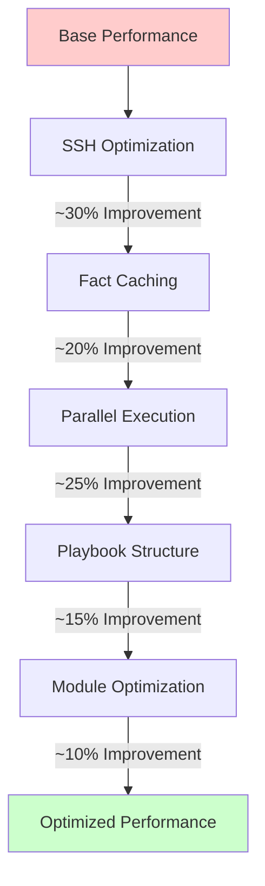

# Ansible Performance Optimization

## Introduction

Ansible is a powerful automation tool that can save you countless hours of manual configuration and deployment work. However, as your infrastructure grows and your playbooks become more complex, you might notice that Ansible tasks take longer to execute. This guide will walk you through various techniques to optimize Ansible performance, making your automation faster and more efficient.

Performance optimization in Ansible isn't just about speed—it's about creating efficient, scalable automation that works reliably across environments of any size. Whether you're managing a handful of servers or thousands of nodes, these techniques will help you get the most out of Ansible.

## Understanding Ansible Performance Bottlenecks

Before diving into optimization techniques, it's important to understand what factors can affect Ansible performance:

1. **SSH Connection Overhead**: Ansible uses SSH for agent-less communication with managed nodes
2. **Task Execution Time**: Complex tasks naturally take longer to complete
3. **Inventory Size**: The number of hosts being managed affects overall execution time
4. **Playbook Complexity**: More tasks mean more processing time
5. **Fact Gathering**: Collecting system information adds time to playbook execution

Let's explore how to address each of these areas to improve performance.

## Optimizing SSH Connections

SSH connections can be a significant performance bottleneck, especially when managing many hosts.

### Use SSH Multiplexing

SSH multiplexing allows Ansible to reuse existing SSH connections rather than creating new ones for each task.

Add the following to your `ansible.cfg` file:

```ini
[ssh_connection]
ssh_args = -o ControlMaster=auto -o ControlPersist=60s
control_path = ~/.ssh/ansible-%%r@%%h:%%p
pipelining = True
```

### Enable Pipelining

Pipelining reduces the number of SSH operations required to execute a module by executing many Ansible modules without requiring a temporary file.

```ini
[ssh_connection]
pipelining = True
```

#### Performance Impact

Without pipelining:
```
PLAY [Example] ******************************************
Task: Install packages  .................... 8.2s
Task: Configure service .................... 7.9s
Task: Start service    .................... 6.3s
```

With pipelining:
```
PLAY [Example] ******************************************
Task: Install packages  .................... 5.1s
Task: Configure service .................... 4.7s
Task: Start service    .................... 3.2s
```

As you can see, enabling pipelining can significantly reduce execution time.

### Use Connection Plugins

Ansible supports various connection plugins. The default is SSH, but you can use other plugins for specific scenarios:

```yaml
- name: Example playbook with connection plugin
  hosts: all
  connection: local
  tasks:
    - name: Local operation
      debug:
        msg: "This task runs on the control node"
```

## Optimizing Fact Gathering

By default, Ansible gathers facts about all managed nodes at the beginning of each playbook run. This can be time-consuming when managing many hosts.

### Disable Fact Gathering When Not Needed

If you don't need host facts, you can disable fact gathering:

```yaml
- name: Playbook without facts
  hosts: webservers
  gather_facts: no
  
  tasks:
    - name: Simple task that doesn't need facts
      debug:
        msg: "No facts needed here!"
```

### Use Fact Caching

For cases where you do need facts, consider enabling fact caching:

Add to your `ansible.cfg`:

```ini
[defaults]
fact_caching = jsonfile
fact_caching_connection = /tmp/ansible_fact_cache
# Cache facts for 24 hours
fact_caching_timeout = 86400
```

#### Performance Comparison

Running a playbook on 50 hosts:

- Without fact caching: ~2 minutes
- With fact caching: ~15 seconds (after first run)

### Gather Subset of Facts

If you only need specific facts, you can gather a subset:

```yaml
- name: Gather only network facts
  hosts: all
  gather_facts: no
  
  tasks:
    - name: Gather network facts only
      setup:
        gather_subset:
          - '!all'
          - '!min'
          - network
```

## Parallel Execution

By default, Ansible runs tasks in parallel across hosts but serially for each individual host. You can modify this behavior to improve performance.

### Increase Forks

The `forks` parameter defines how many parallel processes Ansible will use:

```ini
[defaults]
forks = 50
```

The default value is 5, but increasing it allows Ansible to manage more hosts simultaneously. Choose a value based on your control node's capacity.

### Use Serial Execution for Rolling Updates

For controlled rollouts, use the `serial` keyword:

```yaml
- name: Update webservers in batches
  hosts: webservers
  serial: 5  # Process 5 hosts at a time
  
  tasks:
    - name: Update package
      yum:
        name: nginx
        state: latest
      
    - name: Restart service
      service:
        name: nginx
        state: restarted
```

### Async Tasks

For long-running tasks, use `async` to avoid blocking:

```yaml
- name: Long-running operation with async
  hosts: all
  tasks:
    - name: Install large packages
      yum:
        name: "{{ item }}"
        state: latest
      async: 600  # 10 minutes
      poll: 0  # Don't wait
      loop:
        - docker
        - kubernetes
        
    - name: Check async status
      async_status:
        jid: "{{ ansible_job_id }}"
      register: job_result
      until: job_result.finished
      retries: 30
      delay: 20
      loop: "{{ ansible_job_id }}"
```

## Optimizing Playbook Structure

The way you structure your playbooks can significantly impact performance.

### Use Tags for Partial Execution

Tags allow you to run only specific parts of a playbook:

```yaml
- name: Comprehensive server setup
  hosts: servers
  
  tasks:
    - name: Install packages
      yum:
        name: "{{ item }}"
        state: present
      loop:
        - nginx
        - postgresql
      tags: packages
      
    - name: Configure services
      template:
        src: nginx.conf.j2
        dest: /etc/nginx/nginx.conf
      tags: configuration
```

Run only tagged tasks:

```bash
ansible-playbook playbook.yml --tags "packages"
```

### Minimize Include/Import Usage

While `include_tasks` and `import_tasks` help organize playbooks, excessive use can impact performance:

```yaml
# Less efficient with many small included files
- name: Main playbook with many includes
  hosts: all
  tasks:
    - include_tasks: task1.yml
    - include_tasks: task2.yml
    - include_tasks: task3.yml
    - include_tasks: task4.yml
    
# More efficient
- name: Main playbook with fewer, larger includes
  hosts: all
  tasks:
    - include_tasks: setup_phase.yml
    - include_tasks: deploy_phase.yml
```

### Use `strategy` Plugins

Ansible offers different execution strategies:

```yaml
- name: Playbook with free strategy
  hosts: all
  strategy: free  # Tasks run independently across hosts
  
  tasks:
    - name: Task 1
      debug:
        msg: "Running task 1"
        
    - name: Task 2
      debug:
        msg: "Running task 2"
```

Options include:
- `linear`: Default strategy, hosts move through tasks in lockstep
- `free`: Hosts run through tasks independently
- `debug`: For debugging purposes

## Optimizing Inventory Management

Efficient inventory management can significantly improve performance, especially for large infrastructures.

### Use Dynamic Inventory

For cloud environments or frequently changing infrastructure, dynamic inventory scripts pull host information in real-time:

```bash
ansible-playbook -i inventory_aws_ec2.yml playbook.yml
```

### Group Hosts Efficiently

Well-organized inventory groups allow you to target specific hosts:

```ini
[webservers]
web1.example.com
web2.example.com

[databases]
db1.example.com
db2.example.com

[production:children]
webservers
databases

[development]
dev.example.com
```

Target only specific groups:

```bash
ansible-playbook -i inventory playbook.yml --limit webservers
```

### Use In-Memory Inventory for Large Deployments

For very large inventories, consider using in-memory inventory plugins that are faster than file-based ones.

## Optimizing Module Usage

The way you use Ansible modules can impact performance.

### Prefer Command Modules for Simple Tasks

For simple operations, command-based modules can be faster than specialized ones:

```yaml
# Slower
- name: Create directory with file module
  file:
    path: /tmp/example
    state: directory
    
# Faster for simple operations
- name: Create directory with command
  command: mkdir -p /tmp/example
  args:
    creates: /tmp/example  # Idempotence check
```

### Use `with_items` vs. `loop` Appropriately

For small loops, `loop` is more efficient. For very large loops, `with_items` with `squash_actions` can be better:

```ini
[defaults]
squash_actions = apk,apt,dnf,homebrew,package,pacman,pkgng,yum,zypper
```

Then in your playbook:

```yaml
- name: Install multiple packages
  apt:
    name: "{{ item }}"
    state: present
  with_items:
    - nginx
    - postgresql
    - redis
    - memcached
```

### Minimize Network Transfers

Reduce the size of files being transferred:

```yaml
- name: Copy large file
  copy:
    src: large_file.tar.gz
    dest: /tmp/large_file.tar.gz
  # Better than copying many small files
```

## Performance Monitoring

To optimize effectively, you need to know where the bottlenecks are.

### Enable Callback Plugins

Add to your `ansible.cfg`:

```ini
[defaults]
callback_whitelist = profile_tasks, timer
```

This will show execution time for each task:

```
TASK [Install packages] ******************
Wednesday 12 January 2023  14:36:22 +0000 (0:00:00.769)       0:00:25.109 *******
ok: [server1]

TASK [Configure service] ****************
Wednesday 12 January 2023  14:36:38 +0000 (0:00:15.318)       0:00:40.427 *******
changed: [server1]

PLAY RECAP *****************************
server1 : ok=12   changed=4    unreachable=0    failed=0

Wednesday 12 January 2023  14:36:49 +0000 (0:00:11.074)       0:00:51.501 *******
Playbook run took 0 days, 0 hours, 0 minutes, 51 seconds
```

### Use Ansible Debug Mode

For detailed debugging:

```bash
ANSIBLE_DEBUG=1 ansible-playbook -vvv playbook.yml
```

## Practical Performance Optimization Example

Let's put everything together with a real-world example:

```yaml
---
# playbook: optimized_deployment.yml
- name: Optimized infrastructure deployment
  hosts: webservers
  gather_facts: yes
  strategy: free
  serial: 10
  
  vars:
    cache_valid_time: 3600
  
  pre_tasks:
    - name: Update apt cache
      apt:
        update_cache: yes
        cache_valid_time: "{{ cache_valid_time }}"
      tags: always
  
  tasks:
    - name: Install required packages
      apt:
        name:
          - nginx
          - php-fpm
          - certbot
        state: present
      tags: packages
      
    - name: Deploy application files
      copy:
        src: app.tar.gz
        dest: /var/www/app.tar.gz
      register: app_archive
      tags: deploy
      
    - name: Extract application
      command: tar xzf /var/www/app.tar.gz -C /var/www/html
      args:
        creates: /var/www/html/index.php
      when: app_archive.changed
      tags: deploy
      
    - name: Configure nginx
      template:
        src: nginx_vhost.conf.j2
        dest: /etc/nginx/sites-available/default
      notify: restart nginx
      tags: configure
  
  handlers:
    - name: restart nginx
      service:
        name: nginx
        state: restarted
```

Running this optimized playbook:

```bash
ansible-playbook -i inventory optimized_deployment.yml --forks=20
```

## Performance Visualization with Mermaid

Here's a visualization of how different optimization techniques affect Ansible performance:



## Summary

Optimizing Ansible performance involves several complementary approaches:

1. **SSH Optimization**: Enable multiplexing and pipelining
2. **Fact Management**: Use caching and gather only what you need
3. **Parallel Execution**: Increase forks and use async tasks for long operations
4. **Playbook Structure**: Use tags and organize tasks efficiently
5. **Inventory Management**: Group hosts and target specific groups
6. **Module Usage**: Choose the right modules and patterns for the job
7. **Monitoring**: Use callback plugins to identify bottlenecks

By applying these techniques, you can significantly improve Ansible's performance, especially when managing large infrastructures. Remember that optimization is an iterative process—continuously monitor and refine your approach based on your specific environment and requirements.

## Additional Resources and Exercises

### Resources

- [Ansible Documentation on Performance](https://docs.ansible.com/ansible/latest/reference_appendices/config.html#ansible-performance-tuning)
- [Ansible Configuration Settings](https://docs.ansible.com/ansible/latest/reference_appendices/config.html)
- [Ansible Best Practices Guide](https://docs.ansible.com/ansible/latest/user_guide/playbooks_best_practices.html)

### Exercises

1. **Benchmark Your Environment**: Run a playbook with and without performance optimizations and compare execution times.

2. **Create an Optimized ansible.cfg**:
   ```ini
   [defaults]
   forks = 20
   fact_caching = jsonfile
   fact_caching_connection = /path/to/cache
   fact_caching_timeout = 86400
   
   [ssh_connection]
   pipelining = True
   ssh_args = -o ControlMaster=auto -o ControlPersist=60s
   ```

3. **Refactor a Slow Playbook**: Take an existing slow playbook and apply the optimization techniques from this guide.

4. **Test Different Strategies**: Run the same playbook with different strategy plugins (`linear`, `free`) and compare results.

5. **Implement Fact Caching**: Set up Redis or JSON fact caching and measure the performance improvement on repeated playbook runs.

Remember that the best optimization strategy depends on your specific use case and infrastructure. Always measure the impact of your changes to ensure they provide the expected benefits.