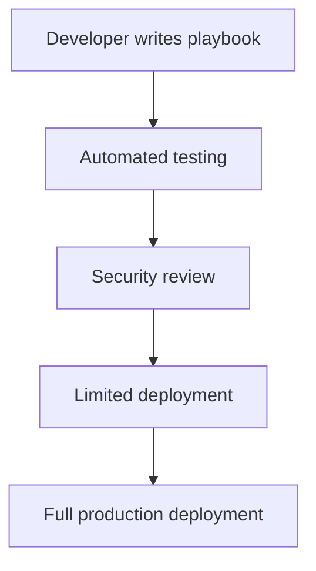

# Ansible Security Practices

## Introduction

Security is a critical aspect of any automation tool, especially one as powerful as Ansible which can manage configurations across your entire infrastructure. This guide covers essential security practices that will help you use Ansible safely and protect your systems from potential vulnerabilities.

Ansible's architecture already provides some inherent security benefits - it's agentless, uses SSH by default, and doesn't require opening additional ports on managed nodes. However, there are still many important security considerations when implementing Ansible in production environments.

## Securing Ansible Control Node

The Ansible control node is where you run your playbooks from and is a high-value target for attackers since it has access to your entire infrastructure.

### Restrict Access to Control Node

Only authorized administrators should have access to the Ansible control node:

```bash
# Example: Using sudo to restrict who can run ansible commands
sudo usermod -aG ansible john
```

### Keep Ansible Updated

Running outdated software versions can expose you to known vulnerabilities:

```bash
# Update Ansible to the latest version
pip install --upgrade ansible
```

Output:
```
Successfully installed ansible-8.3.0
```

### Use Version Control

Store your Ansible playbooks and roles in a secure version control system:

```bash
# Initialize a Git repository for your Ansible code
git init
git add .
git commit -m "Initial ansible configuration"
```

## Credential Management

One of the most important aspects of Ansible security is how you manage credentials.

### Ansible Vault

Ansible Vault encrypts sensitive data like passwords, API keys, and other secrets:

```bash
# Encrypt sensitive variables file
ansible-vault encrypt group_vars/all/secrets.yml
```

Output:
```
New Vault password: 
Confirm New Vault password: 
Encryption successful
```

To use the encrypted file in your playbook:

```bash
# Run playbook with vault password
ansible-playbook site.yml --ask-vault-pass
```

### Use ansible-vault Edit

Never decrypt sensitive files to edit them:

```bash
# Edit encrypted file securely
ansible-vault edit group_vars/all/secrets.yml
```

### Vault ID Management

For more complex scenarios, use Vault IDs to manage different secrets:

```bash
# Encrypt with a specific ID
ansible-vault encrypt --vault-id dev@prompt group_vars/dev/secrets.yml
ansible-vault encrypt --vault-id prod@prompt group_vars/prod/secrets.yml
```

Running a playbook with different vault IDs:

```bash
ansible-playbook site.yml --vault-id dev@prompt --vault-id prod@prompt
```

## Connection Security

Securing connections between control node and managed nodes is crucial.

### SSH Keys Instead of Passwords

Always use SSH key-based authentication instead of passwords:

```yaml
# Example inventory with SSH key configuration
all:
  hosts:
    webserver:
      ansible_host: 192.168.1.10
      ansible_user: deploy
      ansible_ssh_private_key_file: ~/.ssh/id_webserver
```

### Disable Host Key Checking with Caution

While it's convenient for testing, in production you should verify host keys:

```yaml
# inventory.yml - Example of host key verification setup
webservers:
  hosts:
    web01:
      ansible_host: 10.0.0.1
      ansible_user: ansible
  vars:
    ansible_ssh_common_args: '-o StrictHostKeyChecking=yes'
```

## Playbook Security

Following best practices when writing playbooks can enhance your security posture.

### Limit Task Privileges

Use `become` only when necessary and be specific about which user to become:

```yaml
---
- name: Configure web server
  hosts: webservers
  tasks:
    - name: Install packages
      become: true
      ansible.builtin.apt:
        name: nginx
        state: present
        
    - name: Configure application files
      # No become here - using regular user permissions
      ansible.builtin.template:
        src: app-config.j2
        dest: ~/app/config.json
        
    - name: Restart nginx service
      become: true
      become_user: root
      ansible.builtin.service:
        name: nginx
        state: restarted
```

### Validate External Input

Always validate inputs, especially when they come from external sources:

```yaml
- name: Deploy application with validated parameters
  hosts: appservers
  vars_prompt:
    - name: "app_version"
      prompt: "Enter application version to deploy"
      private: no
      
  tasks:
    - name: Validate input
      ansible.builtin.assert:
        that:
          - app_version is regex('^[0-9]+\.[0-9]+\.[0-9]+$')
        fail_msg: "Version must be in semver format (e.g., 1.2.3)"
        
    - name: Deploy application
      when: app_version is regex('^[0-9]+\.[0-9]+\.[0-9]+$')
      ansible.builtin.git:
        repo: https://github.com/company/app.git
        version: "{{ app_version }}"
        dest: /opt/application
```

## Inventory Security

Your inventory contains sensitive information about your infrastructure.

### Dynamic Inventory Security

When using dynamic inventory scripts, ensure they're secure:

```bash
# Set proper permissions on inventory scripts
chmod 700 inventory/aws_ec2.py
```

### Use Inventory Groups for Access Control

Organize your inventory to facilitate security segmentation:

```yaml
# inventory.yml
all:
  children:
    production:
      children:
        db_servers:
          hosts:
            db01:
              ansible_host: 10.0.1.1
        web_servers:
          hosts:
            web01:
              ansible_host: 10.0.2.1
    development:
      hosts:
        dev01:
          ansible_host: 10.0.10.1
```

Then in your playbooks, explicitly target only needed groups:

```yaml
---
- name: Database maintenance
  hosts: db_servers
  # Only runs on database servers
  tasks:
    - name: Backup databases
      # Tasks here
```

## Role-Based Access Control

Implementing RBAC (Role-Based Access Control) for Ansible.

### Ansible Tower/AWX

For larger environments, consider using Ansible Tower or AWX which provide robust RBAC:

```yaml
# Example of RBAC structure in Tower/AWX (conceptual, not actual code)
---
organizations:
  - name: IT Department
    teams:
      - name: Database Admins
        permissions:
          - inventory: db_servers
            permission: use
          - projects: db_maintenance
            permission: use
      - name: Web Admins
        permissions:
          - inventory: web_servers
            permission: use
          - projects: web_maintenance
            permission: use
```

### Limit sudo Access on Managed Nodes

Configure specific sudo permissions for the Ansible user:

```bash
# /etc/sudoers.d/ansible
ansible ALL=(ALL) NOPASSWD: /usr/bin/systemctl restart nginx, /usr/bin/apt-get
```

## Securing Sensitive Data in Logs

Prevent leaking sensitive information in logs.

### No Logging for Sensitive Tasks

Use `no_log` for tasks that handle sensitive data:

```yaml
- name: Configure database password
  ansible.builtin.template:
    src: db_config.j2
    dest: /etc/app/database.conf
  no_log: true
```

### Avoid Debugging with Sensitive Data

Be careful with `debug` modules and verbose output:

```yaml
# Bad practice - exposes secrets in logs
- name: Debug connection
  ansible.builtin.debug:
    var: db_password
    
# Better practice - mask sensitive data
- name: Confirm database connection
  ansible.builtin.debug:
    msg: "Successfully connected to database as {{ db_user }}"
```

## Network Security

Securing network communication in Ansible deployments.

### Jump Hosts / Bastion Hosts

Use jump hosts to access isolated environments:

```yaml
# inventory.yml
all:
  children:
    private_network:
      hosts:
        internal01:
          ansible_host: 10.0.0.5
      vars:
        ansible_ssh_common_args: '-o ProxyCommand="ssh -W %h:%p bastion.example.com"'
```

### SSH Tunneling

Create secure tunnels for accessing services:

```yaml
- name: Set up SSH tunnel for database access
  hosts: localhost
  tasks:
    - name: Establish SSH tunnel
      ansible.builtin.command:
        cmd: ssh -f -N -L 5432:db.internal:5432 bastion.example.com
      changed_when: false
```

## Security Auditing

Regular security audits help identify and address vulnerabilities.

### Ansible Lint

Use ansible-lint to check your playbooks for security issues:

```bash
# Install ansible-lint
pip install ansible-lint

# Run lint checks
ansible-lint playbooks/
```

Output:
```
WARNING  Unnamed task should be named [name[missing]]
playbooks/deploy.yml:15 Task/Handler: debug var=result

WARNING  Jinja2 templates should have .j2 extension [jinja[ext]]
playbooks/templates/nginx.conf:1
```

### Playbook Review Process

Implement a review process for playbooks before they run in production:



## Common Vulnerabilities to Avoid

Here are some common Ansible security pitfalls to avoid.

### Command Injection

Never construct shell commands with unsanitized variables:

```yaml
# DANGEROUS - command injection vulnerability
- name: Dangerous command
  ansible.builtin.shell: "find /data -name {{ user_input }}"
  
# SAFER - use appropriate modules
- name: Find files
  ansible.builtin.find:
    paths: /data
    patterns: "{{ user_input }}"
```

### Hardcoded Secrets

Never include secrets directly in playbooks:

```yaml
# BAD - hardcoded secrets
- name: Connect to service
  ansible.builtin.uri:
    url: https://api.example.com
    user: admin
    password: Password123!  # NEVER do this!
    
# GOOD - use vault variables
- name: Connect to service
  ansible.builtin.uri:
    url: https://api.example.com
    user: "{{ api_user }}"
    password: "{{ api_password }}"  # From encrypted vault
```

## Summary

Securing your Ansible environment involves multiple layers of protection:

1. **Control Node Security**: Restrict access, keep updated, use version control
2. **Credential Management**: Use Ansible Vault for secrets, never store plaintext credentials
3. **Connection Security**: Use SSH keys, verify host keys in production
4. **Playbook Security**: Limit privileges, validate inputs
5. **Inventory Security**: Protect inventory information, use groups for access control
6. **Role-Based Access Control**: Implement RBAC with Tower/AWX
7. **Log Security**: Use no_log for sensitive tasks, be careful with debugging
8. **Network Security**: Use jump hosts and secure tunnels
9. **Security Auditing**: Regularly audit with tools like ansible-lint
10. **Vulnerability Prevention**: Avoid command injection and hardcoded secrets

By following these best practices, you can ensure your Ansible automation remains secure while still being powerful and flexible.

## Additional Resources

- [Ansible Security Guide](https://docs.ansible.com/ansible/latest/user_guide/playbooks_best_practices.html)
- [Ansible Vault Documentation](https://docs.ansible.com/ansible/latest/user_guide/vault.html)
- [Red Hat Ansible Security Automation](https://www.redhat.com/en/technologies/management/ansible/security-automation)

## Exercises

1. Create a playbook that uses Ansible Vault to manage sensitive database credentials.
2. Set up a secure connection to a remote server using SSH keys and verify the host key.
3. Analyze an existing playbook for security vulnerabilities using ansible-lint.
4. Implement a RBAC structure for your Ansible environment.
5. Create a playbook that securely updates system packages without exposing sensitive information in logs.