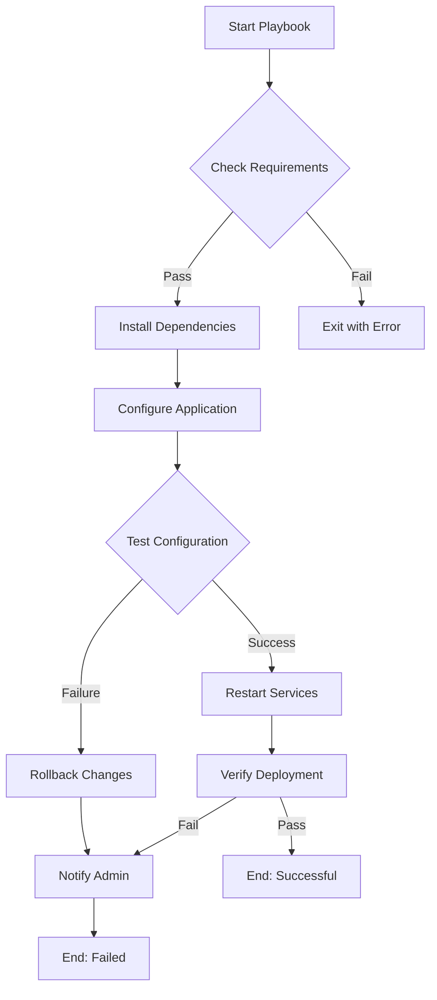

# Ansible Debugging Techniques

## Introduction

When working with Ansible, you'll inevitably encounter situations where your playbooks don't behave as expected. Effective debugging is a crucial skill that separates beginners from experienced Ansible users. This guide explores various techniques to identify, diagnose, and resolve common issues in your Ansible automation workflows.

Debugging in Ansible involves systematically isolating problems, examining variable states, tracking execution flow, and interpreting error messages. With the right techniques, you can quickly pinpoint issues and fix them without extensive trial and error.

## Basic Debugging with Increased Verbosity

### Understanding Ansible Verbosity Levels

Ansible offers different verbosity levels when running playbooks, which can be enabled using the `-v` flag. Each additional "v" provides more detailed output.

```bash
# Basic verbosity
ansible-playbook playbook.yml -v

# More detailed output
ansible-playbook playbook.yml -vv

# Connection debugging
ansible-playbook playbook.yml -vvv

# Extremely verbose output (includes module arguments)
ansible-playbook playbook.yml -vvvv
```

#### Example: Running a Playbook with Increased Verbosity

Input:
```bash
ansible-playbook deploy.yml -vv
```

Output:
```
PLAY [Deploy application] *******************************************************

TASK [Gathering Facts] **********************************************************
ok: [web01]

TASK [Install dependencies] *****************************************************
changed: [web01] => {"changed": true, "cmd": ["apt", "install", "-y", "python3-pip"], "delta": "0:00:03.456789", "end": "2025-03-15 12:34:56.123456", "rc": 0, "start": "2025-03-15 12:34:52.666667", "stderr": "", "stderr_lines": [], "stdout": "Reading package lists...
Building dependency tree...
Reading state information...
python3-pip is already the newest version (20.0.2-5).
0 upgraded, 0 newly installed, 0 to remove and 0 not upgraded.", "stdout_lines": ["Reading package lists...", "Building dependency tree...", "Reading state information...", "python3-pip is already the newest version (20.0.2-5).", "0 upgraded, 0 newly installed, 0 to remove and 0 not upgraded."]}
```

With increased verbosity, you can see detailed information about each task's execution, including command outputs, return values, and timing information.

## Using the `debug` Module

The `debug` module is one of the most straightforward ways to inspect variables and expressions during playbook execution.

### Basic Variable Inspection

```yaml
- name: Display a variable
  debug:
    var: inventory_hostname

- name: Show a custom message with variable
  debug:
    msg: "The application version is: {{ app_version }}"
```

### Conditional Debugging

You can use conditions to only show debug output in specific circumstances:

```yaml
- name: Debug when a condition is met
  debug:
    msg: "Warning: Available disk space is {{ available_disk_space }}GB"
  when: available_disk_space < 5
```

### Example: Debugging a Complex Variable Structure

For a dictionary or list, you might want to see its structure:

```yaml
- name: Get user information
  user_info:
    name: admin
  register: user_data

- name: Display user data
  debug:
    var: user_data
    verbosity: 1  # Only show when -v or higher is used
```

Output with `-v`:
```
TASK [Display user data] ********************************************************
ok: [server1] => {
    "user_data": {
        "changed": false,
        "failed": false,
        "user": {
            "name": "admin",
            "uid": 1001,
            "home": "/home/admin",
            "shell": "/bin/bash",
            "groups": ["admin", "sudo"]
        }
    }
}
```

## Registering and Examining Variables

The `register` keyword allows you to capture the output of a task for later inspection.

```yaml
- name: Check service status
  command: systemctl status nginx
  register: service_result
  failed_when: false  # Prevent task failure if service is down

- name: Display service status
  debug:
    var: service_result.stdout_lines
```

### Example: Using Registered Variables for Decision Making

```yaml
- name: Check if configuration file exists
  stat:
    path: /etc/myapp/config.ini
  register: config_file

- name: Display status of config file
  debug:
    msg: "Config file exists: {{ config_file.stat.exists }}"

- name: Create configuration file if missing
  template:
    src: templates/config.ini.j2
    dest: /etc/myapp/config.ini
  when: not config_file.stat.exists
```

## Using the `--check` and `--diff` Options

Ansible's check mode allows you to do a dry run without making actual changes to your systems.

```bash
# Dry run to see what would change
ansible-playbook deploy.yml --check

# Show differences in modified files
ansible-playbook deploy.yml --diff

# Combine both options
ansible-playbook deploy.yml --check --diff
```

### Example: Checking Configuration File Changes

Input:
```bash
ansible-playbook configure_nginx.yml --check --diff
```

Output:
```
TASK [Update Nginx configuration] ***********************************************
--- before: /etc/nginx/nginx.conf
+++ after: /etc/nginx/nginx.conf
@@ -8,7 +8,7 @@
 events {
-    worker_connections 768;
+    worker_connections 1024;
 }

 http {
```

This output shows exactly what would be changed without actually applying the changes, making it a safe way to verify your playbook's behavior.

## Task-Level Debugging with Tags

Tags allow you to run specific parts of a playbook, which is useful for testing and debugging.

```yaml
- name: Install application dependencies
  apt:
    name: "{{ item }}"
    state: present
  loop: "{{ dependencies }}"
  tags: [dependencies]

- name: Configure application
  template:
    src: app_config.j2
    dest: /etc/app/config.yml
  tags: [configuration]
```

You can then run specific tagged tasks:

```bash
# Only run tasks tagged with "configuration"
ansible-playbook deploy.yml --tags configuration

# Skip certain tags
ansible-playbook deploy.yml --skip-tags dependencies
```

## Creating an Ansible Debug Playbook

A dedicated debug playbook can help you inspect the state of a system:

```yaml
---
- name: Debug playbook for system inspection
  hosts: all
  gather_facts: yes
  tasks:
    - name: Display system information
      debug:
        msg: "{{ ansible_distribution }} {{ ansible_distribution_version }}"

    - name: Show available memory
      debug:
        msg: "Available memory: {{ ansible_memtotal_mb }} MB"

    - name: List all environment variables
      debug:
        var: ansible_env

    - name: Check disk space
      command: df -h
      register: disk_space
      changed_when: false

    - name: Display disk space
      debug:
        var: disk_space.stdout_lines
```

## The `assert` Module for Validation

The `assert` module helps you validate assumptions about your environment and fail early with clear messages.

```yaml
- name: Ensure minimum Python version
  assert:
    that:
      - ansible_python_version is version('3.6', '>=')
    fail_msg: "Python 3.6 or higher is required. Found version: {{ ansible_python_version }}"
    success_msg: "Python version requirement met: {{ ansible_python_version }}"

- name: Validate database connection settings
  assert:
    that:
      - db_host is defined
      - db_port is defined and db_port | int > 0
      - db_name is defined and db_name != ""
    fail_msg: "Database configuration is incomplete or invalid"
```

## Advanced Debugging Techniques

### Using the `meta` Module to Control Execution

The `meta` module allows you to control playbook execution flow:

```yaml
- name: Critical task
  command: some_command
  register: result
  failed_when: result.rc != 0

- name: Stop execution on failure
  meta: end_play
  when: result.rc != 0

- name: This will not run if previous task failed
  debug:
    msg: "Continuing with deployment"
```

### Creating Debugging Callbacks

Ansible callbacks can provide custom output formatting. You can enable built-in callbacks like `profile_tasks` to get timing information:

```bash
# Enable the profile_tasks callback in ansible.cfg
[defaults]
callback_whitelist = profile_tasks

# Or via environment variable
ANSIBLE_CALLBACK_WHITELIST=profile_tasks ansible-playbook playbook.yml
```

### Using `ansible-playbook --step`

The `--step` option allows you to interactively confirm each task before execution:

```bash
ansible-playbook deploy.yml --step
```

This prompts you with options like:
- (y)es: execute the task
- (n)o: skip the task
- (c)ontinue: stop asking and run all remaining tasks

## Visualizing Playbook Execution Flow

Mermaid diagrams can help visualize the flow of complex playbooks:



## Remote Debugging

### SSH to Managed Node for Direct Inspection

When remote debugging is necessary, you can use the `ansible` command to quickly SSH into a problematic node:

```bash
ansible webserver -m shell -a "whoami"
ansible database -m shell -a "systemctl status postgresql"
```

### Creating Debug Files on Remote Systems

Sometimes you need to leave debug artifacts on remote systems for inspection:

```yaml
- name: Capture environment state for debugging
  copy:
    content: |
      Timestamp: {{ ansible_date_time.iso8601 }}
      Hostname: {{ inventory_hostname }}
      OS: {{ ansible_distribution }} {{ ansible_distribution_version }}
      Kernel: {{ ansible_kernel }}
      Python: {{ ansible_python_version }}
      Environment Variables: {{ ansible_env | to_nice_yaml }}
    dest: "/tmp/ansible_debug_{{ inventory_hostname }}.log"
  changed_when: false
```

## Common Debugging Patterns

### Using Blocks for Error Handling

```yaml
- name: Transaction with error handling
  block:
    - name: Update application
      git:
        repo: https://github.com/myorg/myapp.git
        dest: /opt/myapp
      register: git_result

    - name: Build application
      command: make build
      args:
        chdir: /opt/myapp
      when: git_result.changed
  rescue:
    - name: Log failure
      debug:
        msg: "Application update failed, reverting to previous version"

    - name: Restore from backup
      command: cp -R /opt/myapp.bak /opt/myapp
  always:
    - name: Restart application service
      service:
        name: myapp
        state: restarted
```

### Using ignore_errors and failed_when

```yaml
- name: Check if service exists (may fail on some systems)
  command: systemctl status custom-service
  register: service_status
  ignore_errors: yes

- name: Custom failure condition
  command: /opt/app/healthcheck.sh
  register: health_result
  failed_when: "'CRITICAL' in health_result.stdout"
```

## Practical Example: Debugging a Deployment Issue

Let's walk through a real-world debugging scenario:

```yaml
---
- name: Debug application deployment
  hosts: web_servers
  gather_facts: yes
  vars:
    app_name: my_web_app
    app_version: 1.2.3
    required_memory_mb: 1024
  
  tasks:
    - name: Check system requirements
      assert:
        that:
          - ansible_memtotal_mb >= required_memory_mb
          - ansible_distribution in ['Ubuntu', 'Debian', 'CentOS']
        fail_msg: "System does not meet requirements: {{ ansible_memtotal_mb }}MB RAM, {{ ansible_distribution }} {{ ansible_distribution_version }}"

    - name: Check if application is already deployed
      stat:
        path: "/opt/{{ app_name }}/VERSION"
      register: version_file

    - name: Read current version if exists
      command: cat "/opt/{{ app_name }}/VERSION"
      register: current_version
      changed_when: false
      when: version_file.stat.exists

    - name: Debug version comparison
      debug:
        msg: 
          - "Installed version: {{ current_version.stdout | default('not installed') }}"
          - "Target version: {{ app_version }}"
          - "Update needed: {{ (not version_file.stat.exists) or (current_version.stdout is defined and current_version.stdout != app_version) }}"
      
    - name: Deploy application
      block:
        - name: Download application package
          get_url:
            url: "https://example.com/packages/{{ app_name }}-{{ app_version }}.tar.gz"
            dest: "/tmp/{{ app_name }}-{{ app_version }}.tar.gz"
          register: download_result

        - name: Extract application
          unarchive:
            src: "/tmp/{{ app_name }}-{{ app_version }}.tar.gz"
            dest: "/opt/"
            remote_src: yes
          when: download_result is changed
          register: extract_result

        - name: Create VERSION file
          copy:
            content: "{{ app_version }}"
            dest: "/opt/{{ app_name }}/VERSION"
          when: extract_result is changed
      rescue:
        - name: Debug deployment failure
          debug:
            msg: "Deployment failed. See registered variables for details."

        - name: Collect system information for troubleshooting
          command: "{{ item }}"
          loop:
            - "df -h"
            - "free -m"
            - "ls -la /opt/"
          register: system_checks
          changed_when: false

        - name: Display system checks
          debug:
            var: system_checks.results
```

This playbook includes several debugging techniques:
1. System requirement verification with clear error messages
2. Version comparison with debug output
3. Block-based error handling
4. Automated collection of troubleshooting information

## Summary

Effective Ansible debugging requires a combination of techniques:

1. **Increase verbosity** with `-v`, `-vv`, `-vvv`, or `-vvvv` to get more detailed output
2. Use the **`debug` module** to inspect variables and expressions
3. **Register task outputs** to variables for inspection
4. Employ **`--check` and `--diff`** for safe, dry-run testing
5. Use **tags** to isolate and test specific parts of playbooks
6. Create **dedicated debug playbooks** for system inspection
7. Validate assumptions with the **`assert` module**
8. Use **block/rescue/always** constructs for structured error handling
9. Apply **conditional logic** with `when`, `failed_when`, and `changed_when`
10. Create **debug artifacts** on remote systems when necessary

Mastering these debugging techniques will save you time and frustration as you develop and maintain your Ansible automation.

## Additional Resources

- [Ansible Documentation: Debugging Playbooks](https://docs.ansible.com/ansible/latest/user_guide/playbooks_debugger.html)
- [Ansible Documentation: Debug Module](https://docs.ansible.com/ansible/latest/collections/ansible/builtin/debug_module.html)
- [Ansible Documentation: Error Handling](https://docs.ansible.com/ansible/latest/user_guide/playbooks_error_handling.html)

## Exercises

1. Create a debug playbook that gathers information about your target systems and displays it in a structured format.
2. Modify an existing playbook to include proper error handling with the block/rescue/always pattern.
3. Practice using `--check` and `--diff` on a configuration management playbook to see what changes would be made.
4. Write a playbook that uses the `assert` module to validate at least three different system requirements.
5. Create a troubleshooting playbook that collects logs, configuration files, and system information from remote hosts.