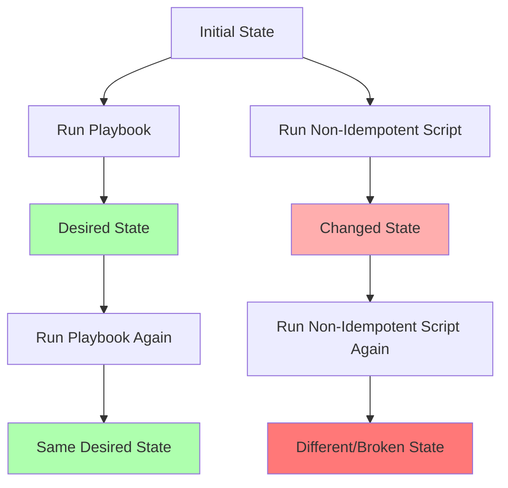

# Ansible Idempotency

## Introduction

Idempotency is one of the most important concepts in Ansible and infrastructure automation. An operation is **idempotent** when applying it multiple times doesn't change the result beyond the initial application. In simple terms: running the same Ansible playbook once or multiple times should result in the same system state.

This concept might sound abstract at first, but it's what makes Ansible reliable and predictable for managing infrastructure at scale. In this guide, we'll explore what idempotency means in Ansible, why it matters, and how to ensure your playbooks follow this critical principle.

## What is Idempotency?

Let's break down this concept with a simple analogy:

- **Non-idempotent operation**: Pressing the "+" button on a calculator. Each press adds 1 to your total.
- **Idempotent operation**: Pressing the "Clear" button on a calculator. The first press clears the display, but additional presses don't change anything more.

In Ansible, idempotency means that running a playbook once to achieve a desired state is the same as running it multiple times. After the first successful run, subsequent runs shouldn't make any changes (unless the desired state itself changes).

## Why Idempotency Matters

Idempotency offers several key benefits:

1. **Safety**: You can run playbooks repeatedly without fear of breaking things
2. **Reliability**: Failed runs can be retried without side effects
3. **Predictability**: You get consistent results regardless of the starting state
4. **Efficiency**: Ansible only makes changes when necessary, saving time and resources

Without idempotency, automation becomes risky and unpredictable — the opposite of what we want when managing infrastructure.

## Idempotency in Action: A Basic Example

Let's look at a simple example of idempotent vs. non-idempotent approaches:

### Non-Idempotent Shell Command

```yaml
- name: Create a directory (non-idempotent approach)
  shell: mkdir /opt/application
```

If you run this task once, it creates the directory. If you run it again, it fails because the directory already exists.

### Idempotent Ansible Module

```yaml
- name: Create a directory (idempotent approach)
  file:
    path: /opt/application
    state: directory
```

This task is idempotent: it creates the directory if it doesn't exist, but does nothing if it already exists. You can run it any number of times with the same result.

## How Ansible Achieves Idempotency

Ansible achieves idempotency through several mechanisms:

### 1. State-Based Modules

Most Ansible modules are designed to be state-based rather than action-based. Instead of saying "run this command," you declare the desired end state, and Ansible figures out how to get there:

```yaml
- name: Ensure Apache is installed and running
  service:
    name: httpd
    state: started
    enabled: yes
```

This task doesn't say "install Apache and start it." Instead, it declares "Apache should be installed, running, and enabled to start at boot." Ansible handles the details.

### 2. Check Mode

Ansible's `--check` mode lets you test what changes would be made without actually making them:

```bash
ansible-playbook site.yml --check
```

This helps verify that your playbooks are properly idempotent.

### 3. Changed Status

Ansible reports whether each task made a change or not. After an initial run where changes are reported, a subsequent run of an idempotent playbook should report "ok" (no changes) for all tasks.

## Common Patterns for Idempotent Tasks

Let's explore some common patterns to ensure idempotency in your playbooks:

### Using Appropriate Modules

```yaml
# Instead of:
- shell: apt-get install nginx -y  # Not idempotent!

# Use:
- apt:
    name: nginx
    state: present  # Idempotent
```

### Managing Files

```yaml
- name: Create configuration file
  template:
    src: app.conf.j2
    dest: /etc/app/app.conf
    owner: app
    group: app
    mode: '0644'
  # Idempotent: only updates if content, permissions, or ownership would change
```

### Handling Complex Operations

For more complex tasks, use conditionals to make them idempotent:

```yaml
- name: Check if application is installed
  stat:
    path: /opt/app/VERSION
  register: app_installed

- name: Install application
  unarchive:
    src: app-1.2.3.tar.gz
    dest: /opt/app
  when: not app_installed.stat.exists
```

## Real-World Example: Idempotent Web Server Configuration

Let's put everything together in a real-world example of configuring a web server:

```yaml
---
- name: Configure web server idempotently
  hosts: webservers
  become: yes
  
  tasks:
    - name: Install nginx
      package:
        name: nginx
        state: present
        
    - name: Create web content directory
      file:
        path: /var/www/myapp
        state: directory
        owner: www-data
        group: www-data
        mode: '0755'
        
    - name: Deploy application configuration
      template:
        src: nginx.conf.j2
        dest: /etc/nginx/sites-available/myapp.conf
        owner: root
        group: root
        mode: '0644'
      register: nginx_config
        
    - name: Enable site configuration
      file:
        src: /etc/nginx/sites-available/myapp.conf
        dest: /etc/nginx/sites-enabled/myapp.conf
        state: link
      notify: Restart nginx
        
    - name: Deploy application content
      copy:
        src: app/
        dest: /var/www/myapp/
        owner: www-data
        group: www-data
      
  handlers:
    - name: Restart nginx
      service:
        name: nginx
        state: restarted
```

This playbook is fully idempotent:
- It installs nginx only if not already installed
- It creates directories only if they don't exist
- It updates configuration files only if they differ from the templates
- It creates symbolic links only if they don't already exist
- It updates application content only if different from the source
- It restarts nginx only if a configuration change was made

## Common Idempotency Pitfalls

Here are some common mistakes that can break idempotency:

### 1. Using Shell or Command Modules Carelessly

```yaml
# Not idempotent!
- name: Add user to group
  shell: usermod -a -G docker ubuntu
  
# Idempotent alternative
- name: Add user to group
  user:
    name: ubuntu
    groups: docker
    append: yes
```

### 2. Not Checking Current State

```yaml
# Not idempotent - always runs git clone
- name: Clone repository
  command: git clone https://github.com/example/repo.git /opt/app
  
# Idempotent alternative
- name: Check if repository exists
  stat:
    path: /opt/app/.git
  register: repo_stat

- name: Clone repository if needed
  git:
    repo: https://github.com/example/repo.git
    dest: /opt/app
  when: not repo_stat.stat.exists
```

### 3. Using Increment Operations

```yaml
# Not idempotent - increments counter each run
- name: Increment app version
  lineinfile:
    path: /opt/app/version.txt
    regexp: '^VERSION='
    line: "VERSION={{ current_version + 1 }}"
  
# Idempotent alternative - sets specific version
- name: Set app version
  lineinfile:
    path: /opt/app/version.txt
    regexp: '^VERSION='
    line: "VERSION=5"
```

## Visual Representation of Idempotency

Let's use a diagram to represent idempotent versus non-idempotent operations:



## Testing for Idempotency

A good practice is to test your playbooks for idempotency by running them twice:

```bash
# First run - should make changes
ansible-playbook playbook.yml

# Second run - should report no changes
ansible-playbook playbook.yml
```

If the second run shows "changed" for any tasks, you may need to revisit those tasks to make them properly idempotent.

You can also build this into your CI/CD pipeline:

```yaml
- name: Test playbook idempotency
  shell: |
    ansible-playbook playbook.yml
    ansible-playbook playbook.yml | grep -q 'changed=0.*failed=0'
    exit $?
```

## Practical Exercises

To reinforce your understanding of idempotency, try these exercises:

1. Take a non-idempotent shell script that configures a service and convert it to an idempotent Ansible playbook.

2. Write a playbook that:
   - Installs a web server
   - Creates a custom configuration
   - Deploys a simple web application
   - Ensures it's idempotent (run it twice to verify)

3. Review an existing playbook and identify any non-idempotent tasks. Refactor them to be idempotent.

## Summary

Idempotency is a fundamental concept in Ansible that ensures reliable, predictable automation. By declaring the desired state rather than steps to get there, Ansible can safely apply changes only when needed.

Key takeaways:
- An idempotent operation produces the same result regardless of how many times it's run
- Idempotency provides safety, reliability, and efficiency in automation
- Most Ansible modules are designed to be idempotent by default
- Avoid shell commands and instead use purpose-built modules when possible
- Always check your playbooks for idempotency by running them twice

By embracing idempotency in your Ansible playbooks, you'll create more reliable, maintainable infrastructure automation that works consistently across environments.

## Additional Resources

- [Ansible Documentation: Idempotence](https://docs.ansible.com/ansible/latest/reference_appendices/glossary.html#term-Idempotency)
- [Ansible Best Practices Guide](https://docs.ansible.com/ansible/latest/user_guide/playbooks_best_practices.html)
- [Testing Ansible Playbooks](https://docs.ansible.com/ansible/latest/user_guide/playbooks_tests.html)