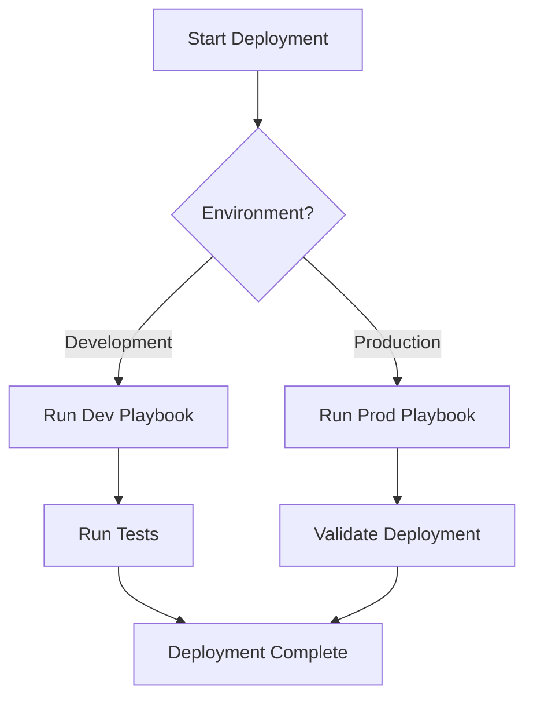

# Ansible Documentation Practices

## Introduction

Good documentation is the foundation of maintainable infrastructure code. In Ansible, proper documentation helps team members understand your automation intent, reduces onboarding time, and prevents troubleshooting headaches. This guide explores best practices for documenting Ansible playbooks, roles, and inventories to ensure your automation remains valuable and understandable over time.

Documentation in Ansible happens at multiple levels:
- **Inline comments** within playbooks and tasks
- **README files** for projects and roles
- **Documentation in variable files**
- **Meta information** in roles
- **Generated documentation** from tools

Let's explore each of these aspects in detail to help you develop comprehensive documentation habits.

## Documenting Playbooks

### Using Comments Effectively

Comments in YAML files begin with the `#` character. Use them to explain complex tasks or provide context:

```yaml
---
# Playbook: database_setup.yml
# Purpose: Configure PostgreSQL database servers
# Created: 2023-04-15
# Author: DevOps Team

- name: Configure PostgreSQL servers
  hosts: database_servers
  become: true
  
  tasks:
    # Install latest PostgreSQL version
    - name: Install PostgreSQL packages
      ansible.builtin.package:
        name: postgresql
        state: present
      
    # The following task creates required database users
    # Security note: passwords should be vaulted in production
    - name: Create database users
      ansible.builtin.postgresql_user:
        name: "{{ item.username }}"
        password: "{{ item.password }}"
        state: present
      loop: "{{ db_users }}"
```

### Descriptive Task Names

Every task should have a clear, descriptive name that explains exactly what it does:

```yaml
# Bad example - vague name:
- name: Run command
  ansible.builtin.command: systemctl restart nginx

# Good example - descriptive name:
- name: Restart Nginx web server after configuration change
  ansible.builtin.command: systemctl restart nginx
```

### Document Play-Level Variables

Document your variables at the beginning of the playbook or in a separate variables file:

```yaml
---
# vars/web_config.yml
# Configuration variables for web server setup
#
# http_port: The port on which the web server will listen
http_port: 80

# enable_ssl: Whether to enable HTTPS/SSL
enable_ssl: true

# web_server_type: The web server software to use
# Supported values: nginx, apache
web_server_type: nginx
```

## Role Documentation

### Comprehensive README Files

Every Ansible role should have a README.md file that contains:

```markdown
# Role Name: nginx_webserver

## Overview
This role installs and configures Nginx web server with security best practices.

## Requirements
- Ansible 2.10+
- Ubuntu 20.04 or CentOS 8

## Role Variables
| Variable | Default | Description |
|----------|---------|-------------|
| nginx_port | 80 | The HTTP port Nginx listens on |
| nginx_user | www-data | User to run Nginx as |
| ssl_enabled | false | Whether to enable SSL/TLS |

## Dependencies
- common_packages
- security_hardening

## Example Playbook
```yaml
- hosts: webservers
  roles:
    - role: nginx_webserver
      nginx_port: 8080
      ssl_enabled: true
```

## Author Information
Created by the Infrastructure Team
```

### Using meta/main.yml

The `meta/main.yml` file in a role can document information about the role:

```yaml
---
galaxy_info:
  role_name: nginx_webserver
  author: DevOps Team
  description: Installs and configures Nginx web server
  company: Example Corp
  license: MIT
  min_ansible_version: 2.10
  
  platforms:
  - name: Ubuntu
    versions:
    - focal
    - jammy
  - name: EL
    versions:
    - 8
    - 9
  
  galaxy_tags:
    - web
    - nginx
    - server
```

## Inventory Documentation

Inventory files should be documented to explain the purpose of groups and important variables:

```ini
# inventory/production
# Last updated: 2023-05-10
# Production environment infrastructure inventory

# Frontend web servers - Customer-facing applications
[web_servers]
web01.example.com
web02.example.com

# Database servers - PostgreSQL cluster
[db_servers]
db01.example.com  # Primary
db02.example.com  # Replica

# Group for all production systems
[production:children]
web_servers
db_servers

# Variables applicable to all production systems
[production:vars]
environment=production
monitoring_enabled=true
```

## Variable Documentation

### Default Variables (defaults/main.yml)

Default variables should be thoroughly documented to help users customize your role:

```yaml
---
# defaults/main.yml

# nginx_user: The system user to run Nginx as
nginx_user: www-data

# nginx_worker_processes: Number of worker processes
# Set to "auto" to automatically determine based on CPU cores
# or set to a specific number
nginx_worker_processes: auto

# nginx_max_clients: Maximum number of simultaneous client connections
# Default is suitable for servers with 1GB RAM
nginx_max_clients: 512
```

## Generating Documentation

### Using ansible-doc for Custom Modules

If you create custom modules, document them properly for use with the `ansible-doc` tool:

```python
#!/usr/bin/python
# -*- coding: utf-8 -*-

DOCUMENTATION = '''
---
module: my_custom_module
short_description: Manages custom application features
description:
    - This module handles the configuration of the custom application
    - It can create, update, and delete application resources
options:
    name:
        description:
            - Name of the resource to manage
        required: true
        type: str
    state:
        description:
            - State of the resource
        choices: ['present', 'absent']
        default: present
        type: str
author:
    - "Your Name (@github_handle)"
'''

EXAMPLES = '''
# Create a new resource
- name: Create application resource
  my_custom_module:
    name: example_resource
    state: present

# Remove a resource
- name: Delete application resource
  my_custom_module:
    name: example_resource
    state: absent
'''
```

## Project Documentation Structure

A well-documented Ansible project should have the following structure:

```
project/
├── README.md              # Project overview and usage instructions
├── CONTRIBUTING.md        # Guidelines for contributors
├── CHANGELOG.md           # Version history and changes
├── inventories/           # Inventory files for environments
│   ├── development/
│   ├── staging/
│   └── production/
├── playbooks/             # Playbook files
│   └── README.md          # Explains available playbooks
├── roles/                 # Custom roles
│   └── role_name/
│       ├── README.md      # Role documentation
│       └── meta/main.yml  # Role metadata
└── docs/                  # Additional documentation
    ├── architecture.md
    └── workflow.md
```

## Automation Flow Documentation with Mermaid

Visual documentation can help explain complex automation workflows:



## Documentation Lifecycle

Documentation should be treated as a living artifact that evolves with your code:

1. **Create documentation** as you develop new playbooks/roles
2. **Update documentation** when you make changes
3. **Review documentation** regularly for accuracy
4. **Automate documentation** generation where possible

## Best Practices Summary

- **Write documentation for humans**, not machines
- **Document the "why"**, not just the "what" or "how"
- **Keep documentation close to code** it describes
- **Use consistent formatting** across all documentation
- **Update documentation** when you update code
- **Test your documentation** by having newcomers follow it
- **Use tools** to generate documentation where appropriate

## Practical Example: Fully Documented Role

Here's a comprehensive example of a well-documented Ansible role:

### Role Structure

```
roles/web_application/
├── README.md
├── defaults/
│   └── main.yml
├── tasks/
│   ├── main.yml
│   ├── install.yml
│   └── configure.yml
├── templates/
│   └── app_config.j2
└── meta/
    └── main.yml
```

### README.md Content

```markdown
# Web Application Role

This role deploys and configures our web application on target servers.

## Features
- Installs required dependencies
- Configures application with secure defaults
- Sets up systemd service for automatic startup
- Configures log rotation

## Usage
Include this role in your playbook:

```yaml
- hosts: web_servers
  roles:
    - role: web_application
      app_version: 1.2.3
      app_environment: production
```

## Variables
See defaults/main.yml for all customizable variables
```

### defaults/main.yml

```yaml
---
# Application version to deploy
# Format: x.y.z (e.g., 1.2.3)
app_version: "1.0.0"

# Application environment
# Options: development, staging, production
app_environment: "development"

# Memory allocation for application (in MB)
# Minimum recommended: 512
app_memory: 1024

# Enable debug mode
# WARNING: Never enable in production!
app_debug: false

# Database connection information
# These should be overridden in environment-specific variables
db_host: "localhost"
db_name: "appdb"
db_user: "appuser"
db_password: "change_me"  # Should be vaulted in production
```

### tasks/main.yml

```yaml
---
# Main tasks file for web_application role

# Include variables based on the environment
- name: Include environment-specific variables
  ansible.builtin.include_vars: "{{ app_environment }}.yml"
  
# Install dependencies and application components
- name: Include installation tasks
  ansible.builtin.import_tasks: install.yml
  tags: [install, update]
  
# Configure the application
- name: Include configuration tasks
  ansible.builtin.import_tasks: configure.yml
  tags: [configure, update]
  
# Ensure the application is running
- name: Ensure application service is running
  ansible.builtin.service:
    name: web_application
    state: started
    enabled: true
  tags: [service]
```

## Summary

Effective documentation is essential for maintaining and scaling Ansible automation. By following these best practices for documenting your playbooks, roles, and inventories, you'll create automation that remains valuable and usable for your entire team.

Remember that documentation is an investment that pays off during troubleshooting, onboarding, and when revisiting code months or years later. Make documentation a core part of your development process, not an afterthought.

## Additional Resources

- [Ansible Documentation](https://docs.ansible.com/)
- [Ansible Galaxy Documentation Guidelines](https://galaxy.ansible.com/docs/)
- [YAML Syntax Guide](https://yaml.org/spec/1.2.2/)

## Exercises

1. Take an existing undocumented playbook and add comprehensive inline comments.
2. Create a README.md file for one of your Ansible roles following the template provided.
3. Generate documentation for your inventory structure explaining the purpose of each group.
4. Create a visual diagram showing the workflow of your most complex Ansible playbook.
5. Review a colleague's Ansible code and provide feedback on their documentation.