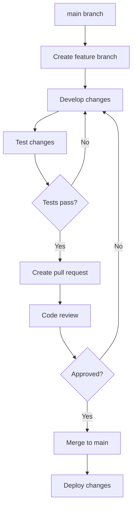

# Ansible Version Control

## Introduction

Version control is a critical aspect of managing Ansible code in professional environments. As your infrastructure automation grows more complex, proper version control practices become essential for collaboration, tracking changes, and maintaining stability. This guide explores how to effectively implement version control for your Ansible projects, helping you establish solid foundations for your automation workflows.

Version controlling your Ansible code provides several key benefits:

- **Traceability**: Track who changed what and when
- **Rollbacks**: Ability to revert to previous working versions
- **Collaboration**: Enable multiple team members to work on the same codebase
- **Testing**: Facilitate testing changes before applying them to production
- **History**: Maintain a complete history of your infrastructure evolution

## Directory Structure Best Practices

Organizing your Ansible code properly is the first step in effective version control. A well-structured project makes it easier to track changes and collaborate with others.

### Recommended Project Structure

Here's a recommended directory structure for version-controlled Ansible projects:

```
ansible-project/
├── inventories/
│   ├── production/
│   │   ├── hosts
│   │   ├── group_vars/
│   │   └── host_vars/
│   ├── staging/
│   │   ├── hosts
│   │   ├── group_vars/
│   │   └── host_vars/
│   └── development/
│       ├── hosts
│       ├── group_vars/
│       └── host_vars/
├── roles/
│   ├── common/
│   ├── webserver/
│   └── database/
├── playbooks/
│   ├── site.yml
│   ├── webservers.yml
│   └── dbservers.yml
├── library/
├── module_utils/
├── filter_plugins/
├── ansible.cfg
└── requirements.yml
```

This structure separates your inventories by environment and organizes roles and playbooks clearly. Let's examine what each component is for:

- **inventories/**: Contains your inventory files separated by environment
- **roles/**: Contains reusable roles that define your configurations
- **playbooks/**: Contains your main playbooks that apply roles to hosts
- **library/**, **module_utils/**, **filter_plugins/**: Custom modules and plugins
- **ansible.cfg**: Configuration file for Ansible
- **requirements.yml**: Defines external role dependencies

### Using .gitignore

Create a proper `.gitignore` file to avoid tracking sensitive or unnecessary files:

```
# Ansible runtime and backup files
*.retry
*.swp
*~

# Inventory secrets
inventories/*/group_vars/*/vault.yml
inventories/*/host_vars/*/vault.yml

# Python virtual environments
venv/
.venv/

# IDE files
.idea/
.vscode/

# Logs
*.log
```

## Git Workflows for Ansible Projects

Implementing a Git workflow helps maintain order in your version control process, especially when multiple team members are involved.

### Feature Branch Workflow

The feature branch workflow is particularly effective for Ansible projects:



### Practical Example: Adding a New Role

Let's walk through a practical example of using Git to add a new role to your Ansible project:

1. Start by creating a new branch:

```bash
# Clone the repository if you haven't already
git clone https://github.com/your-org/ansible-project.git
cd ansible-project

# Create and checkout a new branch
git checkout -b add-nginx-role
```

2. Create your new role structure:

```bash
# Create the role directory structure
ansible-galaxy init roles/nginx
```

3. Develop your role by editing the necessary files:

```yaml
# roles/nginx/tasks/main.yml
---
- name: Install Nginx
  apt:
    name: nginx
    state: present
  become: true
  
- name: Create Nginx configuration
  template:
    src: nginx.conf.j2
    dest: /etc/nginx/nginx.conf
  notify: restart nginx
  become: true
```

4. Add your changes to version control:

```bash
# Add your changes
git add roles/nginx/

# Commit your changes with a descriptive message
git commit -m "Add nginx role with basic installation and configuration"
```

5. Push your branch and create a pull request:

```bash
git push origin add-nginx-role
```

6. After the pull request is reviewed and approved, merge it to the main branch.

## Versioning Strategies

Adopting a proper versioning strategy helps track major changes to your Ansible codebase.

### Semantic Versioning

Semantic Versioning (SemVer) is a great choice for Ansible projects. It uses a three-part version number: MAJOR.MINOR.PATCH

- **MAJOR**: Incompatible changes that require updates to playbooks or inventories
- **MINOR**: Functionality added in a backward-compatible manner
- **PATCH**: Backward-compatible bug fixes

Example:

```bash
# Tag a new version
git tag -a v1.2.3 -m "Version 1.2.3 - Added nginx role and fixed database backup"
git push origin v1.2.3
```

### Using Version Tags in Ansible

You can reference specific versions in your `requirements.yml` file when including external roles:

```yaml
# requirements.yml
---
- name: geerlingguy.mysql
  version: "3.3.0"
  
- src: https://github.com/your-org/ansible-nginx.git
  version: "v2.1.0"
  name: custom.nginx
```

## Managing Secrets with Ansible Vault

Sensitive information should never be stored in plain text in version control. Ansible Vault helps encrypt sensitive data while still keeping it in your repository.

### Encrypting Sensitive Files

```bash
# Create an encrypted file
ansible-vault create inventories/production/group_vars/all/vault.yml

# Edit an encrypted file
ansible-vault edit inventories/production/group_vars/all/vault.yml

# Encrypt an existing file
ansible-vault encrypt inventories/production/group_vars/all/vault.yml
```

### Referencing Encrypted Variables

In your playbooks or role variables, reference the encrypted variables normally:

```yaml
# roles/database/tasks/main.yml
---
- name: Configure database connection
  template:
    src: db_config.j2
    dest: /etc/app/database.conf
  vars:
    db_password: "{{ vault_db_password }}"
```

The `vault_db_password` variable is defined in your encrypted vault file.

### Vault Password Management

For team environments, consider using a shared vault password file that is kept outside of version control:

```bash
# Using a vault password file
ansible-playbook playbooks/site.yml --vault-password-file ~/.vault_pass.txt
```

Or configure it in your `ansible.cfg`:

```ini
# ansible.cfg
[defaults]
vault_password_file = ~/.vault_pass.txt
```

## Testing Changes Before Merging

Implementing testing as part of your version control workflow helps prevent issues before they reach production.

### Ansible Lint

Ansible Lint checks your playbooks and roles for potential issues:

```bash
# Install Ansible Lint
pip install ansible-lint

# Run Ansible Lint on your codebase
ansible-lint playbooks/ roles/
```

### Molecule for Role Testing

Molecule provides a framework for testing Ansible roles:

```bash
# Install Molecule
pip install molecule[docker]

# Initialize Molecule in an existing role
cd roles/nginx
molecule init scenario default -d docker

# Run tests
molecule test
```

A basic Molecule test configuration:

```yaml
# roles/nginx/molecule/default/molecule.yml
---
dependency:
  name: galaxy
driver:
  name: docker
platforms:
  - name: instance
    image: ubuntu:20.04
    pre_build_image: true
provisioner:
  name: ansible
verifier:
  name: ansible
```

### CI/CD Integration

Integrate testing into your CI/CD pipeline to automatically test changes before merging:

```yaml
# .github/workflows/ansible-test.yml
name: Ansible Test

on:
  pull_request:
    branches: [ main ]

jobs:
  lint:
    runs-on: ubuntu-latest
    steps:
      - uses: actions/checkout@v2
      - name: Set up Python
        uses: actions/setup-python@v2
        with:
          python-version: '3.9'
      - name: Install dependencies
        run: pip install ansible ansible-lint
      - name: Lint Ansible playbooks
        run: ansible-lint

  molecule:
    runs-on: ubuntu-latest
    steps:
      - uses: actions/checkout@v2
      - name: Set up Python
        uses: actions/setup-python@v2
        with:
          python-version: '3.9'
      - name: Install dependencies
        run: pip install molecule[docker] ansible
      - name: Run Molecule tests
        run: |
          cd roles/nginx
          molecule test
```

## Real-World Example: Managing a Multi-Environment Deployment

Let's look at a complete example of managing a multi-environment deployment using version control:

### Step 1: Set Up Repository Structure

```bash
# Clone the repository
git clone https://github.com/your-org/ansible-infra.git
cd ansible-infra

# Create basic structure
mkdir -p inventories/{dev,staging,prod}/{group_vars,host_vars}
mkdir -p roles playbooks
```

### Step 2: Create Base Configuration Files

```yaml
# inventories/dev/hosts
[webservers]
web-dev-01.example.com
web-dev-02.example.com

[databases]
db-dev-01.example.com

# inventories/dev/group_vars/all/main.yml
---
environment: development
app_debug_mode: true
```

### Step 3: Create a Playbook

```yaml
# playbooks/site.yml
---
- name: Configure web servers
  hosts: webservers
  roles:
    - common
    - webserver

- name: Configure database servers
  hosts: databases
  roles:
    - common
    - database
```

### Step 4: Branch for New Features

```bash
# Create a branch for deploying a new application
git checkout -b deploy-new-app

# Create a new role
ansible-galaxy init roles/new-app

# Modify the role files...

# Add to your main playbook
# playbooks/site.yml (append to existing file)
- name: Deploy new application
  hosts: webservers
  roles:
    - new-app
```

### Step 5: Test and Commit

```bash
# Test your changes against the development environment
ansible-playbook -i inventories/dev playbooks/site.yml --check

# Commit your changes
git add roles/new-app playbooks/site.yml
git commit -m "Add deployment role for new application"
```

### Step 6: Pull Request and Review

Create a pull request in your Git hosting platform (GitHub, GitLab, etc.), and have team members review the changes. Once approved, merge to the main branch.

### Step 7: Tag a Release

```bash
git checkout main
git pull
git tag -a v1.5.0 -m "Version 1.5.0 - Added new application deployment"
git push origin v1.5.0
```

### Step 8: Deploy to Production

```bash
git checkout v1.5.0
ansible-playbook -i inventories/prod playbooks/site.yml
```

## Handling Ansible Collections in Version Control

Ansible Collections provide a distribution format for Ansible content, and they require special consideration in your version control strategy.

### Including Collections in Your Project

Define your collections in a `collections/requirements.yml` file:

```yaml
# collections/requirements.yml
---
collections:
  - name: ansible.posix
    version: "1.3.0"
  - name: community.mysql
    version: "2.3.2"
```

Install collections:

```bash
ansible-galaxy collection install -r collections/requirements.yml -p ./collections
```

Add the collections directory to your `.gitignore` to avoid tracking the installed collections:

```
# .gitignore
/collections/ansible_collections/
```

### Referencing Collections in Playbooks

```yaml
# playbooks/site.yml
---
- name: Configure servers
  hosts: all
  collections:
    - ansible.posix
  tasks:
    - name: Set SELinux to enforcing mode
      selinux:
        policy: targeted
        state: enforcing
```

## Summary

Effective version control is crucial for managing Ansible code at scale. By following the practices outlined in this guide, you can establish a robust system for tracking changes, collaborating with team members, and ensuring the stability of your infrastructure automation.

Key takeaways:

1. Structure your Ansible projects consistently with separate directories for inventories, roles, and playbooks
2. Use feature branches for development and pull requests for code review
3. Apply semantic versioning to track major changes
4. Secure sensitive data with Ansible Vault
5. Implement testing to catch issues early
6. Integrate with CI/CD pipelines for automated validation

By incorporating these practices into your workflow, you'll create a more maintainable and collaborative Ansible codebase that can grow with your organization's needs.

## Additional Resources

To deepen your understanding of Ansible version control:

- [Ansible Documentation on Project Structure](https://docs.ansible.com/ansible/latest/user_guide/playbooks_best_practices.html)
- [Git Version Control System](https://git-scm.com/book/en/v2)
- [Ansible Galaxy Guide](https://galaxy.ansible.com/docs/)
- [Molecule Testing Framework](https://molecule.readthedocs.io/)

## Exercises

1. Set up a basic Ansible project with the recommended directory structure and initialize Git version control.
2. Create a feature branch, add a new role, and submit a pull request.
3. Implement Ansible Vault to secure sensitive variables in your inventory.
4. Set up a basic CI pipeline using GitHub Actions or GitLab CI to lint your Ansible code.
5. Create a strategy for managing different environments (dev, staging, production) with separate inventory directories.