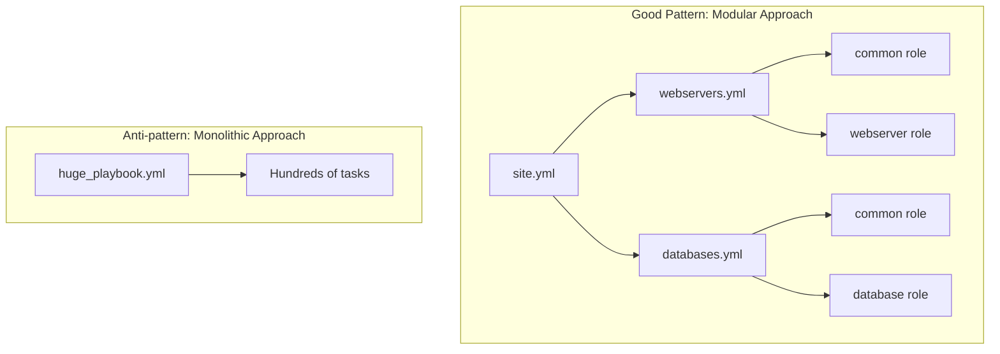

# Ansible Patterns and Anti-patterns

## Introduction

Ansible is a powerful automation tool that simplifies complex tasks like configuration management, application deployment, and orchestration. However, like any powerful tool, using it effectively requires understanding both beneficial patterns and problematic anti-patterns.

In this guide, we'll explore the most important Ansible patterns that lead to maintainable, scalable automation code, as well as the anti-patterns that can create technical debt and maintenance nightmares. Whether you're just starting with Ansible or looking to improve your existing infrastructure code, these guidelines will help you create more effective playbooks and roles.

## Ansible Patterns: The Good Practices

### 1. Use Roles for Organization

Roles are Ansible's way of bundling automation content like tasks, handlers, and variables into reusable components.

#### Pattern: Organize Code in Roles

```yaml
# Project structure
my_ansible_project/
├── inventory/
│   └── hosts
├── playbooks/
│   └── site.yml
└── roles/
    ├── webserver/
    │   ├── tasks/
    │   │   └── main.yml
    │   ├── handlers/
    │   │   └── main.yml
    │   ├── templates/
    │   │   └── nginx.conf.j2
    │   └── vars/
    │       └── main.yml
    └── database/
        └── ...
```

#### Usage Example

```yaml
# playbooks/site.yml
---
- name: Configure web servers
  hosts: webservers
  roles:
    - webserver

- name: Configure database servers
  hosts: databases
  roles:
    - database
```

**Benefits:**
- Promotes code reusability
- Makes playbooks more readable
- Provides a standard structure for your automation code

### 2. Use Variables for Environment-Specific Values

#### Pattern: Define Variables at Different Levels

```yaml
# group_vars/all.yml - Default values for all servers
---
http_port: 80
max_connections: 800

# group_vars/production.yml - Production-specific overrides
---
http_port: 80
max_connections: 1000

# host_vars/webserver1.yml - Host-specific settings
---
http_port: 8080
```

#### Usage in Templates

```jinja
# templates/nginx.conf.j2
server {
    listen {{ http_port }};
    # ...
    
    worker_connections {{ max_connections }};
    # ...
}
```

**Benefits:**
- Separates configuration from implementation
- Makes playbooks portable across environments
- Simplifies maintenance and updates

### 3. Use Tags for Selective Execution

#### Pattern: Tag Related Tasks

```yaml
# roles/webserver/tasks/main.yml
---
- name: Install nginx package
  ansible.builtin.package:
    name: nginx
    state: present
  tags:
    - install
    - webserver

- name: Configure nginx
  ansible.builtin.template:
    src: nginx.conf.j2
    dest: /etc/nginx/nginx.conf
  tags:
    - configure
    - webserver
  notify: Restart nginx
```

#### Running with Tags

```bash
# Only run tasks with the 'configure' tag
ansible-playbook site.yml --tags configure
```

**Benefits:**
- Allows selective execution of tasks
- Speeds up playbook runs by skipping irrelevant tasks
- Helps with troubleshooting specific parts of your automation

### 4. Idempotent Task Design

#### Pattern: Use State Modules and Conditional Checks

```yaml
# Idempotent task example
- name: Create application directory
  ansible.builtin.file:
    path: /opt/my_app
    state: directory
    mode: '0755'

- name: Check if application is installed
  ansible.builtin.stat:
    path: /opt/my_app/VERSION
  register: app_version_file

- name: Install application
  ansible.builtin.unarchive:
    src: https://example.com/releases/myapp-1.2.3.tar.gz
    dest: /opt/my_app
    remote_src: yes
  when: not app_version_file.stat.exists
```

**Benefits:**
- Playbooks can be run multiple times without causing issues
- Changes are only made when needed
- Reduces the risk of automation-related outages

### 5. Use Handlers for Service Management

#### Pattern: Define Handlers and Notify Them

```yaml
# roles/webserver/tasks/main.yml
---
- name: Configure nginx
  ansible.builtin.template:
    src: nginx.conf.j2
    dest: /etc/nginx/nginx.conf
  notify: Restart nginx

# roles/webserver/handlers/main.yml
---
- name: Restart nginx
  ansible.builtin.service:
    name: nginx
    state: restarted
```

**Benefits:**
- Ensures services are only restarted when configuration changes
- Groups related actions together
- Follows the principle of minimal intervention

## Ansible Anti-patterns: Practices to Avoid

### 1. Hardcoding Values

#### Anti-pattern:

```yaml
# Bad example - hardcoding
- name: Configure application
  ansible.builtin.template:
    src: app.conf.j2
    dest: /etc/app/config.ini
  notify: Restart application

- name: Start application
  ansible.builtin.service:
    name: myapp
    state: started
    enabled: yes
```

#### Better Approach:

```yaml
# Good example - using variables
- name: Configure application
  ansible.builtin.template:
    src: "{{ app_config_template }}"
    dest: "{{ app_config_path }}"
  notify: Restart {{ app_service_name }}

- name: Start application
  ansible.builtin.service:
    name: "{{ app_service_name }}"
    state: started
    enabled: yes
```

**Why It's Bad:**
- Reduces reusability of playbooks
- Makes updates more difficult and error-prone
- Creates technical debt

### 2. Using Shell/Command Modules When Specialized Modules Exist

#### Anti-pattern:

```yaml
# Bad example - using shell when specialized modules exist
- name: Install package
  ansible.builtin.shell: yum install -y nginx
  
- name: Create user
  ansible.builtin.command: useradd myappuser
```

#### Better Approach:

```yaml
# Good example - using specialized modules
- name: Install package
  ansible.builtin.package:
    name: nginx
    state: present
  
- name: Create user
  ansible.builtin.user:
    name: myappuser
    state: present
```

**Why It's Bad:**
- Shell/command modules are not idempotent by default
- Specialized modules handle error checking and idempotency
- Harder to maintain and understand

### 3. Large, Monolithic Playbooks

#### Anti-pattern:

```yaml
# Bad example - a monolithic playbook with hundreds of tasks
---
- name: Set up entire infrastructure
  hosts: all
  tasks:
    - name: Task 1
      # ...
    
    # ...hundreds of tasks later...
    
    - name: Task 999
      # ...
```

#### Better Approach:

```yaml
# Good example - breaking down into smaller, focused playbooks
---
# webservers.yml
- name: Configure web servers
  hosts: webservers
  roles:
    - common
    - webserver

# databases.yml
- name: Configure database servers
  hosts: databases
  roles:
    - common
    - database

# site.yml - Main entry point
- import_playbook: webservers.yml
- import_playbook: databases.yml
```

**Why It's Bad:**
- Difficult to maintain and understand
- Harder to debug when things go wrong
- Limits reusability

### 4. Ignoring Error Handling

#### Anti-pattern:

```yaml
# Bad example - no error handling
- name: Download application package
  ansible.builtin.get_url:
    url: https://example.com/app.tar.gz
    dest: /tmp/app.tar.gz
    
- name: Extract application
  ansible.builtin.unarchive:
    src: /tmp/app.tar.gz
    dest: /opt/app
    remote_src: yes
```

#### Better Approach:

```yaml
# Good example - with error handling
- name: Download application package
  ansible.builtin.get_url:
    url: https://example.com/app.tar.gz
    dest: /tmp/app.tar.gz
  register: download_result
  retries: 3
  delay: 5
  until: download_result is succeeded
    
- name: Extract application
  ansible.builtin.unarchive:
    src: /tmp/app.tar.gz
    dest: /opt/app
    remote_src: yes
  when: download_result is succeeded
```

**Why It's Bad:**
- Leads to incomplete deployments
- Difficult to troubleshoot
- Can leave systems in an inconsistent state

### 5. Not Using Version Control

While not strictly an Ansible code issue, not keeping your Ansible code in version control is a significant anti-pattern.

#### Anti-pattern:
- Editing playbooks directly on the Ansible control node
- No history of changes
- Multiple people making untracked changes

#### Better Approach:
- Keep all Ansible code in a Git repository
- Review changes before deploying
- Tag stable releases

```bash
# Example Git workflow
git checkout -b feature/add-redis-role
# Make changes to add Redis support
git add roles/redis
git commit -m "Add Redis role for caching layer"
git push origin feature/add-redis-role
# Create pull/merge request for review
```

**Why It's Bad:**
- No audit trail of changes
- Difficult to roll back problematic changes
- Complicates collaboration

## Visualizing the Pattern Differences

Here's a diagram showing the difference between a good pattern (modular approach) and an anti-pattern (monolithic approach):



## Real-world Example: Web Application Deployment

Let's look at a realistic example that demonstrates several good patterns:

### Project Structure

```
webapp_deploy/
├── ansible.cfg
├── inventory/
│   ├── production
│   └── staging
├── group_vars/
│   ├── all.yml
│   ├── production.yml
│   └── staging.yml
├── roles/
│   ├── common/
│   ├── nginx/
│   ├── app/
│   └── database/
└── playbooks/
    ├── site.yml
    ├── webservers.yml
    └── databases.yml
```

### Variables (group_vars/production.yml)

```yaml
---
# Environment specific variables
env_name: production
app_domain: example.com
app_port: 8000
db_user: app_prod_user
db_password: "{{ vault_db_password }}"  # Password stored in Ansible Vault

# Application settings
app_version: 1.2.3
app_log_level: warning
app_worker_processes: 4
```

### Role Example (roles/app/tasks/main.yml)

```yaml
---
- name: Create application user
  ansible.builtin.user:
    name: "{{ app_user }}"
    comment: "Application service account"
    system: yes
  tags:
    - app
    - user

- name: Install application dependencies
  ansible.builtin.package:
    name: "{{ app_dependencies }}"
    state: present
  tags:
    - app
    - packages

- name: Check if application is already installed
  ansible.builtin.stat:
    path: "{{ app_path }}/VERSION"
  register: app_version_file
  tags:
    - app
    - deploy

- name: Download application release
  ansible.builtin.get_url:
    url: "{{ app_download_url }}/v{{ app_version }}/app.tar.gz"
    dest: "/tmp/app-{{ app_version }}.tar.gz"
    checksum: "sha256:{{ app_checksum }}"
  when: >
    not app_version_file.stat.exists or
    (app_version_file.stat.exists and lookup('file', app_version_file.stat.path) != app_version)
  tags:
    - app
    - deploy
  register: app_download
  retries: 3
  delay: 5
  until: app_download is succeeded

- name: Deploy application
  ansible.builtin.unarchive:
    src: "/tmp/app-{{ app_version }}.tar.gz"
    dest: "{{ app_path }}"
    remote_src: yes
    owner: "{{ app_user }}"
    group: "{{ app_group }}"
  when: app_download is changed
  tags:
    - app
    - deploy
  notify: Restart application service

- name: Configure application
  ansible.builtin.template:
    src: app.conf.j2
    dest: "{{ app_config_path }}"
    owner: "{{ app_user }}"
    group: "{{ app_group }}"
    mode: '0640'
  tags:
    - app
    - config
  notify: Restart application service

- name: Write version file
  ansible.builtin.copy:
    content: "{{ app_version }}"
    dest: "{{ app_path }}/VERSION"
    owner: "{{ app_user }}"
    group: "{{ app_group }}"
  tags:
    - app
    - deploy
```

### Main Playbook (playbooks/site.yml)

```yaml
---
- import_playbook: databases.yml
- import_playbook: webservers.yml

- name: Verify deployment
  hosts: webservers
  gather_facts: no
  tasks:
    - name: Check if application is responding
      ansible.builtin.uri:
        url: "https://{{ app_domain }}"
        return_content: yes
      register: app_response
      retries: 5
      delay: 10
      until: app_response.status == 200
      delegate_to: localhost
      tags:
        - verify
        
    - name: Display successful deployment message
      ansible.builtin.debug:
        msg: "Application v{{ app_version }} successfully deployed to {{ env_name }}"
      when: app_response.status == 200
```

## Summary

Effective Ansible code follows clear patterns that promote:

- **Modularity**: Using roles and breaking down playbooks into manageable pieces
- **Reusability**: Employing variables, templates, and parameterized tasks
- **Reliability**: Focusing on idempotency and proper error handling
- **Scalability**: Creating structures that can grow with your infrastructure needs

Avoid these common anti-patterns:

- **Hardcoding**: Embedding specific values instead of using variables
- **Shell Commands**: Using shell/command modules when specialized modules exist
- **Monolithic Design**: Creating huge, unwieldy playbooks
- **Ignoring Errors**: Not handling failure cases properly
- **Manual Changes**: Not using version control and proper change management

By following these best practices, you'll create Ansible code that's easier to maintain, more reliable, and more effective at managing your infrastructure.

## Additional Resources

For those wanting to further explore Ansible best practices:

- **Official Ansible Documentation**: Particularly the [Best Practices](https://docs.ansible.com/ansible/latest/user_guide/playbooks_best_practices.html) section
- **Ansible Galaxy**: Browse community roles for examples of well-structured code
- **Ansible Lint**: A tool to check your playbooks for common issues and anti-patterns

## Exercises

1. **Refactoring Exercise**: Take a monolithic playbook and break it down into roles and smaller playbooks.
2. **Variable Organization**: Practice organizing variables at different levels (role defaults, group_vars, host_vars).
3. **Error Handling**: Add proper error handling to a playbook that currently lacks it.
4. **Tag Implementation**: Add appropriate tags to an existing role for selective execution.
5. **Idempotence Test**: Run one of your playbooks twice and verify that nothing changes on the second run.