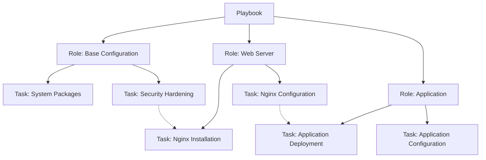

# Ansible Refactoring Strategies

## Introduction

When your Ansible codebase grows, it often becomes more complex and difficult to maintain. Refactoring is the process of restructuring existing code without changing its external behavior, with the goal of improving its internal structure. This guide explores strategies for refactoring Ansible playbooks, roles, and related components to ensure they remain maintainable, reusable, and efficient as your infrastructure automation needs evolve.

## Why Refactor Ansible Code?

Refactoring your Ansible code provides several key benefits:

- **Improved readability**: Make your code easier to understand for team members
- **Enhanced maintainability**: Simplify updates and troubleshooting
- **Better reusability**: Create components that can be used across multiple projects
- **Reduced duplication**: Eliminate redundant code to minimize errors
- **Easier testing**: Facilitate testing of individual components

## Strategy 1: Modularize Playbooks into Roles

### The Problem

Consider this monolithic playbook that handles multiple responsibilities:

```yaml
---
- name: Configure web server
  hosts: webservers
  become: yes
  tasks:
    - name: Install Nginx
      apt:
        name: nginx
        state: present
        
    - name: Configure Nginx
      template:
        src: nginx.conf.j2
        dest: /etc/nginx/nginx.conf
      notify: Restart Nginx
        
    - name: Install PHP
      apt:
        name: 
          - php-fpm
          - php-mysql
        state: present
        
    - name: Configure PHP
      template:
        src: php.ini.j2
        dest: /etc/php/7.4/fpm/php.ini
      notify: Restart PHP-FPM
      
    - name: Deploy application
      git:
        repo: https://github.com/example/app.git
        dest: /var/www/app
        
  handlers:
    - name: Restart Nginx
      service:
        name: nginx
        state: restarted
        
    - name: Restart PHP-FPM
      service:
        name: php7.4-fpm
        state: restarted
```

### The Solution

Refactor into separate roles:

```yaml
---
- name: Configure web server
  hosts: webservers
  become: yes
  roles:
    - nginx
    - php
    - app_deployment
```

Create dedicated roles for each component:

```
roles/
  ├── nginx/
  │   ├── tasks/
  │   │   └── main.yml
  │   ├── templates/
  │   │   └── nginx.conf.j2
  │   └── handlers/
  │       └── main.yml
  ├── php/
  │   ├── tasks/
  │   │   └── main.yml
  │   ├── templates/
  │   │   └── php.ini.j2
  │   └── handlers/
  │       └── main.yml
  └── app_deployment/
      └── tasks/
          └── main.yml
```

The `nginx/tasks/main.yml` would contain:

```yaml
---
- name: Install Nginx
  apt:
    name: nginx
    state: present
    
- name: Configure Nginx
  template:
    src: nginx.conf.j2
    dest: /etc/nginx/nginx.conf
  notify: Restart Nginx
```

## Strategy 2: Use Variables Effectively

### The Problem

Hardcoded values make playbooks inflexible:

```yaml
---
- name: Configure database
  hosts: db_servers
  become: yes
  tasks:
    - name: Install MySQL
      apt:
        name: mysql-server
        state: present
        
    - name: Configure MySQL
      template:
        src: mysql.cnf.j2
        dest: /etc/mysql/mysql.cnf
        
    - name: Set MySQL root password
      mysql_user:
        name: root
        password: insecure_password
        host_all: yes
```

### The Solution

Move configuration to variables:

```yaml
---
- name: Configure database
  hosts: db_servers
  become: yes
  vars_files:
    - vars/db_config.yml
  tasks:
    - name: Install {{ db_package }}
      apt:
        name: "{{ db_package }}"
        state: present
        
    - name: Configure {{ db_package }}
      template:
        src: "{{ db_config_template }}"
        dest: "{{ db_config_path }}"
        
    - name: Set database root password
      mysql_user:
        name: "{{ db_root_user }}"
        password: "{{ db_root_password }}"
        host_all: yes
```

With a `vars/db_config.yml` file:

```yaml
---
db_package: mysql-server
db_config_template: mysql.cnf.j2
db_config_path: /etc/mysql/mysql.cnf
db_root_user: root
db_root_password: "{{ vault_db_root_password }}"
```

And use Ansible Vault for sensitive information:

```bash
ansible-vault create vars/vault.yml
```

## Strategy 3: Extract Reusable Task Files

### The Problem

Repetitive tasks across multiple playbooks:

```yaml
# playbook1.yml
- name: Update apt cache
  apt:
    update_cache: yes
  when: ansible_os_family == "Debian"

# playbook2.yml
- name: Update apt cache
  apt:
    update_cache: yes
  when: ansible_os_family == "Debian"
```

### The Solution

Create a common task file:

```yaml
# tasks/update_apt.yml
---
- name: Update apt cache
  apt:
    update_cache: yes
  when: ansible_os_family == "Debian"
```

Then include it in your playbooks:

```yaml
# playbook1.yml
- name: Include apt update tasks
  import_tasks: tasks/update_apt.yml

# playbook2.yml
- name: Include apt update tasks
  import_tasks: tasks/update_apt.yml
```

## Strategy 4: Implement Task Tags

### The Problem

Running an entire playbook when you only need a specific part:

```yaml
---
- name: Configure web application
  hosts: webservers
  tasks:
    - name: Install packages
      apt:
        name: "{{ item }}"
        state: present
      loop:
        - nginx
        - php-fpm
        - git
        
    - name: Deploy configuration
      template:
        src: "{{ item.src }}"
        dest: "{{ item.dest }}"
      loop:
        - { src: "nginx.conf.j2", dest: "/etc/nginx/nginx.conf" }
        - { src: "php.ini.j2", dest: "/etc/php/7.4/fpm/php.ini" }
        
    - name: Deploy application
      git:
        repo: https://github.com/example/app.git
        dest: /var/www/app
```

### The Solution

Add tags to tasks to make them selectively runnable:

```yaml
---
- name: Configure web application
  hosts: webservers
  tasks:
    - name: Install packages
      apt:
        name: "{{ item }}"
        state: present
      loop:
        - nginx
        - php-fpm
        - git
      tags: 
        - install
        - packages
        
    - name: Deploy configuration
      template:
        src: "{{ item.src }}"
        dest: "{{ item.dest }}"
      loop:
        - { src: "nginx.conf.j2", dest: "/etc/nginx/nginx.conf" }
        - { src: "php.ini.j2", dest: "/etc/php/7.4/fpm/php.ini" }
      tags: 
        - config
        
    - name: Deploy application
      git:
        repo: https://github.com/example/app.git
        dest: /var/www/app
      tags: 
        - deploy
```

Now you can run specific parts of your playbook:

```bash
ansible-playbook webserver.yml --tags "config"
```

## Strategy 5: Implement Proper Error Handling

### The Problem

Playbooks fail without proper cleanup or error handling:

```yaml
---
- name: Risky operations
  hosts: webservers
  tasks:
    - name: Stop service
      service:
        name: nginx
        state: stopped
      
    - name: Update configuration
      template:
        src: nginx.conf.j2
        dest: /etc/nginx/nginx.conf
        
    - name: Start service
      service:
        name: nginx
        state: started
```

### The Solution

Use blocks, rescue, and always for proper error handling:

```yaml
---
- name: Operations with error handling
  hosts: webservers
  tasks:
    - name: Manage service configuration
      block:
        - name: Stop service
          service:
            name: nginx
            state: stopped
          
        - name: Update configuration
          template:
            src: nginx.conf.j2
            dest: /etc/nginx/nginx.conf
            validate: nginx -t -c %s
      rescue:
        - name: Log failure
          debug:
            msg: "Configuration update failed, restoring service"
            
        - name: Set failure flag
          set_fact:
            config_failed: true
      always:
        - name: Ensure service is running
          service:
            name: nginx
            state: started
          when: config_failed is not defined
```

## Strategy 6: Use Collections and Dependencies

### The Problem

Manually installing required roles and collections:

```bash
# Manual installation
ansible-galaxy install geerlingguy.mysql
ansible-galaxy collection install community.mysql
```

### The Solution

Specify dependencies in your role's `meta/main.yml`:

```yaml
---
dependencies:
  - role: geerlingguy.mysql
    when: "'db_servers' in group_names"
```

And use a `requirements.yml` file:

```yaml
---
roles:
  - name: geerlingguy.mysql
    version: 3.3.0

collections:
  - name: community.mysql
    version: 3.5.1
```

Install dependencies with a single command:

```bash
ansible-galaxy install -r requirements.yml
```

## Strategy 7: Create Custom Filters and Plugins

### The Problem

Complex data transformation in templates:

```jinja

server {{ server.name }} {{ server.ip }}:{{ server.port }} weight={{ server.weight if server.weight is defined else 10 }}

```

### The Solution

Create a custom filter plugin:

```python
# filter_plugins/custom_filters.py
def format_server(server):
    weight = server.get('weight', 10)
    return f"server {server['name']} {server['ip']}:{server['port']} weight={weight}"

class FilterModule(object):
    def filters(self):
        return {
            'format_server': format_server
        }
```

Simplify your templates:

```jinja

{{ server | format_server }}

```

## Strategy 8: Implement Idempotent Patterns

### The Problem

Tasks that run unnecessarily or cause changes on every run:

```yaml
---
- name: Install custom software
  hosts: all
  tasks:
    - name: Download installer
      get_url:
        url: https://example.com/installer.sh
        dest: /tmp/installer.sh
        
    - name: Run installer
      shell: bash /tmp/installer.sh
```

### The Solution

Make tasks idempotent by checking for existing state:

```yaml
---
- name: Install custom software
  hosts: all
  tasks:
    - name: Check if software is installed
      command: which custom-software
      register: software_check
      changed_when: false
      failed_when: false
      
    - name: Download installer
      get_url:
        url: https://example.com/installer.sh
        dest: /tmp/installer.sh
      when: software_check.rc != 0
        
    - name: Run installer
      shell: bash /tmp/installer.sh
      args:
        creates: /usr/local/bin/custom-software
      when: software_check.rc != 0
```

## Strategy 9: Visualize Workflow with Diagrams

When refactoring complex Ansible structures, it can be helpful to visualize the workflow and dependencies.



## Strategy 10: Implement Testing

An essential part of refactoring is ensuring that your changes don't break existing functionality. Implement testing as part of your refactoring process:

```yaml
---
- name: Test nginx role
  hosts: localhost
  roles:
    - role: nginx
  tasks:
    - name: Verify Nginx is installed
      command: nginx -v
      register: nginx_version
      changed_when: false
      
    - name: Check Nginx configuration syntax
      command: nginx -t
      changed_when: false
      
    - name: Verify Nginx is running
      command: systemctl is-active nginx
      register: nginx_active
      changed_when: false
      failed_when: nginx_active.stdout != "active"
```

Use tools like Molecule for more comprehensive testing:

```yaml
---
dependency:
  name: galaxy
driver:
  name: docker
platforms:
  - name: instance
    image: geerlingguy/docker-ubuntu2004-ansible
    pre_build_image: true
provisioner:
  name: ansible
verifier:
  name: ansible
```

## Summary

Refactoring your Ansible code is a continuous process that improves maintainability and efficiency. The key strategies we've covered include:

1. **Modularize playbooks into roles** to increase reusability
2. **Use variables effectively** to make your code more flexible
3. **Extract reusable task files** to reduce duplication
4. **Implement task tags** for selective execution
5. **Improve error handling** with blocks and rescue
6. **Leverage collections and dependencies** to simplify management
7. **Create custom filters and plugins** for complex operations
8. **Implement idempotent patterns** to prevent unnecessary changes
9. **Visualize workflows** with diagrams
10. **Implement testing** to ensure reliability

By adopting these strategies, you'll create Ansible code that's more maintainable, efficient, and easier for your team to understand and extend.

## Additional Resources

- **Ansible Documentation**: The official [Ansible Best Practices](https://docs.ansible.com/ansible/latest/user_guide/playbooks_best_practices.html) guide
- **Ansible Galaxy**: Browse [community roles](https://galaxy.ansible.com/) for inspiration on structure and organization
- **Molecule**: Learn about [testing Ansible roles](https://molecule.readthedocs.io/) with Molecule
- **Exercises**:
  - Take an existing monolithic playbook and refactor it into roles
  - Implement error handling in an existing playbook
  - Create a custom filter to simplify a complex template

Remember, refactoring is an incremental process—you don't need to implement all these strategies at once. Start with the one that will bring the most value to your specific situation, and gradually improve your Ansible codebase over time.