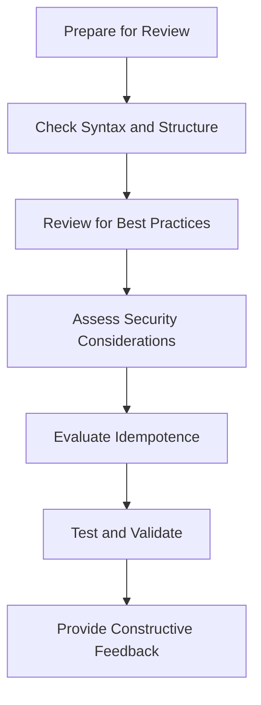

# Ansible Code Reviews

## Introduction

Code reviews are a critical part of the software development lifecycle, and Ansible code is no exception. As organizations increasingly rely on infrastructure as code (IaC) for automation, ensuring the quality and reliability of Ansible playbooks, roles, and modules becomes essential. This guide will walk you through the process of conducting effective Ansible code reviews, highlighting specific considerations unique to Ansible's YAML-based syntax and automation paradigms.

Code reviews for Ansible serve multiple purposes:
- Catching bugs and logic errors before deployment
- Ensuring adherence to best practices and organizational standards
- Sharing knowledge among team members
- Improving overall code quality and maintainability
- Preventing security vulnerabilities in your automation

Whether you're new to Ansible or looking to improve your team's review process, this guide will provide you with practical approaches to reviewing Ansible code effectively.

## Prerequisites

Before diving into code reviews, you should have:
- Basic understanding of Ansible concepts (playbooks, roles, tasks)
- Familiarity with YAML syntax
- Access to your team's Ansible codebase

## The Ansible Code Review Process

Let's walk through a structured approach to reviewing Ansible code:



### 1. Preparation

Before starting a review, make sure you:

- Understand the purpose of the code changes
- Have the proper context about the systems being automated
- Know your organization's Ansible standards

### 2. Syntax and Structure Review

#### YAML Validation

Always check that the YAML syntax is valid. Indentation errors are common in Ansible playbooks.

```bash
# Command to validate YAML syntax
ansible-playbook --syntax-check playbook.yml
```

Example output for a valid playbook:
```
playbook: playbook.yml
```

Example output for an invalid playbook:
```
ERROR! Syntax Error while loading YAML.
  found character that cannot start any token

The error appears to be in '/path/to/playbook.yml': line 8, column 3, but may
be elsewhere in the file depending on the exact syntax problem.
```

#### Directory Structure

Check if the code follows Ansible's recommended directory structure for roles:

```
roles/
  role_name/
    defaults/       # Default variables
    files/          # Static files
    handlers/       # Handlers
    meta/           # Role metadata
    tasks/          # Tasks
    templates/      # Jinja2 templates
    vars/           # Role variables
```

### 3. Best Practices Review

#### Naming Conventions

Check if the code follows consistent naming conventions:

```yaml
# Good: Clear, descriptive task names
- name: Install required packages
  apt:
    name: 
      - nginx
      - postgresql
    state: present
    update_cache: yes

# Bad: Vague or missing task names
- apt:
    name: nginx
    state: present
```

#### Module Usage

Review proper module usage and parameters:

```yaml
# Good: Using appropriate modules
- name: Copy configuration file
  copy:
    src: nginx.conf
    dest: /etc/nginx/nginx.conf
    owner: root
    group: root
    mode: '0644'
  
# Bad: Using command where a module exists
- name: Copy configuration file
  command: cp nginx.conf /etc/nginx/nginx.conf
```

#### Variables

Verify proper variable scope and naming:

```yaml
# Good: Clear variable names with proper scoping
- name: Set web server port
  set_fact:
    web_server_port: 8080

# Bad: Vague or ambiguous variable names
- name: Set port
  set_fact:
    p: 8080
```

### 4. Security Considerations

#### Sensitive Data

Check for exposed secrets or credentials:

```yaml
# Bad: Hardcoded credentials
- name: Connect to database
  mysql_db:
    login_user: admin
    login_password: supersecret  # This should never appear in code
    name: myapp
    state: present

# Good: Using Ansible Vault or variables
- name: Connect to database
  mysql_db:
    login_user: "{{ db_user }}"
    login_password: "{{ db_password }}"
    name: myapp
    state: present
```

#### Permissions

Review file permissions and privilege escalation:

```yaml
# Good: Explicit permission settings
- name: Create application directory
  file:
    path: /opt/myapp
    state: directory
    mode: '0755'
    owner: app_user
    group: app_group

# Good: Limiting privilege escalation
- name: Restart application
  become: yes
  become_user: app_user
  systemd:
    name: myapp
    state: restarted
```

### 5. Idempotence Review

Ensure tasks are idempotent (can run multiple times without changing the result):

```yaml
# Good: Idempotent task
- name: Ensure configuration line exists
  lineinfile:
    path: /etc/ssh/sshd_config
    regexp: '^PermitRootLogin'
    line: 'PermitRootLogin no'
  
# Bad: Non-idempotent task
- name: Add configuration line
  shell: echo 'PermitRootLogin no' >> /etc/ssh/sshd_config
```

### 6. Error Handling

Check for proper error handling and failed_when conditions:

```yaml
# Good: Proper error handling
- name: Check if service is running
  command: systemctl status myapp
  register: service_status
  failed_when: false
  changed_when: false

- name: Start service if not running
  systemd:
    name: myapp
    state: started
  when: service_status.rc != 0
```

## Practical Example: Reviewing a Web Server Role

Let's review a sample Ansible role for deploying a web server:

### Original Code

```yaml
# roles/webserver/tasks/main.yml
- name: install nginx
  apt: name=nginx state=present

- shell: echo "server_name {{ domain }};" >> /etc/nginx/sites-available/default

- command: systemctl restart nginx

- file: path=/var/www/html/index.html content="<html><body>Hello</body></html>"
```

### Code Review Comments

Here's how we might review this code:

1. **Syntax Issues**: The `file` module is being used incorrectly; it doesn't have a `content` parameter.
2. **Idempotence Problems**: Using `echo` with `>>` will add the line each time the playbook runs.
3. **Missing Task Names**: Some tasks don't have descriptive names.
4. **Error Handling**: No checks before restarting services.
5. **Security**: No consideration for file permissions.

### Improved Version

```yaml
# roles/webserver/tasks/main.yml
- name: Install nginx web server
  apt:
    name: nginx
    state: present
    update_cache: yes

- name: Configure server_name in nginx default site
  lineinfile:
    path: /etc/nginx/sites-available/default
    regexp: '^(\s*)server_name'
    line: "    server_name {{ domain }};"
    insertafter: '^\s*listen'
  notify: Restart nginx

- name: Create index.html
  copy:
    content: "<html><body>Hello</body></html>"
    dest: /var/www/html/index.html
    owner: www-data
    group: www-data
    mode: '0644'

# roles/webserver/handlers/main.yml
- name: Restart nginx
  systemd:
    name: nginx
    state: restarted
```

## Ansible-Specific Review Checklist

Here's a handy checklist for Ansible code reviews:

1. **Playbook Structure**
   - Are tasks logically grouped?
   - Are roles used appropriately?
   - Is there a clear separation of concerns?

2. **Variables Management**
   - Are variables properly scoped?
   - Are defaults provided where appropriate?
   - Are variable names descriptive and consistent?

3. **Idempotence**
   - Will tasks produce the same result when run multiple times?
   - Are proper state parameters used?

4. **Performance**
   - Are tasks optimized for performance?
   - Is async used for long-running tasks when appropriate?

5. **Security**
   - Are sensitive values protected with Ansible Vault?
   - Is privilege escalation limited to necessary tasks?
   - Are file permissions explicitly set?

6. **Error Handling**
   - Are failures handled gracefully?
   - Is there appropriate use of failed_when, changed_when, and ignore_errors?

7. **Documentation**
   - Are tasks, roles, and playbooks well-documented?
   - Are there README files for complex roles?

## Tools for Ansible Code Reviews

Several tools can help automate aspects of Ansible code reviews:

1. **ansible-lint**: A linting tool to check playbooks for practices and behavior that could potentially be improved.

```bash
# Install ansible-lint
pip install ansible-lint

# Run ansible-lint on a playbook
ansible-lint playbook.yml
```

Example output:
```
playbook.yml:15: [EANSIBLE0002] Trailing whitespace
playbook.yml:22: [EANSIBLE0012] Commands should not change things if nothing needs doing
```

2. **YAML Linters**: Tools like yamllint can help enforce YAML formatting standards.

3. **Molecule**: A testing framework for Ansible roles that can be incorporated into your review process.

4. **Git Hooks**: Implement pre-commit hooks to automatically check Ansible code before it's committed.

## Implementing Code Reviews in Your Team

For effective Ansible code reviews, consider these team practices:

1. **Create a Standard**: Develop an Ansible style guide for your organization.

2. **Automate Where Possible**: Integrate linting tools into your CI/CD pipeline.

3. **Review Checklist**: Create a team-specific checklist based on your requirements.

4. **Pair Programming**: Consider pair programming for complex Ansible tasks.

5. **Knowledge Sharing**: Use code reviews as opportunities to share knowledge.

## Summary

Effective Ansible code reviews are crucial for maintaining high-quality infrastructure as code. By focusing on syntax, structure, best practices, security, and idempotence, you can ensure your Ansible code is reliable, maintainable, and secure.

Remember that the goal of code reviews is not just to find problems but to collaboratively improve code quality and share knowledge across the team.

## Additional Resources

- Official Ansible Best Practices: [Ansible Documentation](https://docs.ansible.com/ansible/latest/user_guide/playbooks_best_practices.html)
- Ansible Lint Documentation: [Ansible Lint](https://ansible-lint.readthedocs.io/)
- Ansible Galaxy: [Galaxy](https://galaxy.ansible.com/) for examples of well-structured roles

## Exercises

1. Set up `ansible-lint` in your development environment and run it against an existing playbook.
2. Perform a code review on an existing Ansible role in your organization using the checklist from this guide.
3. Refactor a non-idempotent task to make it idempotent.
4. Create a pre-commit hook that runs syntax-checking on Ansible playbooks.
5. Practice giving constructive feedback on an Ansible playbook with a team member.