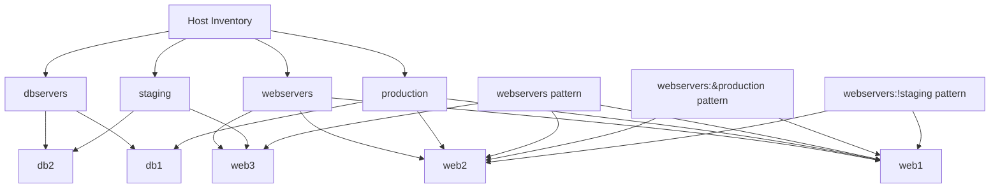

# Ansible Host Patterns

## Introduction

When working with Ansible, you'll often need to target specific hosts or groups of hosts for your automation tasks. This is where **host patterns** come into play. Host patterns are powerful expressions that allow you to select exactly which machines Ansible should operate on when executing playbooks or ad-hoc commands.

In this guide, we'll explore how to use host patterns effectively to target your infrastructure precisely.

## What Are Host Patterns?

Host patterns are expressions used in Ansible to select hosts from your inventory. They can be as simple as a single hostname or as complex as a combination of groups with set operations. Host patterns determine the scope of Ansible's actions - which machines will be affected by a particular task, playbook, or command.

## Basic Host Patterns

Let's start with the simplest host patterns:

### Single Host

To target a single host by its name:

```bash
ansible web1.example.com -m ping
```

This command will run the ping module only on the host named `web1.example.com`.

### All Hosts

To target all hosts in your inventory:

```bash
ansible all -m ping
```

The special pattern `all` refers to every host defined in your inventory.

### Wildcard Patterns

You can use wildcards to match multiple hosts with similar names:

```bash
ansible "web*.example.com" -m ping
```

This would match hosts like `web1.example.com`, `web2.example.com`, etc.

## Group-Based Patterns

Ansible inventories typically organize hosts into groups. These groups become powerful tools for targeting hosts:

### Single Group

To target all hosts in a specific group:

```bash
ansible webservers -m ping
```

This command runs the ping module on all hosts in the `webservers` group.

### Multiple Groups

You can specify multiple groups using colons:

```bash
ansible webservers:dbservers -m ping
```

This targets all hosts in either the `webservers` OR `dbservers` groups.

## Advanced Host Patterns

As your infrastructure grows, you'll need more sophisticated targeting:

### Intersection of Groups

To target hosts that are in both groups (AND operation):

```bash
ansible "webservers:&production" -m ping
```

This targets hosts that are in both the `webservers` AND `production` groups.

### Exclusion

To exclude specific hosts or groups:

```bash
ansible "webservers:!staging" -m ping
```

This targets hosts in the `webservers` group EXCEPT those also in the `staging` group.

### Combining Operations

You can combine these operations for complex patterns:

```bash
ansible "webservers:dbservers:&production:!staging" -m ping
```

This targets hosts that are:
- In either `webservers` OR `dbservers` groups
- AND in the `production` group
- BUT NOT in the `staging` group

## Real-World Examples

Let's look at some practical examples to understand how host patterns work in real scenarios:

### Example 1: Rolling Updates

Imagine you need to update your web servers in batches to avoid downtime:

```yaml
---
- name: Perform rolling updates on web servers
  hosts: webservers:&production
  serial: 2  # Update 2 servers at a time
  tasks:
    - name: Update packages
      ansible.builtin.apt:
        update_cache: yes
        upgrade: yes
```

This playbook targets only production web servers and updates them two at a time.

### Example 2: Environment-Specific Deployment

```yaml
---
- name: Deploy application to staging
  hosts: "app_servers:&staging"
  tasks:
    - name: Pull latest code
      ansible.builtin.git:
        repo: https://github.com/company/app.git
        dest: /var/www/app
        version: develop

- name: Deploy application to production
  hosts: "app_servers:&production"
  tasks:
    - name: Pull latest code
      ansible.builtin.git:
        repo: https://github.com/company/app.git
        dest: /var/www/app
        version: main
```

This playbook uses different host patterns to deploy different code branches to staging and production environments.

### Example 3: Regional Maintenance

If your inventory organizes servers by region:

```yaml
---
- name: Perform maintenance on US-West servers only
  hosts: "us-west:!critical"
  tasks:
    - name: Schedule maintenance reboot
      ansible.builtin.reboot:
        reboot_timeout: 3600
        msg: "Scheduled maintenance reboot"
```

This playbook targets servers in the US-West region, excluding those marked as critical.

## Host Patterns with Variables

You can make your playbooks more flexible by using variables in host patterns:

```yaml
---
- name: Dynamic targeting with variables
  hosts: "{{ target_group | default('all') }}"
  tasks:
    - name: Echo hostname
      ansible.builtin.debug:
        msg: "Running on {{ inventory_hostname }}"
```

This allows you to specify the target group when running the playbook:

```bash
ansible-playbook playbook.yml -e "target_group=webservers"
```

## Host Patterns in Inventory Files

Your inventory file structure already sets up implicit host patterns. Here's an example inventory:

```ini
# Simple hosts
web1.example.com
web2.example.com

# Groups
[webservers]
web1.example.com
web2.example.com

[dbservers]
db1.example.com
db2.example.com

# Group of groups
[production:children]
webservers
dbservers

[staging]
stage-web.example.com
stage-db.example.com
```

With this inventory, you can use patterns like `webservers`, `production`, or `production:!dbservers`.

## Limit Patterns

You can also override the hosts specified in a playbook using the `--limit` flag:

```bash
ansible-playbook site.yml --limit "webservers:&production"
```

This is useful for testing or when you need to run a playbook on a subset of hosts without modifying the playbook itself.

## Visualizing Host Patterns with a Diagram

Here's a diagram showing how different host patterns select hosts from groups:



## Summary

Host patterns are a fundamental concept in Ansible that allows you to precisely target the hosts you want to manage. From simple patterns like single hosts or groups to complex combinations using logical operators, mastering host patterns will give you fine-grained control over your infrastructure automation.

Remember these key points:

- Use group names to target all hosts in a group
- Use `:` (colon) for OR operations
- Use `:&` for AND operations
- Use `:!` for NOT operations
- Combine these operators for complex targeting
- Use the `--limit` option for temporary overrides

By effectively using host patterns, you can create more efficient and targeted automation workflows, reducing the risk of accidentally affecting the wrong systems.

## Exercises

1. Create an inventory file with at least 3 groups and 6 hosts, then practice targeting different combinations with host patterns.
2. Write a playbook that uses different host patterns for different plays.
3. Try using a variable-based host pattern and run your playbook with different target groups.

## Additional Resources

- The official [Ansible documentation on patterns](https://docs.ansible.com/ansible/latest/user_guide/intro_patterns.html)
- The [Ansible inventory guide](https://docs.ansible.com/ansible/latest/user_guide/intro_inventory.html) for more information on organizing your hosts
- Practice with [Ansible ad-hoc commands](https://docs.ansible.com/ansible/latest/user_guide/intro_adhoc.html) to test different host patterns