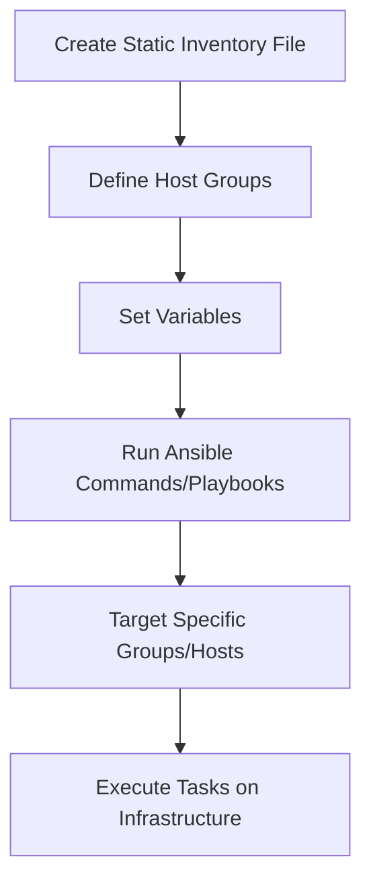

# Ansible Static Inventory

## Introduction

An inventory in Ansible is a collection of hosts (nodes) that Ansible manages. Static inventory is the simplest form of inventory where you manually define hosts and groups in plain text files. This approach is perfect for small to medium-sized environments with relatively stable infrastructure.

In this tutorial, you'll learn how to create, organize, and use static inventory files effectively in your Ansible automation workflows.

## Understanding Static Inventory

Static inventory files in Ansible provide a way to categorize and organize the servers you want to manage. They allow you to:

- Define groups of servers based on function, location, or other criteria
- Set variables for individual hosts or entire groups
- Create hierarchical groups (groups of groups)
- Specify connection details for each host

Unlike dynamic inventory (which we'll cover in another tutorial), static inventory requires manual updates when your infrastructure changes.

## Basic Inventory File

The simplest inventory file is just a list of hostnames or IP addresses, one per line:

```ini
192.168.1.50
192.168.1.51
192.168.1.52
web.example.com
db.example.com
```

By default, Ansible looks for this file at `/etc/ansible/hosts`, but you can specify a different inventory file using the `-i` option:

```bash
ansible -i inventory_file all -m ping
```

## Organizing Hosts with Groups

Grouping hosts makes it easier to target specific sets of servers. Here's how to define groups in the INI format:

```ini
[webservers]
web1.example.com
web2.example.com
192.168.1.100

[dbservers]
db1.example.com
db2.example.com

[development]
dev.example.com
staging.example.com
```

With this inventory, you can target all webservers with:

```bash
ansible webservers -m ping
```

Or all database servers:

```bash
ansible dbservers -m yum -a "name=postgresql state=latest"
```

## Range Patterns

Ansible supports range patterns to make defining multiple similar hosts easier:

```ini
[webservers]
web[1:5].example.com

[dbservers]
db-[a:c].example.com
```

This expands to:
- web1.example.com through web5.example.com
- db-a.example.com, db-b.example.com, and db-c.example.com

## Group Variables

You can assign variables to groups using the `[group:vars]` section:

```ini
[webservers]
web1.example.com
web2.example.com

[webservers:vars]
http_port=80
proxy_timeout=5
```

These variables will be available to all hosts in the webservers group.

## Host Variables

Variables can also be set for individual hosts:

```ini
[webservers]
web1.example.com http_port=8080 ansible_user=admin
web2.example.com http_port=8081 ansible_user=deploy
```

## Groups of Groups

You can create hierarchical group structures:

```ini
[webservers]
web1.example.com
web2.example.com

[dbservers]
db1.example.com
db2.example.com

[east_datacenter]
web1.example.com
db1.example.com

[west_datacenter]
web2.example.com
db2.example.com

[datacenters:children]
east_datacenter
west_datacenter
```

Now you can target all hosts in both datacenters with:

```bash
ansible datacenters -m ping
```

## Connection Settings in Inventory

You can specify connection details for each host:

```ini
[webservers]
web1.example.com ansible_connection=ssh ansible_user=admin ansible_ssh_private_key_file=/path/to/key
web2.example.com ansible_connection=ssh ansible_user=deploy ansible_port=2222
localhost ansible_connection=local
```

Common connection variables include:
- `ansible_connection`: Connection type (ssh, local, docker, etc.)
- `ansible_user`: Username for SSH connections
- `ansible_port`: Port to connect to
- `ansible_ssh_private_key_file`: Path to private key file
- `ansible_become`: Whether to use privilege escalation
- `ansible_become_method`: Method for privilege escalation (sudo, su, etc.)
- `ansible_become_user`: User to become

## YAML Format for Inventory

While the INI format is common, Ansible also supports YAML for inventory files, which can be more readable for complex configurations:

```yaml
all:
  children:
    webservers:
      hosts:
        web1.example.com:
          http_port: 8080
          ansible_user: admin
        web2.example.com:
          http_port: 8081
      vars:
        proxy_timeout: 5
    dbservers:
      hosts:
        db1.example.com:
        db2.example.com:
      vars:
        db_port: 5432
    datacenters:
      children:
        east_datacenter:
          hosts:
            web1.example.com:
            db1.example.com:
        west_datacenter:
          hosts:
            web2.example.com:
            db2.example.com:
```

## Multiple Inventory Files

For better organization, you can split your inventory into multiple files within a directory structure:

```
inventory/
├── group_vars/
│   ├── webservers.yml
│   └── dbservers.yml
├── host_vars/
│   ├── web1.example.com.yml
│   └── db1.example.com.yml
├── production
└── staging
```

To use this inventory, specify the directory:

```bash
ansible -i inventory/ all -m ping
```

## Visualizing Your Inventory

You can see the hosts in your inventory and their group memberships with:

```bash
ansible-inventory -i inventory_file --graph
```

Example output:
```
@all:
  |--@dbservers:
  |  |--db1.example.com
  |  |--db2.example.com
  |--@webservers:
  |  |--web1.example.com
  |  |--web2.example.com
  |--@ungrouped:
```

For more detailed information including variables:

```bash
ansible-inventory -i inventory_file --list
```

## Practical Example: Complete Static Inventory

Let's create a complete example for a small web application environment:

```ini
# Production environment
[prod_webservers]
prod-web1.example.com
prod-web2.example.com

[prod_dbservers]
prod-db1.example.com

[prod:children]
prod_webservers
prod_dbservers

[prod:vars]
env=production
alert_email=admin@example.com

# Staging environment
[staging_webservers]
staging-web1.example.com

[staging_dbservers]
staging-db1.example.com

[staging:children]
staging_webservers
staging_dbservers

[staging:vars]
env=staging
alert_email=dev@example.com

# Web servers across all environments
[webservers:children]
prod_webservers
staging_webservers

[webservers:vars]
http_port=80
ansible_user=webadmin
firewall_allowed_tcp_ports=[80, 443]

# Database servers across all environments
[dbservers:children]
prod_dbservers
staging_dbservers

[dbservers:vars]
db_port=5432
ansible_user=dbadmin
backup_folder=/var/backups/postgres
```

With this inventory, you could run a playbook on all production servers:

```bash
ansible-playbook -i inventory site.yml --limit prod
```

Or update all database servers across environments:

```bash
ansible-playbook -i inventory db-update.yml --limit dbservers
```

## Inventory Testing and Verification

Before using your inventory in production, it's a good practice to verify it:

1. Check for syntax errors:
   ```bash
   ansible-inventory -i inventory --graph
   ```

2. Ensure you can reach all hosts:
   ```bash
   ansible -i inventory all -m ping
   ```

3. Check which hosts would be affected by a playbook:
   ```bash
   ansible-playbook playbook.yml -i inventory --list-hosts
   ```

## Common Inventory Patterns and Best Practices

1. **Use meaningful group names**: Group names should clearly indicate the purpose or function of the servers.

2. **Group by function and environment**: Create groups based on server function (web, db, cache) and environment (prod, dev, staging).

3. **Use host_vars and group_vars directories**: For complex setups, store variables in separate YAML files.

4. **Document your inventory**: Add comments to explain the purpose of servers and groups.

5. **Version control your inventory**: Store your inventory files in a version control system like Git.

6. **Use vault for sensitive data**: Use Ansible Vault to encrypt sensitive variables.

7. **Keep it DRY (Don't Repeat Yourself)**: Use group hierarchies and variable inheritance to avoid duplication.

## Workflow Diagram

Here's a simple visualization of how static inventory fits into the Ansible workflow:



## Summary

Static inventory in Ansible provides a straightforward way to organize and manage your infrastructure. By defining hosts and groups in simple text files, you gain the ability to effectively target specific sets of servers for configuration management and automation tasks.

In this tutorial, you've learned:
- How to create basic static inventory files
- Ways to organize hosts into meaningful groups
- Methods for setting variables at host and group levels
- Techniques for creating hierarchical group structures
- Best practices for managing your inventory

While static inventory works well for stable environments, as your infrastructure grows or becomes more dynamic, you might want to explore dynamic inventory solutions, which we'll cover in another tutorial.

## Exercises

1. Create a static inventory file with at least three groups: webservers, dbservers, and monitoring.
2. Add variables to specify different SSH users for each group.
3. Create a group that includes all servers from other groups.
4. Test your inventory by running an ad-hoc ping command against different groups.
5. Add range patterns to define 5 web servers (web1 through web5).

## Additional Resources

- [Ansible Documentation: Working with Inventory](https://docs.ansible.com/ansible/latest/user_guide/intro_inventory.html)
- [Ansible Documentation: How to build your inventory](https://docs.ansible.com/ansible/latest/network/getting_started/first_inventory.html)
- [Ansible Documentation: Patterns - targeting hosts and groups](https://docs.ansible.com/ansible/latest/user_guide/intro_patterns.html)