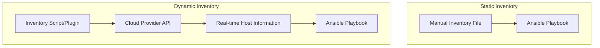

# Ansible Dynamic Inventory

## Introduction

When managing infrastructure with Ansible, one of the first concepts you encounter is inventory - the list of hosts that Ansible will manage. While static inventory files (typically in INI or YAML format) work well for stable environments, they become cumbersome in dynamic cloud environments where servers are constantly being created and destroyed.

**Ansible Dynamic Inventory** solves this problem by generating inventory information in real-time. Instead of maintaining static inventory files, dynamic inventory scripts or plugins query your infrastructure providers (like AWS, Azure, GCP) or other sources of truth (like VMware, CMDB systems) to discover hosts automatically.

## Understanding Dynamic Inventory

### Static vs. Dynamic Inventory

Let's first compare the traditional static inventory approach with dynamic inventory:



With static inventory:
- You manually maintain inventory files
- Changes to infrastructure require manual updates
- Prone to human error and outdated information

With dynamic inventory:
- Inventory is generated at runtime
- Infrastructure changes are automatically detected
- Always up-to-date with your actual environment

## Dynamic Inventory Methods

There are two primary methods to implement dynamic inventory in Ansible:

1. **Inventory Scripts**: Executable programs that generate JSON output in a specific format
2. **Inventory Plugins**: More modern Python modules that are integrated with Ansible's plugin system

### Using Inventory Scripts

Inventory scripts are executable programs (in any language) that output JSON in a specific format that Ansible can understand.

Here's a simple example of a basic dynamic inventory script in Python:

```python
#!/usr/bin/env python3

import json

# In a real scenario, you would query your infrastructure here
# For example, using boto3 for AWS or a similar SDK

# Sample inventory data
inventory = {
    "webservers": {
        "hosts": ["web1.example.com", "web2.example.com"],
        "vars": {
            "http_port": 80
        }
    },
    "databases": {
        "hosts": ["db1.example.com"],
        "vars": {
            "db_port": 5432
        }
    },
    "_meta": {
        "hostvars": {
            "web1.example.com": {
                "ansible_host": "192.168.1.101",
                "role": "web"
            },
            "web2.example.com": {
                "ansible_host": "192.168.1.102",
                "role": "web"
            },
            "db1.example.com": {
                "ansible_host": "192.168.1.103",
                "role": "db"
            }
        }
    }
}

print(json.dumps(inventory))
```

Save this script as `inventory.py`, make it executable with `chmod +x inventory.py`, and use it with Ansible like this:

```bash
ansible-playbook -i inventory.py playbook.yml
```

The `_meta` section is a special section that contains host variables. This allows Ansible to retrieve all data in a single execution of the script, improving performance.

### Using Inventory Plugins

Inventory plugins are the newer, preferred method for implementing dynamic inventory. They provide better integration with Ansible and offer more features.

To use an inventory plugin, you create a YAML configuration file:

```yaml
# aws_ec2.yml
plugin: aws_ec2
regions:
  - us-east-1
  - us-west-1
keyed_groups:
  - key: tags.Environment
    prefix: env
  - key: tags.Application
    prefix: app
  - key: instance_type
    prefix: type
filters:
  instance-state-name: running
```

Then use it with Ansible:

```bash
ansible-playbook -i aws_ec2.yml playbook.yml
```

## Built-in Dynamic Inventory Plugins

Ansible includes many built-in inventory plugins for popular cloud providers:

- **AWS EC2**: Discovers EC2 instances
- **Azure RM**: Discovers Azure resources
- **GCP Compute**: Discovers Google Cloud Platform instances
- **VMware vSphere**: Discovers virtual machines in vSphere
- **OpenStack**: Discovers instances in OpenStack
- Many more!

## Practical Example: AWS EC2 Dynamic Inventory

Let's walk through a practical example of using the AWS EC2 inventory plugin:

### Step 1: Install Required Dependencies

```bash
pip install boto3
```

### Step 2: Configure AWS Credentials

Set up your AWS credentials either through environment variables, the AWS CLI configuration, or an Ansible variables file.

### Step 3: Create the Inventory Configuration File

Create a file named `aws_ec2.yml`:

```yaml
# aws_ec2.yml
plugin: aws_ec2
regions:
  - us-east-1
filters:
  instance-state-name: running
groups:
  webservers: "'web' in tags.Role"
  databases: "'db' in tags.Role"
compose:
  ansible_host: public_ip_address
```

### Step 4: Test the Inventory

```bash
ansible-inventory -i aws_ec2.yml --list
```

This should output a JSON representation of your AWS infrastructure.

Example output:

```json
{
    "_meta": {
        "hostvars": {
            "i-0abc123def456789": {
                "ansible_host": "54.123.45.67",
                "instance_id": "i-0abc123def456789",
                "instance_type": "t2.micro",
                "private_ip_address": "10.0.1.10",
                "public_ip_address": "54.123.45.67",
                "region": "us-east-1",
                "tags": {
                    "Name": "web-server-1",
                    "Role": "web"
                }
            },
            "i-0xyz987abc654321": {
                "ansible_host": "54.234.56.78",
                "instance_id": "i-0xyz987abc654321",
                "instance_type": "t2.micro",
                "private_ip_address": "10.0.1.11",
                "public_ip_address": "54.234.56.78",
                "region": "us-east-1",
                "tags": {
                    "Name": "db-server-1",
                    "Role": "db"
                }
            }
        }
    },
    "all": {
        "children": [
            "aws_ec2",
            "databases",
            "ungrouped",
            "webservers"
        ]
    },
    "aws_ec2": {
        "hosts": [
            "i-0abc123def456789",
            "i-0xyz987abc654321"
        ]
    },
    "databases": {
        "hosts": [
            "i-0xyz987abc654321"
        ]
    },
    "webservers": {
        "hosts": [
            "i-0abc123def456789"
        ]
    }
}
```

### Step 5: Use with Ansible Playbook

Now you can run a playbook targeting your discovered infrastructure:

```bash
ansible-playbook -i aws_ec2.yml playbook.yml
```

## Custom Dynamic Inventory

You can also create your own custom dynamic inventory scripts or plugins for systems not supported by built-in plugins.

### Custom Inventory Script Example

Here's an example of a custom inventory script that might query a custom CMDB system:

```python
#!/usr/bin/env python3

import json
import requests
import os

# Get API token from environment variable
api_token = os.environ.get('CMDB_API_TOKEN')

# Make API request to your CMDB
response = requests.get(
    'https://cmdb.example.com/api/servers',
    headers={'Authorization': f'Bearer {api_token}'}
)

servers = response.json()

# Format data for Ansible
inventory = {
    '_meta': {
        'hostvars': {}
    }
}

# Process servers and add to groups
for server in servers:
    # Extract server data
    hostname = server['name']
    ip = server['ip_address']
    environment = server['environment']
    role = server['role']
    
    # Add host to _meta
    inventory['_meta']['hostvars'][hostname] = {
        'ansible_host': ip,
        'environment': environment,
        'role': role
    }
    
    # Create environment group if it doesn't exist
    if environment not in inventory:
        inventory[environment] = {
            'hosts': []
        }
    
    # Add host to environment group
    inventory[environment]['hosts'].append(hostname)
    
    # Create role group if it doesn't exist
    if role not in inventory:
        inventory[role] = {
            'hosts': []
        }
    
    # Add host to role group
    inventory[role]['hosts'].append(hostname)

# Output inventory in JSON format
print(json.dumps(inventory))
```

Make it executable and use it with Ansible:

```bash
export CMDB_API_TOKEN=your_api_token
ansible-playbook -i custom_inventory.py playbook.yml
```

## Dynamic Inventory Best Practices

1. **Caching**: For large environments, consider enabling inventory caching to improve performance

   ```yaml
   # aws_ec2.yml
   plugin: aws_ec2
   cache: yes
   cache_plugin: jsonfile
   cache_timeout: 3600
   cache_connection: /tmp/aws_inventory_cache
   # Rest of configuration...
   ```

2. **Organized Grouping**: Use meaningful group names and hierarchies
   
3. **Host Variables**: Set relevant host variables based on infrastructure metadata

4. **Documentation**: Document your inventory configuration, especially for custom scripts

5. **Version Control**: Keep inventory configuration files in version control with your playbooks

6. **Testing**: Regularly test your inventory configuration with `ansible-inventory --list`

## Debugging Dynamic Inventory

If you're having issues with your dynamic inventory:

1. Use `ansible-inventory` to check the output:

   ```bash
   ansible-inventory -i inventory_file --list
   ansible-inventory -i inventory_file --graph
   ```

2. Enable verbose output:

   ```bash
   ANSIBLE_VERBOSITY=3 ansible-inventory -i inventory_file --list
   ```

3. Check for specific hosts:

   ```bash
   ansible-inventory -i inventory_file --host hostname
   ```

## Summary

Dynamic inventory is a powerful feature in Ansible that allows you to automatically discover and manage your infrastructure. Instead of maintaining static inventory files, dynamic inventory adapts to your changing environment in real-time.

Key takeaways:

- Dynamic inventory is essential for cloud and other dynamic environments
- Inventory plugins are the modern, preferred approach
- Many built-in plugins exist for popular cloud providers
- You can create custom inventory scripts/plugins for specific needs
- Proper grouping and organization make your Ansible automation more effective

## Exercises

1. Set up the AWS EC2 inventory plugin and run a simple playbook to gather facts from your instances
2. Create a custom inventory script that reads host information from a CSV file
3. Configure inventory caching and measure the performance improvement
4. Create a dynamic inventory that combines multiple sources (e.g., AWS EC2 and static inventory)
5. Implement a custom inventory plugin that queries your organization's internal systems

## Additional Resources

- [Ansible Inventory Plugins Documentation](https://docs.ansible.com/ansible/latest/plugins/inventory.html)
- [Working with Dynamic Inventory](https://docs.ansible.com/ansible/latest/user_guide/intro_dynamic_inventory.html)
- [Developing Custom Inventory Plugins](https://docs.ansible.com/ansible/latest/dev_guide/developing_inventory.html)