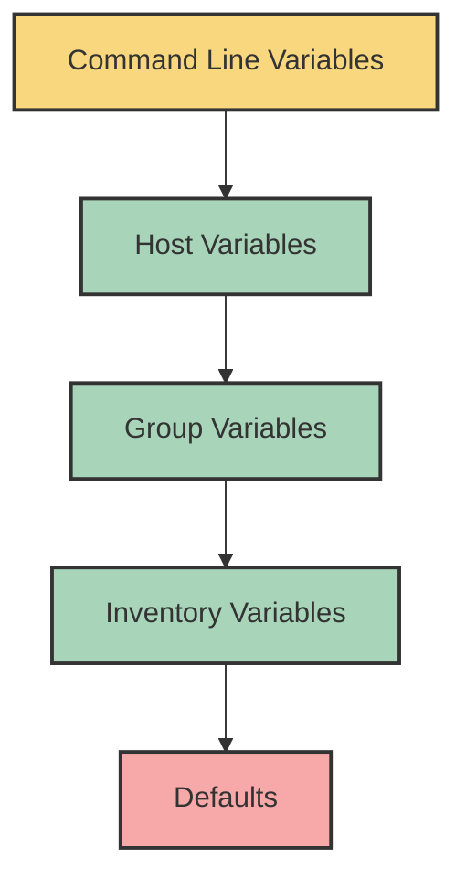

# Ansible Group Variables

## Introduction

When managing multiple servers with Ansible, you'll often need to apply the same configuration to groups of servers. For example, all your web servers might share common settings, while your database servers have their own specific configuration. Manually defining variables for each host would be tedious and error-prone.

This is where **Ansible Group Variables** come in. They allow you to define variables that apply to entire groups of hosts, making your automation more organized, maintainable, and scalable.

## What Are Group Variables?

Group variables are variables assigned to groups of hosts in your Ansible inventory. When Ansible runs a playbook against hosts in that group, these variables are automatically available for use.

Think of group variables as a way to specify common configuration for a collection of similar servers without repeating yourself. They follow Ansible's variable precedence rules, which means they can be overridden by more specific variables (like host variables) when needed.

## Defining Group Variables

There are two main ways to define group variables in Ansible:

### 1. In the Inventory File

You can define group variables directly in your inventory file. This is the simplest approach and works well for small projects or when you have just a few variables.

```ini
[webservers]
web1.example.com
web2.example.com

[webservers:vars]
http_port=80
max_connections=1000
environment=production
```

In this example, all hosts in the `webservers` group will have access to the variables `http_port`, `max_connections`, and `environment`.

### 2. Using Group Variables Files (Recommended)

For better organization, especially in larger projects, Ansible allows you to store group variables in separate files. This approach is more maintainable and follows the Infrastructure as Code best practices.

To use this method, create a directory structure like this:

```
inventory/
├── hosts               # Your inventory file
└── group_vars/         # Directory for group variables
    ├── all.yml         # Variables for all groups
    ├── webservers.yml  # Variables for webservers group
    └── dbservers.yml   # Variables for dbservers group
```

Here's how the content might look:

In `inventory/hosts`:
```ini
[webservers]
web1.example.com
web2.example.com

[dbservers]
db1.example.com
db2.example.com
```

In `inventory/group_vars/webservers.yml`:
```yaml
---
# Variables for the webservers group
http_port: 80
max_connections: 1000
environment: production
allowed_ips:
  - 192.168.1.0/24
  - 10.0.0.0/8
```

In `inventory/group_vars/dbservers.yml`:
```yaml
---
# Variables for the dbservers group
mysql_port: 3306
mysql_max_connections: 500
backup_schedule: "0 2 * * *"  # Cron expression for 2 AM daily
```

## Using Group Variables in Playbooks

Once you've defined your group variables, you can use them in your playbooks. Ansible automatically makes these variables available during playbook execution.

Here's an example playbook that uses the group variables we defined:

```yaml
---
- name: Configure Web Servers
  hosts: webservers
  become: yes
  tasks:
    - name: Install Nginx
      apt:
        name: nginx
        state: present

    - name: Configure Nginx Port
      template:
        src: nginx.conf.j2
        dest: /etc/nginx/nginx.conf
      vars:
        server_port: "{{ http_port }}"  # Using the group variable
      notify: restart nginx

    - name: Configure Connection Limits
      lineinfile:
        path: /etc/nginx/nginx.conf
        regexp: "worker_connections"
        line: "worker_connections {{ max_connections }};"  # Using the group variable
      notify: restart nginx

  handlers:
    - name: restart nginx
      service:
        name: nginx
        state: restarted
```

The template file (`nginx.conf.j2`) might look like:

```
# nginx.conf.j2
user www-data;
worker_processes auto;
events {
    worker_connections {{ server_port }};
}
http {
    # ... other configurations
    server {
        listen {{ server_port }};
        # ... more configurations
    }
    # ... other settings
}
```

## Group Variable Precedence

Ansible follows a specific precedence order when resolving variables. Understanding this order is important for complex setups:



From highest precedence (strongest) to lowest:

1. Variables defined on the command line (`--extra-vars`)
2. Host variables (defined in `host_vars/` directory)
3. Group variables (defined in `group_vars/` directory)
4. Inventory variables (defined in the inventory file)
5. Default variables (defined in the role's `defaults/main.yml`)

This means that if the same variable is defined at multiple levels, the higher precedence value will be used.

## Advanced Group Variables Techniques

### Nested Groups and Variable Inheritance

Ansible allows you to create nested groups, and variables are inherited from parent groups to child groups.

```ini
[webservers]
web1.example.com
web2.example.com

[dbservers]
db1.example.com
db2.example.com

[production:children]
webservers
dbservers

[production:vars]
datacenter=east
environment=production
```

In this example, all hosts in both `webservers` and `dbservers` groups will inherit the variables from the `production` group.

### Using the 'all' Group

The `all` group is a special group that includes every host in your inventory. Variables defined for the `all` group (in `group_vars/all.yml`) apply to every host unless overridden.

```yaml
# group_vars/all.yml
---
ntp_server: ntp.example.com
dns_servers:
  - 8.8.8.8
  - 8.8.4.4
timezone: UTC
```

### Using Variable Files

For complex configurations, you can split your variables into multiple files within a group's directory:

```
inventory/
└── group_vars/
    └── webservers/
        ├── main.yml          # Main variables
        ├── nginx.yml         # Nginx-specific variables
        └── security.yml      # Security-related variables
```

Ansible will automatically load all the YAML files in the directory.

## Practical Examples

### Example 1: Multi-Environment Configuration

Let's set up variables for different environments (development, staging, production):

```
inventory/
├── hosts
└── group_vars/
    ├── all.yml
    ├── development.yml
    ├── staging.yml
    └── production.yml
```

In `hosts`:
```ini
[webservers]
web1.example.com
web2.example.com

[dbservers]
db1.example.com
db2.example.com

[development:children]
webservers
dbservers

[staging]
web-staging.example.com
db-staging.example.com

[production]
web-prod-1.example.com
web-prod-2.example.com
db-prod-1.example.com
db-prod-2.example.com
```

In `group_vars/development.yml`:
```yaml
---
environment: dev
debug_mode: true
log_level: debug
db_user: dev_user
db_password: dev_pass
```

In `group_vars/production.yml`:
```yaml
---
environment: production
debug_mode: false
log_level: warn
ha_enabled: true
monitoring_enabled: true
backup_schedule: "0 2 * * *"
```

### Example 2: Application Deployment

Let's use group variables to deploy a web application across different server types:

In `group_vars/all.yml`:
```yaml
---
app_name: my_awesome_app
app_version: 1.2.3
base_packages:
  - curl
  - vim
  - htop
```

In `group_vars/webservers.yml`:
```yaml
---
server_type: web
web_server: nginx
app_path: /var/www/{{ app_name }}
web_packages:
  - nginx
  - php-fpm
  - nodejs
deployment_order: 2
```

In `group_vars/dbservers.yml`:
```yaml
---
server_type: database
db_type: postgres
data_path: /var/lib/postgresql/data
db_packages:
  - postgresql
  - postgresql-client
  - python3-psycopg2
backup_path: /backup/{{ app_name }}
deployment_order: 1
```

Playbook example:
```yaml
---
- name: Deploy Application Infrastructure
  hosts: all
  become: yes
  tasks:
    - name: Install Base Packages
      apt:
        name: "{{ base_packages }}"
        state: present
        update_cache: yes

- name: Configure Database Servers
  hosts: dbservers
  become: yes
  tasks:
    - name: Install Database Packages
      apt:
        name: "{{ db_packages }}"
        state: present

    - name: Configure Database
      template:
        src: "templates/{{ db_type }}.conf.j2"
        dest: "/etc/{{ db_type }}/{{ db_type }}.conf"
      notify: restart database

  handlers:
    - name: restart database
      service:
        name: "{{ db_type }}"
        state: restarted

- name: Configure Web Servers
  hosts: webservers
  become: yes
  tasks:
    - name: Install Web Packages
      apt:
        name: "{{ web_packages }}"
        state: present

    - name: Configure Web Server
      template:
        src: "templates/{{ web_server }}.conf.j2"
        dest: "/etc/{{ web_server }}/conf.d/{{ app_name }}.conf"
      notify: restart web server

  handlers:
    - name: restart web server
      service:
        name: "{{ web_server }}"
        state: restarted
```

## Best Practices for Group Variables

1. **Use the group_vars directory** for better organization and maintainability.
2. **Keep sensitive data encrypted** using Ansible Vault.
3. **Use meaningful group names** that reflect the purpose of the servers.
4. **Document your variables** with comments in the YAML files.
5. **Use variable files** to organize complex configurations.
6. **Be consistent with naming conventions** for variables.
7. **Avoid deep nesting** of variables to maintain readability.
8. **Use version control** for your inventory and group_vars.

## Summary

Ansible Group Variables provide a powerful way to manage configuration across multiple hosts efficiently. By organizing your variables at the group level, you can:

- Keep your playbooks DRY (Don't Repeat Yourself)
- Maintain consistent configuration across similar servers
- Easily manage different environments
- Make your Ansible code more maintainable and scalable

The flexibility of defining variables in inventory files or dedicated group_vars directories, combined with Ansible's variable precedence system, gives you precise control over your infrastructure configuration.

## Additional Resources

- [Ansible Documentation: Working with Inventory](https://docs.ansible.com/ansible/latest/user_guide/intro_inventory.html)
- [Ansible Documentation: Variable Precedence](https://docs.ansible.com/ansible/latest/user_guide/playbooks_variables.html#variable-precedence-where-should-i-put-a-variable)

## Exercises

1. Create an inventory structure with group variables for a three-tier application (web, app, and database servers).
2. Implement environment-specific configurations (dev, staging, production) using group variables.
3. Create a playbook that uses different group variables to deploy the same application with different configurations based on the environment.
4. Implement a nested group structure with variable inheritance to manage a complex infrastructure.