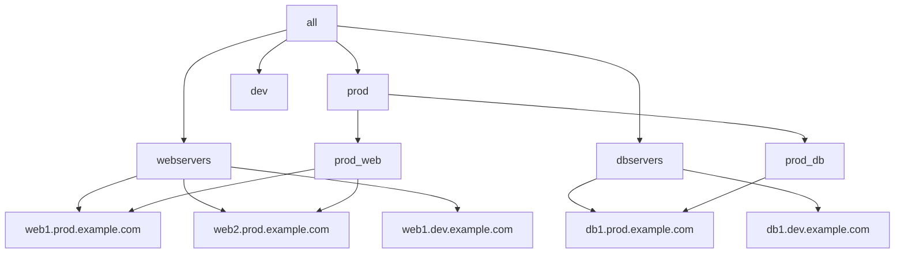

# Ansible Host Groups

In Ansible, **host groups** are a powerful way to organize and categorize your managed systems within your inventory. They allow you to execute tasks on specific sets of machines and apply variables to multiple hosts simultaneously. Understanding host groups is crucial for scaling your Ansible automation effectively.

## What Are Host Groups?

Host groups are logical collections of hosts in your Ansible inventory that share a common purpose or characteristic. For example, you might group hosts by:

- Function (web servers, database servers, load balancers)
- Environment (development, testing, production)
- Geographic location (us-east, eu-west, asia-pacific)
- Hardware characteristics (high-memory, high-cpu)

## Basic Syntax

In the standard INI-format inventory file, groups are defined by placing host names under a group name in square brackets:

```ini
[webservers]
web1.example.com
web2.example.com

[dbservers]
db1.example.com
db2.example.com
```

In this example, we've created two groups: `webservers` and `dbservers`.

## Groups in YAML Format

Ansible also supports YAML-format inventory files, which can be more readable for complex inventories:

```yaml
all:
  children:
    webservers:
      hosts:
        web1.example.com:
        web2.example.com:
    dbservers:
      hosts:
        db1.example.com:
        db2.example.com:
```

## Nested Groups (Group of Groups)

You can create hierarchical structures by defining groups of groups:

```ini
[webservers]
web1.example.com
web2.example.com

[dbservers]
db1.example.com
db2.example.com

[east_datacenter]
web1.example.com
db1.example.com

[west_datacenter]
web2.example.com
db2.example.com

[datacenters:children]
east_datacenter
west_datacenter
```

In YAML format:

```yaml
all:
  children:
    webservers:
      hosts:
        web1.example.com:
        web2.example.com:
    dbservers:
      hosts:
        db1.example.com:
        db2.example.com:
    east_datacenter:
      hosts:
        web1.example.com:
        db1.example.com:
    west_datacenter:
      hosts:
        web2.example.com:
        db2.example.com:
    datacenters:
      children:
        east_datacenter:
        west_datacenter:
```

The `:children` suffix in INI format (or the `children` key in YAML) indicates that the items in this group are other groups, not individual hosts.

## Special Patterns for Host Names

Ansible supports patterns to define multiple similar hosts:

```ini
[webservers]
web[1:5].example.com   # Expands to web1.example.com through web5.example.com
```

You can also specify non-standard SSH ports:

```ini
[webservers]
web1.example.com:2222  # Connect to web1 on port 2222 instead of the default 22
```

## Built-in Groups

Ansible has two built-in groups:

1. `all` - Contains every host in the inventory
2. `ungrouped` - Contains hosts that don't belong to any other group

## Group Variables

One of the most powerful features of host groups is the ability to define variables at the group level:

### In the Inventory File

```ini
[webservers]
web1.example.com
web2.example.com

[webservers:vars]
http_port=80
max_connections=1000
```

### Using group_vars Directory

A more scalable approach is to create a `group_vars` directory alongside your inventory file:

```
inventory/
├── hosts
└── group_vars/
    ├── webservers.yml
    └── dbservers.yml
```

In `webservers.yml`:

```yaml
---
http_port: 80
max_connections: 1000
```

## Practical Example: Complete Setup

Let's walk through a complete example of setting up host groups for a typical web application environment:

### Step 1: Create the inventory structure

```
project/
├── ansible.cfg
├── inventory/
│   ├── hosts
│   ├── group_vars/
│   │   ├── all.yml
│   │   ├── webservers.yml
│   │   ├── dbservers.yml
│   │   └── prod.yml
│   └── host_vars/
│       └── web1.example.com.yml
└── playbooks/
    └── deploy_webapp.yml
```

### Step 2: Define the host groups in `hosts`

```ini
# Production Environment
[prod]
web1.prod.example.com
web2.prod.example.com
db1.prod.example.com

# Development Environment
[dev]
web1.dev.example.com
db1.dev.example.com

# Servers by function
[webservers]
web1.prod.example.com
web2.prod.example.com
web1.dev.example.com

[dbservers]
db1.prod.example.com
db1.dev.example.com

# Cross-functional groups
[prod:children]
prod_web
prod_db

[prod_web]
web1.prod.example.com
web2.prod.example.com

[prod_db]
db1.prod.example.com
```

### Step 3: Define group variables in `group_vars/webservers.yml`

```yaml
---
# Variables for all web servers
http_port: 80
https_port: 443
apache_version: 2.4
document_root: /var/www/html
```

### Step 4: Create a playbook that targets specific groups

```yaml
---
- name: Configure web servers
  hosts: webservers
  become: true
  tasks:
    - name: Install Apache
      ansible.builtin.package:
        name: apache2
        state: present

    - name: Start and enable Apache service
      ansible.builtin.service:
        name: apache2
        state: started
        enabled: yes

- name: Configure database servers
  hosts: dbservers
  become: true
  tasks:
    - name: Install MySQL
      ansible.builtin.package:
        name: mysql-server
        state: present

    - name: Start and enable MySQL service
      ansible.builtin.service:
        name: mysql
        state: started
        enabled: yes
```

### Step 5: Run the playbook on specific environments

```bash
# Run only on production web servers
ansible-playbook playbooks/deploy_webapp.yml --limit prod_web

# Run on all database servers
ansible-playbook playbooks/deploy_webapp.yml --limit dbservers
```

## Using Host Groups with Dynamic Inventories

For cloud environments or dynamic infrastructure, Ansible supports dynamic inventories through inventory plugins or scripts. These automatically generate host groups based on metadata:

```bash
# Example with AWS EC2 plugin
ansible-inventory --graph --plugin aws_ec2

# Output might look like:
@all:
  |--@aws_ec2:
  |  |--@tag_Environment_production:
  |  |  |--i-0123456789abcdef0
  |  |  |--i-0123456789abcdef1
  |  |--@tag_Role_webserver:
  |  |  |--i-0123456789abcdef0
  |  |--@tag_Role_database:
  |  |  |--i-0123456789abcdef1
```

Here, AWS tags automatically become Ansible host groups.

## Visualizing Your Host Groups

You can visualize your inventory structure using the `ansible-inventory` command:

```bash
ansible-inventory --graph
```

Output:
```
@all:
  |--@dbservers:
  |  |--db1.dev.example.com
  |  |--db1.prod.example.com
  |--@dev:
  |  |--db1.dev.example.com
  |  |--web1.dev.example.com
  |--@prod:
  |  |--@prod_db:
  |  |  |--db1.prod.example.com
  |  |--@prod_web:
  |  |  |--web1.prod.example.com
  |  |  |--web2.prod.example.com
  |--@webservers:
  |  |--web1.dev.example.com
  |  |--web1.prod.example.com
  |  |--web2.prod.example.com
```

## Inventory Diagram



## Best Practices for Host Groups

1. **Name groups meaningfully**: Use descriptive names that reflect the purpose of the group.

2. **Use hierarchical groups**: Create a logical hierarchy that makes it easy to run operations at different levels.

3. **Keep inventory files organized**: For large deployments, consider splitting inventory files by environment or function.

4. **Use group_vars for configuration**: Define variables at the group level rather than repeating them for individual hosts.

5. **Document your groups**: Include comments in your inventory files to explain the purpose of each group.

6. **Use host patterns wisely**: Learn Ansible's host patterns to target operations precisely:
   - `webservers:dbservers` – all servers in both groups
   - `webservers:&production` – production webservers (intersection)
   - `webservers:!backed_up` – webservers not in the backed_up group

## Summary

Ansible host groups are a powerful way to organize your infrastructure for automation. They provide:

- Logical organization of hosts
- Hierarchical grouping capabilities
- A mechanism for applying variables to multiple hosts
- Precise targeting of operations
- Scalability for large infrastructures

By mastering host groups, you can create more maintainable, readable, and efficient Ansible automation while avoiding repetition and configuration drift across your infrastructure.

## Further Learning

To deepen your understanding of Ansible host groups:

- Practice creating multi-tier application deployments
- Experiment with different inventory formats (INI, YAML)
- Learn how to use dynamic inventories for cloud environments
- Explore advanced inventory variables and their precedence rules
- Try implementing host group patterns in real-world scenarios

## Exercise

1. Create an inventory with at least three levels of nested groups for a hypothetical company with multiple datacenters, each containing different types of servers.

2. Write a playbook that targets different combinations of these groups using host patterns.

3. Implement group variables at different levels of the hierarchy and observe how variable precedence works.