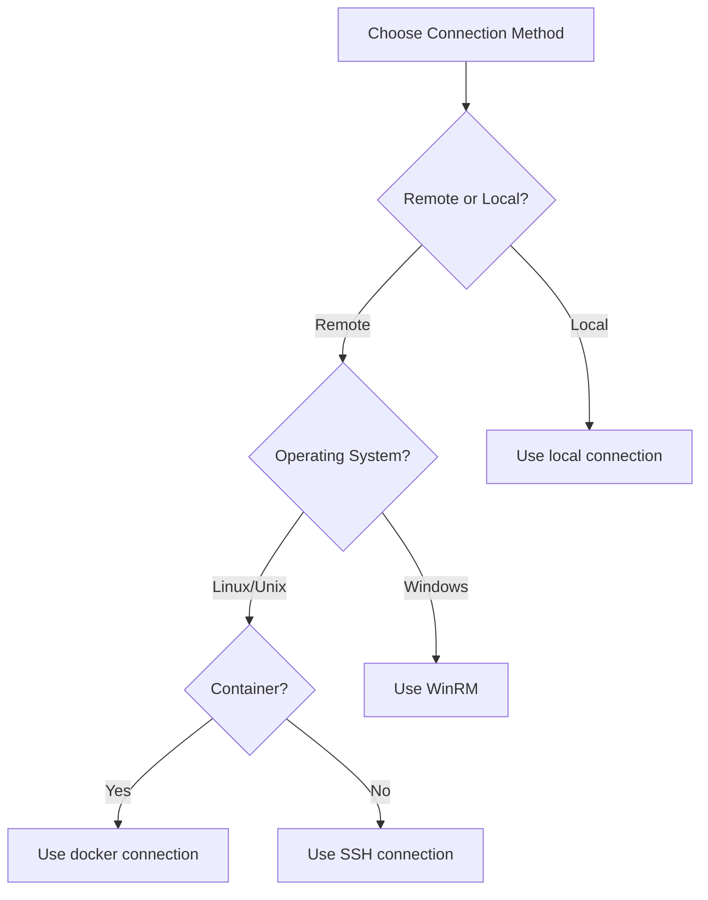

# Ansible Connection Methods

## Introduction

When Ansible communicates with managed hosts to perform tasks, it uses various connection methods or plugins to establish these connections. The connection method determines how Ansible reaches the target system and executes commands or modules. Understanding these connection methods is crucial for effectively managing diverse infrastructure environments.

By default, Ansible uses SSH to connect to remote hosts, but it supports multiple connection types to accommodate different scenarios, such as local execution, containerized environments, or Windows hosts.

## Default Connection: SSH

SSH (Secure Shell) is the default connection method and is used when no other connection type is specified.

### How SSH Connection Works

1. Ansible connects to the remote host using SSH
2. Transfers the module files to the remote host
3. Executes the module on the remote host
4. Retrieves the results

### Basic SSH Configuration

In your inventory file, you can specify SSH-related parameters:

```ini
[webservers]
web1.example.com ansible_user=admin ansible_ssh_private_key_file=/path/to/key.pem
web2.example.com ansible_port=2222 ansible_user=admin
```

Alternatively, in YAML format:

```yaml
all:
  hosts:
    web1.example.com:
      ansible_user: admin
      ansible_ssh_private_key_file: /path/to/key.pem
    web2.example.com:
      ansible_port: 2222
      ansible_user: admin
```

### Common SSH Parameters

| Parameter | Description |
|-----------|-------------|
| `ansible_user` | Username to use when connecting |
| `ansible_port` | SSH port (default: 22) |
| `ansible_ssh_private_key_file` | SSH private key file path |
| `ansible_ssh_pass` | SSH password (not recommended - use Ansible Vault instead) |
| `ansible_ssh_common_args` | Additional SSH arguments |

### Example: Using SSH with Different Parameters

```yaml
- name: Update web servers
  hosts: webservers
  tasks:
    - name: Ensure Apache is installed
      ansible.builtin.package:
        name: apache2
        state: present
```

In this example, Ansible will connect to each host in the `webservers` group using the SSH parameters defined in your inventory.

## Local Connection

The `local` connection executes commands on the control node (the machine running Ansible) rather than on remote hosts.

### When to Use Local Connection

- Running commands on the Ansible controller itself
- Interacting with local files and services
- Using Ansible for local configuration management
- Executing API calls or other tasks that don't require remote execution

### Configuring Local Connection

Explicitly specify local connection in your inventory:

```ini
[local]
localhost ansible_connection=local
```

Or in a playbook:

```yaml
- name: Local operations
  hosts: localhost
  connection: local
  tasks:
    - name: Create a local file
      ansible.builtin.file:
        path: /tmp/test_file.txt
        state: touch
```

### Example: Running Local and Remote Tasks

```yaml
- name: Mixed local and remote operations
  hosts: all
  tasks:
    - name: Local API call
      ansible.builtin.uri:
        url: https://api.example.com/status
        method: GET
      register: api_result
      delegate_to: localhost
      
    - name: Deploy configuration based on API result
      ansible.builtin.template:
        src: templates/config.j2
        dest: /etc/service/config.yaml
      when: api_result.status == 200
```

In this example, the first task runs on the local machine using `delegate_to: localhost`, while the second task runs on each remote host.

## Docker Connection

The `docker` connection type allows Ansible to communicate with Docker containers.

### Prerequisites

- Docker must be installed on the controller node
- Containers must be running when Ansible attempts to connect

### Configuring Docker Connection

Specify Docker connection in your inventory:

```ini
[containers]
mycontainer ansible_connection=docker
```

Or use dynamic inventory with Docker:

```yaml
# docker_inventory.yml
plugin: docker
strict: no
```

### Example: Managing Docker Containers

```yaml
- name: Configure containers
  hosts: containers
  connection: docker
  tasks:
    - name: Ensure required packages are installed
      ansible.builtin.package:
        name: 
          - curl
          - vim
        state: present
    
    - name: Create application directory
      ansible.builtin.file:
        path: /app
        state: directory
        mode: '0755'
```

## Windows Connection Methods

For Windows hosts, Ansible uses different connection methods.

### WinRM

Windows Remote Management (WinRM) is the default connection method for Windows hosts.

```ini
[windows]
win1.example.com ansible_connection=winrm ansible_user=Administrator ansible_password=SecurePass
```

### Setting Up WinRM

To use WinRM, you need to configure it on your Windows hosts:

```powershell
# Run on the Windows host to set up WinRM
$url = "https://raw.githubusercontent.com/ansible/ansible/devel/examples/scripts/ConfigureRemotingForAnsible.ps1"
$file = "$env:temp\ConfigureRemotingForAnsible.ps1"
(New-Object -TypeName System.Net.WebClient).DownloadFile($url, $file)
powershell.exe -ExecutionPolicy Bypass -File $file
```

## Smart Connection Method

The `smart` connection type is a special mode that automatically selects between SSH and paramiko based on system capabilities.

### When to Use Smart Connection

- When connecting to a mix of hosts with different SSH implementations
- When you're unsure if OpenSSH is available on all systems

```ini
[mixed_hosts]
host1.example.com ansible_connection=smart
host2.example.com ansible_connection=smart
```

## Comparing Connection Methods



## Common Connection Parameters

These parameters work across different connection types:

| Parameter | Description |
|-----------|-------------|
| `ansible_connection` | Connection type (ssh, local, docker, winrm, etc.) |
| `ansible_host` | Hostname or IP to connect to |
| `ansible_user` | Username to use for connection |
| `ansible_become` | Whether to use privilege escalation |
| `ansible_become_method` | Method for privilege escalation (sudo, su, etc.) |

## Configuring Connection Methods in ansible.cfg

You can set default connection settings in your `ansible.cfg` file:

```ini
[defaults]
# Default connection type
transport = ssh

[ssh_connection]
# SSH specific settings
ssh_args = -o ControlMaster=auto -o ControlPersist=60s
pipelining = True
```

## Troubleshooting Connection Issues

### Common SSH Connection Problems

```yaml
- name: Test SSH connection with verbose output
  hosts: problematic_host
  gather_facts: no
  tasks:
    - name: Run simple command
      ansible.builtin.command: whoami
      register: result
    
    - name: Display result
      ansible.builtin.debug:
        var: result
```

Run this with `ansible-playbook -vvv` for detailed connection debugging.

### Docker Connection Troubleshooting

Ensure your Docker container is running:

```bash
# Check container status
docker ps

# Run a simple test
ansible -i 'container_name,' all -c docker -m ping
```

## Summary

Understanding Ansible connection methods is essential for efficiently managing diverse infrastructure:

1. **SSH Connection**: The default and most commonly used method for Unix/Linux systems
2. **Local Connection**: Executes commands on the Ansible controller itself
3. **Docker Connection**: Interacts directly with Docker containers
4. **WinRM Connection**: Manages Windows hosts through Windows Remote Management
5. **Smart Connection**: Dynamically chooses between SSH and paramiko

By selecting the appropriate connection method and properly configuring connection parameters, you can ensure Ansible communicates effectively with all your managed hosts, regardless of their environment or platform.

## Additional Resources

- [Ansible Connection Plugins Documentation](https://docs.ansible.com/ansible/latest/plugins/connection.html)
- [Ansible SSH Connection In-Depth](https://docs.ansible.com/ansible/latest/user_guide/connection_details.html)
- [Configuring WinRM for Ansible](https://docs.ansible.com/ansible/latest/user_guide/windows_setup.html)

## Practice Exercises

1. Create an inventory file with hosts using different connection methods.
2. Write a playbook that executes tasks on both local and remote hosts.
3. Configure a Docker container and manage it using Ansible with the docker connection.
4. Test different SSH parameters to optimize connection performance.
5. Set up a Windows host with WinRM and connect to it using Ansible.