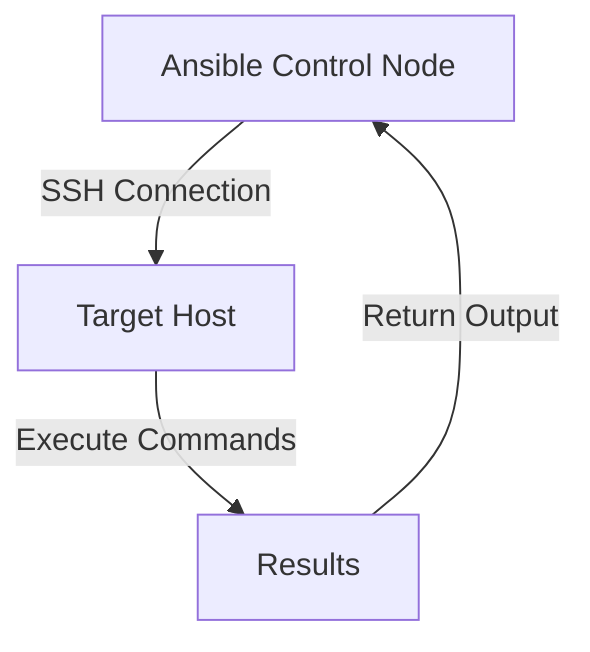

# Ansible SSH Configuration

## Introduction

When working with Ansible, establishing secure and reliable SSH connections to remote hosts is fundamental to successful automation. SSH (Secure Shell) is the default connection protocol Ansible uses to communicate with managed nodes. This guide will walk you through configuring SSH for Ansible, from basic connections to advanced configurations, ensuring your automation infrastructure is both secure and efficient.

## SSH Connection Basics

Ansible relies on SSH to connect to remote hosts and execute commands. By default, Ansible will attempt to use your system's SSH configuration and keys.

### How Ansible Uses SSH

When you run an Ansible playbook or command, the following process occurs:



For a basic SSH connection, Ansible needs:

1. A target hostname or IP address
2. SSH credentials (username/password or SSH key)
3. Sufficient permissions on the target host

Let's look at a simple inventory example:

```ini
# inventory.ini
web_server ansible_host=192.168.1.10 ansible_user=admin
```

## SSH Authentication Methods

### Password Authentication

You can use password authentication, though it's generally not recommended for production environments:

```ini
# inventory.ini
web_server ansible_host=192.168.1.10 ansible_user=admin ansible_ssh_pass=secret_password
```

:::caution
Storing passwords in plain text is insecure. For production, use Ansible Vault to encrypt sensitive data.
:::

A more secure approach is to use SSH keys.

### SSH Key Authentication

SSH key authentication is more secure and allows for passwordless connections:

1. Generate an SSH key pair if you don't already have one:

```bash
ssh-keygen -t rsa -b 4096 -C "ansible"
```

2. Copy your public key to the target host:

```bash
ssh-copy-id admin@192.168.1.10
```

3. Now your inventory can be simplified:

```ini
# inventory.ini
web_server ansible_host=192.168.1.10 ansible_user=admin
```

Ansible will use your default SSH key (`~/.ssh/id_rsa`) automatically.

## Advanced SSH Options

### Specifying SSH Private Key

If you want to use a specific private key:

```ini
# inventory.ini
web_server ansible_host=192.168.1.10 ansible_user=admin ansible_ssh_private_key_file=/path/to/private_key
```

Or in a YAML inventory:

```yaml
# inventory.yaml
all:
  hosts:
    web_server:
      ansible_host: 192.168.1.10
      ansible_user: admin
      ansible_ssh_private_key_file: /path/to/private_key
```

### SSH Configuration Parameters

Ansible supports numerous SSH parameters:

```ini
# inventory.ini
web_server ansible_host=192.168.1.10 
           ansible_user=admin
           ansible_port=2222                 # Custom SSH port
           ansible_connection=ssh            # Connection type
           ansible_ssh_private_key_file=/path/to/key
           ansible_ssh_common_args='-o StrictHostKeyChecking=no'  # Additional SSH options
```

### Using SSH Config File

You can leverage your existing SSH config file (`~/.ssh/config`):

```
# ~/.ssh/config
Host webserver
    HostName 192.168.1.10
    User admin
    Port 2222
    IdentityFile ~/.ssh/webserver_key
    ForwardAgent yes
```

Then your inventory becomes much simpler:

```ini
# inventory.ini
webserver
```

## SSH Forwarding

### Agent Forwarding

SSH agent forwarding allows your Ansible host to use your local SSH keys when connecting from a managed node to another server:

```ini
# inventory.ini
jumphost ansible_host=10.0.0.1 ansible_ssh_common_args='-o ForwardAgent=yes'
```

This is useful when Ansible needs to clone git repositories or access other SSH-secured resources.

## Troubleshooting SSH Connections

### Checking Connectivity

If you're having trouble, test the SSH connection directly:

```bash
ssh -v ansible_user@ansible_host
```

The verbose output will help diagnose connection issues.

### Common Issues and Solutions

1. **Permission Denied Errors**:
   - Ensure your SSH key has correct permissions: `chmod 600 ~/.ssh/id_rsa`
   - Verify the user has access to the target machine

2. **Host Key Verification Failed**:
   - Add the host to your known_hosts file: `ssh-keyscan -H 192.168.1.10 >> ~/.ssh/known_hosts`
   - Or disable strict host key checking (less secure): 
     ```
     ansible_ssh_common_args='-o StrictHostKeyChecking=no'
     ```

3. **Connection Timeouts**:
   - Check firewall settings
   - Verify SSH service is running on the target
   - Increase the SSH timeout:
     ```
     ansible_ssh_timeout=30
     ```

## Practical Examples

### Example 1: Multi-Environment Configuration

Let's say you manage different environments with different SSH configurations:

```yaml
# inventory.yaml
all:
  children:
    production:
      hosts:
        prod_web1:
          ansible_host: 203.0.113.10
          ansible_user: prod_user
          ansible_ssh_private_key_file: ~/.ssh/prod_key
    staging:
      hosts:
        stage_web1:
          ansible_host: 203.0.113.20
          ansible_user: stage_user
          ansible_port: 2222
      vars:
        ansible_ssh_common_args: '-o StrictHostKeyChecking=no -o ForwardAgent=yes'
```

### Example 2: Using a Jump Host (Bastion)

When your target hosts are not directly accessible and require a jump host:

```yaml
# inventory.yaml
all:
  hosts:
    internal_server:
      ansible_host: 10.0.0.10
      ansible_user: admin
      ansible_ssh_common_args: '-o ProxyCommand="ssh -W %h:%p -q jumpuser@jumphost.example.com"'
```

More concisely using SSH config:

```
# ~/.ssh/config
Host jumphost
    HostName jumphost.example.com
    User jumpuser

Host internal_server
    HostName 10.0.0.10
    User admin
    ProxyJump jumphost
```

Then your inventory becomes:

```ini
# inventory.ini
internal_server
```

### Example 3: Group-based SSH Configuration

Group all your web servers with common SSH settings:

```yaml
# inventory.yaml
all:
  children:
    webservers:
      hosts:
        web1:
          ansible_host: 192.168.1.10
        web2:
          ansible_host: 192.168.1.11
      vars:
        ansible_user: webadmin
        ansible_ssh_private_key_file: ~/.ssh/web_cluster_key
        ansible_become: yes
        ansible_become_method: sudo
```

## SSH Configuration in ansible.cfg

You can also configure SSH parameters globally in your `ansible.cfg` file:

```ini
# ansible.cfg
[defaults]
inventory = ./inventory.ini
remote_user = admin
private_key_file = ~/.ssh/id_rsa

[ssh_connection]
ssh_args = -o ControlMaster=auto -o ControlPersist=60s
pipelining = True
control_path = /tmp/ansible-ssh-%%h-%%p-%%r
```

This centralizes your SSH configuration and applies it to all hosts unless overridden.

## Best Practices

1. **Use SSH Keys**: Always prefer SSH key authentication over passwords
2. **Centralize Configurations**: Use `~/.ssh/config` for complex SSH configurations
3. **Secure Your Keys**: Protect private keys with proper permissions
4. **Use Ansible Vault**: Encrypt sensitive data like passwords
5. **Jump Hosts**: Implement bastion/jump hosts for accessing private networks
6. **ControlPersist**: Enable SSH connection multiplexing for better performance
7. **Pipelining**: Enable pipelining to reduce the number of SSH operations

## Summary

SSH configuration is a critical component of setting up an effective Ansible environment. By properly configuring SSH, you can ensure secure, reliable connections to your managed hosts while simplifying your inventory files and improving performance.

From basic key authentication to advanced scenarios involving jump hosts and agent forwarding, mastering SSH configuration gives you full control over how Ansible connects to and manages your infrastructure.

## Additional Resources

- [Ansible Documentation: Connection Methods](https://docs.ansible.com/ansible/latest/user_guide/connection_details.html)
- [OpenSSH Documentation](https://www.openssh.com/manual.html)
- [SSH Key Management Best Practices](https://www.ssh.com/ssh/key-management/)

## Exercises

1. Set up a simple inventory with SSH key authentication for two hosts
2. Configure a jump host scenario to access an internal network
3. Create an inventory structure with different SSH settings for development, staging, and production environments
4. Test SSH connection speed with and without ControlPersist and pipelining