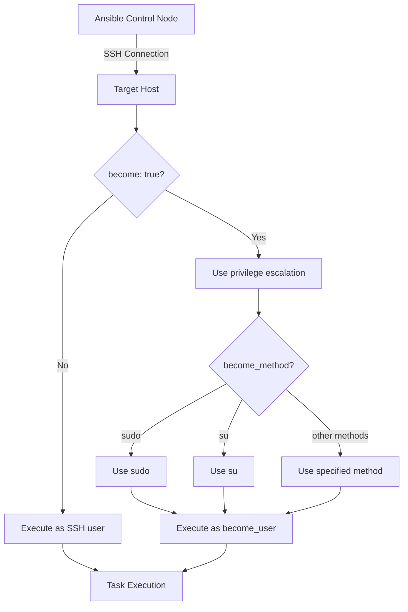

# Ansible Privilege Escalation

## Introduction

When managing remote systems with Ansible, you'll often need to execute commands or tasks that require elevated permissions. In the Linux world, this typically means using `sudo` or similar mechanisms to run commands as the root user or another privileged user. Ansible provides a feature called **privilege escalation** that allows you to execute tasks with elevated permissions in a controlled and secure manner.

Privilege escalation is essential for operations like:
- Installing packages
- Managing system services
- Editing restricted configuration files
- Creating system users
- Mounting filesystems

In this guide, we'll explore how Ansible handles privilege escalation, how to configure it, and best practices for using it securely in your playbooks.

## Understanding Ansible's `become` Directive

Ansible uses the `become` directive to handle privilege escalation. This directive replaces the older `sudo` parameter that was used in earlier versions of Ansible.

The `become` system is more flexible than simply using sudo, as it allows for different privilege escalation methods depending on the target system.

### Key `become` Parameters

Ansible offers several parameters to control how privilege escalation works:

- `become`: A boolean that enables or disables privilege escalation (default: `false`)
- `become_user`: The user to become (default: `root`)
- `become_method`: The privilege escalation method to use (default: `sudo`)
- `become_flags`: Additional flags for the privilege escalation method
- `become_exe`: The executable to use for privilege escalation
- `become_ask_pass`: Whether to prompt for a password (default: `false`)

## Basic Usage

Let's look at some basic examples of using privilege escalation in Ansible playbooks.

### Example 1: Simple Privilege Escalation

```yaml
---
- name: Update packages with privilege escalation
  hosts: webservers
  become: true  # This enables privilege escalation for all tasks in this play

  tasks:
    - name: Update apt cache
      apt:
        update_cache: yes

    - name: Upgrade all packages
      apt:
        upgrade: dist
```

In this example, all tasks in the play will run with elevated privileges because we've set `become: true` at the play level.

### Example 2: Task-Level Privilege Escalation

```yaml
---
- name: Selective privilege escalation
  hosts: webservers
  
  tasks:
    - name: Check disk space
      command: df -h
      register: disk_space
      # This task runs as the regular user

    - name: Install nginx
      apt:
        name: nginx
        state: present
      become: true  # Only this task uses privilege escalation
      
    - name: Debug disk space
      debug:
        var: disk_space.stdout_lines
      # This task runs as the regular user again
```

Here, we're using privilege escalation only for the task that requires it (installing nginx).

## Privilege Escalation Methods

Ansible supports multiple privilege escalation methods:

- `sudo`: The default method, uses the sudo command
- `su`: Uses the su command
- `pbrun`: Uses the pbrun command (PowerBroker)
- `pfexec`: Uses the pfexec command (Solaris)
- `doas`: Uses the doas command (OpenBSD)
- `dzdo`: Uses the dzdo command (Centrify)
- `ksu`: Uses the ksu command (Kerberos)
- `runas`: Used for Windows targets
- `enable`: Used for network devices

### Example: Using Alternative Methods

```yaml
---
- name: Example with different become methods
  hosts: mixed_servers
  
  tasks:
    - name: Task with sudo
      command: whoami
      become: true
      become_method: sudo
      
    - name: Task with su
      command: whoami
      become: true
      become_method: su
      become_user: root
```

## Configuring Privilege Escalation in Inventory

You can also configure privilege escalation settings in your inventory files. This is particularly useful when different hosts require different privilege escalation configurations.

### Example: Host and Group Variables

```ini
# In your inventory file (hosts.ini)
[webservers]
web1.example.com
web2.example.com

[dbservers]
db1.example.com
db2.example.com

[webservers:vars]
ansible_become=true
ansible_become_method=sudo
ansible_become_user=root
ansible_become_password='{{ web_sudo_pass }}'

[dbservers:vars]
ansible_become=true
ansible_become_method=su
ansible_become_user=postgres
ansible_become_password='{{ db_su_pass }}'
```

### Example: Using YAML Inventory

```yaml
# In your inventory file (inventory.yaml)
all:
  children:
    webservers:
      hosts:
        web1.example.com:
        web2.example.com:
      vars:
        ansible_become: true
        ansible_become_method: sudo
        ansible_become_user: root
    
    dbservers:
      hosts:
        db1.example.com:
        db2.example.com:
      vars:
        ansible_become: true
        ansible_become_method: su
        ansible_become_user: postgres
```

## Handling Privilege Escalation Passwords

Ansible provides several ways to manage passwords for privilege escalation:

### Method 1: Using Vault-Encrypted Variables

```yaml
# In group_vars/webservers.yml (encrypted with ansible-vault)
---
ansible_become_password: supersecretpassword
```

### Method 2: Using Command-Line Prompts

When running a playbook:

```bash
ansible-playbook site.yml --ask-become-pass
```

This will prompt for the privilege escalation password before executing the playbook.

### Method 3: Using Connection Variables

```yaml
---
- name: Example with connection variables
  hosts: webservers
  vars:
    ansible_become: true
    ansible_become_password: "{{ lookup('env', 'ANSIBLE_BECOME_PASS') }}"
  
  tasks:
    - name: Install required packages
      apt:
        name: nginx
        state: present
```

## Real-World Examples

Let's look at some practical examples of using privilege escalation in real-world scenarios.

### Example 1: Installing and Configuring a Web Server

```yaml
---
- name: Configure web server
  hosts: webservers
  become: true  # We need elevated privileges for most tasks
  
  tasks:
    - name: Install nginx
      apt:
        name: nginx
        state: present
        
    - name: Copy nginx configuration
      template:
        src: templates/nginx.conf.j2
        dest: /etc/nginx/nginx.conf
        owner: root
        group: root
        mode: '0644'
      notify: Restart nginx
        
    - name: Enable and start nginx service
      systemd:
        name: nginx
        enabled: yes
        state: started
        
  handlers:
    - name: Restart nginx
      systemd:
        name: nginx
        state: restarted
```

### Example 2: Running Some Tasks as Different Users

```yaml
---
- name: Deploy application
  hosts: appservers
  
  tasks:
    - name: Create application directory
      file:
        path: /opt/myapp
        state: directory
        mode: '0755'
      become: true  # Run as root
      
    - name: Clone application repository
      git:
        repo: https://github.com/example/myapp.git
        dest: /opt/myapp
      become: true
      become_user: deploy  # Run as deploy user
      
    - name: Install application dependencies
      command: npm install
      args:
        chdir: /opt/myapp
      become: true
      become_user: deploy  # Run as deploy user
      
    - name: Configure systemd service
      template:
        src: templates/myapp.service.j2
        dest: /etc/systemd/system/myapp.service
        owner: root
        group: root
        mode: '0644'
      become: true  # Run as root
      
    - name: Start and enable service
      systemd:
        name: myapp
        state: started
        enabled: yes
        daemon_reload: yes
      become: true  # Run as root
```

## Privilege Escalation Flow Diagram

Here's a visual representation of how Ansible's privilege escalation works:



## Common Issues and Troubleshooting

### Issue 1: "Missing sudo password"

If you see an error like:

```
FAILED! => {"msg": "Missing sudo password"}
```

Solution: Use `--ask-become-pass` when running your playbook, or configure `ansible_become_password` in your inventory.

### Issue 2: "sudo: no tty present and no askpass program specified"

Solution: Add `become_flags: -H -S` to your play or task.

```yaml
become: true
become_flags: -H -S
```

### Issue 3: Command not found when using sudo

This often happens because sudo might use a different PATH environment variable.

Solution: Use absolute paths in your commands or set the PATH explicitly:

```yaml
- name: Run command with explicit path
  environment:
    PATH: /usr/local/bin:/usr/bin:/bin:/sbin:/usr/sbin
  command: my_command
  become: true
```

## Best Practices

1. **Use Least Privilege**: Only use privilege escalation for tasks that actually require it.

2. **Specify become_user**: Instead of always becoming root, specify the least privileged user needed for the task.

3. **Secure Password Management**: Use ansible-vault to encrypt sensitive information like privilege escalation passwords.

4. **Use Task-Level Privilege Escalation**: Apply `become` at the task level rather than the play level when possible.

5. **Audit Privilege Escalation Usage**: Regularly review your playbooks to ensure privilege escalation is used appropriately.

6. **Use Become Plugin**: For complex setups, consider using Ansible's become plugins to customize privilege escalation behavior.

## Summary

Ansible's privilege escalation is a powerful feature that allows you to execute tasks with elevated permissions when needed. By using the `become` directive and its associated parameters, you can control exactly how and when privilege escalation occurs.

Key takeaways:
- Use `become: true` to enable privilege escalation
- Control which user to become with `become_user`
- Choose the appropriate method with `become_method`
- Configure privilege escalation in inventory files for host-specific settings
- Secure privilege escalation passwords using Ansible Vault

By following best practices and using privilege escalation judiciously, you can maintain the security of your systems while still automating administrative tasks efficiently.

## Additional Resources

- [Ansible Documentation on Privilege Escalation](https://docs.ansible.com/ansible/latest/user_guide/become.html)
- [Ansible Best Practices Guide](https://docs.ansible.com/ansible/latest/user_guide/playbooks_best_practices.html)
- [Security Considerations in Ansible](https://docs.ansible.com/ansible/latest/user_guide/playbooks_vault.html)

## Exercises

1. Create a playbook that installs a web server using privilege escalation and configures it to serve a custom HTML page.

2. Modify an existing playbook to use task-level privilege escalation instead of play-level.

3. Configure an inventory file with different privilege escalation settings for different host groups.

4. Create a playbook that uses different `become_user` values for different tasks in the same play.

5. Implement a secure method for handling privilege escalation passwords in a multi-environment setup.