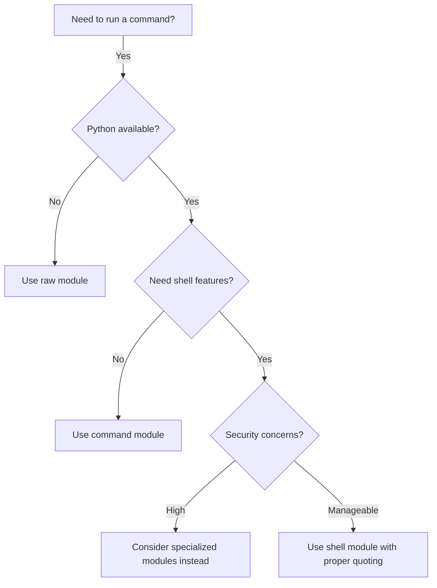

# Ansible Command Modules

## Introduction

Ansible command modules are essential components in the Ansible ecosystem that allow you to execute commands on remote hosts. While Ansible's philosophy encourages using specialized modules for most tasks (like `apt` for package management or `file` for file operations), there are situations where you need to run direct commands on target systems.

In this guide, we'll explore the three primary command modules:
- The `command` module
- The `shell` module  
- The `raw` module

Each has specific use cases, capabilities, and limitations that are important to understand for effective automation.

## The Command Module

The `command` module is the most basic way to execute commands on remote nodes. It runs the specified command without using the shell, which means shell operators like `|` (pipe), `>` (redirection), and `&` (background tasks) don't work.

### Basic Usage

```yaml
- name: Run a simple command
  command: uptime
```

### Output Handling

You can capture the command's output by registering a variable:

```yaml
- name: Get system uptime
  command: uptime
  register: system_uptime

- name: Display the captured output
  debug:
    var: system_uptime.stdout
```

### Parameters and Options

The command module offers several useful parameters:

```yaml
- name: Run command with working directory and environment variables
  command: ls -la
  args:
    chdir: /var/log
    creates: /path/to/sentinel_file
    removes: /path/to/file_to_remove
    environ:
      LANG: C
```

Key parameters include:
- `chdir`: Changes to this directory before running the command
- `creates`: Skip the command if this file exists
- `removes`: Skip the command if this file doesn't exist
- `environ`: Set environment variables

## The Shell Module

The `shell` module is similar to the command module but runs commands through a shell (`/bin/sh` on Unix/Linux), allowing you to use shell features like pipes, redirections, and environment variables.

### Basic Usage

```yaml
- name: Find all log files and count lines
  shell: find /var/log -name "*.log" | xargs wc -l
  register: log_count
```

### Using Shell Features

Shell module allows powerful operations combining multiple commands:

```yaml
- name: Get top 5 memory-consuming processes
  shell: ps aux | sort -rk 4 | head -5
  register: top_memory_processes

- name: Display results
  debug:
    var: top_memory_processes.stdout_lines
```

### Security Considerations

When using the shell module, be cautious about potential security risks, especially with user input:

```yaml
# DON'T do this in production - risk of command injection
- name: Dangerous command with user input
  shell: "find /data -name {{ user_input }}"

# DO this instead - use the 'cmd' parameter with proper quoting
- name: Safe command with user input
  shell:
    cmd: find /data -name "{{ user_input }}"
  vars:
    user_input: "safe_value"
```

## The Raw Module

The `raw` module is the most direct way to execute commands on remote hosts. It doesn't require Python on the remote system, making it useful for initial bootstrapping or systems without Python.

### Basic Usage

```yaml
- name: Install Python on a fresh system
  raw: apt-get update && apt-get install -y python-minimal
```

### When to Use Raw

Use the raw module only when:
- The target system doesn't have Python installed
- You're bootstrapping Python on a system
- You need to interact with devices that don't support Python (like network hardware)

```yaml
- name: Check if Python exists
  raw: test -e /usr/bin/python || test -e /usr/bin/python3
  register: python_check
  changed_when: false
  
- name: Install Python if needed
  raw: apt-get update && apt-get install -y python3
  when: python_check.rc != 0
```

## Practical Examples

### Example 1: System Maintenance Script

```yaml
---
- name: System maintenance tasks
  hosts: webservers
  become: true
  tasks:
    - name: Clear old log files
      shell: find /var/log -name "*.log.*" -type f -mtime +30 -delete
      register: log_cleanup
      
    - name: Show cleanup results
      debug:
        msg: "Logs cleaned: {{ log_cleanup.stdout if log_cleanup.stdout else 'No logs needed cleaning' }}"
        
    - name: Check disk space
      command: df -h
      register: disk_space
      
    - name: Display disk space information
      debug:
        var: disk_space.stdout_lines
```

### Example 2: Application Deployment Checks

```yaml
---
- name: Application deployment verification
  hosts: app_servers
  tasks:
    - name: Check if application is running
      shell: pgrep -f myapp || echo "NOT RUNNING"
      register: app_status
      changed_when: false  # This is just a check, not a change
      
    - name: Verify application port is listening
      shell: netstat -tulpn | grep 8080
      register: port_status
      ignore_errors: true
      changed_when: false
      
    - name: Display application status
      debug:
        msg: >
          Application status: {{ "RUNNING" if "NOT RUNNING" not in app_status.stdout else "NOT RUNNING" }}
          Port 8080 status: {{ "LISTENING" if port_status.rc == 0 else "NOT LISTENING" }}
```

### Example 3: Database Backup

```yaml
---
- name: Database backup
  hosts: db_servers
  become: true
  vars:
    backup_date: "{{ lookup('pipe', 'date +%Y%m%d') }}"
    backup_dir: /var/backups/postgres
  
  tasks:
    - name: Ensure backup directory exists
      file:
        path: "{{ backup_dir }}"
        state: directory
        mode: '0750'
        
    - name: Perform PostgreSQL backup
      shell: |
        pg_dump -U postgres main_db > {{ backup_dir }}/backup_{{ backup_date }}.sql
        gzip {{ backup_dir }}/backup_{{ backup_date }}.sql
      args:
        creates: "{{ backup_dir }}/backup_{{ backup_date }}.sql.gz"
      become_user: postgres
```

## Command Module Decision Flowchart

Here's a flowchart to help you decide which command module to use:



## Best Practices

When working with command modules, follow these best practices:

1. **Use specialized modules when possible** - Command modules should be your last resort when no specialized module exists for your task.

2. **Handle errors properly** - Use `failed_when` to define when a command has failed beyond exit codes:
   ```yaml
   - name: Run application check
     command: /opt/app/check.sh
     register: app_check
     failed_when: "'ERROR' in app_check.stdout or app_check.rc != 0"
   ```

3. **Determine when a task has changed** - Use `changed_when` to define when a task has actually made a change:
   ```yaml
   - name: Get server status
     command: service nginx status
     register: result
     changed_when: false  # This is just a status check, it doesn't change anything
   ```

4. **Avoid command injection** - Always use proper quoting and parameter passing:
   ```yaml
   - name: Safe command execution
     shell:
       cmd: find /data -name "{{ filename }}"
     vars:
       filename: "safe_value"
   ```

5. **Use check mode compatibility** - Make your commands work with `--check` mode:
   ```yaml
   - name: Restart service if needed
     command: service nginx restart
     when: config_changed | bool
     check_mode: false
   ```

## Summary

Ansible command modules provide different ways to execute commands on remote hosts:

- **Command module**: Executes commands without a shell, most secure but limited functionality
- **Shell module**: Runs commands through a shell, allowing pipes, redirections, but needs careful security consideration
- **Raw module**: Direct command execution without Python, useful for bootstrapping

While specialized modules are preferred for most tasks, command modules are invaluable for custom scripts, one-off commands, and situations where no appropriate module exists.

## Additional Resources

- Practice creating playbooks that use command modules for various system administration tasks
- Experiment with different options for error handling and output capture
- Challenge yourself to convert command module usage to specialized modules when possible

## Exercises

1. Create a playbook that gathers system information (uptime, disk usage, memory usage) using command modules and displays a summary.
2. Write a task that safely executes a shell command with user-provided input.
3. Develop a maintenance playbook that uses command modules with proper error handling and change detection.