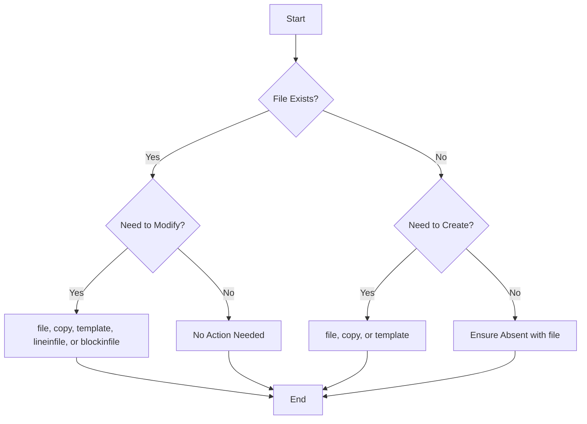

# Ansible File Modules

## Introduction

Managing files and directories is a fundamental operation in system administration. Whether you're creating configuration files, setting up directory structures, or managing file permissions, Ansible provides a robust set of modules to handle these tasks efficiently and consistently across your infrastructure.

In this guide, we'll explore Ansible's file modules, which allow you to automate file-related operations that would otherwise require manual intervention or custom scripts. These modules are essential building blocks for creating maintainable and scalable infrastructure as code.

## Core File Modules

### The `file` Module

The `file` module is the Swiss Army knife of file operations in Ansible. It can create, delete, and modify files and directories, as well as manage their attributes.

#### Basic Usage

```yaml
- name: Create a directory if it doesn't exist
  file:
    path: /etc/app/config
    state: directory
    mode: '0755'
```

#### Available States

The `state` parameter defines what you want to do with the specified path:

- `file`: Ensures it exists as a regular file
- `directory`: Ensures it exists as a directory
- `link`: Creates a symbolic link
- `hard`: Creates a hard link
- `touch`: Similar to the Unix `touch` command, creates an empty file if it doesn't exist
- `absent`: Ensures the file/directory doesn't exist

#### Example: Managing File Permissions

```yaml
- name: Ensure SSH private key has correct permissions
  file:
    path: ~/.ssh/id_rsa
    mode: '0600'
    owner: "{{ ansible_user }}"
    group: "{{ ansible_user }}"
```

This task ensures that an SSH private key has strict permissions, which is crucial for security.

### The `copy` Module

The `copy` module transfers files from the control node (where Ansible is running) to the managed nodes.

#### Basic Usage

```yaml
- name: Copy configuration file to remote server
  copy:
    src: files/app.conf
    dest: /etc/app/app.conf
    owner: app_user
    group: app_group
    mode: '0644'
    backup: yes
```

#### Key Features

- **Backup**: When `backup: yes` is specified, Ansible creates a backup of any existing file before overwriting it.
- **Content**: Instead of copying a file, you can directly specify content:

```yaml
- name: Create a file with specific content
  copy:
    content: |
      # This is a configuration file
      app_name: MyApp
      app_port: 8080
      debug: false
    dest: /etc/app/config.yml
    mode: '0644'
```

- **Validation**: You can validate the file before copying:

```yaml
- name: Copy and validate nginx configuration
  copy:
    src: files/nginx.conf
    dest: /etc/nginx/nginx.conf
    validate: "nginx -t -c %s"
```

### The `template` Module

The `template` module is similar to `copy`, but it processes the source file as a Jinja2 template before transferring it, allowing for dynamic content generation.

#### Basic Usage

```yaml
- name: Configure application using a template
  template:
    src: templates/app.conf.j2
    dest: /etc/app/app.conf
    owner: app_user
    group: app_group
    mode: '0644'
```

#### Template Example (app.conf.j2)

```jinja2
# Application configuration for {{ inventory_hostname }}
# Generated by Ansible on {{ ansible_date_time.date }}

app_name: {{ app_name | default('MyApp') }}
app_port: {{ app_port | default(8080) }}
log_level: {{ log_level | default('info') }}

database:
  host: {{ db_host | default('localhost') }}
  port: {{ db_port | default(5432) }}
  name: {{ db_name | default('app_db') }}
  user: {{ db_user | default('app_user') }}
```

The power of templates comes from their ability to incorporate variables, conditionals, loops, and filters to generate tailored configurations.

## Advanced File Operations

### The `lineinfile` Module

The `lineinfile` module ensures a particular line is present in a file, or replaces an existing line using regular expressions.

#### Adding a Line

```yaml
- name: Add a line to hosts file
  lineinfile:
    path: /etc/hosts
    line: "192.168.1.100 app-server"
```

#### Replacing a Line

```yaml
- name: Change SSH port configuration
  lineinfile:
    path: /etc/ssh/sshd_config
    regexp: '^#?Port\s+\d+$'
    line: 'Port 2222'
    validate: 'sshd -t -f %s'
```

This is particularly useful for making small changes to configuration files without replacing the entire file.

### The `blockinfile` Module

The `blockinfile` module is similar to `lineinfile` but works with blocks of text rather than single lines.

```yaml
- name: Add a block of text to a configuration file
  blockinfile:
    path: /etc/ntp.conf
    block: |
      # NTP servers for internal network
      server ntp1.internal.example.com iburst
      server ntp2.internal.example.com iburst
      server ntp3.internal.example.com iburst
    marker: "# {mark} ANSIBLE MANAGED NTP SERVERS"
```

The `marker` parameter defines the comments that will surround your block, making it easy to identify Ansible-managed sections.

### The `find` Module

The `find` module allows you to search for files based on various criteria and optionally perform actions on the results.

```yaml
- name: Find all log files older than 30 days
  find:
    paths: /var/log
    patterns: "*.log"
    age: 30d
    recurse: yes
  register: old_logs

- name: Remove old log files
  file:
    path: "{{ item.path }}"
    state: absent
  loop: "{{ old_logs.files }}"
```

This example shows how to find and remove log files older than 30 days.

## Real-World Examples

### Example 1: Deploying a Web Application Configuration

```yaml
- name: Configure Nginx for web application
  hosts: web_servers
  become: yes
  vars:
    app_name: my_webapp
    app_domain: example.com
    app_port: 8080
  
  tasks:
    - name: Ensure Nginx configuration directory exists
      file:
        path: /etc/nginx/sites-available
        state: directory
        mode: '0755'

    - name: Ensure sites-enabled directory exists
      file:
        path: /etc/nginx/sites-enabled
        state: directory
        mode: '0755'

    - name: Generate Nginx site configuration from template
      template:
        src: templates/nginx-site.conf.j2
        dest: "/etc/nginx/sites-available/{{ app_name }}"
        owner: root
        group: root
        mode: '0644'
        validate: "nginx -t -c /etc/nginx/nginx.conf"
      notify: Restart Nginx

    - name: Enable site configuration
      file:
        src: "/etc/nginx/sites-available/{{ app_name }}"
        dest: "/etc/nginx/sites-enabled/{{ app_name }}"
        state: link
      notify: Restart Nginx

  handlers:
    - name: Restart Nginx
      service:
        name: nginx
        state: restarted
```

This example shows how multiple file modules work together to deploy and configure an Nginx web server setup.

### Example 2: Managing System Configuration Files

```yaml
- name: Configure system settings
  hosts: all
  become: yes
  tasks:
    - name: Set system-wide environment variables
      blockinfile:
        path: /etc/environment
        block: |
          APP_ENV=production
          APP_LOG_LEVEL=info
          APP_PATH=/opt/myapp
        marker: "# {mark} ANSIBLE MANAGED APP ENVIRONMENT"

    - name: Configure system limits
      copy:
        dest: /etc/security/limits.d/custom.conf
        content: |
          # Custom system limits
          *               soft    nofile          65536
          *               hard    nofile          65536
          *               soft    nproc           4096
          *               hard    nproc           4096
        mode: '0644'

    - name: Ensure sysctl configuration includes our file
      lineinfile:
        path: /etc/sysctl.conf
        line: "include /etc/sysctl.d/*.conf"
        state: present

    - name: Configure kernel parameters
      template:
        src: templates/sysctl-custom.conf.j2
        dest: /etc/sysctl.d/99-custom.conf
        mode: '0644'
      notify: Apply sysctl settings

  handlers:
    - name: Apply sysctl settings
      command: sysctl -p /etc/sysctl.d/99-custom.conf
```

This playbook demonstrates how to use various file modules to manage system configuration files, ensuring consistent settings across your infrastructure.

## Flow Diagram for File Operations



## Advanced Topics

### Managing SELinux Context

When working with systems that use SELinux, you may need to manage file contexts:

```yaml
- name: Create directory with specific SELinux context
  file:
    path: /var/www/html/app
    state: directory
    mode: '0755'
    setype: httpd_sys_content_t
```

### Managing Extended Attributes

Some file operations require setting extended attributes:

```yaml
- name: Set attributes on a file
  file:
    path: /var/log/audit/audit.log
    attributes: +a
```

This example sets the append-only attribute on an audit log file.

### Synchronizing Directories

For more complex file synchronization needs, Ansible provides the `synchronize` module, which is a wrapper around `rsync`:

```yaml
- name: Sync application files to servers
  synchronize:
    src: /local/path/to/app/
    dest: /remote/path/to/app/
    delete: yes
    recursive: yes
    rsync_opts:
      - "--exclude=.git"
      - "--exclude=node_modules"
```

## Summary

Ansible's file modules provide a robust toolset for managing files and directories across your infrastructure:

- The `file` module manages file existence, permissions, and attributes
- The `copy` module transfers files from the control node to managed nodes
- The `template` module allows for dynamic file generation using Jinja2
- The `lineinfile` and `blockinfile` modules make precise modifications to existing files
- The `find` module helps locate files based on various criteria

By leveraging these modules, you can ensure consistent file management across your entire infrastructure, reduce manual configuration errors, and implement infrastructure as code effectively.

## Exercises

1. Create a playbook that sets up a standard directory structure for a web application, with appropriate permissions for different components.
2. Write a task that finds all files with world-writable permissions in `/etc` and corrects them.
3. Create a template for an application configuration file that adapts based on the environment (development, testing, production).
4. Implement a playbook that backs up all configuration files before modifying them.
5. Write a task that ensures all shell scripts in a directory are executable, but not world-writable.

## Additional Resources

- [Ansible Documentation: File Modules](https://docs.ansible.com/ansible/latest/collections/ansible/builtin/file_module.html)
- [Ansible Documentation: Template Module](https://docs.ansible.com/ansible/latest/collections/ansible/builtin/template_module.html)
- [Ansible Documentation: Copy Module](https://docs.ansible.com/ansible/latest/collections/ansible/builtin/copy_module.html)
- [Ansible Documentation: Working with Files](https://docs.ansible.com/ansible/latest/user_guide/files.html)