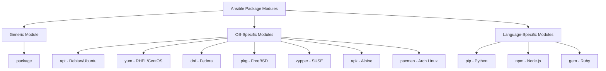

# Ansible Package Modules

## Introduction

Software package management is a critical aspect of system administration. Whether you're installing new applications, updating existing software, or removing unused packages, maintaining consistent software states across your infrastructure is essential. However, managing packages manually becomes impractical as your environment grows.

Ansible provides a powerful solution through its **package modules**, which allow you to automate software installation and management across different operating systems and package managers. These modules abstract away the underlying package manager details, letting you focus on what packages you need rather than how to install them.

In this guide, we'll explore Ansible's package modules, their capabilities, and how to use them effectively in your automation workflows.

## The Package Module Family

Ansible offers both a generic `package` module that tries to use the appropriate package manager for your target system, as well as specific modules for various package managers:



### When to Use Each Module

1. Use the **generic `package` module** when you want Ansible to automatically select the appropriate package manager based on the target system.
2. Use **OS-specific modules** (`apt`, `yum`, etc.) when you need to use features specific to that package manager.
3. Use **language-specific modules** (`pip`, `npm`, etc.) when installing packages for specific programming languages.

## The Generic Package Module

The `package` module serves as a unified interface to various package managers. It automatically detects and uses the appropriate package manager for the target system.

### Basic Usage

```yaml
- name: Install nginx
  package:
    name: nginx
    state: present
```

This simple task will:
- Use `apt` on Debian/Ubuntu systems
- Use `yum` on RHEL/CentOS systems
- Use `dnf` on Fedora systems
- And so on for other supported platforms

### Common Parameters

The `package` module supports these essential parameters:

| Parameter | Description | Example Values |
|-----------|-------------|---------------|
| `name` | Package name or list of packages | `nginx`, `['nginx', 'mysql-server']` |
| `state` | Desired state of the package | `present`, `absent`, `latest` |
| `update_cache` | Update the package cache | `yes`, `no` |

### Example: Installing Multiple Packages

```yaml
- name: Install web server components
  package:
    name:
      - nginx
      - php-fpm
      - mysql-server
    state: present
```

### Example Output

When you run a playbook with the `package` module, you'll see output similar to:

```
TASK [Install nginx] **********************************************************
changed: [webserver1] => {"changed": true, "msg": "installed nginx"}
ok: [webserver2] => {"changed": false, "msg": "package nginx is already installed"}
```

## OS-Specific Package Modules

While the generic module is convenient, sometimes you need features specific to certain package managers. Let's explore some of the most common OS-specific modules.

### apt (Debian/Ubuntu)

The `apt` module manages packages on Debian-based systems like Ubuntu.

```yaml
- name: Install nginx on Ubuntu
  apt:
    name: nginx
    state: present
    update_cache: yes
```

This module provides additional parameters like:

- `cache_valid_time`: Consider the cache valid for the specified time (in seconds)
- `default_release`: Specify a particular distribution release
- `install_recommends`: Whether to install recommended packages

### Example: Installing a Specific Version

```yaml
- name: Install specific version of nginx
  apt:
    name: nginx=1.18.0-0ubuntu1
    state: present
    update_cache: yes
```

### yum (RHEL/CentOS)

For Red Hat-based systems, the `yum` module provides package management:

```yaml
- name: Install nginx on CentOS
  yum:
    name: nginx
    state: present
    enablerepo: epel
```

Unique features include:
- `enablerepo`/`disablerepo`: Temporarily enable/disable specific repositories
- `security`: Only install updates that have been marked as security related

### dnf (Fedora)

DNF is the next-generation package manager for Fedora and newer versions of RHEL:

```yaml
- name: Install the latest version of nginx
  dnf:
    name: nginx
    state: latest
```

## Language-Specific Package Modules

Ansible also provides modules for managing packages in various programming languages.

### pip (Python)

The `pip` module installs Python packages:

```yaml
- name: Install Django
  pip:
    name: django
    version: 3.2.5
```

Extra features include:
- `virtualenv`: Install packages into a Python virtual environment
- `extra_args`: Pass additional arguments to pip

### Example: Installing into a Virtual Environment

```yaml
- name: Install packages into a virtualenv
  pip:
    name:
      - django
      - gunicorn
    virtualenv: /opt/myapp/venv
    state: present
```

## Practical Examples

Let's look at some real-world examples of using package modules in playbooks.

### Example 1: Cross-Platform Web Server Setup

```yaml
---
- name: Install web server
  hosts: web_servers
  become: yes
  tasks:
    - name: Install web server package
      package:
        name: "{{ web_server_package }}"
        state: present
      vars:
        web_server_package: >-
          {{ 
            'nginx' if ansible_os_family == 'Debian' else
            'httpd' if ansible_os_family == 'RedHat' else
            'nginx'
          }}
    
    - name: Start and enable web server service
      service:
        name: "{{ web_server_service }}"
        state: started
        enabled: yes
      vars:
        web_server_service: >-
          {{ 
            'nginx' if ansible_os_family == 'Debian' else
            'httpd' if ansible_os_family == 'RedHat' else
            'nginx'
          }}
```

This playbook:
1. Installs the right web server package for each OS family (nginx on Debian, httpd on RedHat)
2. Enables and starts the corresponding service

### Example 2: System Update and Package Cleanup

```yaml
---
- name: Update system and clean up packages
  hosts: all
  become: yes
  tasks:
    - name: Update package cache
      package:
        update_cache: yes
      changed_when: false  # Don't mark this as a change
      
    - name: Upgrade all packages
      package:
        name: '*'
        state: latest
      register: package_upgrade
      
    - name: Remove unused dependencies
      package:
        autoremove: yes
      when: ansible_os_family == 'Debian' or ansible_os_family == 'RedHat'
      
    - name: Clean package cache
      package:
        clean: yes
      when: ansible_os_family == 'RedHat'
```

This playbook:
1. Updates the package cache
2. Upgrades all installed packages
3. Removes unused dependencies (on supported systems)
4. Cleans the package cache (on RedHat systems)

### Example 3: Development Environment Setup

```yaml
---
- name: Set up Python development environment
  hosts: dev_servers
  become: yes
  tasks:
    - name: Install system packages
      package:
        name:
          - git
          - build-essential
          - python3-dev
          - python3-venv
        state: present
        
    - name: Install Python packages globally
      pip:
        name:
          - virtualenv
          - pipenv
        state: latest
        
    - name: Create project virtual environment
      pip:
        name:
          - django
          - djangorestframework
          - pytest
        virtualenv: /opt/myproject/venv
        virtualenv_command: python3 -m venv
```

This playbook:
1. Installs system-level dependencies for Python development
2. Installs global Python tools
3. Creates a project-specific virtual environment with required packages

## Best Practices

When working with Ansible package modules, keep these best practices in mind:

1. **Use the generic `package` module** when possible for better playbook portability
2. **Pin package versions** in production environments to ensure consistency
3. **Use `update_cache: yes`** when you need the latest repository information
4. **Use idempotent states** like `present` instead of `installed` (they're equivalent, but `present` better reflects Ansible's idempotent nature)
5. **Be careful with `latest`** as it can cause unexpected changes during routine playbook runs
6. **Use `check_mode`** to see what would change without actually making changes:

```bash
ansible-playbook playbook.yml --check
```

## Common Issues and Solutions

### Issue: Package Not Found

If Ansible can't find a package, check:
- Is the package name correct for that OS?
- Is the appropriate repository enabled?
- Do you need to update the package cache?

```yaml
- name: Ensure EPEL repository is enabled
  yum:
    name: epel-release
    state: present
  when: ansible_os_family == 'RedHat'
  
- name: Install package that requires EPEL
  package:
    name: nginx
    state: present
    update_cache: yes
```

### Issue: Unable to Acquire Lock

If another process is using the package manager, Ansible will fail with a lock error:

```yaml
- name: Install package with retries
  package:
    name: nginx
    state: present
  register: package_install
  retries: 5
  delay: 10
  until: package_install is success
```

## Summary

Ansible's package modules provide a powerful and flexible way to manage software across diverse environments. By abstracting away the differences between package managers, they allow you to focus on what matters - defining the desired state of your systems.

Key takeaways:
- Use the generic `package` module for cross-platform compatibility
- Use OS-specific modules when you need special features
- Leverage language-specific modules for programming dependencies
- Follow best practices to ensure predictable and idempotent package management

## Additional Resources

To dive deeper into Ansible package management:

- [Official Ansible package module documentation](https://docs.ansible.com/ansible/latest/collections/ansible/builtin/package_module.html)
- [Ansible apt module documentation](https://docs.ansible.com/ansible/latest/collections/ansible/builtin/apt_module.html)
- [Ansible yum module documentation](https://docs.ansible.com/ansible/latest/collections/ansible/builtin/yum_module.html)
- [Ansible pip module documentation](https://docs.ansible.com/ansible/latest/collections/ansible/builtin/pip_module.html)

## Exercises

1. Create a playbook that installs different web servers based on the target OS (nginx on Debian-based systems, httpd on RedHat-based systems).

2. Write a playbook that updates all packages on your servers but only if they haven't been updated in the last 7 days.

3. Create a role that installs and configures a Python application with its dependencies, using both system packages and pip packages.

4. Write a playbook that performs a rolling update of packages across your infrastructure, updating only a subset of servers at a time to minimize downtime.