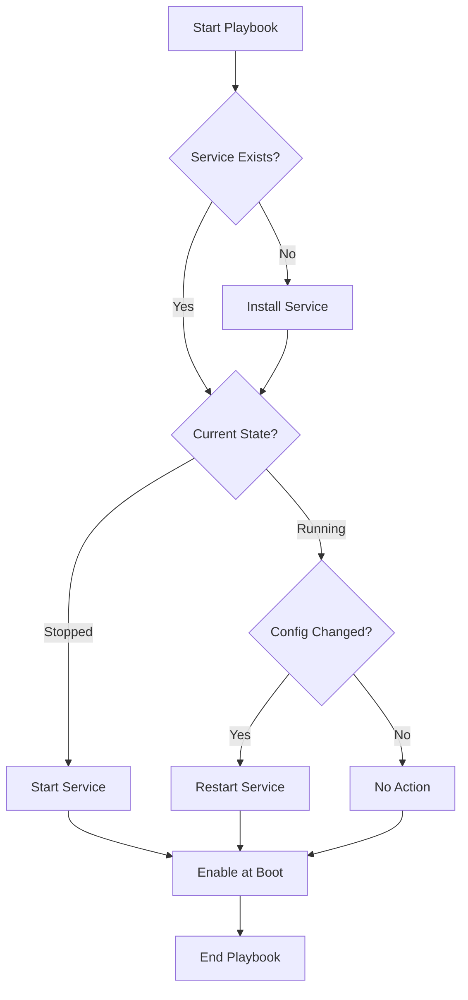

# Ansible Service Modules

## Introduction

System services are critical components that run in the background of operating systems, handling everything from network connectivity to database operations. Managing these services efficiently across multiple servers can be challenging and time-consuming. This is where Ansible's service modules come to the rescue.

Ansible service modules provide a consistent way to control system services across different operating systems, allowing you to start, stop, enable, or disable services through simple, declarative tasks in your playbooks. These modules abstract away the differences between service managers like systemd, SysVinit, or Windows services, providing a unified interface for service management.

In this guide, we'll explore how to use Ansible's service modules to automate service management tasks in your infrastructure.

## Understanding Service Management in Ansible

Before diving into specific modules, let's understand what service management entails:

1. **Starting/Stopping Services**: Controlling the immediate running state of a service
2. **Enabling/Disabling Services**: Configuring whether a service starts automatically on system boot
3. **Restarting/Reloading Services**: Applying configuration changes without full restarts when possible
4. **Checking Service Status**: Verifying if a service is running properly

Ansible provides several modules to handle these operations across different platforms:

- **service**: A generic module that works with most Unix/Linux service managers
- **systemd**: Specifically designed for systems using systemd (modern Linux distributions)
- **win_service**: For managing services on Windows systems

## The `service` Module

The `service` module is the most versatile service management module in Ansible. It's designed to work with various service managers including SysVinit, systemd, upstart, and others.

### Basic Syntax

```yaml
- name: Service module task
  service:
    name: service_name
    state: desired_state
    enabled: yes_or_no
```

### Key Parameters

- **name**: The name of the service to manage
- **state**: The desired state of the service (started, stopped, restarted, reloaded)
- **enabled**: Whether the service should start on boot (yes/no)
- **pattern**: If the service does not identify properly via status, you can specify a pattern to match against running processes
- **sleep**: Period to sleep between checks (useful for services that take time to start)

### Examples

#### Starting a Service

```yaml
- name: Ensure Apache is running
  service:
    name: httpd
    state: started
```

This task ensures that the Apache HTTP server (httpd) is running. If it's already running, no action is taken; if it's stopped, Ansible will start it.

#### Enabling a Service at Boot

```yaml
- name: Ensure MySQL starts at boot
  service:
    name: mysql
    enabled: yes
```

This configures the MySQL service to start automatically when the system boots.

#### Restarting a Service

```yaml
- name: Restart Nginx web server
  service:
    name: nginx
    state: restarted
```

This task will restart the Nginx web server, which is useful after configuration changes.

#### Combined Operations

```yaml
- name: Configure PostgreSQL service
  service:
    name: postgresql
    state: started
    enabled: yes
```

This task ensures PostgreSQL is both running now and configured to start automatically on boot.

## The `systemd` Module

For modern Linux distributions using systemd (like RHEL/CentOS 7+, Ubuntu 16.04+, Debian 8+), the `systemd` module offers more specialized functionality.

### Basic Syntax

```yaml
- name: Systemd module task
  systemd:
    name: service_name
    state: desired_state
    enabled: yes_or_no
```

### Key Parameters

- **name**: The name of the service to manage
- **state**: The desired state of the service
- **enabled**: Whether the service should start on boot
- **daemon_reload**: Run daemon-reload before doing any other operations
- **user**: Run systemctl with --user flag to control user services

### Examples

#### Managing a System Service with Daemon Reload

```yaml
- name: Update and restart a service
  systemd:
    name: myapp
    daemon_reload: yes
    state: restarted
```

This is particularly useful after updating unit files, as it ensures systemd reloads its configuration before attempting to restart the service.

#### Managing User Services

```yaml
- name: Start a user service
  systemd:
    name: podman
    state: started
    user: yes
```

This example manages a service in the user's systemd instance rather than the system-wide one.

#### Handling Failed Services

```yaml
- name: Reset failed state and restart service
  systemd:
    name: application-server
    state: restarted
    no_block: yes
```

This resets a service that has entered the "failed" state and restarts it without waiting for completion.

## The `win_service` Module

For Windows environments, Ansible provides the `win_service` module to manage Windows services.

### Basic Syntax

```yaml
- name: Windows service task
  win_service:
    name: service_name
    state: desired_state
    start_mode: auto_or_manual
```

### Key Parameters

- **name**: The name of the Windows service
- **state**: The desired state (started, stopped, restarted)
- **start_mode**: Startup mode (auto, manual, disabled)
- **dependencies**: A list of service dependencies to set
- **username**: The username to run the service as

### Examples

#### Managing Windows Services

```yaml
- name: Ensure Windows Update service is running
  win_service:
    name: wuauserv
    state: started
    start_mode: auto
```

This ensures the Windows Update service is running and configured to start automatically.

#### Setting Service Dependencies

```yaml
- name: Configure SQL Server Agent with dependencies
  win_service:
    name: SQLSERVERAGENT
    dependencies:
      - MSSQLSERVER
    state: started
```

This configures the SQL Server Agent service to depend on the main SQL Server service.

## Practical Real-World Examples

Let's explore some common scenarios where service modules shine in real-world applications.

### Example 1: Web Server Deployment with Configuration Changes

```yaml
---
- name: Deploy web application with Nginx
  hosts: web_servers
  become: yes
  tasks:
    - name: Install Nginx
      package:
        name: nginx
        state: present

    - name: Deploy website configuration
      template:
        src: nginx-site.conf.j2
        dest: /etc/nginx/sites-available/myapp.conf
      notify: restart nginx

    - name: Enable site configuration
      file:
        src: /etc/nginx/sites-available/myapp.conf
        dest: /etc/nginx/sites-enabled/myapp.conf
        state: link
      notify: restart nginx

    - name: Ensure Nginx is running and enabled
      service:
        name: nginx
        state: started
        enabled: yes

  handlers:
    - name: restart nginx
      service:
        name: nginx
        state: restarted
```

This playbook:
1. Installs Nginx
2. Deploys a configuration file using a template
3. Creates a symbolic link to enable the site
4. Ensures Nginx is running and enabled at boot
5. Uses a handler to restart Nginx only when configuration changes

### Example 2: Managing Database Services with Failover

```yaml
---
- name: Database service management
  hosts: database_servers
  become: yes
  tasks:
    - name: Check if primary database is running
      service_facts:

    - name: Start primary database if not running
      service:
        name: postgresql
        state: started
      when: ansible_facts.services['postgresql.service'].state != 'running'
      register: primary_start

    - name: Wait for database to be ready
      wait_for:
        port: 5432
        timeout: 30
      when: primary_start.changed

    - name: Start replication service if primary is running
      service:
        name: postgresql-replication
        state: started
      when: ansible_facts.services['postgresql.service'].state == 'running'
```

This playbook demonstrates:
1. Using `service_facts` to gather information about service states
2. Conditional service management based on the state of other services
3. Using wait_for to ensure services are fully operational before proceeding

### Example 3: Rolling Service Updates with Minimal Downtime

```yaml
---
- name: Perform rolling updates to application servers
  hosts: app_cluster
  serial: 1  # Update one server at a time
  become: yes
  tasks:
    - name: Remove server from load balancer
      # Commands to remove from load balancer...

    - name: Update application packages
      package:
        name: myapp
        state: latest

    - name: Restart application service
      systemd:
        name: myapp
        state: restarted
        daemon_reload: yes

    - name: Wait for application to be ready
      uri:
        url: "http://localhost:8080/health"
        status_code: 200
      register: result
      until: result.status == 200
      retries: 10
      delay: 5

    - name: Add server back to load balancer
      # Commands to add back to load balancer...
```

This playbook:
1. Updates servers one at a time to maintain service availability
2. Removes each server from the load balancer before updating
3. Uses the systemd module to restart the application with daemon reload
4. Verifies the application is healthy before proceeding
5. Returns the server to the load balancer

## Conditional Service Management

Ansible service modules can be combined with conditionals for more sophisticated service management:

```yaml
- name: Conditionally restart services
  service:
    name: "{{ item }}"
    state: restarted
  loop:
    - nginx
    - php-fpm
  when: config_updated | bool
```

This example restarts both Nginx and PHP-FPM, but only if configurations have been updated.

## Service Modules and Handlers

Handlers are special tasks in Ansible that only run when notified by other tasks. They're ideal for service restarts:

```yaml
- name: Update configuration file
  template:
    src: app.conf.j2
    dest: /etc/app/app.conf
  notify: restart application

handlers:
  - name: restart application
    service:
      name: myapp
      state: restarted
```

This pattern ensures the service only restarts when the configuration actually changes, avoiding unnecessary restarts.

## Visualizing Service Management Workflow



## Best Practices for Service Management

1. **Use Handlers for Restarts**: Only restart services when necessary by using handlers triggered by configuration changes.

2. **Check Before Acting**: When possible, check the current state of services before making changes:
   ```yaml
   - name: Get service facts
     service_facts:

   - name: Start service if not running
     service:
       name: myservice
       state: started
     when: ansible_facts.services['myservice.service'].state != 'running'
   ```

3. **Use the Right Module**: Choose the appropriate module for your OS (systemd for modern Linux, win_service for Windows).

4. **Implement Health Checks**: After starting or restarting services, verify they're functioning correctly:
   ```yaml
   - name: Wait for web service to become available
     uri:
       url: http://localhost/health
       status_code: 200
     register: result
     until: result.status == 200
     retries: 10
     delay: 3
   ```

5. **Manage Dependencies**: Ensure services that depend on each other are managed in the correct order.

6. **Use Variables for Service Names**: Different distributions might use different service names. Use variables to handle this:
   ```yaml
   - name: Start web server
     service:
       name: "{{ web_service_name }}"
       state: started
     vars:
       web_service_name: "{{ 'apache2' if ansible_distribution == 'Ubuntu' else 'httpd' }}"
   ```

## Summary

Ansible's service modules provide powerful tools for managing system services across diverse environments. By abstracting away the differences between service managers, they allow you to create consistent playbooks that work across your entire infrastructure regardless of the underlying operating systems.

In this guide, we've covered:
- The core service modules: `service`, `systemd`, and `win_service`
- How to start, stop, enable, and restart services
- Real-world examples showing service management in action
- Best practices for effective service automation

With these modules, you can automate routine service management tasks, ensure consistent service configurations, and implement sophisticated deployment strategies like rolling updates with minimal downtime.

## Additional Resources and Exercises

### Resources
- [Ansible Service Module Documentation](https://docs.ansible.com/ansible/latest/collections/ansible/builtin/service_module.html)
- [Ansible Systemd Module Documentation](https://docs.ansible.com/ansible/latest/collections/ansible/builtin/systemd_module.html)
- [Ansible Win_Service Module Documentation](https://docs.ansible.com/ansible/latest/collections/ansible/windows/win_service_module.html)

### Exercises

1. **Basic Service Management**:
   Create a playbook that ensures the SSH service is running and enabled on all your Linux servers.

2. **Multi-Platform Service Management**:
   Create a playbook that manages web servers across different distributions (Apache on RHEL/CentOS and Nginx on Ubuntu/Debian).

3. **Service Orchestration**:
   Develop a playbook for a three-tier application that manages services in the correct order: database → application server → web server.

4. **Rolling Updates**:
   Implement a rolling update strategy for a service running on multiple servers, ensuring no downtime during updates.

5. **Service Monitoring**:
   Extend a service management playbook to include basic monitoring checks after service changes.