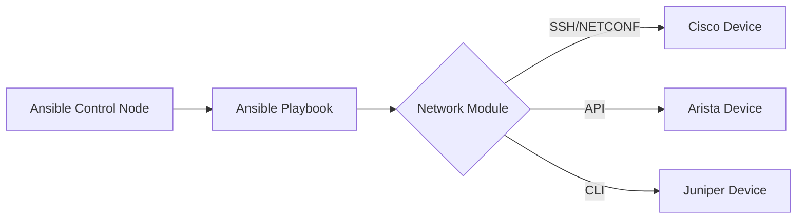

# Ansible Network Modules

## Introduction

Network automation has become essential for modern infrastructure management. Manually configuring network devices is time-consuming, error-prone, and difficult to scale. This is where Ansible's network modules come to the rescue.

Ansible network modules are specialized components that allow you to automate the configuration, management, and operation of network devices from various vendors such as Cisco, Juniper, Arista, and many others. These modules enable network engineers and system administrators to apply the principles of Infrastructure as Code (IaC) to networking equipment.

## Understanding Ansible Network Modules

### What Are Network Modules?

Ansible network modules are collections of Python code that communicate with network devices using their respective APIs or protocols. Unlike regular Ansible modules that typically use SSH to execute commands on Linux/Unix systems, network modules are designed to work with the unique characteristics of network devices.

### Key Benefits

- **Consistency**: Apply identical configurations across multiple devices
- **Version Control**: Store network configurations in Git or other VCS
- **Automation**: Reduce manual configuration errors
- **Documentation**: Self-documenting infrastructure
- **Multi-vendor Support**: Work with devices from different manufacturers

### How Network Modules Work



Ansible network modules work by:

1. Connecting to the network device using the appropriate protocol (SSH, NETCONF, API)
2. Executing commands or making API calls
3. Processing the output
4. Reporting the results back to Ansible

## Common Network Modules

Ansible provides modules for many network vendors. Here are some of the most commonly used ones:

### Cisco IOS Modules

The `ios_*` modules work with Cisco IOS devices:

```yaml
- name: Configure interface on Cisco IOS
  cisco.ios.ios_config:
    lines:
      - description Management interface
      - ip address 192.168.1.1 255.255.255.0
      - no shutdown
    parents: interface GigabitEthernet0/1
```

### Juniper Junos Modules

The `junos_*` modules work with Juniper devices:

```yaml
- name: Configure BGP on Juniper
  junipernetworks.junos.junos_bgp_global:
    config:
      as_number: 65001
      router_id: "192.0.2.1"
    state: merged
```

### Arista EOS Modules

The `eos_*` modules work with Arista EOS devices:

```yaml
- name: Configure VLAN on Arista
  arista.eos.eos_vlans:
    config:
      - vlan_id: 100
        name: "Web-VLAN"
      - vlan_id: 200
        name: "DB-VLAN"
    state: merged
```

## Getting Started with Network Modules

### Prerequisites

Before using Ansible network modules, you'll need:

1. Ansible installed on your control node
2. Network device credentials
3. Network connectivity to the devices
4. Required Python libraries (device-specific)

### Installing Network Collections

Most network modules are now distributed as collections. Install them using:

```bash
ansible-galaxy collection install cisco.ios
ansible-galaxy collection install junipernetworks.junos
ansible-galaxy collection install arista.eos
```

### Basic Inventory Setup

Create an inventory file to define your network devices:

```ini
# inventory.ini
[cisco_routers]
router1 ansible_host=192.168.1.10

[juniper_switches]
switch1 ansible_host=192.168.1.20

[arista_switches]
eos1 ansible_host=192.168.1.30

[network:children]
cisco_routers
juniper_switches
arista_switches

[network:vars]
ansible_network_os=ios
ansible_user=admin
ansible_password=secure_password
ansible_connection=network_cli
```

## Practical Examples

### Example 1: Backup Device Configurations

```yaml
---
# backup_configs.yml
- name: Backup network device configurations
  hosts: network
  gather_facts: no
  
  tasks:
    - name: Backup device configs
      ansible.netcommon.cli_command:
        command: "{{ backup_command[ansible_network_os] }}"
      register: config_output
      vars:
        backup_command:
          ios: "show running-config"
          junos: "show configuration"
          eos: "show running-config"
    
    - name: Save config to file
      copy:
        content: "{{ config_output.stdout }}"
        dest: "backups/{{ inventory_hostname }}_config.txt"
      delegate_to: localhost
```

Running this playbook:

```bash
ansible-playbook backup_configs.yml -i inventory.ini
```

### Example 2: Configure SNMP Across Multiple Platforms

```yaml
---
# configure_snmp.yml
- name: Configure SNMP on all network devices
  hosts: network
  gather_facts: no
  
  vars:
    snmp_community: public_ro
    snmp_location: "Data Center 1"
    snmp_contact: "admin@example.com"
  
  tasks:
    - name: Configure SNMP on Cisco IOS
      cisco.ios.ios_config:
        lines:
          - snmp-server community {{ snmp_community }} RO
          - snmp-server location {{ snmp_location }}
          - snmp-server contact {{ snmp_contact }}
      when: ansible_network_os == 'ios'
    
    - name: Configure SNMP on Juniper Junos
      junipernetworks.junos.junos_config:
        lines:
          - set snmp community {{ snmp_community }} authorization read-only
          - set snmp location {{ snmp_location }}
          - set snmp contact {{ snmp_contact }}
      when: ansible_network_os == 'junos'
    
    - name: Configure SNMP on Arista EOS
      arista.eos.eos_config:
        lines:
          - snmp-server community {{ snmp_community }} ro
          - snmp-server location {{ snmp_location }}
          - snmp-server contact {{ snmp_contact }}
      when: ansible_network_os == 'eos'
```

### Example 3: Using Resource Modules for Idempotent Configuration

Resource modules are newer network modules that provide a more declarative approach:

```yaml
---
# configure_interfaces.yml
- name: Configure interfaces using resource modules
  hosts: cisco_routers
  gather_facts: no
  
  tasks:
    - name: Configure interfaces
      cisco.ios.ios_interfaces:
        config:
          - name: GigabitEthernet0/0
            description: WAN Interface
            enabled: true
          - name: GigabitEthernet0/1
            description: LAN Interface
            enabled: true
        state: merged
```

## Working with Facts

Network modules can gather facts about your devices:

```yaml
---
# gather_facts.yml
- name: Gather network facts
  hosts: network
  gather_facts: no
  
  tasks:
    - name: Gather facts from Cisco devices
      cisco.ios.ios_facts:
        gather_subset: all
      when: ansible_network_os == 'ios'
      
    - name: Display facts
      debug:
        var: ansible_facts
```

Output example:

```
TASK [Display facts] **************************
ok: [router1] => {
    "ansible_facts": {
        "ansible_net_hostname": "router1",
        "ansible_net_iostype": "IOS-XE",
        "ansible_net_serialnum": "9XXXXXXXXX",
        "ansible_net_version": "16.9.3",
        "ansible_network_resources": {},
        ...
    }
}
```

## Advanced Techniques

### Using Templates for Configuration

Jinja2 templates allow for more flexible and reusable configurations:

```yaml
# interfaces.j2

interface {{ interface.name }}
 description {{ interface.description }}
 ip address {{ interface.ip_address }} {{ interface.subnet_mask }}
 
 no shutdown
 
 shutdown
 

```

Playbook using the template:

```yaml
---
# template_config.yml
- name: Configure interfaces using templates
  hosts: cisco_routers
  gather_facts: no
  
  vars:
    interfaces:
      - name: GigabitEthernet0/0
        description: WAN Link
        ip_address: 10.0.0.1
        subnet_mask: 255.255.255.0
        enabled: true
      - name: GigabitEthernet0/1
        description: LAN Link
        ip_address: 192.168.1.1
        subnet_mask: 255.255.255.0
        enabled: true
  
  tasks:
    - name: Generate configuration from template
      template:
        src: interfaces.j2
        dest: "configs/{{ inventory_hostname }}_interfaces.cfg"
      delegate_to: localhost
    
    - name: Apply configuration
      cisco.ios.ios_config:
        src: "configs/{{ inventory_hostname }}_interfaces.cfg"
```

### Network Compliance Checks

You can use Ansible to validate network device configurations:

```yaml
---
# compliance_check.yml
- name: Check NTP configuration compliance
  hosts: network
  gather_facts: no
  
  vars:
    required_ntp_servers:
      - 10.1.1.1
      - 10.1.1.2
  
  tasks:
    - name: Get NTP configuration
      ansible.netcommon.cli_command:
        command: "{{ ntp_command[ansible_network_os] }}"
      register: ntp_output
      vars:
        ntp_command:
          ios: "show running-config | include ntp server"
          junos: "show configuration system ntp"
          eos: "show running-config | include ntp server"
    
    - name: Check compliance
      assert:
        that:
          - "ntp_output.stdout is search('{{ item }}')"
        fail_msg: "NTP server {{ item }} is not configured"
        success_msg: "NTP server {{ item }} is properly configured"
      loop: "{{ required_ntp_servers }}"
```

## Troubleshooting Network Modules

When working with network modules, you might encounter issues. Here are some common troubleshooting tips:

### Enable Verbose Output

Use the `-v` flag to see more details:

```bash
ansible-playbook backup_configs.yml -i inventory.ini -v
```

For even more verbosity, use `-vvv`:

```bash
ansible-playbook backup_configs.yml -i inventory.ini -vvv
```

### Check Connectivity

Ensure you can reach the network devices:

```yaml
- name: Verify connectivity
  ansible.netcommon.net_ping:
    dest: 8.8.8.8
  register: ping_result
```

### Common Issues and Solutions

1. **Authentication failures**: Double-check credentials and privilege levels
2. **Timeout errors**: Increase timeout values in your playbooks
3. **Command syntax errors**: Verify command syntax for specific device types
4. **Missing dependencies**: Ensure all required Python libraries are installed

## Summary

Ansible network modules provide a powerful, vendor-agnostic way to automate network infrastructure. Key takeaways:

- Network modules allow you to manage network devices using Infrastructure as Code principles
- They support multiple vendors through a consistent interface
- You can perform backups, configuration changes, and compliance checks
- Templates and resource modules provide more flexible and idempotent configurations
- Proper inventory management is crucial for successful network automation

By leveraging these modules, you can dramatically reduce manual effort, minimize configuration errors, and improve the consistency of your network infrastructure.

## Additional Resources

To learn more about Ansible network modules:

- Practice with different module types on a lab environment
- Explore vendor-specific documentation for advanced features
- Consider using network simulation tools like GNS3 or EVE-NG for testing

## Exercises

1. Create a playbook to back up configurations from multiple vendor devices
2. Write a Jinja2 template to configure VLAN information across multiple switches
3. Develop a compliance playbook to ensure all network devices have proper security settings
4. Create a playbook that uses facts gathering to generate a network inventory report
5. Build a multi-vendor BGP configuration playbook using resource modules