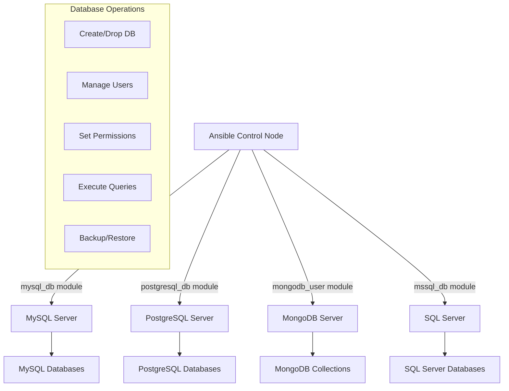

# Ansible Database Modules

## Introduction

Database management is a critical aspect of modern infrastructure operations. Whether you're provisioning new databases, managing users, handling backups, or executing queries, automating these tasks can significantly reduce operational overhead and minimize human error.

Ansible provides a rich set of database modules that enable DevOps engineers and system administrators to automate database operations across various database systems. These modules allow you to manage database instances, users, privileges, and content as part of your infrastructure as code strategy.

In this guide, we'll explore Ansible's database modules, their functionality, and how to use them effectively in your automation workflows.

## Understanding Ansible Database Modules

Ansible database modules are specialized modules designed to interact with various database systems. They abstract away the complexity of database management by providing a simple, declarative interface for common database operations.

### Key Database Modules in Ansible

Ansible supports a wide range of database systems through dedicated modules:

- **MySQL/MariaDB**: `mysql_db`, `mysql_user`, `mysql_query`, etc.
- **PostgreSQL**: `postgresql_db`, `postgresql_user`, `postgresql_query`, etc.
- **MongoDB**: `mongodb_user`, `mongodb_collection`, etc.
- **MSSQL**: `mssql_db`, `mssql_user`, etc.
- **Oracle**: `oracle_db`, `oracle_user`, etc.
- **Redis**: `redis`, `redis_info`, etc.

Let's look at how these modules work and how to use them in practice.

## MySQL/MariaDB Modules

MySQL and MariaDB are among the most popular database systems. Ansible provides several modules to manage these databases.

### Creating a MySQL Database

The `mysql_db` module allows you to create, delete, or manage MySQL databases.

```yaml
- name: Create a new database
  mysql_db:
    name: application_db
    state: present
    login_user: root
    login_password: "{{ mysql_root_password }}"
```

This simple task ensures that the database named `application_db` exists. If it doesn't, Ansible will create it.

### Managing MySQL Users

The `mysql_user` module allows you to create and manage user accounts in MySQL.

```yaml
- name: Create MySQL user with privileges
  mysql_user:
    name: app_user
    password: "{{ app_db_password }}"
    priv: 'application_db.*:ALL'
    host: '%'
    state: present
    login_user: root
    login_password: "{{ mysql_root_password }}"
```

This task creates a MySQL user named `app_user` with full privileges on the `application_db` database.

### Executing MySQL Queries

The `mysql_query` module allows you to execute SQL queries against a MySQL database.

```yaml
- name: Initialize database schema
  mysql_query:
    login_db: application_db
    login_user: root
    login_password: "{{ mysql_root_password }}"
    query: |
      CREATE TABLE IF NOT EXISTS users (
        id INT AUTO_INCREMENT PRIMARY KEY,
        username VARCHAR(50) NOT NULL UNIQUE,
        email VARCHAR(100) NOT NULL,
        created_at TIMESTAMP DEFAULT CURRENT_TIMESTAMP
      );
```

This task executes a SQL query to create a `users` table in the `application_db` database if it doesn't already exist.

## PostgreSQL Modules

PostgreSQL is another widely used relational database system with excellent Ansible support.

### Creating a PostgreSQL Database

```yaml
- name: Create PostgreSQL database
  postgresql_db:
    name: application_db
    state: present
    login_user: postgres
    login_password: "{{ postgres_password }}"
```

### Managing PostgreSQL Users

```yaml
- name: Create PostgreSQL user
  postgresql_user:
    name: app_user
    password: "{{ app_db_password }}"
    db: application_db
    priv: "ALL"
    state: present
    login_user: postgres
    login_password: "{{ postgres_password }}"
```

### Executing PostgreSQL Queries

```yaml
- name: Create schema in PostgreSQL
  postgresql_query:
    db: application_db
    login_user: postgres
    login_password: "{{ postgres_password }}"
    query: |
      CREATE TABLE IF NOT EXISTS users (
        id SERIAL PRIMARY KEY,
        username VARCHAR(50) NOT NULL UNIQUE,
        email VARCHAR(100) NOT NULL,
        created_at TIMESTAMP DEFAULT CURRENT_TIMESTAMP
      );
```

## MongoDB Modules

MongoDB is a popular NoSQL database that stores data in flexible, JSON-like documents.

### Creating MongoDB Users

```yaml
- name: Create MongoDB user
  mongodb_user:
    database: admin
    name: app_user
    password: "{{ mongodb_password }}"
    roles:
      - db: application_db
        role: readWrite
    state: present
    login_user: admin
    login_password: "{{ mongodb_admin_password }}"
```

### Managing MongoDB Collections

```yaml
- name: Create MongoDB collection
  mongodb_collection:
    database: application_db
    name: users
    state: present
    login_user: admin
    login_password: "{{ mongodb_admin_password }}"
```

## Real-world Example: Setting Up a Web Application Database

Let's create a complete playbook that sets up a database for a web application, including the database, user, and schema:

```yaml
---
- name: Setup Web Application Database
  hosts: database_servers
  become: true
  vars_files:
    - vars/database_credentials.yml
  tasks:
    - name: Install MySQL server
      package:
        name: mysql-server
        state: present

    - name: Start and enable MySQL service
      service:
        name: mysql
        state: started
        enabled: yes

    - name: Secure MySQL installation
      mysql_secure_installation:
        login_password: ''
        new_password: "{{ mysql_root_password }}"
        remove_anonymous_user: yes
        disallow_root_login_remotely: yes
        remove_test_db: yes
        
    - name: Create web application database
      mysql_db:
        name: "{{ app_db_name }}"
        state: present
        login_user: root
        login_password: "{{ mysql_root_password }}"
      
    - name: Create application database user
      mysql_user:
        name: "{{ app_db_user }}"
        password: "{{ app_db_password }}"
        priv: "{{ app_db_name }}.*:ALL"
        host: "{{ app_server_ip }}"
        state: present
        login_user: root
        login_password: "{{ mysql_root_password }}"
      
    - name: Import initial database schema
      mysql_db:
        name: "{{ app_db_name }}"
        state: import
        target: files/initial_schema.sql
        login_user: root
        login_password: "{{ mysql_root_password }}"
```

This playbook:
1. Installs the MySQL server
2. Starts the MySQL service and enables it to start on boot
3. Secures the MySQL installation
4. Creates the application database
5. Creates an application user with appropriate privileges
6. Imports an initial database schema

The corresponding `database_credentials.yml` file would contain encrypted sensitive information:

```yaml
mysql_root_password: "secure_root_password"
app_db_name: "webapp_db"
app_db_user: "webapp_user"
app_db_password: "secure_user_password"
app_server_ip: "10.0.0.5"
```

## Working with Database Parameters

Many database modules allow you to set database parameters or configuration options.

### PostgreSQL Configuration Example

```yaml
- name: Set PostgreSQL parameter
  postgresql_set:
    name: max_connections
    value: 100
    login_user: postgres
    login_password: "{{ postgres_password }}"
```

### MySQL Configuration Example

```yaml
- name: Set MySQL parameter
  mysql_variables:
    variable: max_connections
    value: 100
    login_user: root
    login_password: "{{ mysql_root_password }}"
```

## Database Backup and Restore

Ansible can also help you create database backups and restore them when needed.

### MySQL Backup Example

```yaml
- name: Backup MySQL database
  mysql_db:
    name: application_db
    state: dump
    target: /backups/application_db_{{ ansible_date_time.date }}.sql
    login_user: root
    login_password: "{{ mysql_root_password }}"
```

### PostgreSQL Backup Example

```yaml
- name: Backup PostgreSQL database
  postgresql_db:
    name: application_db
    state: dump
    target: /backups/application_db_{{ ansible_date_time.date }}.sql
    login_user: postgres
    login_password: "{{ postgres_password }}"
```

## Database Replication Setup

Ansible can also help you set up database replication for high availability.

### MySQL Replication Example

```yaml
---
- name: Setup MySQL Replication
  hosts: mysql_servers
  become: true
  vars_files:
    - vars/mysql_replication.yml
  tasks:
    - name: Configure master server
      block:
        - name: Set server-id on master
          lineinfile:
            path: /etc/mysql/mysql.conf.d/mysqld.cnf
            regexp: '^server-id'
            line: 'server-id = 1'
          when: inventory_hostname == groups['mysql_master'][0]
          
        - name: Enable binary logging
          lineinfile:
            path: /etc/mysql/mysql.conf.d/mysqld.cnf
            regexp: '^log_bin'
            line: 'log_bin = mysql-bin'
          when: inventory_hostname == groups['mysql_master'][0]
          
      when: inventory_hostname == groups['mysql_master'][0]
      
    - name: Configure slave server
      block:
        - name: Set server-id on slave
          lineinfile:
            path: /etc/mysql/mysql.conf.d/mysqld.cnf
            regexp: '^server-id'
            line: 'server-id = 2'
            
        - name: Configure read_only on slave
          lineinfile:
            path: /etc/mysql/mysql.conf.d/mysqld.cnf
            regexp: '^read_only'
            line: 'read_only = 1'
            
      when: inventory_hostname == groups['mysql_slaves'][0]
      
    - name: Restart MySQL service
      service:
        name: mysql
        state: restarted
```

## Using Ansible Loops with Database Modules

Ansible loops can be very useful when working with databases, especially when you need to create multiple database objects.

### Creating Multiple Databases

```yaml
- name: Create multiple databases
  mysql_db:
    name: "{{ item }}"
    state: present
    login_user: root
    login_password: "{{ mysql_root_password }}"
  loop:
    - app_production
    - app_staging
    - app_development
```

### Creating Multiple Users with Different Privileges

```yaml
- name: Create multiple database users
  mysql_user:
    name: "{{ item.name }}"
    password: "{{ item.password }}"
    priv: "{{ item.priv }}"
    host: "{{ item.host }}"
    state: present
    login_user: root
    login_password: "{{ mysql_root_password }}"
  loop:
    - { name: 'app_admin', password: '{{ app_admin_password }}', priv: '*.*:ALL', host: 'localhost' }
    - { name: 'app_user', password: '{{ app_user_password }}', priv: 'app_db.*:SELECT,INSERT,UPDATE,DELETE', host: '%' }
    - { name: 'read_only', password: '{{ read_only_password }}', priv: 'app_db.*:SELECT', host: '%' }
```

## Database Connection Diagrams

Here's a diagram illustrating how Ansible interacts with databases:



## Handling Database Connection Errors

Database connections can sometimes fail. Here's how to handle errors gracefully:

```yaml
- name: Try to connect to database
  mysql_db:
    name: application_db
    state: present
    login_user: root
    login_password: "{{ mysql_root_password }}"
  register: db_connection
  ignore_errors: yes
  
- name: Handle database connection failure
  debug:
    msg: "Failed to connect to database: {{ db_connection.msg }}"
  when: db_connection.failed

- name: Attempt database recovery
  block:
    - name: Restart MySQL service
      service:
        name: mysql
        state: restarted
      
    - name: Try connection again
      mysql_db:
        name: application_db
        state: present
        login_user: root
        login_password: "{{ mysql_root_password }}"
  when: db_connection.failed
```

## Best Practices for Database Automation with Ansible

When working with database modules in Ansible, follow these best practices:

1. **Use Variable Encryption**: Always use Ansible Vault to encrypt sensitive information such as database passwords.

2. **Idempotent Operations**: Ensure your database tasks are idempotent (can be run multiple times without changing the result beyond the first application).

3. **Transaction Handling**: Be cautious with transactions, especially when running multiple SQL statements.

4. **Test in Non-Production First**: Always test your database automation in a non-production environment first.

5. **Include Proper Error Handling**: Implement proper error handling and recovery mechanisms.

6. **Backup Before Changes**: Always back up your database before making changes.

7. **Use Conditional Statements**: Use Ansible's conditional statements to make your playbooks more robust.

## Summary

Ansible's database modules provide powerful tools for automating database management tasks across different database systems. By using these modules, you can:

- Create and manage databases and users
- Execute SQL queries
- Set database parameters
- Perform backups and restores
- Configure replication
- Handle database operations idempotently

This automation helps reduce manual errors, increases consistency, and saves time in managing database infrastructure.

## Additional Resources

Here are some exercises to help you practice using Ansible database modules:

1. Create a playbook that installs a MySQL server, creates a database and user, and imports a schema.
2. Extend the playbook to set up master-slave replication between two database servers.
3. Create a playbook that performs a scheduled backup of a database and rotates old backups.
4. Create a playbook that checks the status of a database and sends an alert if it's not running.

## Exercises

1. **Basic Database Setup**:  
   Create a playbook that sets up a PostgreSQL database for a simple blog application with tables for posts, users, and comments.

2. **Database Backup Strategy**:  
   Create a playbook that performs daily backups of a MySQL database and keeps only the last 7 days of backups.

3. **Multi-Environment Setup**:  
   Create a playbook that sets up development, staging, and production databases with appropriate user permissions for each environment.

4. **Database Migration**:  
   Create a playbook that safely migrates data from one database to another, including schema changes.