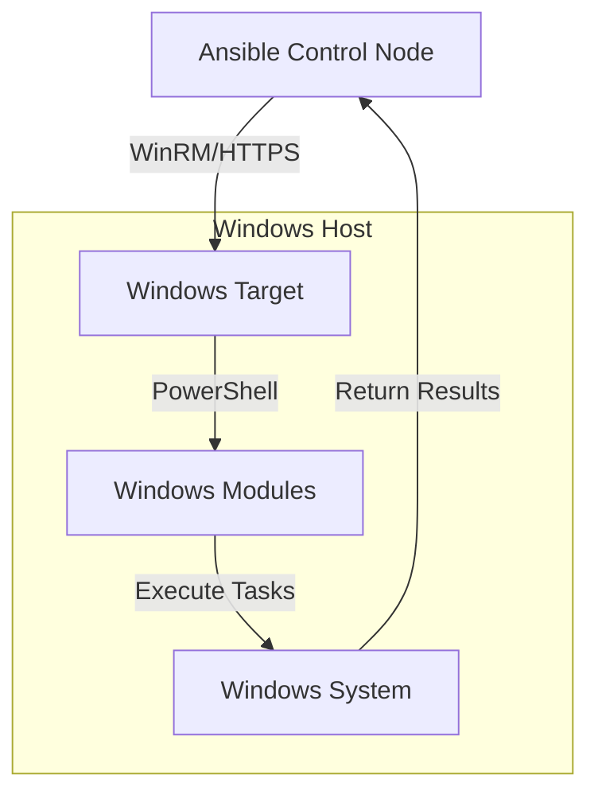

# Ansible Windows Modules

## Introduction

Ansible is a powerful open-source automation tool that can manage configurations, deploy applications, and orchestrate more complex IT tasks. While Ansible was originally designed for Linux/Unix systems, it has robust support for Windows automation through specialized Windows modules.

Windows modules in Ansible allow you to manage Windows servers just as effectively as Linux servers, all from a Linux control machine. These modules handle Windows-specific operations such as managing Windows features, services, registry settings, and more.

## Prerequisites

Before working with Ansible Windows modules, you need:

1. An Ansible control node (Linux/Unix)
2. Windows target hosts with:
   - PowerShell 3.0 or later
   - .NET Framework 4.0 or later
   - WinRM service configured for remote management

## Setting Up WinRM

Windows Remote Management (WinRM) must be configured on Windows hosts. Here's a quick setup script you can run in PowerShell with administrator privileges:

```powershell
$url = "https://raw.githubusercontent.com/ansible/ansible/devel/examples/scripts/ConfigureRemotingForAnsible.ps1"
$file = "$env:temp\ConfigureRemotingForAnsible.ps1"
(New-Object -TypeName System.Net.WebClient).DownloadFile($url, $file)
powershell.exe -ExecutionPolicy Bypass -File $file
```

## Configuring Ansible for Windows

Your Ansible inventory file should specify Windows hosts with connection variables:

```ini
[windows]
windows-server1.example.com
windows-server2.example.com

[windows:vars]
ansible_user=Administrator
ansible_password=SecurePassword
ansible_connection=winrm
ansible_winrm_server_cert_validation=ignore
```

## Core Windows Modules

### win_feature - Managing Windows Features

The `win_feature` module installs or uninstalls Windows features.

**Example: Installing IIS**

```yaml
- name: Install IIS Web Server
  win_feature:
    name: Web-Server
    state: present
    include_management_tools: yes
  register: iis_install

- name: Reboot if required
  win_reboot:
  when: iis_install.reboot_required
```

**Output:**
```
TASK [Install IIS Web Server] ************************************
ok: [windows-server1.example.com]

TASK [Reboot if required] ***************************************
skipping: [windows-server1.example.com]
```

### win_service - Managing Windows Services

Control Windows services with the `win_service` module.

**Example: Configuring a Service**

```yaml
- name: Configure Windows Update service
  win_service:
    name: wuauserv
    start_mode: manual
    state: stopped
```

**Output:**
```
TASK [Configure Windows Update service] **************************
changed: [windows-server1.example.com]
```

### win_package - Installing Software

Install MSI or EXE packages on Windows hosts.

**Example: Installing 7-Zip**

```yaml
- name: Install 7-Zip
  win_package:
    path: https://www.7-zip.org/a/7z1900-x64.msi
    state: present
    product_id: '{23170F69-40C1-2702-1900-000001000000}'
```

## Registry Management

### win_regedit - Managing Registry Keys

Manage Windows registry settings.

**Example: Setting Registry Values**

```yaml
- name: Configure RDP port
  win_regedit:
    path: HKLM:\System\CurrentControlSet\Control\Terminal Server\WinStations\RDP-Tcp
    name: PortNumber
    data: 3389
    type: dword
```

## File Management

### win_file - Managing Files and Directories

Create, delete, or set attributes on files and directories.

**Example: Creating a Directory**

```yaml
- name: Create application directory
  win_file:
    path: C:\App\Logs
    state: directory
```

### win_copy - Copying Files

Copy files to Windows hosts.

**Example: Deploying a Configuration File**

```yaml
- name: Copy configuration file
  win_copy:
    src: ./files/app-config.xml
    dest: C:\App\config.xml
```

## Working with ACLs

### win_acl - Managing File Permissions

Manage file and directory permissions.

**Example: Setting Permissions**

```yaml
- name: Set permissions on a file
  win_acl:
    path: C:\App\sensitive-data.txt
    user: domain\app_service
    rights: ReadAndExecute
    type: allow
    state: present
```

## Advanced Windows Modules

### win_scheduled_task - Managing Scheduled Tasks

Create and manage Windows scheduled tasks.

**Example: Creating a Daily Backup Task**

```yaml
- name: Create backup scheduled task
  win_scheduled_task:
    name: Daily Backup
    description: Backup important files
    actions:
    - path: C:\Windows\System32\WindowsPowerShell\v1.0\powershell.exe
      arguments: -ExecutionPolicy Bypass -File C:\scripts\backup.ps1
    triggers:
    - type: daily
      start_time: '23:00'
    user: SYSTEM
    state: present
```

### win_updates - Managing Windows Updates

Install Windows updates.

**Example: Installing Critical Updates**

```yaml
- name: Install critical Windows updates
  win_updates:
    category_names:
      - SecurityUpdates
      - CriticalUpdates
    state: installed
  register: update_result

- name: Reboot if required
  win_reboot:
  when: update_result.reboot_required
```

## Practical Playbook Example

Let's create a complete playbook that sets up a web server on Windows:

```yaml
---
- name: Configure Windows Web Server
  hosts: windows
  gather_facts: true
  
  tasks:
    - name: Install IIS Web Server
      win_feature:
        name: Web-Server
        state: present
        include_management_tools: yes
      register: iis_install

    - name: Install .NET Framework
      win_feature:
        name: NET-Framework-45-Core
        state: present
      register: dotnet_install

    - name: Reboot if required
      win_reboot:
      when: iis_install.reboot_required or dotnet_install.reboot_required

    - name: Create website directory
      win_file:
        path: C:\inetpub\wwwroot\myapp
        state: directory

    - name: Copy website files
      win_copy:
        src: ./website/
        dest: C:\inetpub\wwwroot\myapp\

    - name: Configure IIS website
      win_iis_website:
        name: My Application
        state: started
        port: 80
        physical_path: C:\inetpub\wwwroot\myapp
        application_pool: MyAppPool

    - name: Allow HTTP through firewall
      win_firewall_rule:
        name: HTTP
        localport: 80
        action: allow
        direction: in
        protocol: tcp
        state: present
        enabled: yes
```

## Windows Module Workflow

Here's a visual representation of how Ansible interacts with Windows hosts:



## Debugging Windows Modules

When troubleshooting Windows modules, you can increase verbosity:

```bash
ansible-playbook -i inventory.ini windows_playbook.yml -v
```

For more detailed output, use `-vvv`:

```bash
ansible-playbook -i inventory.ini windows_playbook.yml -vvv
```

## Best Practices

1. **Idempotency**: Always write playbooks that can be run multiple times without causing issues.

2. **Credential Management**: Use Ansible Vault to securely store Windows credentials.

3. **Testing**: Test playbooks on non-production systems before deploying to production.

4. **Error Handling**: Implement proper error handling and notifications.

5. **Modular Playbooks**: Break complex tasks into smaller, reusable roles.

## Summary

Ansible Windows modules provide a powerful way to automate Windows server administration tasks from a Linux control node. By using these modules, you can:

- Install and configure Windows features and applications
- Manage Windows services, scheduled tasks, and updates
- Control file permissions and registry settings
- Deploy applications and configurations consistently

The key advantage is that you can manage both Linux and Windows environments using the same tools and methodologies, bringing the power of infrastructure as code to your entire IT environment.

## Additional Resources

- [Ansible Windows Documentation](https://docs.ansible.com/ansible/latest/collections/ansible/windows/index.html)
- [Ansible for Windows Examples](https://github.com/ansible/ansible-examples)
- [WinRM Setup Guide](https://docs.ansible.com/ansible/latest/user_guide/windows_setup.html)

## Exercises

1. Create a playbook that installs SQL Server Express on a Windows server.
2. Write a playbook that configures a Windows server as an IIS web server with .NET support.
3. Develop a role to standardize your Windows server configurations.
4. Create a playbook that performs a system inventory of Windows servers, collecting information about installed software, updates, and hardware.