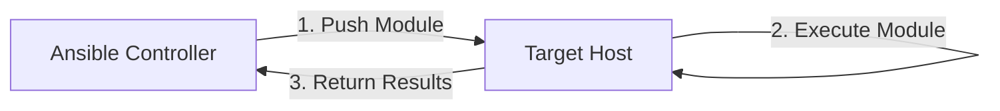

# Ansible Custom Modules

## Introduction

Ansible is a powerful automation tool that uses modules to perform specific tasks on remote systems. While Ansible comes with hundreds of built-in modules, you might encounter situations where these don't quite meet your needs. This is where custom modules come in - they allow you to extend Ansible's functionality by writing your own modules tailored to your specific requirements.

In this guide, we'll explore how to create, test, and implement custom Ansible modules. By the end, you'll have the knowledge to extend Ansible's capabilities to fit your unique automation needs.

## What Are Ansible Modules?

Before diving into custom modules, let's understand what Ansible modules are:

- **Modules** are reusable, standalone scripts that Ansible executes on target hosts
- They're the building blocks of Ansible playbooks
- Each module performs a specific task (e.g., managing files, users, packages, services)
- Modules accept parameters and return JSON data

When you run an Ansible playbook, it connects to your target hosts and pushes small programs called *modules* to them. These modules execute and return information back to the Ansible controller.



## Why Create Custom Modules?

You might want to create custom modules when:

1. You need to integrate with specific software not covered by existing modules
2. You have complex logic that would be difficult to implement with existing modules
3. You want to simplify playbooks by encapsulating repetitive tasks
4. You need to interact with APIs or services that aren't supported out-of-the-box

## Prerequisites

To follow along with this guide, you'll need:

- Basic understanding of Ansible concepts (playbooks, tasks, roles)
- Python programming knowledge (modules are written in Python)
- Ansible installed on your system
- A text editor or IDE

## Creating Your First Custom Module

Let's create a simple custom module that checks if a specified process is running on the target host.

### Step 1: Set Up the Development Environment

First, you'll need to determine where to place your custom modules. You have several options:

1. In a specific project directory structure:
```
your_ansible_project/
├── library/            # Place custom modules here
├── playbooks/
└── inventory
```

2. In a dedicated role:
```
your_ansible_project/
├── roles/
│   └── custom_modules/
│       └── library/    # Place custom modules here
```

3. In Ansible's global module path (not recommended for development)

For this tutorial, we'll use the first approach.

### Step 2: Create the Module File

Create a file named `check_process.py` in your `library/` directory:

```python
#!/usr/bin/python

ANSIBLE_METADATA = {
    'metadata_version': '1.1',
    'status': ['preview'],
    'supported_by': 'community'
}

DOCUMENTATION = '''
---
module: check_process
short_description: Check if a process is running
description:
    - This module checks if a specified process is running on the target host.
options:
    name:
        description:
            - Name of the process to check
        required: true
        type: str
author:
    - Your Name (@yourgithub)
'''

EXAMPLES = '''
# Check if nginx is running
- name: Check nginx process
  check_process:
    name: nginx

# Check if apache2 is running and register the result
- name: Check apache2 process
  check_process:
    name: apache2
  register: apache_status
'''

RETURN = '''
running:
    description: Whether the process is running
    type: bool
    returned: always
pid:
    description: Process ID if running, otherwise null
    type: int
    returned: always
'''

from ansible.module_utils.basic import AnsibleModule
import subprocess

def run_module():
    # Define the module's parameters
    module_args = {
        'name': {'type': 'str', 'required': True}
    }

    # Create the module object
    module = AnsibleModule(
        argument_spec=module_args,
        supports_check_mode=True
    )

    # Extract parameters
    process_name = module.params['name']
    
    # Initialize result dictionary
    result = {
        'changed': False,
        'running': False,
        'pid': None
    }

    # Check if we're in check mode
    if module.check_mode:
        module.exit_json(**result)

    # Run the ps command to find the process
    try:
        ps_output = subprocess.check_output(
            ['ps', '-ef'], 
            universal_newlines=True
        )
        
        # Look for the process in the output
        for line in ps_output.split('
'):
            if process_name in line and 'grep' not in line:
                # Process is running
                result['running'] = True
                # Extract PID (second column in ps output)
                pid = int(line.split()[1])
                result['pid'] = pid
                break
                
        # Return the result
        module.exit_json(**result)
        
    except subprocess.CalledProcessError as e:
        module.fail_json(msg='Error checking process status', error=str(e), **result)

def main():
    run_module()

if __name__ == '__main__':
    main()
```

### Step 3: Using Your Custom Module in a Playbook

Now, let's create a simple playbook to use our custom module:

```yaml
---
- name: Test custom process check module
  hosts: webservers
  gather_facts: no
  
  tasks:
    - name: Check if nginx is running
      check_process:
        name: nginx
      register: nginx_status
      
    - name: Display result
      debug:
        msg: "Nginx is {{ 'running' if nginx_status.running else 'not running' }} with PID {{ nginx_status.pid }}"
```

### Step 4: Testing the Module

You can test your module without running it against actual hosts using Ansible's `ansible-test` command or manually with:

```bash
python -m ansible.modules.check_process name=nginx
```

For more thorough testing, you can also create a test environment with Docker or virtual machines.

## Understanding Module Structure

Let's break down the key components of our custom module:

### 1. Module Metadata

```python
ANSIBLE_METADATA = {
    'metadata_version': '1.1',
    'status': ['preview'],
    'supported_by': 'community'
}
```

This provides information about the module's maturity and support level.

### 2. Documentation

```python
DOCUMENTATION = '''
---
module: check_process
short_description: Check if a process is running
# ...rest of documentation...
'''
```

The documentation section is crucial - it helps users understand how to use your module. It should include:
- Module name and description
- All available parameters with their descriptions
- Required parameters
- Author information

### 3. Examples

```python
EXAMPLES = '''
# Check if nginx is running
- name: Check nginx process
  check_process:
    name: nginx
# ...more examples...
'''
```

Providing clear examples helps users understand how to implement your module in their playbooks.

### 4. Return Values

```python
RETURN = '''
running:
    description: Whether the process is running
    type: bool
    returned: always
# ...more return values...
'''
```

This section documents what values your module will return, helping users understand what to expect and how to use the returned data.

### 5. The Module Logic

The core functionality lives in the `run_module()` function:

1. Define parameters the module accepts
2. Create an AnsibleModule object
3. Perform the actual work
4. Return results

The key components to understand are:

- **AnsibleModule**: The main class that handles parameter validation, check mode, and more
- **Result dictionary**: Contains information about what the module did, including the `changed` flag
- **Exit functions**: `module.exit_json()` for success and `module.fail_json()` for failures

## Advanced Custom Module Techniques

Now that we understand the basics, let's explore some more advanced techniques:

### Complex Parameter Validation

For modules with many parameters or complex validation requirements, you can use more advanced parameter specifications:

```python
module_args = {
    'name': {'type': 'str', 'required': True},
    'state': {
        'type': 'str', 
        'required': False,
        'default': 'present',
        'choices': ['present', 'absent']
    },
    'timeout': {'type': 'int', 'required': False, 'default': 30},
    'env_vars': {'type': 'dict', 'required': False}
}
```

### Handling Check Mode

Check mode (--check flag) allows Ansible to simulate changes without actually making them. Proper handling ensures your module works correctly with this feature:

```python
if module.check_mode:
    # Predict what would happen but don't make changes
    result['changed'] = would_change()
    module.exit_json(**result)

# Normal mode code continues here...
```

### Implementing Idempotency

A well-designed Ansible module should be idempotent - running it multiple times should result in the same system state:

```python
# Check current state
current_state = get_current_state()

# Compare with desired state
if current_state != desired_state:
    # Make changes
    make_changes()
    result['changed'] = True
else:
    # No changes needed
    result['changed'] = False
```

### Using Module Utilities

Ansible provides helpful utilities to simplify common tasks:

```python
from ansible.module_utils.basic import AnsibleModule
from ansible.module_utils.common.dict_transformations import camel_dict_to_snake_dict
from ansible.module_utils.urls import fetch_url
```

These utilities can help with tasks like:
- API requests
- File operations
- Parameter handling
- JSON processing

## Real-World Example: Custom API Module

Let's create a more practical module that interacts with a REST API. This module will create, update, or delete resources in a hypothetical service:

```python
#!/usr/bin/python

ANSIBLE_METADATA = {
    'metadata_version': '1.1',
    'status': ['preview'],
    'supported_by': 'community'
}

DOCUMENTATION = '''
---
module: custom_api
short_description: Manage resources in our API service
description:
    - Create, update or delete resources in our custom API service
options:
    endpoint:
        description:
            - API endpoint URL
        required: true
        type: str
    api_key:
        description:
            - Authentication API key
        required: true
        type: str
    resource_id:
        description:
            - ID of the resource to manage
        required: false
        type: str
    state:
        description:
            - Desired state of the resource
        choices: ['present', 'absent']
        default: present
        type: str
    data:
        description:
            - Resource data (for creation or update)
        required: false
        type: dict
author:
    - Your Name (@yourgithub)
'''

EXAMPLES = '''
# Create a new resource
- name: Create API resource
  custom_api:
    endpoint: "https://api.example.com/v1/resources"
    api_key: "{{ api_key }}"
    state: present
    data:
      name: "Test Resource"
      type: "test"
      properties:
        color: blue
        size: medium
  register: result

# Update an existing resource
- name: Update API resource
  custom_api:
    endpoint: "https://api.example.com/v1/resources"
    api_key: "{{ api_key }}"
    resource_id: "12345"
    state: present
    data:
      name: "Updated Resource"
      properties:
        color: red
  register: result

# Delete a resource
- name: Delete API resource
  custom_api:
    endpoint: "https://api.example.com/v1/resources"
    api_key: "{{ api_key }}"
    resource_id: "12345"
    state: absent
'''

RETURN = '''
resource:
    description: The resource details
    type: dict
    returned: when state=present
status_code:
    description: HTTP status code from the request
    type: int
    returned: always
changed:
    description: Whether the resource was changed
    type: bool
    returned: always
'''

from ansible.module_utils.basic import AnsibleModule
from ansible.module_utils.urls import fetch_url
import json

def run_module():
    module_args = {
        'endpoint': {'type': 'str', 'required': True},
        'api_key': {'type': 'str', 'required': True, 'no_log': True},
        'resource_id': {'type': 'str', 'required': False},
        'state': {
            'type': 'str',
            'default': 'present',
            'choices': ['present', 'absent']
        },
        'data': {'type': 'dict', 'required': False, 'default': {}}
    }

    result = {
        'changed': False,
        'status_code': None
    }

    module = AnsibleModule(
        argument_spec=module_args,
        supports_check_mode=True
    )

    endpoint = module.params['endpoint']
    api_key = module.params['api_key']
    resource_id = module.params['resource_id']
    state = module.params['state']
    data = module.params['data']

    # Prepare headers
    headers = {
        'Content-Type': 'application/json',
        'Authorization': f'Bearer {api_key}'
    }

    # Check if resource exists for update/delete operations
    if resource_id:
        resource_url = f"{endpoint}/{resource_id}"
        response, info = fetch_url(
            module, 
            resource_url,
            headers=headers,
            method='GET'
        )
        
        result['status_code'] = info['status']
        resource_exists = info['status'] == 200
        
        # If running in check mode, predict the result
        if module.check_mode:
            if state == 'present' and not resource_exists:
                result['changed'] = True
            elif state == 'present' and resource_exists:
                # Would update - assume it would change
                result['changed'] = True
            elif state == 'absent' and resource_exists:
                result['changed'] = True
            module.exit_json(**result)
        
        # Actual execution
        if state == 'absent' and resource_exists:
            # Delete the resource
            response, info = fetch_url(
                module,
                resource_url,
                headers=headers,
                method='DELETE'
            )
            result['status_code'] = info['status']
            if info['status'] in [200, 202, 204]:
                result['changed'] = True
            else:
                module.fail_json(
                    msg=f"Failed to delete resource: {info['msg']}",
                    **result
                )
                
        elif state == 'present' and resource_exists:
            # Update existing resource
            response, info = fetch_url(
                module,
                resource_url,
                data=json.dumps(data),
                headers=headers,
                method='PUT'
            )
            result['status_code'] = info['status']
            
            if info['status'] in [200, 201]:
                content = response.read()
                result['resource'] = json.loads(content.decode('utf-8'))
                result['changed'] = True
            else:
                module.fail_json(
                    msg=f"Failed to update resource: {info['msg']}",
                    **result
                )
    
    # Create new resource
    elif state == 'present':
        # Skip actual creation in check mode
        if module.check_mode:
            result['changed'] = True
            module.exit_json(**result)
            
        # Create the resource
        response, info = fetch_url(
            module,
            endpoint,
            data=json.dumps(data),
            headers=headers,
            method='POST'
        )
        result['status_code'] = info['status']
        
        if info['status'] in [200, 201]:
            content = response.read()
            result['resource'] = json.loads(content.decode('utf-8'))
            result['changed'] = True
        else:
            module.fail_json(
                msg=f"Failed to create resource: {info['msg']}",
                **result
            )
    
    # Return results
    module.exit_json(**result)

def main():
    run_module()

if __name__ == '__main__':
    main()
```

### Using the API Module in a Playbook

```yaml
---
- name: Manage API Resources
  hosts: localhost
  gather_facts: no
  vars:
    api_key: "your-secure-api-key"
    
  tasks:
    - name: Create a new resource
      custom_api:
        endpoint: "https://api.example.com/v1/resources"
        api_key: "{{ api_key }}"
        state: present
        data:
          name: "Production Server"
          type: "server"
          properties:
            region: "us-west-2"
            tier: "premium"
      register: new_resource
      
    - name: Show created resource
      debug:
        var: new_resource.resource
        
    - name: Update the resource
      custom_api:
        endpoint: "https://api.example.com/v1/resources"
        api_key: "{{ api_key }}"
        resource_id: "{{ new_resource.resource.id }}"
        state: present
        data:
          properties:
            tier: "standard"
      register: updated_resource
```

## Best Practices for Custom Modules

To ensure your modules are robust, maintainable, and user-friendly:

### 1. Follow Ansible Module Conventions

- Use consistent parameter naming
- Follow Python PEP 8 style guidelines
- Include comprehensive documentation
- Provide meaningful examples

### 2. Handle Errors Gracefully

```python
try:
    # Attempt some operation
    result = do_something_risky()
except Exception as e:
    module.fail_json(
        msg="Operation failed", 
        error=str(e),
        **result
    )
```

### 3. Ensure Idempotency

- Check current state before making changes
- Only report `changed=True` when actual changes occur
- Make your module repeatable without side effects

### 4. Support Check Mode

Always implement check mode support to allow users to test playbooks safely:

```python
if module.check_mode:
    result['changed'] = would_change()
    module.exit_json(**result)
```

### 5. Secure Sensitive Data

- Use `no_log: True` for sensitive parameters:

```python
module_args = {
    'password': {'type': 'str', 'required': True, 'no_log': True}
}
```

### 6. Return Useful Information

- Return data that helps users understand what happened
- Include status information, IDs, and other relevant details
- Maintain consistency in return values

## Distributing Custom Modules

Once you've created useful custom modules, you might want to share them with your team or the community:

### 1. Within Your Organization

- Create a dedicated Ansible role containing your modules
- Use git repositories to version control your modules
- Document usage with examples

### 2. As an Ansible Collection

For more formal distribution, consider creating an Ansible Collection:

```
collection/
├── docs/
├── galaxy.yml
├── plugins/
│   └── modules/
│       ├── check_process.py
│       └── custom_api.py
├── README.md
└── roles/
```

Build and distribute with:

```bash
ansible-galaxy collection build
ansible-galaxy collection publish ./my_namespace-my_collection-1.0.0.tar.gz
```

## Debugging Custom Modules

When developing modules, debugging is crucial. Here are some techniques:

### 1. Enable Ansible Debug Mode

```bash
ANSIBLE_DEBUG=1 ansible-playbook -v your_playbook.yml
```

### 2. Add Debug Output

```python
import json

# Debug information
debug_info = {
    'params': module.params,
    'current_state': current_state
}

# Write to a file
with open('/tmp/ansible_debug.json', 'w') as f:
    f.write(json.dumps(debug_info, indent=4))
```

### 3. Using Python Debugger

For local testing, you can add breakpoints:

```python
import pdb

def run_module():
    # ... code ...
    pdb.set_trace()  # This will start the debugger
    # ... more code ...
```

## Summary

Creating custom Ansible modules allows you to extend Ansible's capabilities to suit your specific needs. By following best practices and understanding the module structure, you can create robust, reusable automation components.

In this guide, we've covered:
- The basics of Ansible modules
- How to create a simple custom module
- Advanced techniques for parameter handling and API interactions
- Best practices for module development
- Debugging and distribution methods

## Next Steps

Now that you understand how to create custom Ansible modules, consider these next steps:

1. **Practice**: Convert some of your complex playbook tasks into custom modules
2. **Explore**: Study the source code of existing Ansible modules for inspiration
3. **Contribute**: Share your modules with the Ansible community
4. **Integrate**: Combine your modules with roles and collections for complete solutions

## Exercises

1. Create a custom module that checks if a specific file contains a pattern and optionally replaces it
2. Develop a module that interacts with a database (MySQL, PostgreSQL, etc.)
3. Build a module that integrates with a cloud service not covered by existing modules
4. Enhance the API module from this guide to handle pagination and error retries

## Additional Resources

- [Ansible Module Development Documentation](https://docs.ansible.com/ansible/latest/dev_guide/developing_modules_general.html)
- [Ansible Module Architecture](https://docs.ansible.com/ansible/latest/dev_guide/developing_program_flow_modules.html)
- [Python API for Module Development](https://docs.ansible.com/ansible/latest/dev_guide/developing_api.html)
- [Ansible Collections Documentation](https://docs.ansible.com/ansible/latest/dev_guide/developing_collections.html)