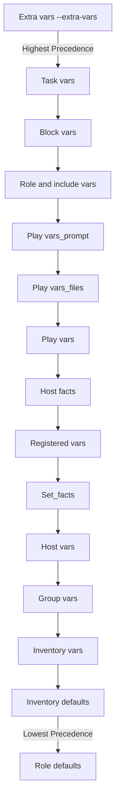

# Ansible Variable Types

## Introduction

Variables in Ansible provide a way to deal with differences between systems when automating infrastructure. They allow you to store values that can vary from host to host, playbook to playbook, or even from one playbook run to another.

Understanding the different types of variables in Ansible and how they work is crucial for creating efficient, reusable automation. In this guide, we'll explore the various variable types in Ansible, how to define them, and when to use each type.

## Basic Variable Types

Ansible supports several basic data types for variables:

- **Strings**: Text values
- **Numbers**: Integers and floats
- **Booleans**: True/false values
- **Lists**: Ordered collections of items
- **Dictionaries**: Key-value pairs
- **Null**: Undefined values (represented as `null` or `~`)

Let's look at some examples of how to define these variable types in Ansible:

```yaml
# String variable
app_name: "My Application"

# Number variables
max_connections: 100
timeout_seconds: 30.5

# Boolean variables
debug_mode: true
enable_feature: false

# List variable
web_servers:
  - server1.example.com
  - server2.example.com
  - server3.example.com

# Dictionary variable
database_config:
  host: db.example.com
  port: 5432
  username: admin
  password: secret123

# Null value
optional_setting: null
```

## Variable Scope and Precedence

Variables in Ansible have different scopes, determining where they can be used and their precedence when variables with the same name exist in multiple places.

### Variable Scope Types

1. **Global Scope**: Variables defined in command line or configuration files
2. **Play Scope**: Variables defined at the play level
3. **Host Scope**: Variables defined for specific hosts
4. **Task Scope**: Variables defined for a specific task

Here's a diagram showing the variable precedence in Ansible:



## Where to Define Variables

Ansible offers multiple locations to define variables:

### 1. In Inventory Files

You can define variables directly in inventory files:

```ini
# Simple inventory with variables
web1.example.com ansible_user=admin http_port=80
web2.example.com http_port=8080

[webservers]
web1.example.com
web2.example.com

[webservers:vars]
ntp_server=ntp.example.com
proxy=proxy.example.com
```

### 2. In Group/Host Variable Files

Group variables can be defined in separate files:

```
/etc/ansible/
├── inventory
├── group_vars/
│   ├── all.yml           # Variables for all hosts
│   ├── webservers.yml    # Variables for webservers group
│   └── dbservers.yml     # Variables for dbservers group
└── host_vars/
    ├── web1.example.com.yml  # Variables specific to web1
    └── db1.example.com.yml   # Variables specific to db1
```

Example content of `group_vars/webservers.yml`:

```yaml
---
http_port: 80
max_clients: 200
app_environment: production
```

### 3. In Playbooks

Variables can be defined directly in playbooks:

```yaml
---
- hosts: webservers
  vars:
    http_port: 80
    max_clients: 200
  vars_files:
    - /vars/external_vars.yml
  
  tasks:
    - name: Configure web server
      template:
        src: templates/httpd.conf.j2
        dest: /etc/httpd/conf/httpd.conf
      vars:
        max_clients: 300  # Task-level variable overrides play-level
```

### 4. In Roles

Role variables are defined in the role's directory structure:

```
roles/
└── webserver/
    ├── defaults/       # Default variables (lowest precedence)
    │   └── main.yml
    ├── vars/           # Role variables (higher precedence)
    │   └── main.yml
    ├── tasks/
    ├── handlers/
    ├── templates/
    └── files/
```

Example content of `roles/webserver/defaults/main.yml`:

```yaml
---
http_port: 80
max_clients: 200
```

## Special Variable Types

### 1. Registered Variables

Registered variables capture the output of a task for later use:

```yaml
- name: Get server uptime
  command: uptime
  register: system_uptime

- name: Display uptime
  debug:
    msg: "System uptime: {{ system_uptime.stdout }}"
```

Output:
```
TASK [Display uptime] *********************************************************
ok: [web1.example.com] => {
    "msg": "System uptime: 14:32:18 up 7 days, 2:12, 1 user, load average: 0.05, 0.03, 0.01"
}
```

### 2. Facts

Facts are variables that are automatically discovered by Ansible from the managed hosts:

```yaml
- name: Display system facts
  debug:
    msg: "OS: {{ ansible_distribution }} {{ ansible_distribution_version }}, IP: {{ ansible_default_ipv4.address }}"
```

Output:
```
TASK [Display system facts] ***************************************************
ok: [web1.example.com] => {
    "msg": "OS: Ubuntu 20.04, IP: 192.168.1.10"
}
```

### 3. Magic Variables

Ansible provides special variables that provide information about the playbook run:

```yaml
- name: Show inventory information
  debug:
    msg: >
      Host: {{ inventory_hostname }},
      Group: {{ group_names | join(', ') }},
      Play: {{ ansible_play_name }}
```

Output:
```
TASK [Show inventory information] *********************************************
ok: [web1.example.com] => {
    "msg": "Host: web1.example.com, Group: webservers, production, Play: Configure webservers"
}
```

## Working with Variable Types

### Using String Variables

Strings in Ansible can be defined with or without quotes. However, it's a good practice to quote strings, especially when they contain special characters:

```yaml
# Variable definitions
app_name: "My Web App"
version: "2.1.3"
server_message: "Welcome to {{ app_name }} version {{ version }}"

# Using the variables
- name: Create welcome file
  copy:
    content: "{{ server_message }}"
    dest: /var/www/html/welcome.txt
```

### Using List Variables

Lists can be defined and accessed in multiple ways:

```yaml
# Defining lists
web_servers:
  - server1.example.com
  - server2.example.com
  - server3.example.com

# Alternative syntax
web_servers: ['server1.example.com', 'server2.example.com', 'server3.example.com']

# Accessing list items
- name: Configure first server
  debug:
    msg: "First server: {{ web_servers[0] }}"
```

Output:
```
TASK [Configure first server] *************************************************
ok: [localhost] => {
    "msg": "First server: server1.example.com"
}
```

### Using Dictionary Variables

Dictionaries (or maps) provide key-value storage:

```yaml
# Defining dictionaries
database:
  host: db.example.com
  port: 5432
  name: myapp
  credentials:
    username: admin
    password: secret123

# Accessing dictionary values
- name: Configure database connection
  template:
    src: db_config.j2
    dest: /etc/myapp/database.conf
  vars:
    db_host: "{{ database.host }}"
    db_port: "{{ database.port }}"
    db_user: "{{ database.credentials.username }}"
```

### Using Boolean Variables

Booleans in Ansible can be represented in multiple ways:

```yaml
# Different ways to define true
feature_enabled: true
debug_mode: yes
logging: on

# Different ways to define false
maintenance_mode: false
notifications: no
auto_update: off

# Using boolean variables in conditionals
- name: Start service if feature is enabled
  service:
    name: myapp
    state: started
  when: feature_enabled
```

## Variable Transformations and Filters

Ansible provides filters to transform variables:

### String Manipulation

```yaml
username: "John Smith"

- name: Display transformed username
  debug:
    msg:
      - "Lowercase: {{ username | lower }}"
      - "Uppercase: {{ username | upper }}"
      - "Replace spaces: {{ username | replace(' ', '_') }}"
```

Output:
```
TASK [Display transformed username] *******************************************
ok: [localhost] => {
    "msg": [
        "Lowercase: john smith",
        "Uppercase: JOHN SMITH",
        "Replace spaces: John_Smith"
    ]
}
```

### List Operations

```yaml
servers: ['web1', 'web2', 'db1', 'web3']

- name: Filter web servers
  debug:
    msg: "Web servers: {{ servers | select('match', '^web') | list | join(', ') }}"
```

Output:
```
TASK [Filter web servers] *****************************************************
ok: [localhost] => {
    "msg": "Web servers: web1, web2, web3"
}
```

## Best Practices for Variable Management

1. **Use descriptive variable names**:
   Choose clear, meaningful names that indicate the purpose of the variable.

2. **Organize variables by scope**:
   Place variables in the appropriate files based on their scope (all hosts, specific groups, or individual hosts).

3. **Document your variables**:
   Add comments to explain the purpose and expected values of variables.

4. **Use defaults for role variables**:
   Define default values for role variables to make roles more portable.

5. **Avoid hardcoding sensitive information**:
   Use Ansible Vault for passwords and other sensitive data.

6. **Be consistent with variable naming conventions**:
   Choose a naming style (e.g., snake_case) and stick to it.

## Practical Example: Configuring a Web Application

Let's look at a practical example that uses different variable types to configure a web application:

```yaml
---
# group_vars/webservers.yml
web_app:
  name: "My Web Application"
  version: "1.2.3"
  environment: "production"
  debug: false
  allowed_ips:
    - 192.168.1.0/24
    - 10.0.0.0/8
  database:
    host: db.example.com
    port: 5432
    name: webapp_db
    user: webapp_user
    password: !vault |
      $ANSIBLE_VAULT;1.1;AES256
      3132646538666...encrypted_data...

# playbook.yml
---
- name: Configure Web Application
  hosts: webservers
  become: true
  
  tasks:
    - name: Ensure web server is installed
      package:
        name: nginx
        state: present
    
    - name: Generate application configuration
      template:
        src: templates/app_config.j2
        dest: /etc/webapp/config.yml
      vars:
        app_port: 8080
        max_connections: 1000
```

And the corresponding template file:

```jinja
# templates/app_config.j2
---
# Configuration for {{ web_app.name }} v{{ web_app.version }}
# Environment: {{ web_app.environment }}

server:
  port: {{ app_port }}
  max_connections: {{ max_connections }}
  debug_mode: {{ web_app.debug }}

allowed_networks:

  - {{ network }}


database:
  host: {{ web_app.database.host }}
  port: {{ web_app.database.port }}
  name: {{ web_app.database.name }}
  user: {{ web_app.database.user }}
```

## Summary

In this guide, we've explored the different variable types in Ansible:

- Basic types: strings, numbers, booleans, lists, dictionaries, and null values
- Variable scopes and precedence
- Different places to define variables (inventory, group/host vars, playbooks, roles)
- Special variables: registered variables, facts, and magic variables
- Variable transformations using filters
- Best practices for variable management

Understanding these variable types and how to use them effectively will help you create more flexible, maintainable Ansible playbooks and roles.

## Additional Resources

- [Ansible Variables Documentation](https://docs.ansible.com/ansible/latest/user_guide/playbooks_variables.html)
- [Ansible Variable Precedence](https://docs.ansible.com/ansible/latest/user_guide/playbooks_variables.html#variable-precedence-where-should-i-put-a-variable)
- [Ansible Facts](https://docs.ansible.com/ansible/latest/user_guide/playbooks_vars_facts.html)
- [Jinja2 Filters](https://docs.ansible.com/ansible/latest/user_guide/playbooks_filters.html)

## Exercises

1. Create a playbook that uses a combination of string, list, and dictionary variables to configure a service.
2. Define variables at different levels (inventory, group vars, and playbook) and observe the precedence.
3. Create a role with default variables and override them from a playbook.
4. Use registered variables to capture command output and make decisions based on the results.
5. Use Ansible facts to customize configurations based on the target system's attributes.