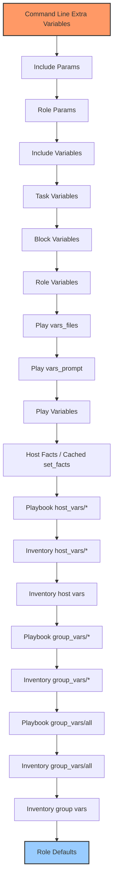

# Ansible Variable Precedence

## Introduction

When working with Ansible, variables can be defined in multiple places. But what happens when the same variable is defined in different locations with different values? Which value does Ansible actually use?

This is where **variable precedence** comes into play. Variable precedence is the hierarchy that determines which variable definition takes priority when the same variable is defined in multiple places.

Understanding this hierarchy is crucial for debugging and writing predictable Ansible playbooks. In this guide, we'll explore the order of precedence for variables in Ansible and provide practical examples to clarify this concept.

## The Variable Precedence Hierarchy

Ansible evaluates variables in a specific order, with later sources overriding earlier ones. Here's the complete precedence hierarchy from lowest (first to be overridden) to highest (last to be overridden):

1. Command line values (for example, `-e "user=john"`)
2. Role defaults (defined in `role/defaults/main.yml`)
3. Inventory file or script group vars
4. Inventory group_vars/all
5. Playbook group_vars/all
6. Inventory group_vars/*
7. Playbook group_vars/*
8. Inventory file or script host vars
9. Inventory host_vars/*
10. Playbook host_vars/*
11. Host facts / cached set_facts
12. Play vars
13. Play vars_prompt
14. Play vars_files
15. Role vars (defined in `role/vars/main.yml`)
16. Block vars (only for tasks in block)
17. Task vars (only for the task)
18. Include variables
19. Role (and include_role) params
20. Include params
21. Extra vars (always win precedence)

Let's break this down with examples to better understand how this works in practice.

## Basic Variable Precedence Examples

### Example 1: Role Defaults vs. Inventory Variables

Role defaults are designed to be overridden, and they have one of the lowest precedences in the hierarchy.

```yaml
# roles/webserver/defaults/main.yml
http_port: 80
max_clients: 200
```

If you define the same variable in your inventory:

```yaml
# inventory/group_vars/webservers.yml
http_port: 8080
```

When you run a playbook that uses the `webserver` role for hosts in the `webservers` group, the `http_port` value will be `8080` because inventory group variables have higher precedence than role defaults.

### Example 2: Playbook Variables vs. Extra Variables

Let's say you have a playbook with a defined variable:

```yaml
# deploy_app.yml
---
- hosts: webservers
  vars:
    app_version: 1.0.2
  tasks:
    - name: Display app version
      debug:
        msg: "Deploying application version {{ app_version }}"
```

If you run this playbook with an extra variable:

```bash
ansible-playbook deploy_app.yml -e "app_version=1.0.3"
```

The output would show:

```
TASK [Display app version] *******************************************
ok: [web01] => {
    "msg": "Deploying application version 1.0.3"
}
```

The `-e` command line extra variables will always override any other variable definitions because they have the highest precedence.

## Visualizing Variable Precedence

To better understand the hierarchy, let's visualize it:



In this diagram, variables defined at the top will override variables defined at the bottom when they share the same name.

## Real-World Applications

Let's explore some practical scenarios where understanding variable precedence is important.

### Environment-Specific Configuration

One common use case is to have different configurations for different environments (development, staging, production).

```yaml
# roles/app/defaults/main.yml (lowest precedence)
db_host: localhost
db_user: app
db_password: default_password
```

```yaml
# group_vars/production.yml (higher precedence)
db_host: prod-db.example.com
db_password: "{{ vault_db_password }}"  # Using Ansible Vault for sensitive data
```

```yaml
# host_vars/specific-server.yml (even higher precedence)
db_host: dedicated-db.example.com
```

With this setup:
- Most servers use the defaults
- Production servers use the production database
- One specific server uses a dedicated database

### Overriding Role Behavior

Another common pattern is to create flexible roles with sensible defaults that can be overridden as needed:

```yaml
# roles/nginx/defaults/main.yml
nginx_worker_processes: auto
nginx_worker_connections: 1024
nginx_keepalive_timeout: 65
```

You can then override these values at different levels:

```yaml
# group_vars/high_traffic_servers.yml
nginx_worker_processes: 8
nginx_worker_connections: 4096
```

And for special cases, use command-line overrides:

```bash
ansible-playbook deploy.yml -e "nginx_keepalive_timeout=30"
```

## Practical Example: Complete Deployment Scenario

Let's walk through a complete example that demonstrates variable precedence in action.

### Directory Structure

```
project/
├── ansible.cfg
├── inventory/
│   ├── hosts
│   ├── group_vars/
│   │   ├── all.yml
│   │   └── webservers.yml
│   └── host_vars/
│       └── web01.yml
├── roles/
│   └── webapp/
│       ├── defaults/
│       │   └── main.yml
│       └── vars/
│           └── main.yml
└── deploy.yml
```

### File Contents

```yaml
# roles/webapp/defaults/main.yml
app_port: 8000
app_workers: 4
app_debug: false
app_version: 1.0.0
```

```yaml
# roles/webapp/vars/main.yml
app_service_name: webapp
app_config_path: /etc/webapp
```

```yaml
# inventory/group_vars/all.yml
app_debug: true  # Enable debug in development
```

```yaml
# inventory/group_vars/webservers.yml
app_port: 8080
app_workers: 8
```

```yaml
# inventory/host_vars/web01.yml
app_port: 9000  # Special port for this server
```

```yaml
# deploy.yml
---
- hosts: webservers
  vars:
    app_version: 1.1.0
  roles:
    - webapp
  tasks:
    - name: Display application configuration
      debug:
        msg: |
          Application Configuration:
          - Port: {{ app_port }}
          - Workers: {{ app_workers }}
          - Debug: {{ app_debug }}
          - Version: {{ app_version }}
          - Service: {{ app_service_name }}
          - Config Path: {{ app_config_path }}
```

### Execution and Results

When you run the playbook for `web01`:

```bash
ansible-playbook deploy.yml -l web01
```

The output would be:

```
TASK [Display application configuration] *******************************************
ok: [web01] => {
    "msg": "Application Configuration:
- Port: 9000
- Workers: 8
- Debug: true
- Version: 1.1.0
- Service: webapp
- Config Path: /etc/webapp"
}
```

Let's analyze why each variable has this value:

- `app_port: 9000` - From host_vars/web01.yml (host-specific override)
- `app_workers: 8` - From group_vars/webservers.yml (group override)
- `app_debug: true` - From group_vars/all.yml (overrides role default)
- `app_version: 1.1.0` - From the playbook vars (overrides role default)
- `app_service_name: webapp` - From role/vars/main.yml (no overrides)
- `app_config_path: /etc/webapp` - From role/vars/main.yml (no overrides)

If you run the same playbook with an extra variable:

```bash
ansible-playbook deploy.yml -l web01 -e "app_debug=false"
```

The `app_debug` would be `false` because extra vars have the highest precedence.

## Using `ansible_facts` and Registered Variables

Ansible facts and registered variables also fit into the precedence hierarchy. Facts gathered about hosts are available as variables and typically override role defaults but can be overridden by more specific variable definitions.

```yaml
---
- hosts: webservers
  tasks:
    - name: Get application status
      command: /usr/bin/app_status
      register: app_status
      changed_when: false

    - name: Display status
      debug:
        msg: "Application status: {{ app_status.stdout }}"
      
    - name: Use ansible_facts
      debug:
        msg: "OS: {{ ansible_facts['distribution'] }} {{ ansible_facts['distribution_version'] }}"
```

Registered variables like `app_status` are available within the play but won't override extra vars if they exist with the same name.

## Best Practices for Variable Management

To avoid confusion with variable precedence:

1. **Be consistent with variable definitions**: Try to define variables in the same place for similar purposes.

2. **Use descriptive variable names**: Prefix variables with the role or function name to avoid collisions.

3. **Document your variables**: Add comments to explain what variables are used for and where they might be overridden.

4. **Use `vars_files` for complex variable structures**: Keep your playbooks clean by storing complex variables in separate files.

5. **Debug variable values when needed**:
   ```yaml
   - name: Debug all variables
     debug:
       var: vars
       verbosity: 2
   ```

6. **Use the `vars` lookup for introspection**:
   ```yaml
   - name: Check specific variable
     debug:
       msg: "{{ lookup('vars', 'app_port') }}"
   ```

## Summary

Understanding Ansible's variable precedence is essential for creating flexible, maintainable automation. The key points to remember:

- Variables can be defined in multiple locations
- Later sources in the precedence hierarchy override earlier ones
- Extra vars (command line `-e`) always have the highest precedence
- Role defaults have the lowest precedence and are meant to be overridden
- Host-specific variables override group variables
- Play variables override inventory variables

By strategically placing your variable definitions according to this hierarchy, you can create playbooks that are both flexible and predictable.

## Additional Resources

- [Ansible Documentation on Variable Precedence](https://docs.ansible.com/ansible/latest/user_guide/playbooks_variables.html#variable-precedence-where-should-i-put-a-variable)
- [Ansible Best Practices](https://docs.ansible.com/ansible/latest/user_guide/playbooks_best_practices.html)

## Exercises

1. Create a role with default variables and override them at different levels (group_vars, host_vars, play vars, and extra vars).
2. Write a playbook that displays the effective value of variables defined at different precedence levels.
3. Use `ansible -m debug -a "var=hostvars[inventory_hostname]"` to explore all variables defined for a host.
4. Create a playbook that uses conditional logic based on variables that might be defined at different precedence levels.