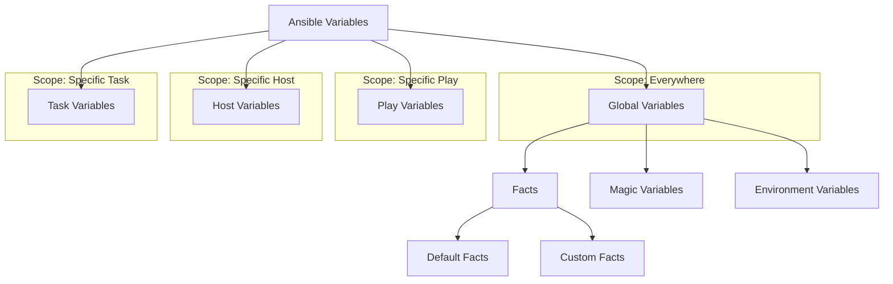

# Ansible Global Variables

## Introduction

Ansible global variables are predefined variables that are automatically available in all Ansible playbooks and roles without requiring explicit declaration. These variables provide essential information about the managed hosts, the control node, and the Ansible runtime environment. Understanding global variables is crucial for creating dynamic, adaptable playbooks that can respond to different environments and conditions.

In this tutorial, we'll explore Ansible's global variables (also known as "facts" and "magic variables"), learn how to access them, and discover practical applications for making your automation more powerful and flexible.

## Types of Ansible Global Variables

Ansible provides several categories of global variables:

1. **Facts** - Information gathered about managed hosts
2. **Magic Variables** - Special variables set by Ansible 
3. **Connection Variables** - Variables related to the connection to managed hosts
4. **Environment Variables** - Variables from the control node's environment

Let's explore each type in detail.

## Ansible Facts

Facts are variables containing information about the managed hosts that Ansible automatically collects during playbook execution.

### How Facts Are Collected

By default, Ansible runs the `setup` module at the beginning of each play to gather facts about the hosts. This process is called "fact gathering."

```yaml
- name: Example Playbook with Fact Gathering
  hosts: all
  gather_facts: yes  # This is the default; facts will be collected
  
  tasks:
    - name: Print operating system
      debug:
        msg: "The OS is {{ ansible_distribution }} {{ ansible_distribution_version }}"
```

You can disable fact gathering for performance reasons if you don't need facts:

```yaml
- name: Example Playbook without Fact Gathering
  hosts: all
  gather_facts: no  # Facts will not be collected
  
  tasks:
    - name: A task that doesn't need facts
      debug:
        msg: "Running a task without facts"
```

### Common Ansible Facts

Here are some commonly used facts that Ansible collects:

| Fact Variable | Description | Example Value |
|---------------|-------------|--------------|
| `ansible_distribution` | Operating system distribution | "Ubuntu" |
| `ansible_distribution_version` | OS distribution version | "22.04" |
| `ansible_architecture` | System architecture | "x86_64" |
| `ansible_processor_cores` | Number of CPU cores | 4 |
| `ansible_memtotal_mb` | Total memory in MB | 8192 |
| `ansible_hostname` | Host's hostname | "webserver01" |
| `ansible_fqdn` | Host's fully qualified domain name | "webserver01.example.com" |
| `ansible_default_ipv4.address` | Default IPv4 address | "192.168.1.100" |
| `ansible_interfaces` | List of network interfaces | ["eth0", "lo"] |

### Viewing All Available Facts

You can see all facts available for a host using a simple ad-hoc command:

```bash
ansible hostname -m setup
```

Or within a playbook:

```yaml
- name: Display all facts
  hosts: all
  gather_facts: yes
  tasks:
    - name: Print all facts
      debug:
        var: ansible_facts
```

## Magic Variables

Magic variables are special variables that Ansible sets automatically. They provide information about playbooks, inventories, and the current execution environment.

### Common Magic Variables

| Magic Variable | Description | Example Usage |
|----------------|-------------|--------------|
| `hostvars` | Contains variables for all hosts | `{{ hostvars['web1'].ansible_host }}` |
| `group_names` | List of groups the current host is in | `...` |
| `groups` | Dictionary of all inventory groups | `{{ groups['database'] }}` |
| `inventory_hostname` | Name of the current host as in inventory | `"web1"` |
| `playbook_dir` | Directory containing the playbook | `"/path/to/playbook/dir"` |
| `ansible_play_hosts` | All hosts in current play | `{{ ansible_play_hosts }}` |
| `ansible_version` | Dictionary of Ansible version info | `{{ ansible_version.full }}` |

### Example Usage of Magic Variables

```yaml
- name: Example of using magic variables
  hosts: all
  gather_facts: yes
  
  tasks:
    - name: Show the groups this host belongs to
      debug:
        msg: "This host ({{ inventory_hostname }}) belongs to: {{ group_names }}"
        
    - name: Show all hosts in the webservers group
      debug:
        msg: "Webservers: {{ groups['webservers'] }}"
      when: groups['webservers'] is defined
      
    - name: Get IP of another server
      debug:
        msg: "The database server IP is {{ hostvars[groups['database'][0]].ansible_default_ipv4.address }}"
      when: groups['database'] is defined and groups['database']|length > 0
```

## Practical Examples

Let's look at some real-world examples of using global variables in Ansible playbooks.

### Example 1: OS-Specific Tasks

Use facts to perform different tasks based on the operating system:

```yaml
- name: Install web server
  hosts: webservers
  gather_facts: yes
  
  tasks:
    - name: Install Apache on Debian/Ubuntu
      apt:
        name: apache2
        state: present
      when: ansible_distribution in ['Debian', 'Ubuntu']
    
    - name: Install Apache on CentOS/RHEL
      yum:
        name: httpd
        state: present
      when: ansible_distribution in ['CentOS', 'RedHat']
      
    - name: Report unsupported OS
      debug:
        msg: "Unsupported OS: {{ ansible_distribution }}"
      when: ansible_distribution not in ['Debian', 'Ubuntu', 'CentOS', 'RedHat']
```

### Example 2: Resource-Based Configuration

Adjust application settings based on server resources:

```yaml
- name: Configure application based on server resources
  hosts: application_servers
  gather_facts: yes
  
  tasks:
    - name: Set JVM heap size based on available memory
      template:
        src: jvm.options.j2
        dest: /etc/app/jvm.options
      vars:
        # Set heap size to 50% of available memory, max 8GB
        heap_size: "{{ [ansible_memtotal_mb * 0.5, 8192] | min | int }}"
```

With a template file (`jvm.options.j2`):

```
# Generated by Ansible
-Xms{{ heap_size }}m
-Xmx{{ heap_size }}m
```

### Example 3: Using Inventory Group Information

Configure load balancer to include all web servers:

```yaml
- name: Configure load balancer
  hosts: load_balancers
  gather_facts: yes
  
  tasks:
    - name: Generate Nginx config with all web servers
      template:
        src: nginx.conf.j2
        dest: /etc/nginx/nginx.conf
      vars:
        web_servers: "{{ groups['webservers'] }}"
```

With a template file (`nginx.conf.j2`):

```
http {
    upstream web_backend {
        
        server {{ hostvars[server].ansible_default_ipv4.address }}:8080;
        
    }
    
    server {
        listen 80;
        
        location / {
            proxy_pass http://web_backend;
        }
    }
}
```

## Custom Facts

In addition to built-in facts, you can create custom facts that become available as global variables.

### Creating Custom Facts

1. Create a directory on the remote host: `/etc/ansible/facts.d/`
2. Place files ending with `.fact` in this directory
3. Make the files executable and ensure they output valid JSON

Example custom fact script (`/etc/ansible/facts.d/application_status.fact`):

```bash
#!/bin/bash

# Get application status
APP_NAME="my_application"
APP_VERSION=$(cat /opt/app/version.txt 2>/dev/null || echo "unknown")
APP_STATUS=$(systemctl is-active my_application 2>/dev/null || echo "unknown")

# Output JSON
cat << EOF
{
  "name": "$APP_NAME",
  "version": "$APP_VERSION",
  "status": "$APP_STATUS"
}
EOF
```

### Accessing Custom Facts

Custom facts appear under the `ansible_local` variable:

```yaml
- name: Use custom facts
  hosts: application_servers
  gather_facts: yes
  
  tasks:
    - name: Display application status
      debug:
        msg: "Application: {{ ansible_local.application_status.name }} ({{ ansible_local.application_status.version }}) - Status: {{ ansible_local.application_status.status }}"
      when: ansible_local.application_status is defined
```

## Visualizing Variable Scope

Here's a diagram showing the scope of different Ansible variables:



## Best Practices

When working with global variables in Ansible:

1. **Cache facts** for performance when dealing with many hosts:
   ```yaml
   # ansible.cfg
   [defaults]
   fact_caching = jsonfile
   fact_caching_connection = /path/to/facts_cache
   fact_caching_timeout = 86400  # seconds (24 hours)
   ```

2. **Use variable validation** to avoid errors:
   ```yaml
   - name: Ensure required facts are available
     assert:
       that:
         - ansible_distribution is defined
         - ansible_memtotal_mb is defined
       fail_msg: "Required facts are not available. Make sure fact gathering is enabled."
   ```

3. **Document fact usage** in your playbooks with comments:
   ```yaml
   # Uses ansible_distribution fact to determine package name
   - name: Install appropriate web server package
     package:
       name: "{{ 'apache2' if ansible_distribution == 'Ubuntu' else 'httpd' }}"
       state: present
   ```

4. **Be careful with sensitive information** in facts:
   ```yaml
   - name: Display only non-sensitive facts
     debug:
       msg: "{{ ansible_distribution }} {{ ansible_distribution_version }}"
     # Avoid displaying all facts as they might contain sensitive information
     # debug: var=ansible_facts
   ```

## Summary

Ansible global variables provide essential information about your environment and greatly enhance the flexibility and power of your playbooks:

- **Facts** provide information about managed hosts (OS, hardware, network)
- **Magic variables** provide information about the Ansible environment
- **Custom facts** allow you to extend the fact system with your own variables
- Global variables enable dynamic, adaptable automation that works across different environments

Understanding how to use these variables effectively will help you create more robust and flexible automation solutions with Ansible.

## Additional Resources

- [Ansible Facts Documentation](https://docs.ansible.com/ansible/latest/user_guide/playbooks_vars_facts.html)
- [Ansible Special Variables](https://docs.ansible.com/ansible/latest/reference_appendices/special_variables.html)
- [Ansible Variable Precedence](https://docs.ansible.com/ansible/latest/user_guide/playbooks_variables.html#variable-precedence-where-should-i-put-a-variable)

## Exercises

1. Create a playbook that displays the operating system, total memory, and IP address of all your hosts.
2. Write a playbook that installs a different package depending on the operating system distribution.
3. Create a custom fact that records the last deployment date of your application and display it in a playbook.
4. Write a template that uses the `hostvars` magic variable to list all hosts in your inventory along with their IP addresses.
5. Create a playbook that skips certain tasks based on the amount of available memory on the target host.