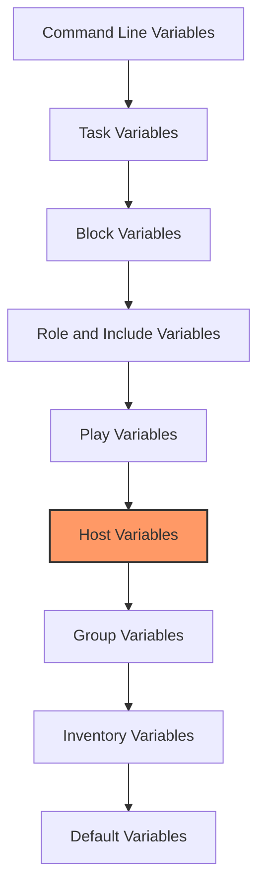

# Ansible Host Variables

## Introduction

When managing infrastructure with Ansible, you'll often need to configure servers differently even when they serve similar purposes. For example, web servers might need different memory allocations, unique hostnames, or varying application settings. **Host variables** in Ansible solve this problem by allowing you to define specific variables for individual hosts.

Host variables enable you to:
- Customize configurations for specific servers
- Override group-level default settings
- Store unique information like IP addresses or credentials securely
- Keep your playbooks reusable across different environments

Let's explore how to define and use host variables effectively in your Ansible projects.

## Understanding Host Variable Precedence

Before diving into implementation details, it's important to understand where host variables fit in Ansible's variable precedence hierarchy:



Host variables take precedence over group variables but can be overridden by play variables and those defined at higher levels. This hierarchical system gives you fine-grained control over your infrastructure.

## Defining Host Variables

There are several ways to define host variables in Ansible:

### 1. Directly in the Inventory File

The simplest method is to define variables right in your inventory file:

```ini
# inventory.ini
[webservers]
web1.example.com ansible_host=192.168.1.101 http_port=80 max_memory=4G
web2.example.com ansible_host=192.168.1.102 http_port=8080 max_memory=2G

[dbservers]
db1.example.com ansible_host=192.168.1.103 db_name=production max_connections=1000
```

This approach works well for simple setups but can become unwieldy as the number of variables increases.

### 2. Using Host Variable Files

For better organization, you can create dedicated variable files for each host:

1. Create a directory structure:

```
inventory/
├── hosts           # Your inventory file
├── host_vars/
│   ├── web1.example.com.yml
│   ├── web2.example.com.yml
│   └── db1.example.com.yml
└── group_vars/
    ├── webservers.yml
    └── dbservers.yml
```

2. Define variables in each host's YAML file:

```yaml
# host_vars/web1.example.com.yml
---
http_port: 80
max_memory: 4G
environment: production
hostname: web1
backup_server: backup.example.com
```

```yaml
# host_vars/web2.example.com.yml
---
http_port: 8080
max_memory: 2G
environment: staging
hostname: web2
backup_server: backup-stage.example.com
```

This method keeps your inventory file clean and makes it easier to track host-specific configurations.

### 3. Using YAML Inventory with Inline Variables

If you prefer YAML for your inventory, you can define host variables inline:

```yaml
# inventory.yml
all:
  children:
    webservers:
      hosts:
        web1.example.com:
          ansible_host: 192.168.1.101
          http_port: 80
          max_memory: 4G
        web2.example.com:
          ansible_host: 192.168.1.102
          http_port: 8080
          max_memory: 2G
    dbservers:
      hosts:
        db1.example.com:
          ansible_host: 192.168.1.103
          db_name: production
          max_connections: 1000
```

This approach is particularly useful for complex inventory structures.

## Using Host Variables in Playbooks

Once defined, host variables can be accessed in playbooks using the standard Ansible variable syntax:

```yaml
# configure_webservers.yml
---
- name: Configure webservers
  hosts: webservers
  tasks:
    - name: Set up web server configuration
      template:
        src: templates/nginx.conf.j2
        dest: /etc/nginx/nginx.conf
      vars:
        server_name: "{{ inventory_hostname }}"
        
    - name: Configure memory limits
      lineinfile:
        path: /etc/systemd/system.conf
        line: "DefaultMemoryLimit={{ max_memory }}"
        
    - name: Set up port in firewall
      firewalld:
        port: "{{ http_port }}/tcp"
        permanent: yes
        state: enabled
      notify: restart firewalld
      
  handlers:
    - name: restart firewalld
      service:
        name: firewalld
        state: restarted
```

In this example, `http_port` and `max_memory` are host variables that will have different values for each server in the `webservers` group.

## Template Example with Host Variables

One of the most powerful uses of host variables is within Jinja2 templates. Here's how you might create a web server configuration file:

```jinja
# templates/nginx.conf.j2
user nginx;
worker_processes auto;
error_log /var/log/nginx/error.log;
pid /run/nginx.pid;

events {
    worker_connections 1024;
}

http {
    server {
        listen {{ http_port }} default_server;
        server_name {{ hostname }}.{{ domain_name }};
        
        location / {
            root /usr/share/nginx/html;
            index index.html;
        }
        
        # Environment-specific configurations
        
        access_log /var/log/nginx/access.log main;
        error_log /var/log/nginx/error.log error;
        
        access_log /var/log/nginx/access.log debug;
        error_log /var/log/nginx/error.log debug;
        
        
        # Memory limits based on host variable
        
        proxy_buffer_size 8k;
        proxy_buffers 8 8k;
        
        proxy_buffer_size 4k;
        proxy_buffers 4 4k;
        
    }
}
```

When Ansible runs, it will generate a customized configuration file for each host based on its specific variables.

## Real-world Example: Deploying a Multi-tier Application

Let's look at a more comprehensive example where host variables are essential. Imagine deploying a web application with database backends across different environments:

### Host Variable Structure

```
inventory/
├── hosts
├── host_vars/
│   ├── web-prod-1.yml
│   ├── web-prod-2.yml
│   ├── web-staging.yml
│   ├── db-prod-master.yml
│   ├── db-prod-replica.yml
│   └── db-staging.yml
└── group_vars/
    ├── all.yml
    ├── webservers.yml
    └── dbservers.yml
```

### Host Variable Content

```yaml
# host_vars/web-prod-1.yml
---
server_role: primary
app_port: 8080
cache_size: 2G
ssl_cert_path: "/etc/ssl/web-prod-1.crt"
ssl_key_path: "/etc/ssl/web-prod-1.key"
app_config:
  log_level: "error"
  debug_mode: false
  session_timeout: 3600
backup_schedule: "0 2 * * *"  # 2 AM daily
```

```yaml
# host_vars/db-prod-master.yml
---
db_role: master
max_connections: 1000
innodb_buffer_pool_size: 12G
binlog_format: "ROW"
server_id: 1
replication:
  enabled: true
  slaves:
    - db-prod-replica
backup_schedule: "0 1 * * *"  # 1 AM daily
```

### Playbook Using Host Variables

```yaml
# deploy_application.yml
---
- name: Deploy database servers
  hosts: dbservers
  become: yes
  tasks:
    - name: Install MySQL packages
      package:
        name: mysql-server
        state: present
      
    - name: Configure MySQL
      template:
        src: templates/my.cnf.j2
        dest: /etc/my.cnf
      notify: restart mysql
      
    - name: Set up replication
      template:
        src: templates/replication.sql.j2
        dest: /tmp/replication.sql
      when: db_role is defined and db_role == "master"
      
    - name: Execute replication setup
      mysql_db:
        state: import
        name: all
        target: /tmp/replication.sql
      when: db_role is defined and db_role == "master"
      
  handlers:
    - name: restart mysql
      service:
        name: mysql
        state: restarted

- name: Deploy web application
  hosts: webservers
  become: yes
  tasks:
    - name: Install application packages
      package:
        name: 
          - nginx
          - nodejs
        state: present
        
    - name: Configure Nginx
      template:
        src: templates/nginx-vhost.j2
        dest: /etc/nginx/conf.d/application.conf
      notify: restart nginx
      
    - name: Deploy application files
      copy:
        src: app/
        dest: /var/www/application/
        
    - name: Configure application
      template:
        src: templates/app-config.j2
        dest: /var/www/application/config.json
      notify: restart application
      
    - name: Set up SSL certificates
      copy:
        src: "{{ item.src }}"
        dest: "{{ item.dest }}"
        mode: '0600'
      loop:
        - { src: "certs/{{ inventory_hostname }}.crt", dest: "{{ ssl_cert_path }}" }
        - { src: "certs/{{ inventory_hostname }}.key", dest: "{{ ssl_key_path }}" }
      when: ssl_cert_path is defined and ssl_key_path is defined
      notify: restart nginx
      
    - name: Configure backup job
      cron:
        name: "Backup application data"
        hour: "{{ backup_schedule.split(' ')[1] }}"
        minute: "{{ backup_schedule.split(' ')[0] }}"
        job: "/usr/local/bin/backup-app.sh > /var/log/backup.log 2>&1"
      when: backup_schedule is defined
      
  handlers:
    - name: restart nginx
      service:
        name: nginx
        state: restarted
        
    - name: restart application
      service:
        name: application
        state: restarted
```

This example demonstrates how host variables allow you to customize deployments for each server while keeping the playbook logic consistent.

## Special Ansible Host Variables

Ansible provides several built-in host variables that are automatically defined:

| Variable | Description |
|----------|-------------|
| `inventory_hostname` | The hostname as defined in the inventory |
| `inventory_hostname_short` | The short version of the hostname (before the first period) |
| `ansible_host` | The configured hostname or IP to connect to |
| `ansible_port` | The configured SSH port |
| `ansible_user` | The configured SSH username |
| `ansible_connection` | The connection type (ssh, local, docker, etc.) |
| `hostvars` | Dictionary containing all host variables |

These can be used in playbooks and templates just like user-defined variables:

```yaml
- name: Show hostname information
  debug:
    msg: "We are configuring {{ inventory_hostname }} ({{ ansible_host }}) with user {{ ansible_user }}"
```

## Best Practices for Host Variables

When working with host variables, follow these best practices:

1. **Organize by function**: Group related variables together in your host_vars files.

2. **Use meaningful names**: Choose descriptive variable names that indicate their purpose.

3. **Document your variables**: Add comments to explain what each variable does.

4. **Be consistent**: Use a consistent naming scheme across all hosts.

5. **Don't store secrets in plain text**: Use Ansible Vault for sensitive information:

   ```bash
   # Encrypt a host variables file containing secrets
   ansible-vault encrypt inventory/host_vars/web1.example.com.yml
   
   # Edit an encrypted file
   ansible-vault edit inventory/host_vars/web1.example.com.yml
   
   # Run a playbook with an encrypted file
   ansible-playbook site.yml --ask-vault-pass
   ```

6. **Use defaults**: Define default values in group_vars, and only override them in host_vars when necessary.

7. **Keep variables DRY**: Avoid duplicating the same variable values across multiple hosts.

## Common Issues and Troubleshooting

### 1. Variable Not Found

If a variable isn't being recognized, check:
- Spelling and capitalization
- File placement (should be in host_vars/hostname.yml)
- File format (valid YAML)

Use the `ansible-inventory` command to verify your variables are being loaded:

```bash
ansible-inventory --host web1.example.com --yaml
```

### 2. Variable Precedence Problems

If a variable has an unexpected value, it might be defined at multiple levels. Check:
- Command line variables (`-e` flag)
- Task-level vars
- Play-level vars
- Host variables
- Group variables

Use the debug module to see the actual value:

```yaml
- name: Debug variable
  debug:
    var: http_port
    verbosity: 1
```

### 3. YAML Syntax Errors

YAML is sensitive to indentation and special characters. Common issues include:
- Inconsistent indentation
- Missing quotes around strings with special characters
- Invalid characters in variable names

Use a YAML validator to check your files before using them with Ansible.

## Summary

Host variables are a powerful feature in Ansible that allow you to customize configurations for individual hosts while maintaining clean, reusable playbooks. By storing host-specific information separately from your playbook logic, you create more maintainable automation.

Key takeaways:
- Host variables can be defined in inventory files, YAML inventories, or dedicated host_vars files
- They take precedence over group variables but can be overridden by play variables
- Host variables are essential for customizing configurations in multi-server deployments
- Use Ansible Vault to securely store sensitive host-specific information
- Follow best practices for organization and naming to keep your Ansible projects maintainable

## Exercise: Create a Multi-environment Deployment

**Challenge**: Create an Ansible setup that deploys a simple web application across development, staging, and production environments, using host variables to customize configurations for each server.

1. Set up an inventory with three hosts, one for each environment
2. Create host_vars files for each host with appropriate variables
3. Create a playbook that deploys the application with environment-specific configurations
4. Use templates to generate configuration files based on host variables
5. Add host-specific backup schedules and logging configurations

This exercise will help you practice using host variables effectively in a real-world scenario.

## Additional Resources

- [Ansible Variables Documentation](https://docs.ansible.com/ansible/latest/user_guide/playbooks_variables.html)
- [Ansible Inventory Documentation](https://docs.ansible.com/ansible/latest/user_guide/intro_inventory.html)
- [Ansible Best Practices](https://docs.ansible.com/ansible/latest/user_guide/playbooks_best_practices.html)
- [Using Ansible Vault](https://docs.ansible.com/ansible/latest/user_guide/vault.html)