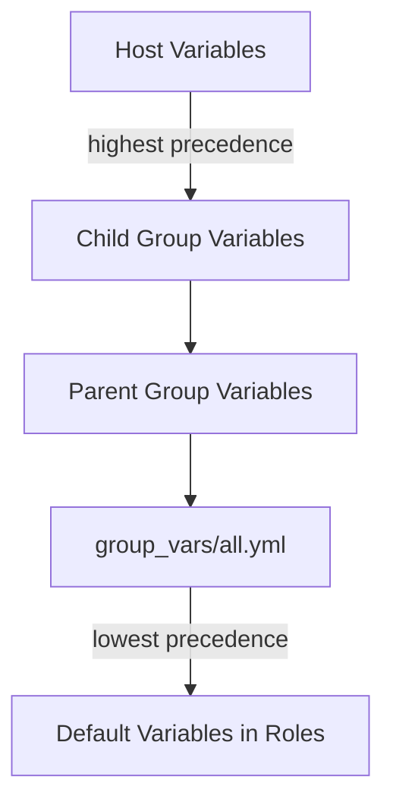

# Ansible Group Variables

## Introduction

When managing infrastructure with Ansible, you'll often need to apply the same configuration to multiple servers. While you could define variables for each server individually, this quickly becomes unwieldy as your infrastructure grows. **Group variables** solve this problem by allowing you to define variables that apply to entire groups of servers, making your Ansible configurations more maintainable and scalable.

Group variables are a powerful feature in Ansible's variable system that help you organize configuration data hierarchically and reduce redundancy in your playbooks.

## Understanding Inventory Groups

Before diving into group variables, let's understand how Ansible organizes hosts into groups. In Ansible, you define your managed servers in an inventory file, where you can organize servers into logical groups:

```ini
# inventory.ini
[webservers]
web1.example.com
web2.example.com

[databases]
db1.example.com
db2.example.com

[production:children]
webservers
databases
```

In this example:
- `webservers` and `databases` are groups containing specific hosts
- `production` is a parent group (using the `:children` suffix) that includes all hosts from both the `webservers` and `databases` groups

## Defining Group Variables

There are two main ways to define group variables in Ansible:

### Method 1: In the Inventory File

You can define variables directly in your inventory file:

```ini
[webservers]
web1.example.com
web2.example.com

[webservers:vars]
http_port=80
max_clients=200
```

The `:vars` suffix allows you to define variables that apply to all hosts in the `webservers` group.

### Method 2: Using Group Variables Files (Recommended)

The preferred approach for defining group variables is using separate YAML files in either:
- `group_vars/` directory in the same location as your playbook
- `group_vars/` directory in the same location as your inventory file

For example:

```
project_directory/
├── inventory.ini
├── playbook.yml
└── group_vars/
    ├── webservers.yml
    ├── databases.yml
    └── production.yml
```

The content of `group_vars/webservers.yml` might look like:

```yaml
---
# Variables for all webservers
http_port: 80
max_clients: 200
document_root: /var/www/html
```

This approach is more maintainable as your configuration grows.

## Variable Precedence and Inheritance

Ansible follows a specific order of precedence for variables. When it comes to group variables:

1. Host-specific variables take precedence over group variables
2. Child group variables take precedence over parent group variables
3. Variables defined in `group_vars/all.yml` apply to all groups (lowest precedence)

Let's visualize this with a diagram:



## Practical Example: Multi-Environment Deployment

Let's explore a practical example of using group variables to manage configurations across different environments:

### Directory Structure

```
ansible-project/
├── inventory.ini
├── deploy.yml
└── group_vars/
    ├── all.yml
    ├── development.yml
    ├── staging.yml
    ├── production.yml
    ├── webservers.yml
    └── databases.yml
```

### Inventory File

```ini
# inventory.ini
[development]
dev-web1.example.com
dev-db1.example.com

[staging]
stage-web1.example.com
stage-db1.example.com

[production]
prod-web1.example.com
prod-web2.example.com
prod-db1.example.com
prod-db2.example.com

[webservers]
dev-web1.example.com
stage-web1.example.com
prod-web1.example.com
prod-web2.example.com

[databases]
dev-db1.example.com
stage-db1.example.com
prod-db1.example.com
prod-db2.example.com
```

### Group Variables Files

**all.yml** - Settings for all environments:

```yaml
---
# Common settings for all environments
ansible_user: deployer
app_name: my_application
log_level: info
```

**development.yml** - Settings specific to development:

```yaml
---
# Development environment settings
env_name: development
debug_mode: true
database_name: "{{ app_name }}_dev"
app_port: 8000
```

**production.yml** - Settings specific to production:

```yaml
---
# Production environment settings
env_name: production
debug_mode: false
database_name: "{{ app_name }}_prod"
app_port: 80
backup_enabled: true
```

**webservers.yml** - Settings for all web servers:

```yaml
---
# Variables for all web servers
http_port: "{{ app_port }}"
worker_processes: auto
static_files_path: /var/www/static
```

### Playbook Using Group Variables

Now, let's create a playbook that uses these group variables:

```yaml
---
# deploy.yml
- name: Configure Webservers
  hosts: webservers
  tasks:
    - name: Create Nginx Configuration
      template:
        src: templates/nginx.conf.j2
        dest: /etc/nginx/sites-available/{{ app_name }}
      vars:
        server_name: "{{ inventory_hostname }}"
      notify: Restart Nginx

    - name: Display Environment Info
      debug:
        msg: "Deploying {{ app_name }} in {{ env_name }} environment on port {{ http_port }}"

  handlers:
    - name: Restart Nginx
      service:
        name: nginx
        state: restarted
```

### Template File Example

```jinja
# templates/nginx.conf.j2
server {
    listen {{ http_port }};
    server_name {{ server_name }};
    
    
    error_log /var/log/nginx/{{ app_name }}-error.log debug;
    
    error_log /var/log/nginx/{{ app_name }}-error.log error;
    
    
    root {{ static_files_path }};
    
    location / {
        proxy_pass http://localhost:{{ app_port }};
        proxy_set_header Host $host;
        proxy_set_header X-Real-IP $remote_addr;
    }
}
```

### Running the Playbook

When you run this playbook against different environments, the appropriate variables will be applied:

```bash
# Deploy to development
ansible-playbook -i inventory.ini deploy.yml --limit development

# Deploy to production
ansible-playbook -i inventory.ini deploy.yml --limit production
```

## Advanced Group Variables Techniques

### Using Dynamic Inventory

For cloud environments or dynamic infrastructure, you can use Ansible's dynamic inventory scripts. Group variables work the same way with dynamic inventory - you just need to create the appropriate files in the `group_vars/` directory.

### Group Variables in Roles

When using Ansible roles, you can define group variables specific to a role in:

```
roles/
└── myapp/
    ├── tasks/
    ├── handlers/
    ├── defaults/
    └── vars/
        └── main.yml
```

Variables defined in a role's `defaults/main.yml` have lower precedence than group variables, allowing you to override them as needed.

### Using Variable Files with group_by

The `group_by` module allows you to create dynamic groups based on facts. You can then define variables for these dynamic groups:

```yaml
- name: Create OS-specific groups
  hosts: all
  tasks:
    - name: Group hosts by OS
      group_by:
        key: "os_{{ ansible_facts['os_family'] }}"

- name: Configure Debian systems
  hosts: os_Debian
  tasks:
    - name: Install Debian packages
      apt:
        name: "{{ debian_packages }}"
        state: present
```

With a corresponding `group_vars/os_Debian.yml` file:

```yaml
---
debian_packages:
  - apt-transport-https
  - ca-certificates
  - ntp
```

## Best Practices for Group Variables

1. **Use YAML files instead of INI format** - YAML provides better readability and support for complex data structures.

2. **Organize variables logically** - Group variables by environment, server role, or application component.

3. **Use variable layering** - Define common variables in `all.yml` and override as needed in more specific groups.

4. **Keep sensitive data secure** - Use Ansible Vault to encrypt files containing sensitive variables:

   ```bash
   ansible-vault encrypt group_vars/production.yml
   ```

5. **Document your variables** - Add comments to explain what variables are for and how they're used.

6. **Use clear naming conventions** - For example, prefix variables with the component they affect: `nginx_port`, `db_user`, etc.

7. **Avoid deeply nested variables** - Keep your variable structure reasonably flat for better readability.

## Summary

Ansible group variables provide a powerful way to manage configuration across multiple servers. By organizing your infrastructure into logical groups and defining variables at the appropriate levels, you can create maintainable, DRY (Don't Repeat Yourself) configurations that scale with your infrastructure.

Key points to remember:
- Group variables can be defined in inventory files or separate YAML files
- The `group_vars/` directory is the recommended approach for complex configurations
- Ansible follows a specific precedence order when resolving variables
- Group variables can be used to manage different environments effectively
- Best practices include proper organization, security for sensitive data, and clear documentation

## Exercises

1. Create an inventory with three groups: `webservers`, `databases`, and `monitoring`. Add at least two hosts to each group.

2. Create appropriate group variables files for each group with relevant variables.

3. Write a simple playbook that displays the group-specific variables for each host.

4. Modify your structure to add an environment-based grouping (dev, staging, prod) and implement variable inheritance.

## Additional Resources

- [Ansible Variables Documentation](https://docs.ansible.com/ansible/latest/user_guide/playbooks_variables.html)
- [Ansible Best Practices](https://docs.ansible.com/ansible/latest/user_guide/playbooks_best_practices.html)
- [Ansible Variable Precedence](https://docs.ansible.com/ansible/latest/user_guide/playbooks_variables.html#variable-precedence-where-should-i-put-a-variable)