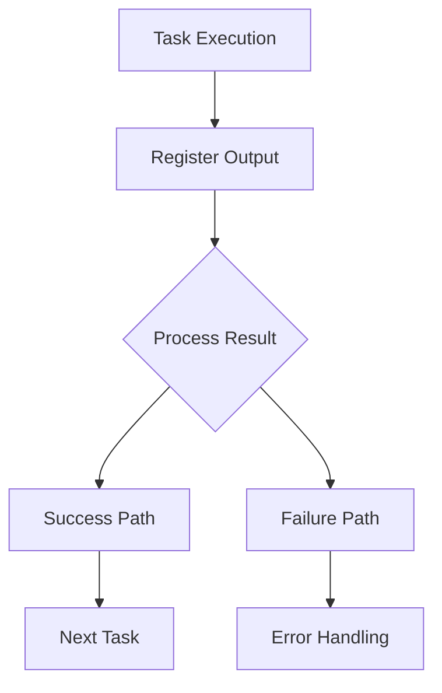

# Ansible Registered Variables

## Introduction

When working with Ansible, you often need to capture the output or result of a task to use it in subsequent tasks. This is where **registered variables** come into play. They provide a way to store the results of an Ansible task, including standard output, error messages, return codes, and other valuable information.

In this guide, we'll explore how to use registered variables in Ansible, why they're essential, and practical examples to help solidify your understanding.

## What Are Registered Variables?

Registered variables in Ansible are special variables that store the output and status information from a previously executed task. They are created using the `register` keyword in a task and can be referenced in subsequent tasks within the same play.

Think of registered variables as containers that capture everything about a task's execution:
- Standard output
- Error messages
- Return codes
- Changed status
- Task metadata

## Basic Syntax

To create a registered variable, add the `register` keyword to any task:

```yaml
- name: Run a command
  command: ls -la /var/log
  register: command_output
```

In this example, the output of the `ls -la /var/log` command is stored in a variable named `command_output`.

## Accessing Registered Variable Data

Registered variables contain structured data with several properties. Here are the most common properties:

| Property | Description |
|----------|-------------|
| `stdout` | Standard output as a single string |
| `stdout_lines` | Standard output split into a list of lines |
| `stderr` | Standard error output |
| `rc` | Return code (0 usually means success) |
| `changed` | Boolean indicating if the task changed the system |
| `failed` | Boolean indicating if the task failed |

### Example: Basic Usage

```yaml
- name: Get date
  command: date
  register: date_output

- name: Display date
  debug:
    msg: "Current date is {{ date_output.stdout }}"
```

## Practical Example 1: Conditional Execution Based on Command Output

One of the most common uses of registered variables is to make decisions based on the output of a task:

```yaml
- name: Check if a file exists
  command: stat /etc/myapp.conf
  register: stat_result
  ignore_errors: true

- name: Create configuration file if it doesn't exist
  template:
    src: templates/myapp.conf.j2
    dest: /etc/myapp.conf
  when: stat_result.rc != 0
```

In this example, we:
1. Try to check if a file exists using the `stat` command
2. Store the result in `stat_result`
3. Create the file only if the previous command's return code is not 0 (indicating failure, meaning the file doesn't exist)

## Practical Example 2: Working with Command Output

Let's see how to process command output line by line:

```yaml
- name: Get list of running processes
  shell: ps aux | grep httpd
  register: process_list

- name: Display each process
  debug:
    msg: "Process line: {{ item }}"
  loop: "{{ process_list.stdout_lines }}"
  when: process_list.stdout_lines | length > 0
```

This playbook:
1. Gets a list of running processes that match "httpd"
2. Registers the output in the `process_list` variable
3. Loops through each line of the output and displays it
4. Only executes the loop if there are lines in the output

## Practical Example 3: Error Handling

Registered variables are excellent for error handling:

```yaml
- name: Attempt to start a service
  service:
    name: myapp
    state: started
  register: service_result
  ignore_errors: true

- name: Report service start failure
  debug:
    msg: "Failed to start myapp service: {{ service_result.msg }}"
  when: service_result.failed

- name: Try alternative method if service failed
  shell: /etc/init.d/myapp start
  when: service_result.failed
```

This playbook:
1. Attempts to start a service using the `service` module
2. Registers the result
3. Displays an error message if the service failed to start
4. Tries an alternative method to start the service if the first attempt failed

## Practical Example 4: Capturing and Using Complex Output

When working with modules that return complex data, registered variables become even more powerful:

```yaml
- name: Gather facts about network interfaces
  shell: ip addr show
  register: interfaces

- name: Find IP addresses in the output
  set_fact:
    ip_addresses: "{{ interfaces.stdout | regex_findall('inet ([0-9.]+)') }}"

- name: Display all IP addresses
  debug:
    msg: "Found IP addresses: {{ ip_addresses }}"
```

This example:
1. Gathers information about network interfaces
2. Uses regex to extract all IP addresses
3. Displays the results

## Working with JSON Output

Many Ansible modules return JSON data. You can access this data using dot notation:

```yaml
- name: Retrieve system information
  setup:
  register: system_info

- name: Display OS family
  debug:
    msg: "Operating system: {{ system_info.ansible_facts.ansible_distribution }} {{ system_info.ansible_facts.ansible_distribution_version }}"
```

## Best Practices for Using Registered Variables

1. **Use descriptive names** - Choose meaningful variable names that describe what data they contain.

2. **Leverage `failed_when` and `changed_when`** - Customize when a task is considered failed or changed:

```yaml
- name: Check if configuration is up to date
  shell: grep -q "version=5.0" /etc/myapp.conf
  register: config_check
  failed_when: false
  changed_when: false

- name: Update configuration if needed
  template:
    src: templates/myapp.conf.j2
    dest: /etc/myapp.conf
  when: config_check.rc != 0
```

3. **Handle empty output** - Always check if output exists before using it:

```yaml
- name: Display users only if any found
  debug:
    msg: "Found users: {{ user_list.stdout_lines }}"
  when: user_list.stdout_lines is defined and user_list.stdout_lines | length > 0
```

4. **Keep variables scoped appropriately** - Remember that registered variables are only available within the current play.

## Advanced Usage: Registering Results from Loops

When you register the result of a task that uses a loop, the registered variable contains information about each iteration:

```yaml
- name: Check multiple services
  service_facts:
  register: service_status

- name: Check if specific services are running
  debug:
    msg: "{{ item }} is {{ 'running' if service_status.ansible_facts.services[item + '.service'].state == 'running' else 'stopped' }}"
  loop:
    - httpd
    - mysql
    - redis
  when: item + '.service' in service_status.ansible_facts.services
```

## Visualizing the Registered Variable Flow



## Summary

Registered variables are a powerful feature in Ansible that allow you to:

1. Capture the output and status of tasks
2. Make decisions based on previous task results
3. Handle errors gracefully
4. Process and transform command output
5. Chain tasks together in sophisticated ways

By mastering registered variables, you'll be able to create more dynamic, responsive, and intelligent Ansible playbooks.

## Exercises

To solidify your understanding of registered variables, try these exercises:

1. Create a playbook that checks if a specific version of Python is installed and installs it if not.
2. Write a playbook that gets disk usage information and alerts if any partition is more than 80% full.
3. Develop a playbook that searches for configuration files containing a specific pattern and backs them up before making changes.

## Additional Resources

- [Ansible Documentation: Registered Variables](https://docs.ansible.com/ansible/latest/user_guide/playbooks_variables.html#registering-variables)
- [Ansible Documentation: Conditionals](https://docs.ansible.com/ansible/latest/user_guide/playbooks_conditionals.html)
- [Ansible Documentation: Filters](https://docs.ansible.com/ansible/latest/user_guide/playbooks_filters.html)