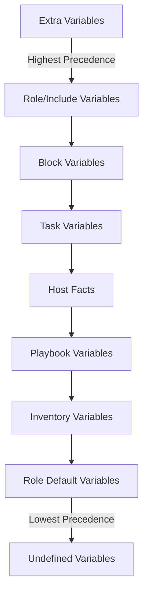

# Ansible Extra Variables

## Introduction

When working with Ansible, you often need to make your playbooks versatile and adaptable to different environments or scenarios. Ansible's variable system helps achieve this flexibility, and **extra variables** are an especially powerful feature within this system.

Extra variables (also called "extra vars") are variables that can be passed to an Ansible playbook at runtime. They have the highest precedence in Ansible's variable hierarchy, which means they override all other variable definitions - making them perfect for providing runtime configuration without modifying your playbooks.

In this tutorial, we'll explore how to use extra variables effectively to enhance your Ansible automation workflows.

## What Are Extra Variables?

Extra variables allow you to:

- Pass data to playbooks at execution time
- Override any previously defined variables
- Make your playbooks more generic and reusable
- Customize playbook execution without editing the playbook itself

Let's look at the basics before diving into more complex scenarios.

## Using Extra Variables with ansible-playbook

The most common way to pass extra variables is through the command line using the `--extra-vars` (or `-e`) option when executing a playbook.

### Basic Syntax

```bash
ansible-playbook playbook.yml --extra-vars "variable_name=value"
```

For example, let's say we have a simple playbook that deploys an application:

```yaml
---
- name: Deploy application
  hosts: webservers
  tasks:
    - name: Print application version
      debug:
        msg: "Deploying application version {{ app_version }}"
    
    - name: Deploy application
      # Actual deployment task would go here
      debug:
        msg: "Deployment of version {{ app_version }} to {{ environment }} complete"
```

We can run this playbook and specify the version and environment at runtime:

```bash
ansible-playbook deploy.yml --extra-vars "app_version=1.2.3 environment=staging"
```

Output:
```
TASK [Print application version] ***********************************
ok: [webserver1] => {
    "msg": "Deploying application version 1.2.3"
}

TASK [Deploy application] *****************************************
ok: [webserver1] => {
    "msg": "Deployment of version 1.2.3 to staging complete"
}
```

## Different Ways to Specify Extra Variables

Ansible offers several formats for providing extra variables:

### 1. Key-Value Pairs

```bash
ansible-playbook playbook.yml --extra-vars "key1=value1 key2=value2"
```

### 2. JSON Format

```bash
ansible-playbook playbook.yml --extra-vars '{"key1":"value1","key2":"value2"}'
```

### 3. YAML Format

```bash
ansible-playbook playbook.yml --extra-vars '{"key1":"value1","key2":"value2"}'
```

### 4. Using a JSON or YAML File

```bash
ansible-playbook playbook.yml --extra-vars "@vars.json"
ansible-playbook playbook.yml --extra-vars "@vars.yml"
```

Where `vars.json` might contain:
```json
{
  "app_version": "1.2.3",
  "environment": "production",
  "debug_mode": true
}
```

Or `vars.yml` could contain:
```yaml
---
app_version: 1.2.3
environment: production
debug_mode: true
```

## Complex Data Structures as Extra Variables

You can also pass complex data structures like lists and dictionaries:

### Using JSON Format

```bash
ansible-playbook playbook.yml --extra-vars '{"users":["john","alice","bob"],"settings":{"debug":true,"logging":"verbose"}}'
```

### Example Playbook Using Complex Extra Variables

```yaml
---
- name: Configure application with complex variables
  hosts: application_servers
  tasks:
    - name: Print users
      debug:
        msg: "User: {{ item }}"
      loop: "{{ users }}"
    
    - name: Configure settings
      debug:
        msg: "Setting up with debug={{ settings.debug }} and logging={{ settings.logging }}"
```

## Practical Examples

Let's explore some real-world scenarios where extra variables shine:

### Example 1: Configuring Different Environments

```yaml
---
- name: Deploy to environment
  hosts: "{{ target_hosts }}"
  tasks:
    - name: Install required packages
      debug:
        msg: "Installing packages for {{ environment }} environment"
    
    - name: Apply environment-specific configuration
      debug:
        msg: "Applying configuration for {{ environment }} with database {{ db_host }}"
```

Run with:
```bash
ansible-playbook deploy.yml --extra-vars "environment=dev target_hosts=dev_servers db_host=dev-db.example.com"
```

Or for production:
```bash
ansible-playbook deploy.yml --extra-vars "environment=prod target_hosts=prod_servers db_host=prod-db.example.com"
```

### Example 2: Dynamic Inventory Filtering

```yaml
---
- name: Perform operations on specific servers
  hosts: "{{ server_type }}"
  tasks:
    - name: Perform maintenance
      debug:
        msg: "Performing {{ operation_type }} on {{ inventory_hostname }}"
```

Execute with:
```bash
ansible-playbook maintenance.yml --extra-vars "server_type=webservers operation_type=restart"
```

### Example 3: Secret Handling (For Development Only)

```yaml
---
- name: Configure application credentials
  hosts: app_servers
  tasks:
    - name: Set application secrets
      debug:
        msg: "Configuring {{ application_name }} with API key {{ api_key | default('DEFAULT_KEY') }}"
```

Run with:
```bash
ansible-playbook configure.yml --extra-vars "application_name=payment-service api_key=a1b2c3d4"
```

**Note:** For production environments, use Ansible Vault or another secret management solution rather than passing secrets as extra vars.

## Variable Precedence

It's important to understand that extra variables take the highest precedence in Ansible. This means they will override any other variable definitions, including:

- Variables defined in playbooks
- Variables defined in inventory files
- Variables defined in group_vars or host_vars
- Role defaults or variables



## Best Practices for Using Extra Variables

1. **Use for Runtime Configuration:** Extra variables are ideal for parameters that change between runs.

2. **Avoid Hardcoding Sensitive Data:** Don't include passwords or API keys directly in command lines. Use Ansible Vault or environment variables for sensitive data.

3. **Document Required Extra Variables:** Make sure to document which extra variables your playbook requires.

4. **Provide Defaults:** When possible, provide sensible defaults in your playbook so it can run without all extra variables being defined.

5. **Use Descriptive Names:** Choose clear, descriptive names for your variables.

```yaml
# Good
ansible-playbook deploy.yml --extra-vars "application_version=1.2.3 target_environment=staging"

# Less Clear
ansible-playbook deploy.yml --extra-vars "v=1.2.3 env=stg"
```

6. **Use JSON/YAML Files for Complex Data:** For complex variable structures, use external JSON or YAML files rather than long command lines.

## Common Pitfalls and Troubleshooting

### String vs. Boolean/Numeric Values

When passing boolean or numeric values, be careful with quotes. In YAML/JSON format, values are properly typed, but in key=value format, everything is treated as a string by default.

```bash
# This variable will be a string "true", not a boolean
ansible-playbook playbook.yml --extra-vars "debug_mode=true"

# To ensure proper boolean type, use JSON format
ansible-playbook playbook.yml --extra-vars '{"debug_mode":true}'
```

### Variable Interpolation

Extra variables are processed after all other variables, so they can reference other variables:

```bash
ansible-playbook playbook.yml --extra-vars "app_dir=/opt/apps/{{ application_name }}"
```

But this only works if `application_name` is defined elsewhere before the extra vars are processed.

### Escaping Special Characters

When using special characters in your variables, you might need to escape them:

```bash
ansible-playbook playbook.yml --extra-vars "message=\"Hello, World!\""
```

## Summary

Extra variables provide a powerful way to make your Ansible playbooks more flexible and reusable. By passing variables at runtime, you can adapt your automation to different scenarios without modifying the underlying code.

Key points to remember:
- Extra variables have the highest precedence in Ansible's variable system
- They can be specified in multiple formats: key=value pairs, JSON, YAML, or from files
- They're perfect for runtime configuration and making playbooks reusable
- Complex data structures can be passed as extra variables
- Always follow best practices, especially regarding sensitive data

## Exercises

1. Create a playbook that deploys a web application and accepts extra variables for:
   - Application version
   - Deployment environment (dev/staging/prod)
   - Feature flags (as a dictionary)

2. Modify an existing playbook to use extra variables instead of hardcoded values.

3. Create a deployment script that uses a YAML file for extra variables and allows users to override specific values via command line parameters.

## Additional Resources

- [Ansible Documentation on Variables](https://docs.ansible.com/ansible/latest/user_guide/playbooks_variables.html)
- [Ansible's Variable Precedence Rules](https://docs.ansible.com/ansible/latest/user_guide/playbooks_variables.html#variable-precedence-where-should-i-put-a-variable)
- [Using Variables with Jinja2 Templates](https://docs.ansible.com/ansible/latest/user_guide/playbooks_templating.html)