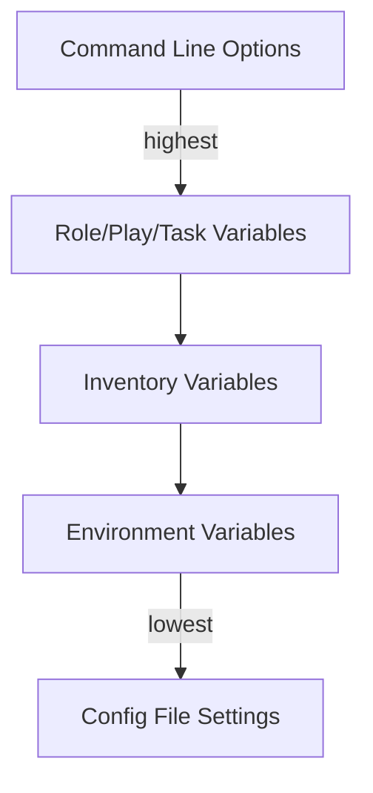

# Ansible Environment Variables

Environment variables provide a powerful way to control Ansible's behavior and pass information to playbooks without modifying code. In this guide, we'll explore how environment variables work in Ansible and how you can leverage them effectively.

## Introduction to Environment Variables in Ansible

Environment variables are key-value pairs that can influence how applications run. In Ansible, environment variables serve two main purposes:

1. **Controlling Ansible's behavior**: Ansible reads specific environment variables to determine how it should operate
2. **Passing environment settings to tasks**: You can specify environment variables that should be available to tasks during execution

This dual nature makes environment variables particularly useful for configuration management and maintaining separation between code and environment-specific settings.

## Ansible's Built-in Environment Variables

Ansible recognizes several built-in environment variables that control its behavior. Here are some of the most commonly used ones:

### 1. `ANSIBLE_CONFIG`

Specifies the path to the Ansible configuration file.

```bash
# Setting the ANSIBLE_CONFIG environment variable
export ANSIBLE_CONFIG=/path/to/custom/ansible.cfg

# Running a playbook with the custom config
ansible-playbook my_playbook.yml
```

### 2. `ANSIBLE_INVENTORY`

Defines the location of your inventory file.

```bash
# Setting a custom inventory location
export ANSIBLE_INVENTORY=/path/to/custom/inventory.ini

# Running with the custom inventory
ansible all -m ping
```

### 3. `ANSIBLE_ROLES_PATH`

Specifies where Ansible should look for roles.

```bash
# Setting multiple role paths (colon-separated)
export ANSIBLE_ROLES_PATH=/opt/ansible/roles:/home/user/ansible/roles

# Using roles from these locations
ansible-playbook playbook_with_roles.yml
```

### 4. `ANSIBLE_HOST_KEY_CHECKING`

Controls whether Ansible verifies SSH host keys.

```bash
# Disable host key checking (useful for testing)
export ANSIBLE_HOST_KEY_CHECKING=False

# Run playbook without host key verification
ansible-playbook deploy_to_new_servers.yml
```

## Setting Environment Variables for Tasks

You can also specify environment variables that should be available to the commands and scripts executed by Ansible tasks.

### Basic Usage

Here's how to set environment variables for a specific task:

```yaml
- name: Run a script with custom environment
  shell: my_script.sh
  environment:
    API_KEY: "secret_key_123"
    DEBUG: "true"
    APP_ENV: "development"
```

### Setting Environment Variables for an Entire Play

You can define environment variables at the play level to apply them to all tasks:

```yaml
- name: Play with environment variables
  hosts: webservers
  environment:
    NODE_ENV: production
    HTTP_PROXY: http://proxy.example.com:8080
  
  tasks:
    - name: Install npm packages
      npm:
        name: express
        state: present
      # This task inherits the environment variables defined at the play level
      
    - name: Run with different environment
      shell: npm start
      environment:
        NODE_ENV: development
        # This overrides the play-level NODE_ENV, but keeps HTTP_PROXY
```

## Using Variables in Environment Definitions

You can use Ansible variables within your environment definitions:

```yaml
- name: Deploy application
  hosts: app_servers
  vars:
    api_endpoint: "https://api.example.com/v1"
    log_level: "info"
    
  tasks:
    - name: Run deployment script
      script: deploy.sh
      environment:
        API_ENDPOINT: "{{ api_endpoint }}"
        LOG_LEVEL: "{{ log_level }}"
        DEPLOY_ID: "{{ ansible_date_time.iso8601 }}"
```

## Practical Example: Configuring a Web Application

Let's look at a complete example of deploying a Node.js application with environment-specific configuration:

```yaml
---
- name: Deploy web application
  hosts: webservers
  gather_facts: yes
  vars:
    app_root: "/var/www/myapp"
    
  tasks:
    - name: Clone application repository
      git:
        repo: https://github.com/example/myapp.git
        dest: "{{ app_root }}"
        version: main
        
    - name: Install dependencies
      npm:
        path: "{{ app_root }}"
        state: present
      environment:
        NODE_ENV: production
        NPM_CONFIG_LOGLEVEL: error
        
    - name: Create environment file
      template:
        src: env.j2
        dest: "{{ app_root }}/.env"
      notify: restart application
        
    - name: Start application
      shell: npm start
      args:
        chdir: "{{ app_root }}"
      environment:
        NODE_ENV: production
        PORT: 3000
        DATABASE_URL: "{{ db_url }}"
        REDIS_HOST: "{{ redis_host }}"
        LOG_LEVEL: "{{ 'debug' if debug_mode else 'info' }}"
        
  handlers:
    - name: restart application
      service:
        name: myapp
        state: restarted
```

In this example, we:
1. Clone a Git repository
2. Install dependencies with specific npm environment settings
3. Create a configuration file from a template
4. Start the application with environment variables including some derived from Ansible variables

## Environment Variables and Vault

For sensitive information, you can combine environment variables with Ansible Vault:

```yaml
- name: Deploy with secure credentials
  hosts: database_servers
  vars_files:
    - vault/credentials.yml  # Encrypted file containing sensitive variables
  
  tasks:
    - name: Run database migration
      command: ./migrate.sh
      args:
        chdir: /opt/application/db
      environment:
        DB_USER: "{{ vault_db_user }}"
        DB_PASSWORD: "{{ vault_db_password }}"
        DB_HOST: "{{ vault_db_host }}"
```

## Setting Environment Variables Through the Command Line

You can also set environment variables directly when running Ansible commands:

```bash
# Setting a temporary environment variable for just this command
ANSIBLE_STDOUT_CALLBACK=yaml ansible-playbook playbook.yml

# Setting multiple variables
ANSIBLE_NOCOWS=1 ANSIBLE_RETRY_FILES_ENABLED=False ansible-playbook playbook.yml
```

## Environment Variables Precedence

Ansible follows a specific precedence order when determining which value to use for a variable:



Understanding this precedence helps when debugging variable conflicts or unexpected behavior.

## Best Practices for Using Environment Variables

1. **Security considerations**: 
   - Don't commit sensitive environment variables to source control
   - Use Ansible Vault for encrypting sensitive data
   - Be aware that environment variables may be visible in process listings

2. **Portability**:
   - Use environment variables to make playbooks portable across environments
   - Consider combining with inventory groups for environment-specific settings

3. **Documentation**:
   - Document required environment variables in your README files
   - Use comments in playbooks to explain the purpose of each environment variable

## Debugging Environment Variables

If you need to check what environment variables are available during a task's execution:

```yaml
- name: Debug environment variables
  shell: env | sort
  register: environment_debug
  
- name: Display environment
  debug:
    var: environment_debug.stdout_lines
```

## Summary

Environment variables in Ansible provide a flexible way to control both how Ansible itself behaves and how the tasks it executes operate. By leveraging environment variables effectively, you can:

- Control Ansible's configuration without modifying config files
- Pass runtime information to scripts and commands
- Keep sensitive information separate from your playbooks
- Make your automation more portable across different environments

Understanding how to use environment variables will help you create more flexible, secure, and maintainable Ansible playbooks.

## Additional Resources

- [Ansible Environment Variables Official Documentation](https://docs.ansible.com/ansible/latest/reference_appendices/config.html#environment-variables)
- [Ansible Configuration Settings](https://docs.ansible.com/ansible/latest/reference_appendices/config.html)
- [Using Environment Variables with Ansible Tower/AWX](https://docs.ansible.com/ansible-tower/latest/html/userguide/job_templates.html#extra-environment-variables)

## Exercises

1. Create a playbook that uses different database connection settings based on environment variables.
2. Modify an existing playbook to make it work behind a proxy by using the appropriate environment variables.
3. Set up a playbook that logs environment information to help with debugging deployment issues.