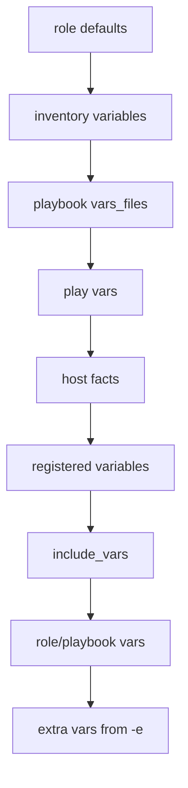

# Ansible Variable Files

When working with Ansible, you'll often need to use variables to make your playbooks more flexible and reusable. As your automation grows, managing these variables directly in playbooks can become unwieldy. This is where **variable files** come in—they allow you to organize variables in separate files and reference them in your playbooks.

## Introduction to Variable Files

Variable files in Ansible are separate YAML files that contain variable definitions. They help you:

- Keep playbooks clean and focused on tasks
- Reuse variable sets across multiple playbooks
- Separate environment-specific configuration from task logic
- Implement a more organized and maintainable infrastructure as code

## Creating Variable Files

Variable files are simple YAML files with key-value pairs. Let's look at an example:

```yaml
# webserver_vars.yml
http_port: 80
https_port: 443
document_root: /var/www/html
max_clients: 200
```

This file defines four variables related to a web server configuration. Each variable has a name and a value, following YAML syntax.

## Using Variable Files in Playbooks

There are several ways to include variable files in your playbooks:

### Method 1: Using `vars_files`

The most direct method is using the `vars_files` directive in your playbook:

```yaml
---
- name: Configure web servers
  hosts: webservers
  vars_files:
    - webserver_vars.yml
  
  tasks:
    - name: Ensure Apache is configured
      template:
        src: apache.conf.j2
        dest: /etc/httpd/conf/httpd.conf
      vars:
        server_port: "{{ http_port }}"
```

This playbook loads the variables from `webserver_vars.yml` and makes them available throughout the playbook. The `http_port` variable is referenced in the template task.

### Method 2: Using the `include_vars` module

You can also load variable files dynamically during playbook execution:

```yaml
---
- name: Configure web servers
  hosts: webservers
  
  tasks:
    - name: Load web server variables
      include_vars:
        file: webserver_vars.yml
    
    - name: Display loaded port
      debug:
        msg: "HTTP port is set to {{ http_port }}"
```

This approach gives you more control over when variables are loaded. Variables become available only after the `include_vars` task runs.

## Using Group and Host Variable Files

Ansible automatically loads variables from certain directories based on your inventory structure:

```
inventory/
├── group_vars/
│   ├── all.yml          # Variables for all hosts
│   ├── webservers.yml   # Variables for 'webservers' group
│   └── dbservers.yml    # Variables for 'dbservers' group
└── host_vars/
    ├── web1.example.com.yml
    └── db1.example.com.yml
```

Let's see how this works:

1. Create an inventory file:

```ini
# inventory.ini
[webservers]
web1.example.com
web2.example.com

[dbservers]
db1.example.com
```

2. Create group variables for webservers:

```yaml
# group_vars/webservers.yml
http_port: 80
https_port: 443
```

3. Create host-specific variables:

```yaml
# host_vars/web1.example.com.yml
document_root: /var/www/custom
```

4. Use these variables in a playbook:

```yaml
---
- name: Configure web servers
  hosts: webservers
  
  tasks:
    - name: Show configuration
      debug:
        msg: "Server {{ inventory_hostname }} will use HTTP port {{ http_port }} and document root {{ document_root | default('/var/www/html') }}"
```

When this playbook runs, Ansible automatically loads the appropriate variables for each host. For `web1.example.com`, it will use both the group variables from `webservers.yml` and the host-specific variables from `web1.example.com.yml`.

## Variable Precedence

When using multiple variable files, it's important to understand Ansible's variable precedence. Here's a simplified view:



Variables defined in methods higher on this chart are overridden by those defined in methods lower on the chart. For example, variables in `vars_files` will override inventory variables but will be overridden by play variables.

## Real-World Example: Multi-Environment Configuration

Let's create a practical example of using variable files to manage a web application across different environments:

### Project Structure

```
project/
├── inventories/
│   ├── development/
│   │   ├── hosts
│   │   └── group_vars/
│   │       ├── all.yml
│   │       └── webservers.yml
│   └── production/
│       ├── hosts
│       └── group_vars/
│           ├── all.yml
│           └── webservers.yml
├── playbooks/
│   └── deploy_webapp.yml
└── vars/
    └── webapp_defaults.yml
```

### Variable Files Content

1. Default variables for the application:

```yaml
# vars/webapp_defaults.yml
app_name: my_webapp
app_version: 1.0.0
app_port: 8080
app_log_level: info
db_name: webapp_db
max_connections: 100
```

2. Development environment variables:

```yaml
# inventories/development/group_vars/all.yml
environment: development
debug_mode: true
```

```yaml
# inventories/development/group_vars/webservers.yml
app_port: 8000
app_log_level: debug
db_host: dev-db.example.com
```

3. Production environment variables:

```yaml
# inventories/production/group_vars/all.yml
environment: production
debug_mode: false
```

```yaml
# inventories/production/group_vars/webservers.yml
app_port: 80
app_log_level: warn
db_host: prod-db.example.com
max_connections: 500
```

### Deployment Playbook

```yaml
---
# playbooks/deploy_webapp.yml
- name: Deploy web application
  hosts: webservers
  vars_files:
    - ../vars/webapp_defaults.yml
  
  tasks:
    - name: Display deployment configuration
      debug:
        msg: |
          Deploying {{ app_name }} v{{ app_version }} to {{ environment }}
          - App port: {{ app_port }}
          - Log level: {{ app_log_level }}
          - DB host: {{ db_host }}
          - Max connections: {{ max_connections }}
          - Debug mode: {{ debug_mode }}
    
    - name: Generate app configuration file
      template:
        src: templates/app.conf.j2
        dest: /etc/{{ app_name }}/app.conf
      notify: restart application
  
  handlers:
    - name: restart application
      service:
        name: "{{ app_name }}"
        state: restarted
```

### Running the Playbook

To deploy to development:

```bash
ansible-playbook -i inventories/development/hosts playbooks/deploy_webapp.yml
```

To deploy to production:

```bash
ansible-playbook -i inventories/production/hosts playbooks/deploy_webapp.yml
```

The same playbook works for both environments because the environment-specific variables are separated into different files.

## Best Practices for Variable Files

1. **Organize by purpose**: Group related variables together in logical files.

2. **Use meaningful file names**: Name your variable files clearly to indicate their purpose (e.g., `mysql_settings.yml`, `nginx_config.yml`).

3. **Document your variables**: Add comments in your variable files to explain what each variable does.

   ```yaml
   # Database settings
   # -----------------
   # Maximum number of connections allowed to the database
   db_max_connections: 100
   
   # Connection timeout in seconds
   db_timeout: 30
   ```

4. **Use default values**: Provide sensible defaults for optional variables.

   ```yaml
   # defaults/main.yml in a role
   http_port: 80
   enable_ssl: false
   ```

5. **Separate sensitive information**: Use Ansible Vault for passwords and other sensitive data.

   ```bash
   # Encrypt a variable file
   ansible-vault encrypt credentials.yml
   
   # Use in a playbook
   ansible-playbook site.yml --ask-vault-pass
   ```

6. **Use variable namespaces**: Prefix variables with a component name to avoid conflicts.

   ```yaml
   # nginx_vars.yml
   nginx_port: 80
   nginx_worker_processes: 4
   
   # mysql_vars.yml
   mysql_port: 3306
   mysql_max_connections: 100
   ```

## Advanced Variable File Techniques

### Using Jinja2 in Variable Files

Starting with Ansible 2.8, you can use Jinja2 in `vars_files`:

```yaml
# vars/app_settings.yml
app_base_dir: /opt/app
app_log_dir: "{{ app_base_dir }}/logs"
app_data_dir: "{{ app_base_dir }}/data"
```

### Conditional Variable Files

You can load different variable files based on conditions:

```yaml
---
- name: Configure servers
  hosts: all
  vars_files:
    - "vars/common.yml"
    - "vars/{{ ansible_os_family }}.yml"
  
  tasks:
    - name: Install packages
      package:
        name: "{{ required_packages }}"
        state: present
```

Create OS-specific variable files:

```yaml
# vars/Debian.yml
required_packages:
  - apt-transport-https
  - ca-certificates

# vars/RedHat.yml
required_packages:
  - ca-certificates
  - yum-utils
```

## Summary

Ansible variable files are a powerful way to organize your automation variables and keep your playbooks clean and maintainable. They allow you to:

- Separate variables from playbook logic
- Reuse variable sets across multiple playbooks
- Configure different environments using the same playbooks
- Keep sensitive information secure using Ansible Vault

By following the examples and best practices in this guide, you can build more flexible and maintainable Ansible automation.

## Additional Resources

- Practice creating variable files for different environments
- Try integrating Ansible Vault with your variable files
- Experiment with variable precedence by defining the same variable in different locations
- Challenge yourself to refactor an existing playbook to use variable files