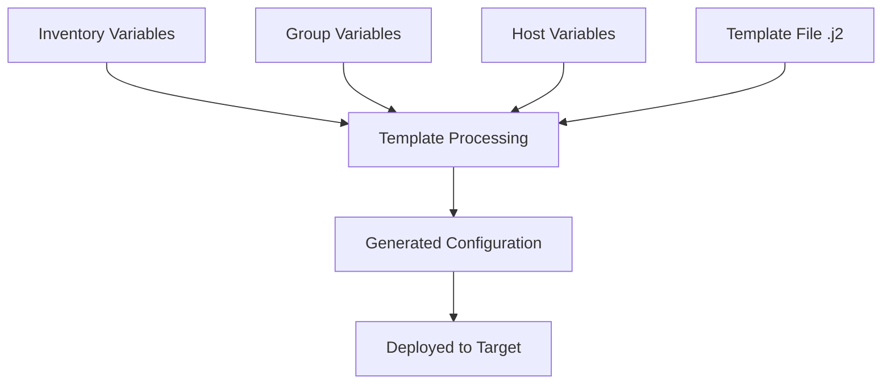

# Ansible Jinja2 Basics

## Introduction

Jinja2 is a modern and designer-friendly templating engine for Python that serves as the backbone for Ansible's templating functionality. When working with Ansible, you'll frequently need to create dynamic configurations that adapt to different environments, servers, or conditions. This is where Jinja2 templates become invaluable.

In this guide, we'll explore the fundamentals of Jinja2 in the context of Ansible, providing you with the essential knowledge to create flexible and powerful templates for your infrastructure automation.

## What is Jinja2?

Jinja2 is a templating language that allows you to:

- Generate dynamic content based on variables
- Execute control structures like loops and conditionals
- Apply filters to transform data
- Use macros for reusable template fragments

Ansible uses Jinja2 for:
- Template files (using the `template` module)
- Variable substitution in playbooks
- Conditional expressions in tasks and plays
- Generating dynamic content

## Basic Syntax

Jinja2 uses these delimiters:

- `{{ ... }}` - For expressions (variables, operations)
- `` - For statements (control structures like if/else, loops)
- `{# ... #}` - For comments (not rendered in output)

## Working with Variables

### Simple Variable Substitution

```yaml
# inventory file
[web_servers]
web1 ansible_host=192.168.1.10

[web_servers:vars]
http_port=8080
server_name=example.com
```

```jinja
# templates/nginx.conf.j2
server {
    listen {{ http_port }};
    server_name {{ server_name }};
    
    location / {
        root /var/www/html;
        index index.html;
    }
}
```

```yaml
# playbook.yml
- name: Configure web server
  hosts: web_servers
  tasks:
    - name: Generate Nginx configuration
      template:
        src: templates/nginx.conf.j2
        dest: /etc/nginx/sites-available/default
```

Output (generated file):

```
server {
    listen 8080;
    server_name example.com;
    
    location / {
        root /var/www/html;
        index index.html;
    }
}
```

### Working with Dictionaries

Jinja2 can also access values in dictionaries:

```yaml
# vars file
app_config:
  name: "My Application"
  version: 1.2.3
  ports:
    http: 80
    https: 443
```

```jinja
# templates/app.conf.j2
App Name: {{ app_config.name }}
Version: {{ app_config.version }}
HTTP Port: {{ app_config.ports.http }}
HTTPS Port: {{ app_config.ports.https }}
```

Output:

```
App Name: My Application
Version: 1.2.3
HTTP Port: 80
HTTPS Port: 443
```

## Control Structures

### Conditionals

Use `if`, `elif`, and `else` statements to include content conditionally:

```jinja
# templates/service.conf.j2
[Service]
ExecStart=/usr/bin/myapp

Restart=always
RestartSec=5

Restart=on-failure



StandardOutput=journal
StandardError=journal

```

### Loops

Loop through lists and dictionaries with `for` loops:

```yaml
# vars file
users:
  - name: alice
    groups: [admin, developers]
  - name: bob
    groups: [developers]
  - name: charlie
    groups: [testers]
```

```jinja
# templates/sudoers.j2
# User privilege specification


{{ user.name }} ALL=(ALL:ALL) ALL


```

Output:

```
# User privilege specification
alice ALL=(ALL:ALL) ALL
```

## Filters

Jinja2 filters transform data before displaying it. Ansible provides many built-in filters:

### String Manipulation

```jinja
{{ hostname | upper }}               # Convert to uppercase
{{ filename | basename }}            # Get filename from path
{{ path | dirname }}                 # Get directory from path
{{ string | regex_replace('foo', 'bar') }}  # Replace using regex
```

### Data Transformation

```jinja
{{ list | join(', ') }}              # Join list elements
{{ dict | to_json }}                 # Convert to JSON
{{ dict | to_yaml }}                 # Convert to YAML
{{ secret | password_hash('sha512') }}  # Hash a password
```

### Default Values

```jinja
{{ variable | default('fallback') }}  # Use fallback if variable is undefined
```

### Practical Example with Filters

```yaml
# vars file
server_info:
  hostname: web-server
  ip_address: 192.168.1.100
  environment: production
  services:
    - name: nginx
      port: 80
    - name: postgresql
      port: 5432
```

```jinja
# templates/server_info.conf.j2
HOSTNAME={{ server_info.hostname | upper }}
ENVIRONMENT={{ server_info.environment | default('development') }}

# Services

SERVICE_{{ loop.index }}={{ service.name | upper }}_{{ service.port }}


# JSON Configuration
CONFIG_JSON={{ server_info | to_json }}
```

Output:

```
HOSTNAME=WEB-SERVER
ENVIRONMENT=production

# Services
SERVICE_1=NGINX_80
SERVICE_2=POSTGRESQL_5432

# JSON Configuration
CONFIG_JSON={"hostname":"web-server","ip_address":"192.168.1.100","environment":"production","services":[{"name":"nginx","port":80},{"name":"postgresql","port":5432}]}
```

## Advanced Features

### Arithmetic Operations

Jinja2 supports basic arithmetic:

```jinja
{{ 5 + 5 }}                  # Output: 10
{{ variable * 2 }}           # Multiply by 2
{{ (value / 10) | int }}     # Divide and convert to integer
```

### Logic and Comparisons

```jinja

  The service is active and has multiple users.



  Apply production-like settings

```

### Template Inheritance and Includes

Jinja2 allows breaking templates into reusable components:

```jinja
{# templates/base.j2 #}
server {
    listen {{ port | default(80) }};
    server_name {{ server_name }};
    
    
}
```

```jinja
{# templates/website.j2 #}



    root /var/www/{{ site_name }};
    index index.html;
    
    

```

## Real-World Example: Multi-Environment Configuration

Let's create a comprehensive example for configuring a web application across multiple environments:

```yaml
# group_vars/all.yml
app_name: my_web_app
base_packages:
  - nginx
  - python3
  - postgresql-client

# group_vars/development.yml
environment: development
debug_mode: true
database:
  host: localhost
  port: 5432
  name: devdb

# group_vars/production.yml
environment: production
debug_mode: false
database:
  host: db.example.com
  port: 5432
  name: proddb
ssl_enabled: true
```

```jinja
# templates/app_config.ini.j2
[general]
app_name = {{ app_name }}
environment = {{ environment }}
debug = {{ debug_mode | lower }}

[database]
host = {{ database.host }}
port = {{ database.port }}
name = {{ database.name }}

pool_size = 20
ssl_mode = require

pool_size = 5
ssl_mode = prefer


[logging]

level = ERROR
file = /var/log/{{ app_name }}/app.log
rotate_size = 50M
backup_count = 10

level = DEBUG
file = {{ app_name }}.log
rotate_size = 5M
backup_count = 3


[features]

{{ feature }} = enabled

# No features enabled


# Generated on: {{ ansible_date_time.iso8601 }}
# Managed by Ansible - DO NOT EDIT MANUALLY
```

In our playbook:

```yaml
- name: Configure application
  hosts: webservers
  tasks:
    - name: Generate application configuration
      template:
        src: templates/app_config.ini.j2
        dest: "/etc/{{ app_name }}/config.ini"
        owner: www-data
        group: www-data
        mode: '0640'
      notify: restart application
```

With this template, you can generate environment-specific configurations from a single template file.

## Flow Control Visualization

Here's a visualization of how Jinja2 templating works in Ansible:



## Best Practices

1. **Keep templates simple**: Complex logic should be handled in Ansible tasks or roles when possible.

2. **Use comments**: Document your templates with `{# comments #}` to explain complex sections.

3. **Format your templates**: Well-formatted templates are easier to maintain.

4. **Set defaults**: Use the `default` filter to handle missing variables gracefully.

5. **Validate templates**: Test your templates with different variable combinations before deploying.

6. **Use version control**: Keep your templates in version control systems like Git.

7. **Use consistent naming**: Adopt a consistent naming convention for templates and variables.

## Common Pitfalls

- **Missing quotes**: Remember to quote string values in conditionals: ``
- **Undefined variables**: Always provide defaults or check if variables exist
- **Whitespace control**: Use `` to control whitespace in the output
- **Escaping**: Be careful with special characters within strings

## Summary

Jinja2 templating in Ansible provides a powerful way to generate dynamic configurations. In this guide, we've covered:

- Basic syntax and variable substitution
- Control structures like conditionals and loops
- Filters for transforming data
- Real-world examples for practical application

By mastering Jinja2 templates, you can create flexible, environment-specific configurations that adapt to your infrastructure's needs, making your Ansible automation more powerful and maintainable.

## Further Resources

- Practice by converting existing configuration files to templates
- Experiment with more complex Jinja2 features like macros
- Try combining multiple templates with includes and blocks
- Explore additional Jinja2 filters available in Ansible