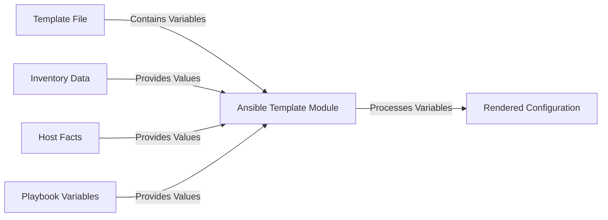

# Ansible Template Module

## Introduction

The template module is one of Ansible's most powerful features that allows you to dynamically generate configuration files and other text-based documents on target hosts. Instead of maintaining multiple versions of similar configuration files for different environments or servers, you can create a single template with variables that Ansible will populate during playbook execution.

At its core, the template module leverages **Jinja2**, a modern and designer-friendly templating language for Python, to create dynamic content. This allows you to write configuration files that can adapt to different scenarios based on inventory data, facts gathered from hosts, or variables defined in your playbooks.

## How Templates Work in Ansible

Before diving into the template module itself, let's understand the basic workflow:



1. You create a template file with placeholders (variables)
2. Ansible collects data from various sources (inventory, facts, vars)
3. The template module renders the file by replacing variables with actual values
4. The rendered file is deployed to the target host(s)

## Basic Syntax

The template module is used in Ansible playbooks with the following basic syntax:

```yaml
- name: Generate configuration from template
  template:
    src: template_file.j2
    dest: /path/to/output/file.conf
    owner: user
    group: group
    mode: '0644'
```

Let's break down the key parameters:

- `src`: Path to the template file (relative to the playbook or roles/templates directory)
- `dest`: Location on the target host where the rendered file should be placed
- `owner` and `group`: User and group ownership for the rendered file (optional)
- `mode`: Permissions for the rendered file (optional, but recommended)

## Creating Your First Template

Let's create a simple template for an Nginx virtual host configuration:

1. First, create a template file named `nginx_vhost.conf.j2`:

```
server {
    listen 80;
    server_name {{ server_name }};

    root {{ web_root }};
    index index.html index.htm;

    location / {
        try_files $uri $uri/ =404;
    }
}
```

2. Next, create a playbook to use this template:

```yaml
---
- name: Configure Nginx virtual host
  hosts: web_servers
  vars:
    server_name: example.com
    web_root: /var/www/example
  
  tasks:
    - name: Create Nginx configuration from template
      template:
        src: nginx_vhost.conf.j2
        dest: /etc/nginx/sites-available/example.conf
        owner: root
        group: root
        mode: '0644'
```

When Ansible runs this playbook, it will:
1. Read the template file `nginx_vhost.conf.j2`
2. Replace `{{ server_name }}` with `example.com` and `{{ web_root }}` with `/var/www/example`
3. Create a file at `/etc/nginx/sites-available/example.conf` on the target server with the rendered content

## Jinja2 Template Features

The template module's power comes from Jinja2's features. Here are some key ones you should know:

### Variables

Variables in Jinja2 templates are enclosed in double curly braces:

```
Hello, {{ username }}!
```

### Conditionals

You can use conditional logic in your templates:

```

log_level = ERROR

log_level = DEBUG

```

### Loops

Loops allow you to iterate over lists or dictionaries:

```

user {{ user.name }} {
    home = {{ user.home_dir }}
    shell = {{ user.shell }}
}

```

### Filters

Jinja2 provides filters to transform data:

```
# Convert to uppercase
{{ hostname | upper }}

# Get default value if variable is undefined
{{ optional_setting | default('fallback_value') }}

# Join list items with commas
allowed_hosts = {{ allowed_ips | join(', ') }}
```

## Practical Examples

Let's explore some practical examples of using the template module:

### Example 1: Dynamic SSH Configuration

**Template file (`ssh_config.j2`):**

```
# SSH Config generated by Ansible
# Generated on: {{ ansible_date_time.date }}

Host *
    StrictHostKeyChecking {{ ssh_strict_checking | default('ask') }}
    ForwardAgent {{ ssh_forward_agent | default('no') }}


Host {{ host.alias }}
    HostName {{ host.hostname }}
    User {{ host.user | default('root') }}
    Port {{ host.port | default(22) }}
    
    IdentityFile {{ host.key_file }}
    

```

**Playbook:**

```yaml
---
- name: Configure SSH client
  hosts: workstations
  vars:
    ssh_strict_checking: 'no'
    ssh_forward_agent: 'yes'
    ssh_hosts:
      - alias: webserver
        hostname: 192.168.1.10
        user: admin
      - alias: database
        hostname: 192.168.1.20
        port: 2222
        key_file: ~/.ssh/db_key
  
  tasks:
    - name: Generate SSH config
      template:
        src: ssh_config.j2
        dest: ~/.ssh/config
        mode: '0600'
```

**Output on target host:**

```
# SSH Config generated by Ansible
# Generated on: 2025-03-15

Host *
    StrictHostKeyChecking no
    ForwardAgent yes

Host webserver
    HostName 192.168.1.10
    User admin
    Port 22
    
Host database
    HostName 192.168.1.20
    User root
    Port 2222
    IdentityFile ~/.ssh/db_key
```

### Example 2: Multi-Environment Configuration

**Template file (`app_config.ini.j2`):**

```ini
; Application configuration 
; Environment: {{ environment }}

[database]
host = {{ db_configs[environment].host }}
port = {{ db_configs[environment].port }}
name = {{ db_configs[environment].name }}
user = {{ db_configs[environment].user }}
password = {{ db_configs[environment].password }}

[cache]
enabled = {{ cache_enabled | lower }}

provider = {{ cache_provider }}
ttl = {{ cache_ttl }}


[logging]

level = WARNING
file = /var/log/app/production.log

level = INFO
file = /var/log/app/staging.log

level = DEBUG
file = /var/log/app/development.log

```

**Playbook:**

```yaml
---
- name: Deploy application configuration
  hosts: app_servers
  vars:
    environment: "{{ env | default('development') }}"
    db_configs:
      development:
        host: localhost
        port: 5432
        name: app_dev
        user: dev_user
        password: dev_password
      staging:
        host: db.staging.example.com
        port: 5432
        name: app_staging
        user: stage_user
        password: stage_password
      production:
        host: db.production.example.com
        port: 5432
        name: app_production
        user: prod_user
        password: prod_password
    cache_enabled: true
    cache_provider: redis
    cache_ttl: 3600
  
  tasks:
    - name: Generate application configuration
      template:
        src: app_config.ini.j2
        dest: "/opt/myapp/config.ini"
        owner: app
        group: app
        mode: '0640'
```

**Output (with `env=staging`):**

```ini
; Application configuration 
; Environment: staging

[database]
host = db.staging.example.com
port = 5432
name = app_staging
user = stage_user
password = stage_password

[cache]
enabled = true
provider = redis
ttl = 3600

[logging]
level = INFO
file = /var/log/app/staging.log
```

## Advanced Features

### Template Module Options

The template module offers several advanced options:

- `backup`: Create a backup of the original file if it exists
- `validate`: Run a command to validate the content before copying
- `force`: Whether to overwrite if content is different (default: yes)
- `follow`: Follow symlinks (default: no)

Example with validation:

```yaml
- name: Deploy nginx config
  template:
    src: nginx.conf.j2
    dest: /etc/nginx/nginx.conf
    owner: root
    group: root
    mode: '0644'
    validate: '/usr/sbin/nginx -t -c %s'
    backup: yes
```

### Using Ansible Facts

Ansible automatically gathers facts about target hosts that you can use in templates:

```
[system]
hostname = {{ ansible_hostname }}
os = {{ ansible_distribution }} {{ ansible_distribution_version }}
cpu_cores = {{ ansible_processor_cores }}
memory = {{ ansible_memtotal_mb }}MB
```

### Template Debugging

When troubleshooting templates, you can use the `debug` module to verify variables:

```yaml
- name: Debug variables
  debug:
    var: db_configs[environment]
```

You can also use the Jinja2 `` statement in the template itself, which will show detailed variable information during execution.

## Best Practices

1. **Use descriptive variable names**: Make your templates self-documenting with clear variable names.

2. **Organize templates in a logical structure**: Typically in a `templates/` directory within your role.

3. **Include comments in your templates**: Explain the purpose and any complex logic.

4. **Use default values**: Always provide defaults for optional variables with the `default` filter.

5. **Validate whenever possible**: Use the `validate` parameter for configuration files to prevent syntax errors.

6. **Keep templates DRY (Don't Repeat Yourself)**: Use Jinja2 includes, macros, or Ansible's `template_src` to reuse code.

7. **Version control your templates**: Store templates in git along with your playbooks.

## Common Pitfalls and Solutions

### Escaping Special Characters

Sometimes you need to use characters that conflict with Jinja2 syntax:

```
# Using literal curly braces
config = {{ '{{' }} not_a_variable {{ '}}' }}

# Using the raw tag

This {{ will not be }} processed

```

### Whitespace Control

Control whitespace with Jinja2 tags using minus signs:

```

{{ item }}

```

### Variable Scope

Be aware of variable scope in loops and conditionals:

```

{{ local_var }}  <!-- This works -->


  

{{ loop_var }}  <!-- This doesn't work outside the loop -->
```

## Summary

The Ansible template module is a powerful tool for creating dynamic configuration files that adapt to different environments and requirements. By leveraging Jinja2 templating, you can:

- Maintain a single source of truth for your configuration files
- Dynamically generate configurations based on variables, facts, and inventory
- Apply conditional logic to create environment-specific configurations
- Reduce repetition and increase consistency across your infrastructure

With the template module, you can implement Infrastructure as Code principles and make your configuration management more efficient and less error-prone.

## Additional Resources

- Practice creating templates for different services like Apache, MySQL, or custom applications
- Explore using templates with Ansible roles to create modular, reusable automation
- Learn more about Jinja2 filters and advanced templating techniques

## Exercises

1. Create a template for a simple web application's configuration file that changes based on environment (dev/staging/prod).

2. Build a template that generates user accounts on a system based on a list of users in your inventory.

3. Create a template for a monitoring agent configuration that adjusts settings based on the host's role (e.g., web server, database, etc.).

4. Develop a template for a load balancer configuration that dynamically includes all web servers from your inventory.