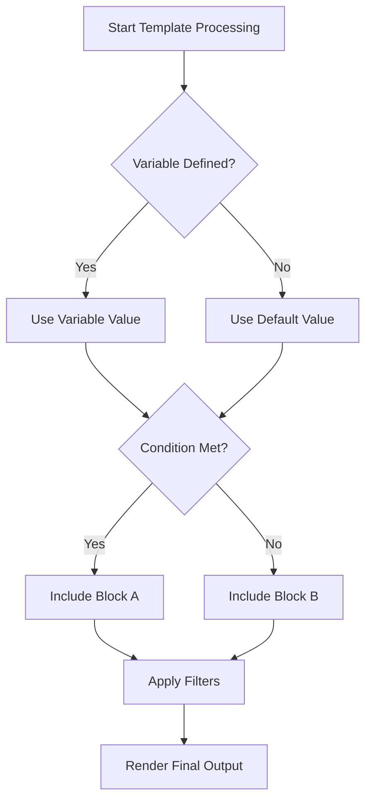

# Ansible Template Logic

## Introduction

Templates are one of Ansible's most powerful features, allowing you to create dynamic configuration files tailored to each managed host. Ansible uses the Jinja2 templating engine, which provides a rich set of logical operations that help you create truly dynamic content.

In this guide, we'll explore the logic capabilities available in Ansible templates, including conditionals, loops, filters, and more. These features allow you to make smarter templates that adapt to different scenarios and requirements.

## Template Logic Fundamentals

Before diving into complex operations, let's understand what makes template logic work in Ansible:

1. **Variables**: The foundation of dynamic templates
2. **Expressions**: Calculations and operations within templates
3. **Control Structures**: Conditionals and loops to control template flow
4. **Filters**: Transform data within templates

## Conditional Statements

Conditional statements in Ansible templates allow you to include or exclude content based on specific conditions.

### Basic If Statements

The most fundamental conditional is the `if` statement:

```jinja

# This is an Ubuntu server
apt_package_manager: apt

# This is a CentOS server
apt_package_manager: yum

# Unknown distribution
apt_package_manager: unknown

```

This will generate different configuration based on the Linux distribution of the target system.

### Ternary Operator

For simple conditions, you can use the ternary operator:

```jinja
server_type: {{ "production" if environment == "prod" else "development" }}
```

This produces:
- `server_type: production` when `environment` is "prod"
- `server_type: development` otherwise

### Testing for Existence

Check if variables exist before using them:

```jinja

port: {{ database_port }}

port: 5432  # Default port

```

## Loops in Templates

Loops allow you to process collections of data in templates.

### For Loops

The basic `for` loop iterates through a list:

```jinja
# Available databases:

- {{ db.name }} ({{ db.type }})

```

If your `databases` variable looks like:
```yaml
databases:
  - name: users
    type: postgres
  - name: logs
    type: mongodb
```

The output would be:
```
# Available databases:
- users (postgres)
- logs (mongodb)
```

### Loop Variables

Jinja2 provides special variables inside loops:

```jinja

server{{ loop.index }}.example.com  # Numbered starting from 1

```

Useful loop variables include:
- `loop.index`: Current iteration (1-indexed)
- `loop.index0`: Current iteration (0-indexed)
- `loop.first`: True if first iteration
- `loop.last`: True if last iteration
- `loop.length`: Total number of items

### Nested Loops

You can nest loops for more complex data structures:

```jinja

[{{ env }}]

{{ server.name }} ansible_host={{ server.ip }}



```

## Filters and Transformations

Filters transform variable data before rendering it in templates.

### Basic Filters

```jinja
{{ username | upper }}  # Convert to uppercase
{{ path | basename }}   # Extract filename from path
{{ number | int }}      # Convert to integer
```

### Default Values

```jinja
{{ database_port | default(5432) }}  # Use 5432 if database_port is undefined
```

### Combining Filters

Chain multiple filters together:

```jinja
{{ filename | basename | splitext | first }}  # Get filename without extension
```

### Working with Lists

Process lists with specialized filters:

```jinja
{{ ['web1', 'web2', 'web3'] | join(', ') }}  # Results in: web1, web2, web3
{{ servers | map(attribute='name') | list }}  # Extract all server names
{{ servers | selectattr('type', 'equalto', 'web') | list }}  # Filter by server type
```

### Custom Filters

Ansible provides many useful filters:

```jinja
{{ secret | password_hash('sha512') }}  # Generate password hash
{{ 192168100 | ipaddr }}  # Format as IP address: 11.128.100.0
{{ data | to_yaml }}  # Convert data to YAML format
```

## Practical Example: Web Server Configuration

Let's look at a complete example of an Nginx configuration template:

```jinja
# server.conf.j2
server {
    listen {{ nginx_port | default(80) }};
    server_name {{ server_name }};

    
    listen 443 ssl;
    ssl_certificate {{ ssl_cert_path }};
    ssl_certificate_key {{ ssl_key_path }};
    

    root {{ web_root }};
    index index.html;

    
    # IP restrictions
    location / {
        
        allow {{ ip }};
        
        deny all;
    }
    

    
    location {{ location.path }} {
        
        {{ key }} {{ value }};
        
    }
    
}
```

When used with this variable set:

```yaml
nginx_port: 8080
server_name: example.com
ssl_enabled: true
ssl_cert_path: /etc/certs/example.com.crt
ssl_key_path: /etc/certs/example.com.key
web_root: /var/www/example
allowed_ips:
  - 192.168.1.0/24
  - 10.0.0.5
custom_locations:
  - path: /api
    options:
      proxy_pass: http://backend:3000
      proxy_set_header: Host $host
  - path: /static
    options:
      expires: 7d
```

The resulting configuration would be:

```
# server.conf.j2
server {
    listen 8080;
    server_name example.com;

    listen 443 ssl;
    ssl_certificate /etc/certs/example.com.crt;
    ssl_certificate_key /etc/certs/example.com.key;

    root /var/www/example;
    index index.html;

    # IP restrictions
    location / {
        allow 192.168.1.0/24;
        allow 10.0.0.5;
        deny all;
    }

    location /api {
        proxy_pass http://backend:3000;
        proxy_set_header Host $host;
    }
    
    location /static {
        expires 7d;
    }
}
```

## Advanced Template Logic

### Macros

Define reusable template code blocks with macros:

```jinja

[database_{{ name }}]
host = {{ host }}
port = {{ port }}
user = {{ user }}
password = {{ password }}


# Main database
{{ database_config('main', 'admin', 'secure_password') }}

# Reporting database
{{ database_config('reports', 'reporter', 'report_pwd', 'reporting.example.com', 5433) }}
```

This would produce:

```
# Main database
[database_main]
host = localhost
port = 5432
user = admin
password = secure_password

# Reporting database
[database_reports]
host = reporting.example.com
port = 5433
user = reporter
password = report_pwd
```

### Template Inheritance

For complex configurations, you can use template inheritance:

```jinja
{# base.conf.j2 #}
global_setting = value


# Default server configuration



log_level = info

```

Then in a child template:

```jinja
{# web_server.conf.j2 #}



# Web server specific settings
threads = {{ threads | default(4) }}
max_connections = {{ max_conn | default(100) }}

```

### Error Handling

Handle undefined variables gracefully:

```jinja

username = {{ user }}

# No user defined, using default
username = nobody

```

## Template Logic Best Practices

1. **Keep Logic Simple**: Complex logic should be handled in playbooks or roles, not templates
2. **Use Defaults**: Always provide default values for optional variables
3. **Document Templates**: Comment your templates, especially complex logic
4. **Test Thoroughly**: Validate templates with different variable sets
5. **Variable Naming**: Use clear, consistent naming for variables

## Debugging Template Logic

When templates don't render as expected, use these debugging techniques:

### Debug Filter

```jinja
{{ variable | debug }}
```

### Verbosity in Ansible

Run your playbook with increased verbosity:

```bash
ansible-playbook -vvv playbook.yml
```

### Template Testing

Test templates locally before deploying:

```bash
ansible-playbook playbook.yml --check --diff
```

## Visualizing Template Flow



## Summary

Ansible template logic combines the power of Jinja2 templating with Ansible's variable system to create dynamic, adaptive configuration files. The key components we've explored include:

- Conditional statements for situational configuration
- Loops for processing collections of data
- Filters for transforming and manipulating variables
- Advanced features like macros and inheritance for reusable templates

By mastering these template logic concepts, you can create sophisticated configurations that automatically adapt to different environments, reducing duplication and increasing consistency across your infrastructure.

## Exercises

1. Create a template for an Apache virtual host that changes based on whether the environment is development, staging, or production.
2. Build a database configuration template that supports multiple database types (MySQL, PostgreSQL, MongoDB) with appropriate settings for each.
3. Create a logging configuration template that can be customized based on the application and environment.

## Additional Resources

- [Jinja2 Documentation](https://jinja.palletsprojects.com/)
- [Ansible Template Module](https://docs.ansible.com/ansible/latest/collections/ansible/builtin/template_module.html)
- [Ansible Filter Guide](https://docs.ansible.com/ansible/latest/user_guide/playbooks_filters.html)