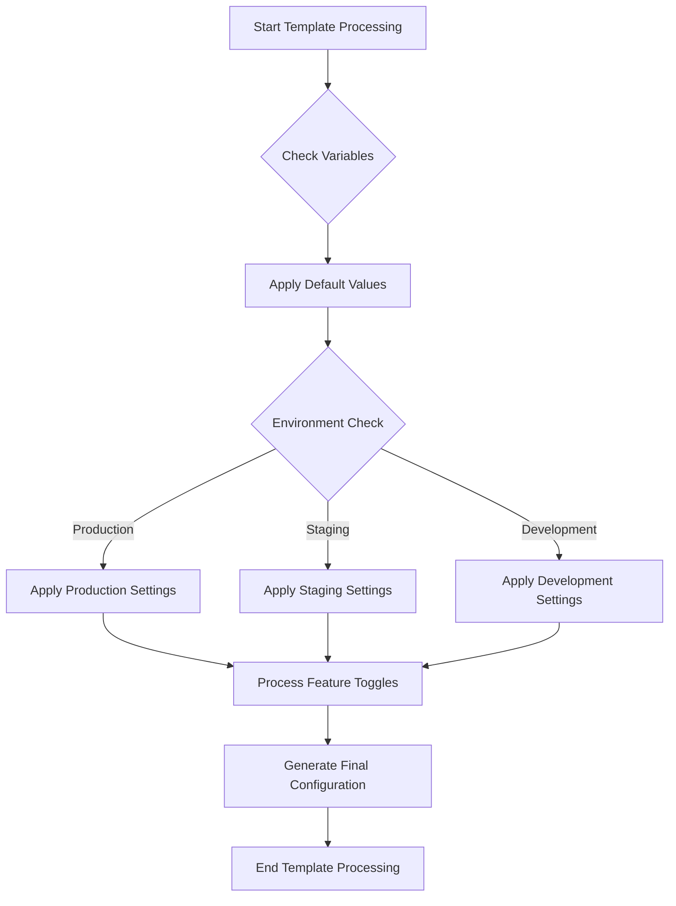

# Ansible Template Conditionals

## Introduction

When managing infrastructure with Ansible, you'll often need to create configuration files that vary based on different conditions. Ansible templates, powered by the Jinja2 templating engine, provide powerful conditional capabilities that let you generate dynamic content.

In this guide, we'll explore how to use conditionals in Ansible templates to create flexible and adaptable configuration files. These conditionals help you build templates that can adjust their output based on variable values, host facts, or other criteria.

## Understanding Template Conditionals

Ansible templates use Jinja2's conditional syntax to control what content appears in the final rendered file. This allows you to:

- Include or exclude sections of configuration based on conditions
- Set different values depending on environment, operating system, or other factors
- Create highly customized configurations from a single template

## Basic Conditional Syntax

The most basic form of a conditional in Jinja2 templates uses the `if`-`else`-`endif` structure.

### Simple If Statement

```jinja

This will appear if the condition is true

```

### If-Else Statement

```jinja

This will appear if the condition is true

This will appear if the condition is false

```

### If-Elif-Else Statement

```jinja

This will appear if condition1 is true

This will appear if condition1 is false but condition2 is true

This will appear if both condition1 and condition2 are false

```

## Practical Examples

Let's explore some practical examples of using conditionals in Ansible templates.

### Example 1: Configuring a Web Server Based on Environment

Here's a template for an Nginx configuration file that adjusts settings based on the deployment environment:

```jinja
server {
    listen 80;
    server_name {{ server_name }};

    
    # Production-specific settings
    worker_connections 1024;
    keepalive_timeout 10;
    
    # Staging-specific settings
    worker_connections 512;
    keepalive_timeout 30;
    
    # Development settings
    worker_connections 256;
    keepalive_timeout 65;
    

    # Common configuration continues here
    root /var/www/html;
    index index.html;
}
```

In your Ansible playbook, you would set the `environment` variable:

```yaml
- name: Configure Nginx
  template:
    src: nginx.conf.j2
    dest: /etc/nginx/sites-available/default
  vars:
    environment: "production"
    server_name: "example.com"
```

### Example 2: OS-Specific Configuration

This template uses Ansible facts to determine the operating system and generates appropriate configuration:

```jinja
# Package management configuration

package_manager: apt
update_command: apt-get update

package_manager: yum
update_command: yum update

# Default configuration
package_manager: unknown
update_command: echo "Unknown OS family"

```

### Example 3: Feature Toggles

You can use conditionals to enable or disable features in your configuration:

```jinja
# Application configuration file

# Core settings
app_port: 8080
log_level: info


# Monitoring settings
monitoring_port: 9090
metrics_endpoint: /metrics
prometheus_scrape: true



# SSL Configuration
ssl_enabled: true
ssl_cert_path: /etc/ssl/certs/app.crt
ssl_key_path: /etc/ssl/private/app.key

```

In your playbook, you control which features are enabled:

```yaml
- name: Generate application config
  template:
    src: app.conf.j2
    dest: /etc/app/config.yaml
  vars:
    enable_monitoring: true
    enable_ssl: false
```

## Conditional Operators

Jinja2 offers various operators for creating conditions:

### Comparison Operators

- `==`: Equal to
- `!=`: Not equal to
- `>`: Greater than
- `>=`: Greater than or equal to
- `<`: Less than
- `<=`: Less than or equal to

### Logical Operators

- `and`: Logical AND
- `or`: Logical OR
- `not`: Logical NOT

### Example with Multiple Conditions

```jinja

# SSL is enabled - configure secure settings
ssl_protocols TLSv1.2 TLSv1.3;
ssl_ciphers HIGH:!aNULL:!MD5;

```

## Checking if Variables Exist

Before using a variable, you might need to check if it's defined:

### Using the `defined` Test

```jinja

# Use the special configuration
special_option: {{ special_config }}

# Use default configuration
special_option: default

```

### Using the `default` Filter

The `default` filter provides a fallback value if a variable is undefined:

```jinja
debug_mode: {{ debug | default(false) }}
timeout: {{ request_timeout | default(30) }}
```

## Conditional Loops

You can combine conditionals with loops to filter items:

```jinja
Available servers:

  
server {{ server.name }} ({{ server.ip }})
  

```

## Real-World Example: Multi-Environment Database Configuration

Here's a more complete example of a database configuration template that adapts to different environments:

```jinja
# Database configuration for {{ application_name }}
# Generated by Ansible on {{ ansible_date_time.date }}

[database]
driver = {{ db_driver | default('postgresql') }}
host = {{ db_host }}
port = {{ db_port | default(5432) }}
name = {{ db_name }}


# Production database settings
pool_size = 20
max_overflow = 10
pool_timeout = 30
pool_recycle = 3600
ssl_mode = require

# Staging database settings
pool_size = 10
max_overflow = 5
pool_timeout = 60
pool_recycle = 1800
ssl_mode = prefer

# Development database settings
pool_size = 5
max_overflow = 2
pool_timeout = 90
pool_recycle = 300
ssl_mode = disable


[credentials]

# Use environment variables for credentials
use_env_vars = true
username_var = DB_USERNAME
password_var = DB_PASSWORD

# Hardcoded credentials (not recommended for production)
use_env_vars = false
username = {{ db_username }}
password = {{ db_password }}



[backup]
enabled = true
schedule = {{ db_backup_schedule | default('0 2 * * *') }}
retention_days = {{ db_backup_retention | default(7) }}
storage_path = {{ db_backup_path | default('/var/backups/db') }}

```

This template adjusts connection pool settings based on environment and conditionally includes backup configuration when enabled.

## Advanced Techniques

### Inline Conditionals (Ternary Operator)

For simple conditions, you can use the ternary operator syntax:

```jinja
debug_level: {{ "debug" if debug_mode else "info" }}
max_connections: {{ 100 if environment == "production" else 20 }}
```

### Using the `is` and `in` Operators

The `is` operator is used with tests, and `in` checks for containment:

```jinja

# Debian-based system configuration



user: {{ username }}

```

### Using `not` with Tests

You can combine `not` with tests:

```jinja

app_version: 1.0.0  # Default version

```

## Best Practices

1. **Keep logic simple**: Move complex logic to Ansible tasks or roles rather than templates
2. **Use defaults**: Provide sensible defaults with the `default` filter
3. **Validate inputs**: Check if variables are defined before using them
4. **Comment your conditions**: Explain the purpose of conditional blocks
5. **Consistent indentation**: Maintain proper indentation for readability
6. **Group related conditions**: Keep related conditional blocks together

## Flow Diagram for Template Processing



## Summary

Conditionals in Ansible templates provide powerful flexibility when generating configuration files. By mastering these techniques, you can create templates that adapt to different environments, operating systems, and deployment scenarios.

With Jinja2's conditional syntax, you can:
- Include or exclude configuration sections based on conditions
- Provide environment-specific settings
- Implement feature toggles
- Set defaults for missing variables
- Generate highly customized configurations from a single template

This approach allows you to maintain a single source of truth while deploying appropriately configured files across your infrastructure.

## Additional Resources

- [Jinja2 Template Designer Documentation](https://jinja.palletsprojects.com/en/3.0.x/templates/)
- [Ansible Template Module Documentation](https://docs.ansible.com/ansible/latest/collections/ansible/builtin/template_module.html)

## Exercises

1. Create a template for an Apache virtual host configuration that changes settings based on whether it's a development, staging, or production environment.

2. Design a template for a logging configuration that enables different log levels and destinations based on the environment and available disk space.

3. Build a template for a load balancer configuration that dynamically includes backend servers from an Ansible inventory group, but only if they have a specific tag or property.