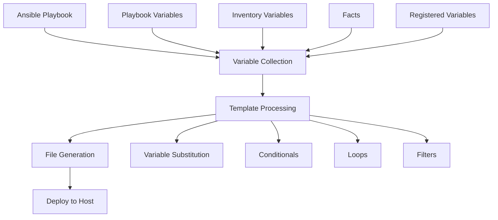

# Ansible Template Variables

## Introduction

When managing infrastructure with Ansible, you'll often need to generate configuration files that vary slightly between servers. Rather than maintaining separate files for each server, Ansible templates allow you to create a single template file and populate it with different values for each host. This is made possible through **Ansible template variables**.

Template variables are placeholders in your template files that Ansible replaces with actual values during playbook execution. Ansible's templating system is powered by the **Jinja2** templating engine, which provides a flexible way to incorporate variables, conditionals, loops, and filters in your templates.

In this guide, we'll explore how to use variables in Ansible templates to create dynamic configuration files that adapt to your infrastructure needs.

## Basic Variable Usage

The most fundamental use of variables in templates is straightforward substitution. Variables are enclosed in double curly braces `{{ }}`.

### Example: Basic Variable Substitution

Let's create a simple template for an NGINX server configuration:

**Template file (`nginx.conf.j2`):**

```jinja2
server {
    listen {{ nginx_port }};
    server_name {{ server_hostname }};

    root {{ web_root }};
    index index.html;
}
```

**Ansible playbook (`deploy_nginx.yml`):**

```yaml
---
- name: Configure NGINX
  hosts: webservers
  vars:
    nginx_port: 80
    server_hostname: example.com
    web_root: /var/www/html
  
  tasks:
    - name: Generate NGINX configuration
      template:
        src: nginx.conf.j2
        dest: /etc/nginx/conf.d/default.conf
      notify:
        - restart nginx
  
  handlers:
    - name: restart nginx
      service:
        name: nginx
        state: restarted
```

**Generated output (`/etc/nginx/conf.d/default.conf`):**

```nginx
server {
    listen 80;
    server_name example.com;

    root /var/www/html;
    index index.html;
}
```

## Variable Sources

Ansible template variables can come from multiple sources:

1. **Playbook variables**: Defined directly in your playbooks with `vars:` or `vars_files:`.
2. **Inventory variables**: Defined in your inventory files or in host/group vars directories.
3. **Facts**: Information gathered automatically by Ansible about managed hosts.
4. **Registered variables**: Values captured from task output.
5. **Role defaults and variables**: Defined in roles structure.
6. **Extra variables**: Passed via the command line with `-e` or `--extra-vars`.

### Example: Using Different Variable Sources

**Inventory file (`inventory.ini`):**

```ini
[webservers]
web1.example.com

[webservers:vars]
web_environment=production
```

**Host variables file (`host_vars/web1.example.com.yml`):**

```yaml
nginx_port: 8080
server_hostname: web1.example.com
```

**Group variables file (`group_vars/webservers.yml`):**

```yaml
web_root: /var/www/production
```

**Template file (`nginx.conf.j2`):**

```jinja2
# Server configuration for {{ server_hostname }}
# Environment: {{ web_environment }}
server {
    listen {{ nginx_port }};
    server_name {{ server_hostname }};

    root {{ web_root }};
    index index.html;

    # Include server facts
    # Managed by Ansible on {{ ansible_facts['date_time']['date'] }}
    # Server OS: {{ ansible_facts['distribution'] }} {{ ansible_facts['distribution_version'] }}
}
```

## Accessing Complex Variables

Ansible variables can be complex data structures like dictionaries and lists. Jinja2 provides syntax to access these nested values.

### Dictionaries

Access dictionary values using the dot notation or square brackets:

```jinja2
{{ user.name }} or {{ user['name'] }}
```

### Example: Dictionary Variables

**Playbook variables:**

```yaml
app_config:
  port: 3000
  log_level: info
  database:
    host: db.example.com
    port: 5432
    name: myapp
```

**Template usage:**

```jinja2
# Application configuration
port={{ app_config.port }}
log_level={{ app_config.log_level }}

# Database configuration
db_host={{ app_config.database.host }}
db_port={{ app_config.database.port }}
db_name={{ app_config.database.name }}
```

### Lists

Access list items using the index:

```jinja2
{{ users[0] }}
```

### Example: List Variables

**Playbook variables:**

```yaml
allowed_hosts:
  - 192.168.1.10
  - 192.168.1.11
  - 192.168.1.12
```

**Template usage:**

```jinja2
# Allowed hosts
allowed_hosts = [

  "{{ host }}",

]
```

## Conditional Statements

Template variables can be used in conditional statements to include or exclude parts of your configuration based on certain conditions.

### Example: Conditional Configuration

**Template file (`apache.conf.j2`):**

```jinja2
<VirtualHost *:{{ apache_port | default(80) }}>
    ServerName {{ server_name }}
    DocumentRoot {{ document_root }}

    
    SSLEngine on
    SSLCertificateFile {{ ssl_cert_file }}
    SSLCertificateKeyFile {{ ssl_key_file }}
    

    
    # Development-specific settings
    LogLevel debug
    
    # Production-specific settings
    LogLevel warn
    
    # Default settings
    LogLevel info
    
</VirtualHost>
```

## Loops in Templates

You can use loops in templates to generate repetitive configuration blocks based on variables.

### Example: Loop Through a List

**Playbook variables:**

```yaml
web_apps:
  - name: app1
    port: 8001
    path: /app1
  - name: app2
    port: 8002
    path: /app2
  - name: app3
    port: 8003
    path: /app3
```

**Template file (`nginx_proxy.conf.j2`):**

```jinja2
# Proxy configuration for multiple applications


upstream {{ app.name }} {
    server 127.0.0.1:{{ app.port }};
}

location {{ app.path }} {
    proxy_pass http://{{ app.name }};
    proxy_set_header Host $host;
    proxy_set_header X-Real-IP $remote_addr;
}

```

## Filters

Jinja2 filters allow you to transform variable values before they're inserted into templates. Ansible extends the default Jinja2 filters with many additional ones.

### Common Filters

- `default`: Provides a default value if the variable is undefined
- `upper`, `lower`: Converts text to uppercase or lowercase
- `join`: Joins list elements into a string
- `to_json`, `to_yaml`: Converts a variable to JSON or YAML format
- `regex_replace`: Replaces text using regular expressions

### Example: Using Filters

**Template file (`config.properties.j2`):**

```jinja2
# Database configuration
db.host={{ database.host | default('localhost') }}
db.port={{ database.port | default(5432) }}
db.name={{ database.name | lower }}

# Application settings
app.environment={{ environment | upper }}
app.debug={{ debug | default(false) | bool | string }}
app.allowed_ips={{ allowed_ips | join(',') }}

# Timestamp
generated.on={{ ansible_facts.date_time.iso8601 }}
```

## Working with Ansible Facts

Ansible facts provide a wealth of information about your target hosts that you can use in your templates.

### Example: System Configuration Template

**Template file (`system_info.conf.j2`):**

```jinja2
# System Information for {{ ansible_facts['hostname'] }}
# Generated by Ansible on {{ ansible_facts['date_time']['date'] }}

OS: {{ ansible_facts['distribution'] }} {{ ansible_facts['distribution_version'] }}
Architecture: {{ ansible_facts['architecture'] }}
Kernel: {{ ansible_facts['kernel'] }}

# Memory Information
Total Memory: {{ (ansible_facts['memtotal_mb'] / 1024) | round(2) }} GB
Swap Space: {{ (ansible_facts['swaptotal_mb'] / 1024) | round(2) }} GB

# Network Information


Interface {{ interface }}:
  IP Address: {{ data.ipv4.address | default('Not configured') }}
  Netmask: {{ data.ipv4.netmask | default('Not configured') }}


```

## Combining Variables with Logical Operations

Jinja2 allows for complex logical operations with variables.

### Example: Advanced Conditional Logic

**Template file (`security.conf.j2`):**

```jinja2
# Security configuration


require_ssl = true
ssl_min_version = TLSv1.2

require_ssl = true
ssl_min_version = TLSv1.1

require_ssl = false


# IP restrictions

allowed_networks = {{ allowed_networks | join(',') }}

additional_allowed = {{ additional_networks | join(',') }}


# No IP restrictions applied

```

## Practical Example: Creating a Multi-Environment Configuration

Let's create a practical example for a web application that requires different configurations based on the environment.

### Directory Structure

```
ansible/
├── inventory/
│   ├── production
│   └── staging
├── group_vars/
│   ├── all.yml
│   ├── production.yml
│   └── staging.yml
├── templates/
│   └── app_config.json.j2
└── deploy_app.yml
```

### Variables Definition

**group_vars/all.yml**:

```yaml
app_name: mywebapp
app_port: 3000
log_format: json
```

**group_vars/production.yml**:

```yaml
environment: production
debug_mode: false
database:
  host: prod-db.example.com
  port: 5432
  user: app_user
  name: app_production
cache:
  enabled: true
  ttl: 3600
```

**group_vars/staging.yml**:

```yaml
environment: staging
debug_mode: true
database:
  host: staging-db.example.com
  port: 5432
  user: app_user
  name: app_staging
cache:
  enabled: false
  ttl: 60
```

### Template

**templates/app_config.json.j2**:

```jinja2
{
  "appName": "{{ app_name }}",
  "environment": "{{ environment }}",
  "port": {{ app_port }},
  "debug": {{ debug_mode | bool | lower }},
  "logConfig": {
    "format": "{{ log_format }}",
    "level": "{{ 'debug' if debug_mode else 'info' }}"
  },
  "database": {
    "host": "{{ database.host }}",
    "port": {{ database.port }},
    "user": "{{ database.user }}",
    "name": "{{ database.name }}"
  },
  "cache": {
    "enabled": {{ cache.enabled | bool | lower }},
    
    "ttl": {{ cache.ttl }},
    "provider": "{{ 'redis' if environment == 'production' else 'memory' }}"
    
    "provider": "none"
    
  },
  "generatedBy": "Ansible on {{ ansible_facts.date_time.iso8601 }}"
}
```

### Playbook

**deploy_app.yml**:

```yaml
---
- name: Deploy application configuration
  hosts: all
  tasks:
    - name: Create application directory
      file:
        path: "/opt/{{ app_name }}/config"
        state: directory
        mode: '0755'
      
    - name: Generate application config
      template:
        src: templates/app_config.json.j2
        dest: "/opt/{{ app_name }}/config/config.json"
        mode: '0644'
      notify:
        - restart application

  handlers:
    - name: restart application
      service:
        name: "{{ app_name }}"
        state: restarted
```

## Template Flow Control Diagram

Here's a visual representation of how template variables are processed:



## Best Practices for Template Variables

1. **Use meaningful variable names**: Choose descriptive names that indicate the purpose of the variable.

2. **Organize variables hierarchically**: Group related variables in dictionaries to keep them organized.

3. **Provide default values**: Use the `default` filter to ensure templates work even if a variable is not defined.

   ```jinja2
   {{ app_port | default(8080) }}
   ```

4. **Use the appropriate data types**: Boolean values should be boolean, numbers should be numeric.

5. **Escape special characters**: Use quotes for strings containing special characters in YAML.

6. **Comment your templates**: Add comments to explain complex logic or variable usage.

7. **Use environment-specific variables**: Structure your variables based on environments.

8. **Validate variables**: Use Ansible's `assert` module to validate variable values before applying templates.

   ```yaml
   - name: Validate variables
     assert:
       that:
         - app_port is defined and app_port | int > 0
         - app_name is defined and app_name | length > 0
       fail_msg: "Required variables are missing or invalid"
   ```

## Summary

Ansible template variables provide a powerful mechanism for creating dynamic configuration files that adapt to your infrastructure needs. By leveraging Jinja2's templating capabilities, you can:

- Substitute variables with actual values
- Apply conditionals to include or exclude configuration sections
- Use loops to generate repetitive configuration blocks
- Transform values using filters
- Access complex data structures
- Utilize system facts for host-specific configurations

This approach allows you to maintain a single template file instead of multiple static configuration files, significantly reducing maintenance overhead and ensuring consistency across your infrastructure.

## Exercises

1. Create a template for an Apache virtual host configuration that supports both HTTP and HTTPS based on variables.

2. Design a template for a database configuration file that supports multiple database types (MySQL, PostgreSQL) with appropriate settings for each.

3. Build a template for a load balancer configuration that dynamically includes backend servers from an Ansible inventory.

4. Create a template that generates different logging configurations based on the environment (development, staging, production).

5. Design a template for a firewall configuration that includes rules from a list of dictionaries containing service names, ports, and allowed IP ranges.

## Additional Resources

- [Ansible Template Documentation](https://docs.ansible.com/ansible/latest/collections/ansible/builtin/template_module.html)
- [Jinja2 Template Designer Documentation](https://jinja.palletsprojects.com/en/3.0.x/templates/)
- [Ansible Variable Precedence](https://docs.ansible.com/ansible/latest/playbook_guide/playbooks_variables.html#variable-precedence-where-should-i-put-a-variable)
- [Ansible Best Practices](https://docs.ansible.com/ansible/latest/tips_tricks/ansible_tips_tricks.html)