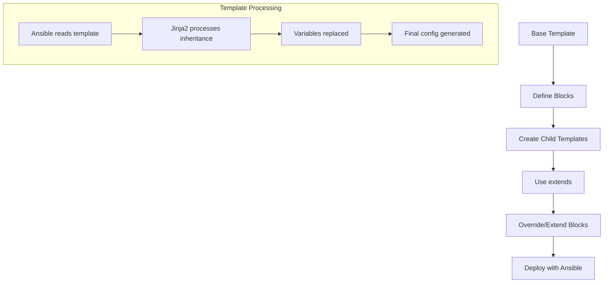

# Ansible Template Inheritance

## Introduction

Template inheritance is a powerful feature in Ansible that allows you to create reusable, modular templates. This concept leverages Jinja2's inheritance capabilities to help you maintain consistent structure across multiple templates while reducing duplication.

In this guide, we'll explore how to use template inheritance in Ansible, enabling you to create base templates that can be extended and customized for specific use cases.

## Understanding Template Inheritance

Template inheritance works similarly to object-oriented programming inheritance. You create a "base" or "parent" template that defines the overall structure, and then "child" templates can:

1. Inherit this structure
2. Override specific sections
3. Add new content where needed

This approach promotes:

- **DRY (Don't Repeat Yourself)** principles
- **Consistency** across configuration files
- **Easier maintenance** by centralizing common elements

## Basic Concepts of Jinja2 Template Inheritance

Before we dive into Ansible-specific examples, let's understand the core concepts of Jinja2 template inheritance:

### Blocks and Block Inheritance

The inheritance system uses three primary directives:

- ``: Defines a section that child templates can override
- ``: Indicates that this template inherits from another
- `{{ super() }}`: References the content of the parent block (useful when extending rather than completely replacing)

## Creating a Base Template

Let's start by creating a base template for a web server configuration:

```jinja
{# base_nginx.conf.j2 #}
server {
    listen 80;
    server_name {{ server_name }};

    
    # Default server configuration
    root /var/www/html;
    index index.html;
    

    
    access_log /var/log/nginx/access.log;
    error_log /var/log/nginx/error.log;
    

    
    # Default security settings
    
}
```

This base template defines the structure with three blocks that can be customized:
- `server_config`: For basic server configuration
- `logging`: For log settings
- `security`: For security-related configurations

## Creating Child Templates

Now, let's create a child template that extends our base:

```jinja
{# php_nginx.conf.j2 #}



# PHP application configuration
root /var/www/php_app;
index index.php index.html;

location ~ \.php$ {
    include snippets/fastcgi-php.conf;
    fastcgi_pass unix:/var/run/php/php7.4-fpm.sock;
}



# PHP-specific security settings
location ~ /\.ht {
    deny all;
}

```

Note how this template:
- Extends the base template
- Overrides the `server_config` block with PHP-specific settings
- Adds security settings to the `security` block
- Inherits the `logging` block without changes

## Using the `super()` Function

Sometimes you want to extend a block rather than completely replace it. The `super()` function allows you to include the parent block's content:

```jinja
{# secure_nginx.conf.j2 #}



{{ super() }}
# Additional security headers
add_header X-Frame-Options "SAMEORIGIN";
add_header X-Content-Type-Options "nosniff";
add_header X-XSS-Protection "1; mode=block";

```

In this example, we're keeping the default security settings and adding more security headers.

## Practical Example: Implementing Template Inheritance in Ansible

Let's see how to implement template inheritance in an Ansible playbook:

### Directory Structure

First, set up your directory structure:

```
ansible_project/
├── playbooks/
│   └── configure_webservers.yml
├── templates/
│   ├── base_nginx.conf.j2
│   ├── php_nginx.conf.j2
│   └── secure_nginx.conf.j2
├── inventory.ini
└── ansible.cfg
```

### Ansible Playbook

Now, create a playbook that uses these templates:

```yaml
# configure_webservers.yml
---
- name: Configure web servers
  hosts: webservers
  become: yes
  vars:
    server_name: example.com
  tasks:
    - name: Create Nginx configuration for PHP servers
      template:
        src: php_nginx.conf.j2
        dest: /etc/nginx/sites-available/php_app.conf
      when: inventory_hostname in groups['php_servers']
      notify: Restart Nginx

    - name: Create Nginx configuration for secure servers
      template:
        src: secure_nginx.conf.j2
        dest: /etc/nginx/sites-available/secure_app.conf
      when: inventory_hostname in groups['secure_servers']
      notify: Restart Nginx

  handlers:
    - name: Restart Nginx
      service:
        name: nginx
        state: restarted
```

### Inventory File Example

```ini
# inventory.ini
[webservers]
web1.example.com
web2.example.com
web3.example.com

[php_servers]
web1.example.com

[secure_servers]
web2.example.com
web3.example.com
```

## Advanced Template Inheritance Techniques

### Nested Inheritance

You can create multiple levels of inheritance for more complex configurations:

```
Base Template → Framework-specific Template → Application-specific Template
```

For example:

```jinja
{# framework_nginx.conf.j2 #}



# Framework common settings
root /var/www/framework;
index index.php index.html;

```

Then:

```jinja
{# laravel_nginx.conf.j2 #}



{{ super() }}
# Laravel specific configuration
location / {
    try_files $uri $uri/ /index.php?$query_string;
}

```

### Conditional Blocks

You can use Ansible variables within your templates to conditionally include content:

```jinja


location ~* \.(jpg|jpeg|png|gif|ico|css|js)$ {
    expires 30d;
    add_header Cache-Control "public, no-transform";
}


```

## Real-World Application: Multi-Environment Configuration

A common use case for template inheritance is managing configurations across different environments (development, staging, production):

### Base Template

```jinja
{# base_app_config.j2 #}
application:
  name: "{{ app_name }}"
  
  
  database:
    host: localhost
    name: app_db
    user: app_user
  
  
  
  features:
    cache: true
    logging: true
  
  
  
  security:
    encryption: aes-256
  
```

### Production Environment Template

```jinja
{# production_app_config.j2 #}



database:
  host: "{{ prod_db_host }}"
  name: "{{ prod_db_name }}"
  user: "{{ prod_db_user }}"
  connection_pool: 20
  read_replica: true



security:
  encryption: aes-256
  ssl: true
  headers:
    strict_transport: true
    content_security: "default-src 'self'"

```

### Development Environment Template

```jinja
{# development_app_config.j2 #}



{{ super() }}
  debug: true
  profiling: true

```

## Implementation Flow

Let's visualize the template inheritance flow:



## Best Practices for Template Inheritance

1. **Keep the base template simple**: Include only the structure and blocks that are truly common.

2. **Use meaningful block names**: Choose descriptive names that clearly indicate the purpose of each section.

3. **Document your templates**: Add comments explaining the purpose of blocks and expected variables.

4. **Be consistent with indentation**: Maintain consistent indentation to make templates readable.

5. **Use default values**: Provide sensible defaults for variables to make templates more robust.

6. **Test your templates**: Verify the generated output for each environment before deploying.

7. **Version control**: Keep your templates in version control alongside your Ansible code.

## Common Pitfalls and Troubleshooting

### Template Not Found Errors

If you encounter "template not found" errors, check:

1. The path in the `extends` statement is relative to the location where Ansible runs
2. The template search path in your `ansible.cfg`

You might need to use the full path:

```jinja

```

Or configure the template path in `ansible.cfg`:

```ini
[defaults]
template_path = /path/to/templates
```

### Unexpected Output

If the generated configuration isn't what you expect:

1. Use Ansible's `debug` module to view the processed template
2. Check for whitespace issues in your templates
3. Verify block names match exactly between parent and child templates

Example debug task:

```yaml
- name: Debug template output
  debug:
    msg: "{{ lookup('template', 'php_nginx.conf.j2') }}"
```

## Summary

Template inheritance in Ansible offers a powerful way to create modular, maintainable configuration templates. By leveraging Jinja2's inheritance capabilities, you can:

- Create base templates with common structures
- Override specific sections where needed
- Extend existing blocks with additional content
- Keep your configurations DRY and consistent across environments

This approach is particularly valuable for managing complex configurations across multiple environments or for different variations of similar services.

## Exercises

1. Create a base template for an Apache web server configuration with blocks for virtual hosts, logging, and security.

2. Extend your base template to create configurations for a static website and a dynamic application.

3. Implement a multi-tier template inheritance structure for a database configuration that handles development, staging, and production environments.

4. Create a template for a load balancer configuration that uses conditional blocks based on Ansible variables.

## Additional Resources

- [Ansible Template Documentation](https://docs.ansible.com/ansible/latest/user_guide/playbooks_templating.html)
- [Jinja2 Template Inheritance Documentation](https://jinja.palletsprojects.com/en/3.0.x/templates/#template-inheritance)
- [Ansible Best Practices Guide](https://docs.ansible.com/ansible/latest/user_guide/playbooks_best_practices.html)