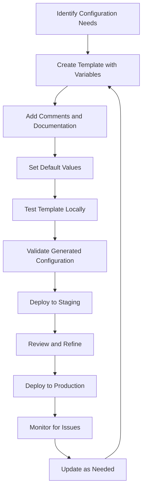

# Ansible Template Best Practices

## Introduction

Ansible templates are powerful tools that allow you to generate dynamic configuration files based on variables. Templates use the Jinja2 templating engine, which provides extensive functionality for transforming data into structured configuration files. While templates are flexible, following best practices ensures your configuration management remains maintainable, efficient, and error-free.

This guide explores essential best practices for working with Ansible templates, helping beginners avoid common pitfalls and create robust automation solutions.

## Template Basics Refresher

Before diving into best practices, let's quickly review what templates are in Ansible:

Templates in Ansible are files with the `.j2` extension (for Jinja2) that contain both static content and dynamic expressions. When Ansible processes a template, it replaces variables and expressions with their actual values, generating a configuration file specific to each managed host.

Example template structure:
```jinja
# {{ ansible_managed }}
# Configuration for {{ inventory_hostname }}

server_name: {{ server_name }}
max_connections: {{ max_connections | default(100) }}


user_access: {{ user }}

```

With that refresher, let's explore the best practices that will help you create better templates.

## Directory Organization

### Use a Consistent Directory Structure

**Best Practice**: Organize your templates in a logical directory structure that mirrors their purpose.

```
roles/
  └── webserver/
      ├── templates/
      │   ├── nginx/
      │   │   ├── nginx.conf.j2
      │   │   └── vhost.conf.j2
      │   └── ssl/
      │       └── ssl-params.conf.j2
      └── tasks/
          └── main.yml
```

**Why it matters**: A well-organized directory structure makes it easier to locate templates, especially in complex roles with multiple configurations.

### Template Naming Conventions

**Best Practice**: Use descriptive names for templates and always include the `.j2` extension.

```
nginx.conf.j2  # Good: Clearly indicates an Nginx config template
web_cfg.j2     # Less clear: Doesn't specify what type of web configuration
```

**Why it matters**: Consistent naming makes it easier to understand what each template generates without having to examine the contents.

## Template Content Best Practices

### Use the `ansible_managed` Variable

**Best Practice**: Include the `ansible_managed` variable at the top of your templates.

```jinja
# {{ ansible_managed }}
# Last modified: {{ template_run_date }}

server {
    listen 80;
    server_name {{ server_name }};
    # ...
}
```

**Why it matters**: This clearly indicates that the file is managed by Ansible and should not be edited directly. It also provides information about when the template was last processed.

### Comment Your Templates

**Best Practice**: Add comments explaining complex logic or non-obvious configurations.

```jinja
# {{ ansible_managed }}


# SSL configuration enabled - redirecting HTTP to HTTPS
server {
    listen 80;
    server_name {{ server_name }};
    return 301 https://$host$request_uri;
}

# Standard HTTP-only configuration
server {
    listen 80;
    server_name {{ server_name }};
    # ...
}

```

**Why it matters**: Comments help other team members (and your future self) understand why certain decisions were made in the template.

### Use Default Values for Variables

**Best Practice**: Provide default values for variables using the `default` filter.

```jinja
# Server configuration
server_name: {{ server_name }}
max_connections: {{ max_connections | default(100) }}
timeout: {{ timeout | default(30) }}
```

**Why it matters**: Default values prevent template rendering failures when variables are undefined, making your templates more robust.

## Working with Conditionals and Loops

### Keep Conditional Logic Simple

**Best Practice**: Keep conditional logic in templates as simple as possible. For complex logic, use variables defined in your playbooks or roles.

```jinja
# Good approach

feature_setting = enabled

feature_setting = disabled


# Better approach for complex conditions

feature_setting = {{ feature_setting_value }}

```

**Why it matters**: Moving complex logic to your Ansible variables makes templates easier to read and maintain.

### Use Loop Variables Carefully

**Best Practice**: Be explicit about loop variables and their scopes.

```jinja

  # Access for {{ user.name }}
  user {{ user.name }} {
    permissions = {{ user.permissions | join(',') }}
  }

```

**Why it matters**: Clear loop variable usage prevents unintended behavior and makes templates easier to debug.

## Error Handling and Validation

### Validate Template Output

**Best Practice**: Add validation tasks after template deployment to verify the generated configuration is valid.

```yaml
- name: Deploy Nginx configuration
  template:
    src: nginx.conf.j2
    dest: /etc/nginx/nginx.conf
  register: nginx_config

- name: Validate Nginx configuration
  command: nginx -t
  changed_when: false
  when: nginx_config.changed
```

**Why it matters**: Validating configurations prevents service disruptions from invalid configurations.

### Use Defensive Programming

**Best Practice**: Use defensive programming techniques to handle potentially missing or invalid data.

```jinja

# Backend server configuration
upstream backend {
  
  server {{ server.ip }}:{{ server.port | default(8080) }};
  
}

# No backend servers defined
upstream backend {
  server 127.0.0.1:8080 fail_timeout=0;
}

```

**Why it matters**: Defensive programming ensures your templates generate valid configurations even with incomplete data.

## Performance Considerations

### Minimize Template Processing

**Best Practice**: Avoid unnecessary template processing by using the `changed_when` directive with appropriate conditions.

```yaml
- name: Generate configuration file
  template:
    src: app.conf.j2
    dest: /etc/app/app.conf
  register: template_result
  changed_when: template_result.changed
  notify: Restart application
```

**Why it matters**: Minimizing template processing improves playbook performance and reduces unnecessary service restarts.

### Use Template Caching When Appropriate

**Best Practice**: For large environments, consider using Ansible's fact caching to improve template rendering performance.

In `ansible.cfg`:
```ini
[defaults]
fact_caching = jsonfile
fact_caching_connection = /path/to/fact/cache
fact_caching_timeout = 7200
```

**Why it matters**: Template caching can significantly improve performance in large environments with many hosts.

## Security Considerations

### Protect Sensitive Data

**Best Practice**: Never include plaintext secrets in templates. Use Ansible Vault or other secure methods to manage sensitive data.

```jinja
# Database configuration
db_host: {{ db_host }}
db_user: {{ db_user }}
db_password: {{ db_password }}  # This should come from an encrypted vault
```

**Why it matters**: Protecting sensitive data prevents security breaches and follows security best practices.

### Template Permissions

**Best Practice**: Set appropriate permissions for generated files, especially for configurations containing sensitive information.

```yaml
- name: Deploy SSL private key
  template:
    src: ssl/private.key.j2
    dest: /etc/ssl/private/server.key
    owner: root
    group: root
    mode: '0600'
```

**Why it matters**: Proper file permissions prevent unauthorized access to sensitive configurations.

## Real-World Example: Web Server Configuration

Let's apply these best practices to a real-world example of configuring an Nginx web server:

**Template File**: `nginx/vhost.conf.j2`
```jinja
# {{ ansible_managed }}
# Virtual Host configuration for {{ domain_name }}
# Generated by Ansible on {{ template_run_date }}

server {
    
    listen 443 ssl http2;
    listen [::]:443 ssl http2;
    
    listen 80;
    listen [::]:80;
    
    
    server_name {{ domain_name }} {{ domain_aliases | default([]) | join(' ') }};
    root {{ document_root | default('/var/www/html') }};
    index {{ index_files | default(['index.html', 'index.php']) | join(' ') }};

    # Access and error logs
    access_log {{ log_path | default('/var/log/nginx') }}/{{ domain_name }}-access.log;
    error_log {{ log_path | default('/var/log/nginx') }}/{{ domain_name }}-error.log;

    
    # SSL Configuration
    ssl_certificate {{ ssl_cert_path }};
    ssl_certificate_key {{ ssl_key_path }};
    ssl_protocols TLSv1.2 TLSv1.3;
    ssl_prefer_server_ciphers on;
    ssl_ciphers "EECDH+AESGCM:EDH+AESGCM";
    ssl_session_cache shared:SSL:10m;
    
    # HSTS (uncomment to enable)
    
    add_header Strict-Transport-Security "max-age=63072000; includeSubDomains; preload";
    
    

    
    # PHP-FPM Configuration
    location ~ \.php$ {
        include snippets/fastcgi-php.conf;
        fastcgi_pass unix:/var/run/php/php{{ php_version | default('7.4') }}-fpm.sock;
        fastcgi_param SCRIPT_FILENAME $document_root$fastcgi_script_name;
        include fastcgi_params;
    }
    

    
    # CORS Headers
    add_header 'Access-Control-Allow-Origin' '{{ cors_origins | default("*") }}';
    add_header 'Access-Control-Allow-Methods' '{{ cors_methods | default("GET, POST, OPTIONS") }}';
    add_header 'Access-Control-Allow-Headers' '{{ cors_headers | default("DNT,User-Agent,X-Requested-With,If-Modified-Since,Cache-Control,Content-Type,Range") }}';
    

    # Security headers
    add_header X-Content-Type-Options "nosniff" always;
    add_header X-Frame-Options "SAMEORIGIN" always;
    add_header X-XSS-Protection "1; mode=block" always;

    # Static content
    location ~* \.(jpg|jpeg|png|gif|ico|css|js)$ {
        expires {{ static_expiry | default('7d') }};
        add_header Cache-Control "public, no-transform";
    }
}
```

**Playbook**: `configure_vhost.yml`
```yaml
- name: Configure Nginx Virtual Host
  hosts: webservers
  become: true
  vars:
    domain_name: "example.com"
    document_root: "/var/www/example"
    enable_ssl: true
    ssl_cert_path: "/etc/ssl/certs/example.com.crt"
    ssl_key_path: "/etc/ssl/private/example.com.key"
    php_enabled: true
    php_version: "8.1"
  
  tasks:
    - name: Ensure document root exists
      file:
        path: "{{ document_root }}"
        state: directory
        owner: www-data
        group: www-data
        mode: '0755'
    
    - name: Deploy Nginx vhost configuration
      template:
        src: nginx/vhost.conf.j2
        dest: "/etc/nginx/sites-available/{{ domain_name }}.conf"
        owner: root
        group: root
        mode: '0644'
      register: vhost_config
    
    - name: Enable Nginx vhost
      file:
        src: "/etc/nginx/sites-available/{{ domain_name }}.conf"
        dest: "/etc/nginx/sites-enabled/{{ domain_name }}.conf"
        state: link
      notify: Reload Nginx
    
    - name: Validate Nginx configuration
      command: nginx -t
      changed_when: false
      when: vhost_config.changed
  
  handlers:
    - name: Reload Nginx
      service:
        name: nginx
        state: reloaded
```

This example demonstrates:
1. The `ansible_managed` comment at the top
2. Default values for variables
3. Conditional blocks based on feature flags
4. Clear comments explaining sections
5. Security considerations
6. Validation of the configuration before reloading Nginx

## Advanced Template Techniques

### Use Custom Filters

**Best Practice**: Create custom Jinja2 filters for complex transformations.

In your `filter_plugins/custom_filters.py`:
```python
def format_address(address, port=80):
    """Format an address with port."""
    return f"{address}:{port}"

class FilterModule(object):
    def filters(self):
        return {
            'format_address': format_address,
        }
```

In your template:
```jinja
upstream backend {
    
    server {{ server.address | format_address(server.port) }};
    
}
```

**Why it matters**: Custom filters help keep your templates clean by moving complex logic into Python code.

### Template Inheritance

**Best Practice**: Use Jinja2's template inheritance for reusable layouts.

Base template (`base.conf.j2`):
```jinja
# {{ ansible_managed }}
# Base configuration for {{ service_name }}


log_level = {{ log_level | default('info') }}
max_connections = {{ max_connections | default(100) }}



# Service-specific configuration goes here

```

Specific template (`app.conf.j2`):
```jinja



# Application configuration
app_name = {{ app_name }}
app_port = {{ app_port | default(8080) }}
app_workers = {{ app_workers | default(4) }}

```

**Why it matters**: Template inheritance promotes reusability and consistency across configurations.

## Template Debugging

### Test Templates Locally

**Best Practice**: Test templates locally before deploying them to production.

```bash
ansible-playbook --check --diff deploy_config.yml
```

**Why it matters**: Local testing helps catch errors before they affect production environments.

### Use Debug Mode for Complex Templates

**Best Practice**: Enable verbose output when debugging complex templates.

```bash
ANSIBLE_DISPLAY_SKIPPED_HOSTS=false ANSIBLE_DISPLAY_OK_HOSTS=false ansible-playbook deploy_config.yml -v
```

**Why it matters**: Verbose output helps identify issues with template processing.

## Template Management Workflow

Here's a suggested workflow for managing Ansible templates effectively:



Following this workflow ensures your templates are well-designed, tested, and maintained throughout their lifecycle.

## Summary

Ansible templates are powerful tools for generating dynamic configurations. By following these best practices, you can create templates that are:

- **Maintainable**: Well-organized, commented, and easy to understand
- **Robust**: Using default values and defensive programming techniques
- **Secure**: Properly handling sensitive data and permissions
- **Efficient**: Minimizing unnecessary processing and optimizing performance

Remember that the goal of templates is to make configuration management simpler and more reliable. When used effectively, templates can significantly reduce the effort required to manage complex infrastructure.

## Additional Resources

For further learning, explore these resources:

- [Jinja2 Documentation](https://jinja.palletsprojects.com/): The official documentation for the Jinja2 templating engine
- [Ansible Template Module Documentation](https://docs.ansible.com/ansible/latest/collections/ansible/builtin/template_module.html): Details on the Ansible template module
- [Ansible Template Examples](https://docs.ansible.com/ansible/latest/user_guide/playbooks_templating.html): Official examples of using templates in Ansible

## Exercises

To reinforce your understanding of Ansible template best practices, try these exercises:

1. **Refactor a Template**: Take an existing template and refactor it to follow the best practices in this guide.

2. **Create a Multi-Environment Template**: Design a template that can generate different configurations for development, staging, and production environments.

3. **Template Debugging Challenge**: Intentionally introduce errors in a template and practice debugging them using Ansible's verbose mode.

4. **Custom Filter Development**: Create a custom Jinja2 filter to solve a specific configuration challenge in your environment.

5. **Template Inheritance Structure**: Implement a template inheritance structure for a web server configuration that supports multiple types of applications.

By mastering Ansible templates and following these best practices, you'll be able to manage complex configurations with confidence and efficiency.