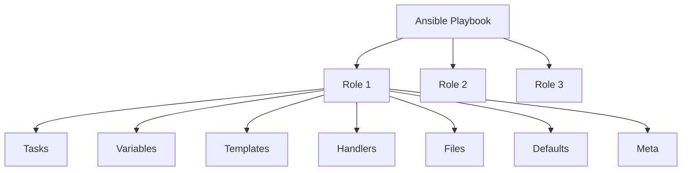

# Ansible Roles Basics

## Introduction

Ansible roles provide a way to organize and structure your automation content, making it more reusable, maintainable, and easier to share. Think of roles as packages of automation that can be easily shared and reused across different projects.

In this guide, we'll explore the basics of Ansible roles, their structure, how to create them, and how to use them effectively in your automation projects.

## What Are Ansible Roles?

Roles are a way to group multiple tasks together and encapsulate all the necessary variables, files, templates, and handlers needed for a piece of automation to work. They represent a complete unit of automation that can be easily shared and reused.



## Role Directory Structure

An Ansible role follows a standard directory structure:

```
role_name/
├── defaults/      # Default variables (lowest precedence)
│   └── main.yml
├── files/         # Static files
├── handlers/      # Handlers for notifications
│   └── main.yml
├── meta/          # Role metadata
│   └── main.yml
├── tasks/         # Tasks to be executed
│   └── main.yml
├── templates/     # Jinja2 templates
├── tests/         # Test playbooks
├── vars/          # Role variables (higher precedence)
│   └── main.yml
└── README.md      # Documentation
```

Each directory serves a specific purpose, and Ansible automatically looks for `main.yml` files in each directory to load the respective content.

## Creating Your First Role

Let's create a simple role that installs and configures Nginx. We'll go through each step to demonstrate the role creation process.

### Step 1: Create the Role Structure

You can create a role manually or use the `ansible-galaxy` command to generate the directory structure:

```bash
ansible-galaxy init nginx
```

This creates a directory structure for your role with all the necessary directories and empty main.yml files.

### Step 2: Define the Tasks

The core functionality of your role goes in the `tasks/main.yml` file. Let's create a simple task file for installing Nginx:

```yaml
# tasks/main.yml
---
- name: Install Nginx
  package:
    name: nginx
    state: present
  become: true

- name: Ensure Nginx is running and enabled
  service:
    name: nginx
    state: started
    enabled: true
  become: true

- name: Configure Nginx
  template:
    src: nginx.conf.j2
    dest: /etc/nginx/nginx.conf
  notify: Restart Nginx
  become: true
```

### Step 3: Create Handlers

Handlers are tasks that only run when notified by other tasks. Let's create a handler to restart Nginx:

```yaml
# handlers/main.yml
---
- name: Restart Nginx
  service:
    name: nginx
    state: restarted
  become: true
```

### Step 4: Create a Template

Let's create a simple Nginx configuration template:

```
# templates/nginx.conf.j2
user nginx;
worker_processes {{ nginx_worker_processes | default(1) }};
error_log /var/log/nginx/error.log;
pid /run/nginx.pid;

events {
    worker_connections {{ nginx_worker_connections | default(1024) }};
}

http {
    include /etc/nginx/mime.types;
    default_type application/octet-stream;

    server {
        listen 80;
        server_name {{ nginx_server_name | default('localhost') }};

        location / {
            root {{ nginx_root_dir | default('/usr/share/nginx/html') }};
            index index.html;
        }
    }
}
```

### Step 5: Define Default Variables

Variables provide flexibility to your role. Default variables have the lowest precedence and can be easily overridden:

```yaml
# defaults/main.yml
---
nginx_worker_processes: 1
nginx_worker_connections: 1024
nginx_server_name: localhost
nginx_root_dir: /usr/share/nginx/html
```

### Step 6: Add Metadata

Role metadata provides information about the role, including dependencies, supported platforms, and author information:

```yaml
# meta/main.yml
---
galaxy_info:
  author: Your Name
  description: Role to install and configure Nginx
  company: Your Company
  license: MIT
  min_ansible_version: 2.9
  platforms:
    - name: Ubuntu
      versions:
        - all
    - name: CentOS
      versions:
        - all
  galaxy_tags:
    - web
    - nginx
    - server

dependencies: []
```

## Using Roles in Playbooks

Now that we have created our role, let's see how to use it in a playbook:

```yaml
---
- name: Deploy web server
  hosts: webservers
  roles:
    - nginx
```

For more control, you can also use the `include_role` or `import_role` tasks:

```yaml
---
- name: Deploy web server
  hosts: webservers
  tasks:
    - name: Include Nginx role
      include_role:
        name: nginx
      vars:
        nginx_worker_processes: 4
        nginx_server_name: example.com
```

## Role Dependencies

You can define dependencies in the `meta/main.yml` file, and Ansible will ensure they are executed before your role:

```yaml
dependencies:
  - role: common
    vars:
      some_parameter: 3
  - role: security
```

## Role Organization

Here are some best practices for organizing your roles:

1. **Keep roles focused**: Each role should do one thing well.
2. **Use variables**: Make your roles configurable with variables.
3. **Document your roles**: Include a descriptive README.md with examples.
4. **Version your roles**: Use version control and semantic versioning.
5. **Test your roles**: Include tests to verify your role works as expected.

## Ansible Galaxy

Ansible Galaxy is a hub for sharing and discovering Ansible roles. You can:

- Search for roles: `ansible-galaxy search nginx`
- Install roles: `ansible-galaxy install geerlingguy.nginx`
- List installed roles: `ansible-galaxy list`

## Real-World Example

Let's look at a complete example that uses multiple roles to set up a web application:

```yaml
---
- name: Deploy web application
  hosts: webservers
  roles:
    - common
    - role: nginx
      vars:
        nginx_worker_processes: 4
        nginx_server_name: myapp.example.com
    - role: mysql
      vars:
        mysql_root_password: "{{ vault_mysql_root_password }}"
    - role: php
    - role: app
      vars:
        app_env: production
```

In this example, we're using five roles to deploy a web application:

1. `common`: Sets up basic server configurations
2. `nginx`: Installs and configures the web server
3. `mysql`: Sets up the database
4. `php`: Installs PHP and necessary extensions
5. `app`: Deploys the actual application

Each role focuses on a specific aspect of the deployment, making the playbook clean and easy to understand.

## Reusing Community Roles

For common tasks, you can leverage the community's expertise by using established roles from Ansible Galaxy:

```yaml
---
- name: Setup web server
  hosts: webservers
  roles:
    - geerlingguy.nginx
    - geerlingguy.php
    - geerlingguy.mysql
```

## Summary

Ansible roles are a powerful way to organize your automation content, making it more reusable and maintainable. Key points to remember:

- Roles follow a standard directory structure
- Each directory in a role serves a specific purpose
- Roles can be easily shared and reused across projects
- Variables make roles flexible and configurable
- Ansible Galaxy provides a hub for discovering and sharing roles

By mastering Ansible roles, you're taking a significant step towards more maintainable and scalable automation.

## Additional Resources

- [Ansible Roles Documentation](https://docs.ansible.com/ansible/latest/user_guide/playbooks_reuse_roles.html)
- [Ansible Galaxy](https://galaxy.ansible.com/)

## Exercises

1. Create a simple role that installs and configures a basic web server.
2. Modify an existing role to make it more configurable with variables.
3. Create a playbook that uses multiple roles to deploy a complete application stack.
4. Explore Ansible Galaxy and find a role that you can use in your projects.
5. Convert an existing playbook into one or more roles for better organization.