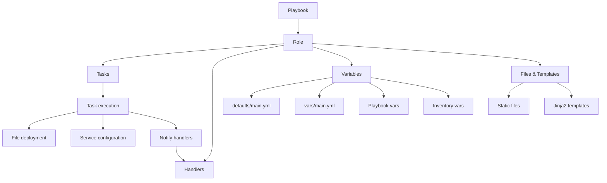

# Ansible Role Structure

## Introduction

When working with Ansible, you'll eventually want to organize your automation code into reusable, modular components. This is where **Ansible roles** come in. A role is essentially a way to bundle automation content (like tasks, handlers, files, and variables) into a standardized file structure.

Think of roles as the building blocks of your Ansible automation - they allow you to:

- Create reusable, modular components
- Share and reuse configurations between projects
- Improve readability and organization of your code
- Focus on what each component should do rather than how to do it

In this guide, we'll explore the standard structure of Ansible roles and how to organize your automation code effectively.

## Standard Role Directory Structure

An Ansible role has a defined directory structure with specific directories for different types of content. Let's look at what a complete role structure looks like:

```
roles/
└── my_role/
    ├── defaults/       # Default variables (lowest precedence)
    │   └── main.yml
    ├── files/          # Static files to be deployed
    ├── handlers/       # Handlers to be triggered by tasks
    │   └── main.yml
    ├── meta/           # Role metadata and dependencies
    │   └── main.yml
    ├── tasks/          # Tasks to be executed by the role
    │   └── main.yml
    ├── templates/      # Jinja2 templates
    ├── tests/          # Tests for the role
    │   ├── inventory
    │   └── test.yml
    └── vars/           # Role variables (higher precedence)
        └── main.yml
```

Let's understand each directory and its purpose in detail.

## Role Components Explained

### 1. `tasks/main.yml` - The Core of Your Role

The `tasks` directory contains the main list of tasks that the role will execute. This is the core functionality of your role.

```yaml
# roles/webserver/tasks/main.yml
---
- name: Install Apache
  ansible.builtin.package:
    name: apache2
    state: present

- name: Configure Apache
  ansible.builtin.template:
    src: apache.conf.j2
    dest: /etc/apache2/apache.conf
  notify: Restart Apache

- name: Ensure Apache is running
  ansible.builtin.service:
    name: apache2
    state: started
    enabled: yes
```

You can also split tasks into multiple files and include them in the main tasks file:

```yaml
# roles/webserver/tasks/main.yml
---
- name: Import install tasks
  ansible.builtin.import_tasks: install.yml

- name: Import configure tasks
  ansible.builtin.import_tasks: configure.yml

- name: Import service tasks
  ansible.builtin.import_tasks: service.yml
```

### 2. `defaults/main.yml` - Default Variables

The `defaults` directory contains default variables for the role that have the lowest precedence and can be easily overridden.

```yaml
# roles/webserver/defaults/main.yml
---
apache_port: 80
apache_document_root: /var/www/html
enable_ssl: false
```

### 3. `vars/main.yml` - Role Variables

The `vars` directory contains variables that are less likely to be overridden and have higher precedence than defaults.

```yaml
# roles/webserver/vars/main.yml
---
apache_packages:
  - apache2
  - apache2-utils
apache_config_path: /etc/apache2
```

### 4. `handlers/main.yml` - Event Responders

Handlers are tasks that only run when notified by another task. They're typically used for restarting services or triggering other actions.

```yaml
# roles/webserver/handlers/main.yml
---
- name: Restart Apache
  ansible.builtin.service:
    name: apache2
    state: restarted

- name: Reload Apache
  ansible.builtin.service:
    name: apache2
    state: reloaded
```

### 5. `files/` - Static Files

The `files` directory contains static files that need to be transferred to the managed hosts. Files in this directory can be referenced directly by name.

```yaml
# Using files in tasks
- name: Copy static HTML file
  ansible.builtin.copy:
    src: index.html  # Refers to roles/webserver/files/index.html
    dest: /var/www/html/index.html
```

### 6. `templates/` - Dynamic Files with Jinja2

The `templates` directory contains Jinja2 templates that will be processed before being copied to the managed hosts.

```jinja2
<!-- roles/webserver/templates/vhost.conf.j2 -->
<VirtualHost *:{{ apache_port }}>
    DocumentRoot {{ apache_document_root }}
    
    <Directory {{ apache_document_root }}>
        AllowOverride All
        Require all granted
    </Directory>
    
    ErrorLog ${APACHE_LOG_DIR}/error.log
    CustomLog ${APACHE_LOG_DIR}/access.log combined
</VirtualHost>
```

Using templates in tasks:

```yaml
- name: Configure virtual host
  ansible.builtin.template:
    src: vhost.conf.j2
    dest: /etc/apache2/sites-available/000-default.conf
  notify: Reload Apache
```

### 7. `meta/main.yml` - Role Metadata

The `meta` directory contains role metadata, including dependencies on other roles.

```yaml
# roles/webserver/meta/main.yml
---
galaxy_info:
  author: Your Name
  description: Role to install and configure Apache webserver
  company: Your Company
  license: MIT
  min_ansible_version: 2.9
  platforms:
    - name: Ubuntu
      versions:
        - focal
        - jammy
  galaxy_tags:
    - web
    - apache
    - httpd

dependencies:
  - role: common
    vars:
      some_parameter: value
```

### 8. `tests/` - Role Testing

The `tests` directory contains an inventory and test playbook for testing the role.

```yaml
# roles/webserver/tests/test.yml
---
- hosts: localhost
  roles:
    - role: webserver
      apache_port: 8080
```

## Role Organization in Playbooks

Now that we understand the structure of a role, let's see how to use roles in playbooks:

```yaml
---
- name: Configure webservers
  hosts: webservers
  become: yes
  roles:
    - common
    - webserver
    - { role: monitoring, when: enable_monitoring | default(true) }
```

You can also use roles with the `include_role` or `import_role` tasks:

```yaml
---
- name: Configure servers
  hosts: all
  tasks:
    - name: Include common role
      ansible.builtin.import_role:
        name: common

    - name: Configure database if needed
      ansible.builtin.include_role:
        name: database
      when: inventory_hostname in groups['db_servers']
```

## Role Organization with Collections

In newer versions of Ansible, roles can be part of collections. A typical collection structure looks like:

```
collection/
├── docs/
├── galaxy.yml
├── plugins/
│   └── ...
├── README.md
└── roles/
    ├── role1/
    │   └── ...
    └── role2/
        └── ...
```

When a role is part of a collection, you can reference it using the fully qualified name:

```yaml
- name: Use a role from a collection
  hosts: all
  roles:
    - namespace.collection.role_name
```

## Creating Roles with ansible-galaxy

The easiest way to create a new role with the correct structure is to use the `ansible-galaxy` command:

```bash
ansible-galaxy role init my_new_role
```

This creates a new role with all the necessary directories and template files.

## Real-World Example: Creating a LAMP Stack Role

Let's see a more comprehensive example of creating roles for a LAMP stack (Linux, Apache, MySQL, PHP).

We'll create three separate roles:

1. `apache` - Installs and configures Apache web server
2. `mysql` - Installs and configures MySQL database server
3. `php` - Installs PHP and necessary extensions

```
roles/
├── apache/
│   ├── defaults/main.yml
│   ├── handlers/main.yml
│   ├── tasks/main.yml
│   └── templates/
│       └── vhost.conf.j2
├── mysql/
│   ├── defaults/main.yml
│   ├── handlers/main.yml
│   ├── tasks/
│   │   ├── main.yml
│   │   ├── install.yml
│   │   └── secure.yml
│   └── templates/
│       └── my.cnf.j2
└── php/
    ├── defaults/main.yml
    ├── tasks/main.yml
    └── templates/
        └── php.ini.j2
```

Then, we can create a playbook that uses these roles:

```yaml
---
- name: Configure LAMP servers
  hosts: lamp_servers
  become: yes
  roles:
    - apache
    - mysql
    - php
```

## Best Practices for Role Structure

Here are some best practices to follow when creating and structuring Ansible roles:

1. **Keep roles focused** - Each role should have a single responsibility
2. **Use defaults appropriately** - Put variables that are meant to be overridden in `defaults/main.yml`
3. **Document your roles** - Include a README.md file with usage instructions
4. **Use proper dependency management** - Define role dependencies in `meta/main.yml`
5. **Test your roles** - Include tests for your roles in the `tests/` directory
6. **Use version control** - Store your roles in a Git repository
7. **Consider publishing** - Share useful roles on Ansible Galaxy
8. **Use tags** - Tag tasks in your roles for selective execution

## Role Structure Visualization

Here's a visual representation of how data flows through an Ansible role:



## Summary

Ansible roles provide a standardized way to structure your automation code, making it more modular, reusable, and maintainable. The key components of an Ansible role include:

- **Tasks**: The core functionality of the role
- **Handlers**: Respond to notifications from tasks
- **Variables**: Both default and role-specific variables
- **Files and Templates**: Static and dynamic content for deployment
- **Meta**: Role metadata and dependencies

By organizing your Ansible code into roles, you can:
- Simplify complex deployments
- Share and reuse configuration code
- Improve collaboration with other team members
- Create a library of standardized infrastructure components

## Additional Resources

To further explore Ansible roles, consider these resources:

- The [official Ansible documentation on roles](https://docs.ansible.com/ansible/latest/user_guide/playbooks_reuse_roles.html)
- Explore community roles on [Ansible Galaxy](https://galaxy.ansible.com/)
- Learn about [role testing frameworks](https://molecule.readthedocs.io/) like Molecule

## Exercises

1. Create a basic role that installs and configures Nginx with a custom configuration file.
2. Modify an existing role to make it more parameterized using default variables.
3. Create a role dependency structure where one role depends on another.
4. Refactor an existing playbook into multiple roles for better organization.
5. Create a role that works across multiple Linux distributions by using conditionals.