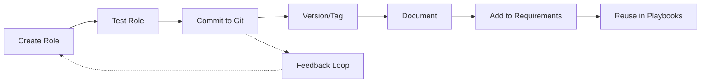

# Ansible Role Reuse

## Introduction

One of the most powerful features of Ansible roles is their reusability. Rather than writing the same automation code over and over for different projects or environments, you can create roles once and reuse them across your entire infrastructure. This approach not only saves time but also promotes consistency, reduces errors, and makes your automation more maintainable.

In this guide, we'll explore various strategies for reusing Ansible roles effectively, from simple inclusion in multiple playbooks to more advanced techniques like role parameterization and creating role collections.

## Why Reuse Roles?

Before diving into the how, let's understand the why:

- **Consistency**: Using the same roles across environments ensures consistent configuration
- **Efficiency**: Write once, use many times
- **Maintainability**: Update a role in one place to affect all playbooks that use it
- **Collaboration**: Share well-designed roles with teammates or the broader community
- **Testing**: Well-defined roles are easier to test and verify

## Basic Role Reuse

### Including Roles in Multiple Playbooks

The simplest form of role reuse is including the same role in different playbooks:

```yaml
# playbook1.yml
---
- hosts: webservers
  roles:
    - common
    - nginx
    - monitoring

# playbook2.yml
---
- hosts: appservers
  roles:
    - common
    - java
    - monitoring
```

In this example, both `common` and `monitoring` roles are reused across different server types.

### Role Directory Structure

To effectively reuse roles, you need a clear directory structure. Here's a standard Ansible role layout:

```
roles/
├── common/
│   ├── defaults/
│   │   └── main.yml
│   ├── handlers/
│   │   └── main.yml
│   ├── tasks/
│   │   └── main.yml
│   ├── templates/
│   ├── vars/
│   │   └── main.yml
│   └── README.md
└── nginx/
    ├── ...
```

## Role Parameterization

### Using Role Variables

To make roles truly reusable, they need to be flexible. This is where variables come in:

```yaml
# roles/nginx/defaults/main.yml
---
nginx_port: 80
nginx_worker_processes: 2
nginx_max_clients: 1024
ssl_enabled: false
```

These default variables can be overridden when using the role:

```yaml
# production-webservers.yml
---
- hosts: prod_webservers
  roles:
    - role: nginx
      vars:
        nginx_port: 443
        ssl_enabled: true
        nginx_worker_processes: 8
```

### Creating Flexible Templates

Templates should be designed with reuse in mind:

```
# roles/nginx/templates/nginx.conf.j2
worker_processes {{ nginx_worker_processes }};

events {
    worker_connections {{ nginx_max_clients }};
}

http {
    
    ssl_protocols TLSv1.2 TLSv1.3;
    ssl_ciphers HIGH:!aNULL:!MD5;
    
    
    server {
        listen {{ nginx_port }};
        # ... more configuration ...
    }
}
```

## Advanced Role Reuse

### Role Dependencies

You can define dependencies to ensure that certain roles are always included when another role is used:

```yaml
# roles/webapp/meta/main.yml
---
dependencies:
  - role: common
  - role: nginx
    vars:
      nginx_port: 8080
  - role: mysql
    vars:
      mysql_databases:
        - name: app_db
          state: present
```

Now whenever the `webapp` role is included, its dependencies will automatically be applied.

### Creating Role Collections

As your role library grows, organize them into collections for easier management:

```
collections/
└── my_organization/
    └── my_collection/
        ├── roles/
        │   ├── common/
        │   ├── nginx/
        │   └── ...
        └── galaxy.yml
```

The `galaxy.yml` defines metadata about your collection:

```yaml
# galaxy.yml
namespace: my_organization
name: my_collection
version: 1.0.0
readme: README.md
authors:
  - Your Name <your.email@example.com>
description: Collection of reusable Ansible roles
license:
  - MIT

  - infrastructure
  - web
  - database
repository: https://github.com/your_org/ansible_collection
```

You can then install and use the collection:

```bash
ansible-galaxy collection install my_organization.my_collection
```

And reference roles from it:

```yaml
# playbook.yml
---
- hosts: webservers
  roles:
    - my_organization.my_collection.nginx
```

## Role Reuse Best Practices

### 1. Design for Flexibility

Make your roles adaptable by:
- Using variables with sensible defaults
- Making behavior conditional
- Documenting all variables

```yaml
# Example of conditional behavior in a role task
- name: Configure backup service
  include_tasks: backup.yml
  when: backup_enabled | default(false)
```

### 2. Use Clear Naming Conventions

```
roles/
├── app_nginx/          # For application-specific nginx
├── system_nginx/       # For system-level nginx
└── monitoring_nginx/   # For nginx monitoring
```

### 3. Version Your Roles

Use git tags or semantic versioning to track role versions:

```yaml
# requirements.yml
---
- src: https://github.com/your_username/ansible-role-nginx
  version: v1.2.0
  name: nginx
```

### 4. Document Your Roles

Create a thorough README for each role:

```markdown
# Nginx Role

Configures Nginx web server with customizable settings.

## Variables

| Variable | Default | Description |
|----------|---------|-------------|
| nginx_port | 80 | Port to listen on |
| ssl_enabled | false | Enable SSL |
| ... | ... | ... |

## Example Usage

```yaml
- hosts: webservers
  roles:
    - role: nginx
      vars:
        nginx_port: 443
        ssl_enabled: true
```
```

## Real-World Example: Multi-Environment Deployment

Let's look at how role reuse helps in a real-world scenario where we need to deploy the same application to development, staging, and production environments:

```yaml
# inventory.yml
all:
  children:
    development:
      hosts:
        dev-app-01:
          ansible_host: 192.168.1.101
    staging:
      hosts:
        stage-app-01:
          ansible_host: 192.168.2.101
        stage-app-02:
          ansible_host: 192.168.2.102
    production:
      hosts:
        prod-app-01:
          ansible_host: 10.0.1.101
        prod-app-02:
          ansible_host: 10.0.1.102
        prod-app-03:
          ansible_host: 10.0.1.103
```

Our unified deployment playbook:

```yaml
# deploy.yml
---
- hosts: all
  vars:
    app_name: my_application
  roles:
    - role: common
    - role: java
      vars:
        java_version: "{{ env_java_version }}"
    - role: app_config
      vars:
        config_template: "{{ environment_name }}_config.j2"
        log_level: "{{ env_log_level }}"
    - role: monitoring
      vars:
        alert_email: "{{ env_alert_email }}"
```

Environment-specific variable files:

```yaml
# group_vars/development.yml
environment_name: development
env_java_version: "11"
env_log_level: "DEBUG"
env_alert_email: "dev-team@example.com"
```

```yaml
# group_vars/production.yml
environment_name: production
env_java_version: "11"
env_log_level: "WARN"
env_alert_email: "ops-alerts@example.com"
```

To deploy to different environments, you simply run:

```bash
ansible-playbook -i inventory.yml deploy.yml --limit development
ansible-playbook -i inventory.yml deploy.yml --limit staging
ansible-playbook -i inventory.yml deploy.yml --limit production
```

The same roles are reused across all environments, but with different parameters.

## Role Sharing Workflow

A common workflow for sharing and reusing roles within a team:



## Summary

Ansible role reuse is a powerful strategy that can significantly improve your infrastructure automation. By creating well-designed, parameterized roles and organizing them effectively, you can build a library of reusable components that make your automation more consistent, efficient, and maintainable.

Key takeaways:
- Design roles with reuse in mind from the start
- Use variables and templates to make roles flexible
- Create clear documentation for your roles
- Organize roles into collections as your library grows
- Version your roles to track changes

## Exercises

1. Take an existing playbook and refactor it into reusable roles
2. Create a parameterized role that can be used in at least three different contexts
3. Set up a roles directory structure for a multi-environment deployment
4. Create a simple role collection and share it with a teammate
5. Document a role following the best practices outlined in this guide

## Additional Resources

- [Ansible Documentation: Roles](https://docs.ansible.com/ansible/latest/user_guide/playbooks_reuse_roles.html)
- [Ansible Galaxy](https://galaxy.ansible.com/) - A hub for finding and sharing Ansible roles
- [Ansible Collections Documentation](https://docs.ansible.com/ansible/latest/user_guide/collections_using.html)