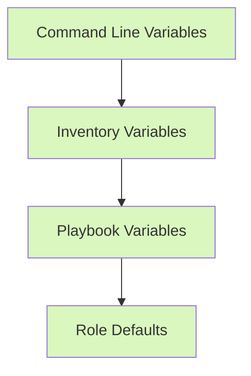

# Ansible Role Variables

## Introduction

Variables are a fundamental component of Ansible roles that allow you to create flexible, reusable automation. By separating your configuration data from your tasks, variables make your roles more adaptable across different environments and use cases.

In this guide, we'll explore how to define, organize, and use variables within Ansible roles. You'll learn best practices for variable management and see practical examples that demonstrate how variables can enhance your automation workflows.

## Understanding Role Variables

In Ansible roles, variables provide a way to customize behavior without modifying the underlying task logic. This separation of data and functionality is a core principle that makes roles reusable across different environments.

### Why Use Variables in Roles?

- **Flexibility**: The same role can be used in different scenarios by changing variable values
- **Maintainability**: Centralizing configuration makes updates easier
- **Clarity**: Separating configuration from implementation improves readability
- **Reusability**: Well-parameterized roles can be shared across teams and projects

## Variable Precedence in Roles

Ansible uses a specific precedence order when determining which variable value to use. When working with roles, it's important to understand where role variables fit in this hierarchy.



From highest precedence (overrides everything) to lowest:

1. Command line variables (`-e` or `--extra-vars`)
2. Variables defined in inventory
3. Variables defined in the playbook
4. Role variables (in `vars/main.yml`)
5. Role default variables (in `defaults/main.yml`)

This hierarchy means that role defaults can be easily overridden, making your roles flexible and customizable.

## Directory Structure for Role Variables

When you create a role using `ansible-galaxy init`, it sets up directories specifically for variables:

```
my_role/
├── defaults/
│   └── main.yml    # Default values, lowest precedence
├── vars/
│   └── main.yml    # Role variables, higher precedence
└── ...other role directories...
```

Let's examine how to use each directory:

### defaults/main.yml

This file contains default values that are meant to be overridden. These have the lowest precedence in the variable hierarchy.

```yaml
# defaults/main.yml
http_port: 80
max_connections: 1000
enable_ssl: false
```

### vars/main.yml

Variables in this directory have higher precedence and are less likely to be overridden. Use this for values that are intrinsic to the role's operation.

```yaml
# vars/main.yml
service_config_path: "/etc/myapp"
required_packages:
  - "myapp"
  - "myapp-tools"
  - "myapp-plugins"
```

## Organizing Variables with var_files

For complex roles with many variables, you can split variables into multiple files:

```
my_role/
├── defaults/
│   ├── main.yml
│   ├── logging.yml
│   └── security.yml
└── vars/
    ├── main.yml
    ├── debian.yml
    └── redhat.yml
```

Then include these files in your `main.yml`:

```yaml
# defaults/main.yml
---
# Include default logging settings
- include_vars: logging.yml
# Include default security settings
- include_vars: security.yml
```

## Variable Scope in Roles

Variables defined in a role are available:

1. Within the role itself
2. In the playbook that includes the role
3. In other roles included after this role

This scoping behavior helps prevent variable name collisions between different roles.

## Practical Examples

Let's look at practical examples of using variables in roles:

### Example 1: Web Server Role

Here's how you might set up variables for a web server role:

```yaml
# defaults/main.yml
---
# Web server configuration
web_server_name: "apache2"
web_server_port: 80
web_server_doc_root: "/var/www/html"
web_server_enable_php: true
web_server_enable_ssl: false
web_server_ssl_cert: ""
web_server_ssl_key: ""
```

Then in your tasks:

```yaml
# tasks/main.yml
---
- name: Install web server
  ansible.builtin.package:
    name: "{{ web_server_name }}"
    state: present

- name: Configure web server port
  ansible.builtin.template:
    src: server-config.j2
    dest: "/etc/{{ web_server_name }}/ports.conf"
  notify: restart web server
```

### Example 2: Using OS-Specific Variables

For roles that need to work across different operating systems:

```yaml
# vars/main.yml
---
# Include OS-specific variables
- include_vars: "{{ ansible_os_family | lower }}.yml"
```

```yaml
# vars/debian.yml
---
web_service_name: apache2
web_config_path: /etc/apache2
```

```yaml
# vars/redhat.yml
---
web_service_name: httpd
web_config_path: /etc/httpd
```

Then in your tasks:

```yaml
# tasks/main.yml
---
- name: Ensure web server is running
  ansible.builtin.service:
    name: "{{ web_service_name }}"
    state: started
    enabled: yes
```

## Using Role Variables in Playbooks

When using a role in a playbook, you can override default variables:

```yaml
---
- hosts: webservers
  roles:
    - role: web_server
      vars:
        web_server_port: 8080
        web_server_enable_ssl: true
```

This overrides the defaults defined in the role, making it adaptable to different environments.

## Using Variables with `include_role` and `import_role`

When dynamically including roles, you can also pass variables:

```yaml
---
- hosts: all
  tasks:
    - name: Include web server role with custom variables
      include_role:
        name: web_server
      vars:
        web_server_port: 8080
```

## Variable Facts

Ansible automatically collects information about managed hosts, called "facts." These can be used as variables in your roles:

```yaml
# tasks/main.yml
---
- name: Configure memory settings based on available RAM
  ansible.builtin.template:
    src: memory-config.j2
    dest: "/etc/{{ app_name }}/memory.conf"
  vars:
    # Use 50% of available memory for the application
    app_memory_mb: "{{ (ansible_memtotal_mb * 0.5) | int }}"
```

## Using Jinja2 with Role Variables

Ansible uses Jinja2 templating, which allows for powerful variable manipulation:

```yaml
# templates/server-config.j2
# Server configuration for {{ inventory_hostname }}
ServerName {{ server_name | default(inventory_hostname) }}
Listen {{ web_server_port }}


Listen 443
SSLCertificateFile {{ web_server_ssl_cert }}
SSLCertificateKeyFile {{ web_server_ssl_key }}

```

## Variable Prompts

You can prompt for variable values during playbook execution:

```yaml
# vars/main.yml
---
# Other variables...

# Prompt for sensitive information
- name: Database password
  prompt: "Enter the database password"
  private: yes
  variable: db_password
```

## Best Practices for Role Variables

1. **Use Default Variables Liberally**: Make your role flexible by defaulting as many variables as possible
2. **Document Your Variables**: Add comments explaining each variable's purpose, type, and acceptable values
3. **Use Namespacing**: Prefix variables with your role name (e.g., `web_server_port` instead of just `port`)
4. **Set Sensible Defaults**: Default values should work "out of the box" for common cases
5. **Validate Variables**: Include tasks that validate variable values before using them
6. **Keep Sensitive Data Separate**: Use Ansible Vault for secrets
7. **Use Variable Files for Complex Data**: Break out complex data structures into separate files

## Example Role with Variables

Let's see how a complete role implementation might look:

```yaml
# roles/web_app/defaults/main.yml
---
app_name: "my_web_app"
app_version: "1.2.3"
app_port: 8080
app_environment: "production"
app_debug_mode: false
app_db_host: "localhost"
app_db_port: 5432
app_db_name: "app_database"
app_db_user: "app_user"
# Don't store actual passwords in defaults
app_db_password: ""
```

```yaml
# roles/web_app/vars/main.yml
---
# Internal variables not meant to be overridden
app_log_dir: "/var/log/{{ app_name }}"
app_config_dir: "/etc/{{ app_name }}"
app_data_dir: "/var/lib/{{ app_name }}"
app_packages:
  - "{{ app_name }}"
  - "{{ app_name }}-client"
  - "{{ app_name }}-utils"
```

```yaml
# roles/web_app/tasks/main.yml
---
- name: Ensure app directories exist
  ansible.builtin.file:
    path: "{{ item }}"
    state: directory
    mode: '0755'
  loop:
    - "{{ app_log_dir }}"
    - "{{ app_config_dir }}"
    - "{{ app_data_dir }}"

- name: Install app packages
  ansible.builtin.package:
    name: "{{ app_packages }}"
    state: present
    version: "{{ app_version }}"

- name: Generate app configuration
  ansible.builtin.template:
    src: app-config.j2
    dest: "{{ app_config_dir }}/config.yml"
  notify: restart app service

- name: Ensure app is running
  ansible.builtin.service:
    name: "{{ app_name }}"
    state: started
    enabled: yes
```

```yaml
# Using the role in a playbook
---
- hosts: app_servers
  vars:
    global_app_version: "1.3.0"
  roles:
    - role: web_app
      vars:
        app_version: "{{ global_app_version }}"
        app_environment: "staging"
        app_debug_mode: true
        app_db_host: "db.example.com"
```

## Variable Validation

It's important to validate variables to provide helpful error messages:

```yaml
# tasks/main.yml
---
- name: Verify required variables are defined
  ansible.builtin.assert:
    that:
      - app_db_password is defined and app_db_password != ""
    fail_msg: "app_db_password must be provided"

- name: Verify port is in valid range
  ansible.builtin.assert:
    that:
      - app_port | int >= 1024 and app_port | int <= 65535
    fail_msg: "app_port must be between 1024-65535"
```

## Using Variable Filters

Ansible provides filters to transform variables:

```yaml
# Example using filters
app_memory_limit: "{{ (ansible_memtotal_mb * 0.75) | int }}m"
app_hostname: "{{ inventory_hostname | regex_replace('\\..*$', '') }}"
app_config_json: "{{ app_config | to_json }}"
```

## Summary

Role variables are a powerful feature in Ansible that enable you to create flexible, reusable automation. By properly organizing variables into defaults and vars directories, understanding variable precedence, and following best practices, you can create roles that work across different environments and use cases.

Key takeaways:

- Use `defaults/main.yml` for values that should be easily overridden
- Use `vars/main.yml` for internal role variables
- Namespace your variables to avoid collisions
- Leverage Jinja2 templates to create dynamic configurations
- Validate variables to provide helpful error messages
- Use variable filters to transform data as needed

By mastering role variables, you'll make your automation more maintainable, flexible, and powerful.

## Additional Resources

- Ansible Documentation: [Using Variables](https://docs.ansible.com/ansible/latest/user_guide/playbooks_variables.html)
- Ansible Documentation: [Variable Precedence](https://docs.ansible.com/ansible/latest/user_guide/playbooks_variables.html#variable-precedence-where-should-i-put-a-variable)
- Ansible Documentation: [Jinja2 Filters](https://docs.ansible.com/ansible/latest/user_guide/playbooks_filters.html)

## Exercises

1. Create a role that installs and configures a database server with variables for:
   - Database type (MySQL, PostgreSQL)
   - Port number
   - Memory allocation
   - Data directory

2. Modify an existing role to use OS-specific variables for:
   - Package names
   - Service names
   - Configuration paths

3. Create a role that generates different configurations based on environment variables (development, staging, production).