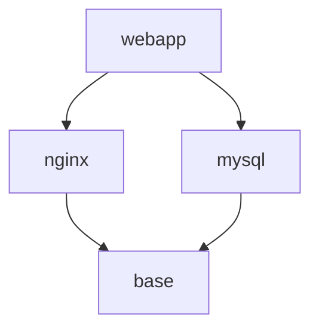

# Ansible Role Dependencies

## Introduction

When building automation with Ansible, you'll often need to create roles that depend on functionality provided by other roles. For example, a role that deploys a web application might depend on roles that install a web server, configure a database, and set up security measures.

Role dependencies let you build modular, composable automation by establishing relationships between roles, allowing them to be used together in a structured way. This approach promotes code reuse and helps maintain clean, organized playbooks.

In this guide, we'll explore how role dependencies work in Ansible, how to configure them correctly, and best practices for managing them effectively.

## Understanding Role Dependencies

Role dependencies define relationships where one role requires another role to run before it. When Ansible executes a role with dependencies, it first runs the dependent roles in the order specified.

There are two main ways to define role dependencies in Ansible:

1. Using the `dependencies` keyword in the role's `meta/main.yml` file
2. Using the `import_role` or `include_role` modules within tasks

Let's explore both approaches.

## Defining Dependencies in meta/main.yml

The most common way to define role dependencies is through the `meta/main.yml` file in your role directory structure:

```
my_role/
├── defaults/
├── files/
├── handlers/
├── meta/
│   └── main.yml
├── tasks/
├── templates/
└── vars/
```

Inside the `meta/main.yml` file, you can specify dependencies using the `dependencies` key:

```yaml
---
dependencies:
  - role: common
  - role: apache
    vars:
      apache_port: 8080
```

In this example, the role has two dependencies:
1. The `common` role, with default variables
2. The `apache` role, with a custom port variable

### How Dependencies Execute

When Ansible runs a role with dependencies:

1. It first executes all dependency roles in the order listed
2. Then it executes the main role's tasks
3. Variables from the parent role are available to dependency roles
4. Each dependency is only executed once, even if listed multiple times

Let's see a complete example:

```yaml
# roles/database/meta/main.yml
---
dependencies: []  # No dependencies

# roles/webserver/meta/main.yml
---
dependencies:
  - role: common

# roles/webapp/meta/main.yml
---
dependencies:
  - role: webserver
  - role: database
    vars:
      database_name: app_production
```

When you include the `webapp` role in a playbook:

```yaml
---
- hosts: app_servers
  roles:
    - role: webapp
```

Ansible will execute roles in this order:
1. `common` (required by `webserver`)
2. `webserver` (required by `webapp`)
3. `database` with `database_name` set to `app_production` (required by `webapp`)
4. `webapp` (the main role)

## Using import_role and include_role

An alternative to the `meta/main.yml` approach is to use task inclusion within your role's tasks. This gives you more control over when dependent roles are executed.

### Static Role Dependencies with import_role

You can use `import_role` to statically include another role:

```yaml
# roles/webapp/tasks/main.yml
---
- name: Import database role
  import_role:
    name: database
  vars:
    database_name: app_production

- name: Setup application configuration
  template:
    src: app.conf.j2
    dest: /etc/app.conf
```

When using `import_role`:
- Dependencies are processed during playbook parsing
- Tags and conditionals apply to all tasks in the imported role
- Role is always imported, even if tasks are skipped

### Dynamic Role Dependencies with include_role

For more flexibility, you can use `include_role` to dynamically include roles:

```yaml
# roles/webapp/tasks/main.yml
---
- name: Check if database is needed
  stat:
    path: /etc/app/db.flag
  register: db_flag

- name: Include database role
  include_role:
    name: database
  vars:
    database_name: app_production
  when: db_flag.stat.exists

- name: Setup application configuration
  template:
    src: app.conf.j2
    dest: /etc/app.conf
```

When using `include_role`:
- Dependencies are processed at runtime
- You can use conditions to determine if a role should be included
- Tags only apply to the include statement itself, not tasks within the role

## Practical Example: Building a Web Application Stack

Let's create a practical example of role dependencies for deploying a typical web application stack:

```
roles/
├── base/
│   ├── tasks/
│   │   └── main.yml
│   └── meta/
│       └── main.yml
├── nginx/
│   ├── tasks/
│   │   └── main.yml
│   └── meta/
│       └── main.yml
├── mysql/
│   ├── tasks/
│   │   └── main.yml
│   └── meta/
│       └── main.yml
└── webapp/
    ├── tasks/
    │   └── main.yml
    └── meta/
        └── main.yml
```

Here's how the dependencies might be defined:

```yaml
# roles/base/meta/main.yml
---
dependencies: []  # No dependencies

# roles/nginx/meta/main.yml
---
dependencies:
  - role: base

# roles/mysql/meta/main.yml
---
dependencies:
  - role: base

# roles/webapp/meta/main.yml
---
dependencies:
  - role: nginx
    vars:
      nginx_port: 80
      nginx_server_name: "myapp.example.com"
  - role: mysql
    vars:
      mysql_databases:
        - name: myapp
          encoding: utf8
      mysql_users:
        - name: myapp
          password: "{{ vault_mysql_password }}"
          priv: "myapp.*:ALL"
```

Now you can simply include the `webapp` role in your playbook:

```yaml
---
- hosts: webservers
  vars_files:
    - vault.yml
  roles:
    - webapp
```

Ansible will automatically handle executing all the required roles in the correct order:
1. `base` (required by both `nginx` and `mysql`)
2. `nginx` (required by `webapp`)
3. `mysql` (required by `webapp`)
4. `webapp` (the main role)

## Visualizing Role Dependencies

Let's visualize the dependencies in our web application stack:



This diagram shows that the `webapp` role depends on both the `nginx` and `mysql` roles, which in turn both depend on the `base` role.

## Handling Role Dependency Variables

When working with role dependencies, variables are passed down from the parent role to the dependent roles. This allows you to customize the behavior of dependent roles.

There are several ways variables can be defined and overridden:

1. Variables defined in the `vars` section of a dependency declaration
2. Variables defined in the role's `defaults/main.yml` file
3. Variables defined in the playbook

The order of precedence (from lowest to highest) is:
1. Role defaults
2. Dependency variables
3. Playbook variables

For example:

```yaml
# roles/nginx/defaults/main.yml
---
nginx_port: 8080
nginx_server_name: localhost

# roles/webapp/meta/main.yml
---
dependencies:
  - role: nginx
    vars:
      nginx_port: 80  # Overrides the default
```

Then in your playbook:

```yaml
---
- hosts: webservers
  vars:
    nginx_server_name: "production.example.com"  # Highest precedence
  roles:
    - webapp
```

The effective values will be:
- `nginx_port: 80` (from dependency declaration)
- `nginx_server_name: "production.example.com"` (from playbook)

## Best Practices for Role Dependencies

### 1. Keep Dependencies Minimal

Only include dependencies that are strictly necessary for your role to function. Too many dependencies create complex dependency trees that are difficult to understand and maintain.

### 2. Use Role Defaults Wisely

Define sensible defaults in your roles so they can work independently, but allow dependent roles to override these defaults when needed.

```yaml
# roles/nginx/defaults/main.yml
---
nginx_port: 80
nginx_worker_processes: "{{ ansible_processor_vcpus | default(2) }}"
```

### 3. Document Role Dependencies

Clearly document your role's dependencies in the README file, including:
- Required roles
- Required variables
- Optional variables

### 4. Avoid Circular Dependencies

Ensure your roles don't create circular dependencies (where A depends on B, and B depends on A). Ansible will detect and prevent circular dependencies, but it's best to avoid them in your design.

### 5. Consider Using Collections

For complex projects, consider organizing related roles into Ansible Collections, which provide a way to package and distribute roles, plugins, and modules together.

## Troubleshooting Role Dependencies

### Common Issues

1. **Role Not Found**: Ensure the dependent role is in the correct location (either in your project's `roles/` directory or in a configured role path).

2. **Variable Conflicts**: Variables with the same name in different roles can cause conflicts. Use role-specific prefixes for variable names to avoid this.

3. **Dependency Order Issues**: If roles must execute in a specific order, make sure your dependency chain reflects this.

### Debugging Dependencies

To see the effective role execution order:

```bash
ansible-playbook --list-tasks playbook.yml
```

To get detailed information about role processing:

```bash
ANSIBLE_DEBUG=true ansible-playbook -vvv playbook.yml
```

## Summary

Ansible role dependencies are a powerful feature that allows you to:

- Build modular, reusable automation components
- Create layered infrastructure deployment
- Pass configuration from parent roles to dependent roles
- Organize complex automation into manageable pieces

By properly leveraging role dependencies, you can create maintainable, scalable automation that follows good software engineering practices like modularity and reusability.

## Additional Resources

- [Ansible Roles Documentation](https://docs.ansible.com/ansible/latest/user_guide/playbooks_reuse_roles.html)
- [Ansible Galaxy](https://galaxy.ansible.com/) - A hub for sharing and finding Ansible roles
- [Ansible Collections](https://docs.ansible.com/ansible/latest/user_guide/collections_using.html) - For organizing related roles and content

## Exercises

1. Create a base role with common tasks like system updates and firewall configuration
2. Create an application role that depends on the base role
3. Add variables to the application role that can be passed to the base role
4. Create a playbook that uses the application role and overrides some variables
5. Experiment with `import_role` vs. `include_role` to understand the differences in behavior