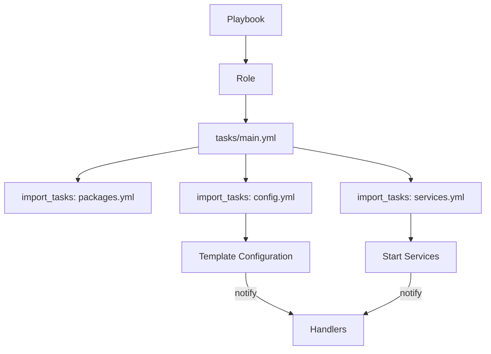

# Ansible Role Tasks

## Introduction

Tasks are the heart of any Ansible role. They define the specific actions that Ansible will execute on your managed hosts. When you organize tasks within roles, you create reusable, modular components that can significantly simplify your automation workflows.

In this guide, we'll explore how to create, organize, and implement tasks within Ansible roles. You'll learn best practices for structuring your tasks and see practical examples that you can adapt for your own projects.

## Understanding Tasks in Ansible Roles

In Ansible roles, tasks are defined in YAML files that outline the specific operations to be performed. These tasks typically reside in the `tasks` directory of your role structure:

```
my_role/
├── tasks/
│   ├── main.yml
│   └── additional_tasks.yml
├── handlers/
├── defaults/
├── vars/
├── files/
├── templates/
└── meta/
```

The `main.yml` file serves as the primary entry point for your role's tasks. When Ansible executes your role, it automatically looks for this file first.

## Basic Structure of Task Files

Let's examine the basic structure of a task file:

```yaml
---
# tasks/main.yml

- name: Install required packages
  apt:
    name: "{{ item }}"
    state: present
  loop:
    - nginx
    - python3
    - python3-pip
  become: true
  tags:
    - packages
    - setup

- name: Create application directory
  file:
    path: "/opt/myapp"
    state: directory
    mode: '0755'
  become: true
  tags:
    - configuration
```

Each task consists of:

1. A descriptive `name` (highly recommended for readability)
2. A module name (like `apt`, `file`, `template`)
3. Module parameters
4. Optional elements like `become`, `when`, `tags`, etc.

## Organizing Tasks with Include and Import

As your roles grow more complex, you might want to split your tasks into multiple files for better organization. Ansible provides two mechanisms for this: `include_tasks` and `import_tasks`.

### Using import_tasks

The `import_tasks` directive processes the included file during the playbook parsing phase:

```yaml
---
# tasks/main.yml

- import_tasks: packages.yml
- import_tasks: configuration.yml
- import_tasks: services.yml
```

```yaml
---
# tasks/packages.yml

- name: Install required packages
  apt:
    name: "{{ item }}"
    state: present
  loop:
    - nginx
    - python3
    - python3-pip
  become: true
  tags:
    - packages
```

### Using include_tasks

The `include_tasks` directive processes the included file during the execution phase:

```yaml
---
# tasks/main.yml

- include_tasks: packages.yml
- include_tasks: configuration.yml
  when: configure_app | bool
- include_tasks: services.yml
```

The key difference is that `import_tasks` is static (processed at parse time), while `include_tasks` is dynamic (processed at runtime). This means `include_tasks` can use variables defined during the play execution and can be conditionally included.

## Task Conditionals

Tasks can be selectively executed based on conditions:

```yaml
- name: Install Apache for Debian/Ubuntu systems
  apt:
    name: apache2
    state: present
  when: ansible_os_family == "Debian"
  become: true

- name: Install Apache for Red Hat systems
  dnf:
    name: httpd
    state: present
  when: ansible_os_family == "RedHat"
  become: true
```

## Loops in Tasks

When you need to perform the same action multiple times with different parameters, loops are invaluable:

```yaml
- name: Create multiple directories
  file:
    path: "{{ item }}"
    state: directory
    mode: '0755'
  loop:
    - /opt/myapp/config
    - /opt/myapp/data
    - /opt/myapp/logs
  become: true
```

## Task Handlers

Tasks can notify handlers to trigger additional actions:

```yaml
- name: Update Nginx configuration
  template:
    src: nginx.conf.j2
    dest: /etc/nginx/sites-available/myapp.conf
  become: true
  notify: Restart Nginx
```

The handler referenced by `notify` would be defined in the `handlers/main.yml` file:

```yaml
---
# handlers/main.yml

- name: Restart Nginx
  service:
    name: nginx
    state: restarted
  become: true
```

## Role Tasks Visualization

Here's a simplified diagram of how tasks flow within a role:



## Practical Examples

### Example 1: Web Server Role

Let's create tasks for a web server role:

```yaml
---
# tasks/main.yml

- import_tasks: install.yml
- import_tasks: configure.yml
- import_tasks: secure.yml
- import_tasks: deploy.yml
```

```yaml
---
# tasks/install.yml

- name: Install Nginx web server
  apt:
    name: nginx
    state: present
  become: true
  tags:
    - install
    - nginx

- name: Ensure Nginx is started and enabled
  service:
    name: nginx
    state: started
    enabled: yes
  become: true
  tags:
    - service
    - nginx
```

```yaml
---
# tasks/configure.yml

- name: Create virtual host configuration
  template:
    src: virtualhost.conf.j2
    dest: /etc/nginx/sites-available/{{ app_name }}.conf
  become: true
  tags:
    - configure
    - nginx

- name: Enable virtual host
  file:
    src: /etc/nginx/sites-available/{{ app_name }}.conf
    dest: /etc/nginx/sites-enabled/{{ app_name }}.conf
    state: link
  become: true
  notify: Restart Nginx
  tags:
    - configure
    - nginx
```

### Example 2: Database Role

Here's an example of tasks for a database role:

```yaml
---
# tasks/main.yml for a PostgreSQL role

- name: Install PostgreSQL packages
  apt:
    name:
      - postgresql
      - postgresql-contrib
      - python3-psycopg2
    state: present
  become: true
  tags:
    - install
    - database

- name: Ensure PostgreSQL is started and enabled
  service:
    name: postgresql
    state: started
    enabled: yes
  become: true
  tags:
    - service
    - database

- name: Create application database
  postgresql_db:
    name: "{{ app_db_name }}"
    state: present
  become: true
  become_user: postgres
  tags:
    - database
    - configuration

- name: Create database user
  postgresql_user:
    db: "{{ app_db_name }}"
    name: "{{ app_db_user }}"
    password: "{{ app_db_password }}"
    priv: "ALL"
    state: present
  become: true
  become_user: postgres
  tags:
    - database
    - configuration
  no_log: true  # Hides sensitive information in logs
```

## Task Execution Control

### Tags

Tags allow you to run or skip specific parts of your role:

```yaml
- name: Install packages
  apt:
    name: "{{ item }}"
    state: present
  loop: "{{ required_packages }}"
  become: true
  tags:
    - install
    - packages
```

You can then run only tasks with specific tags:

```bash
ansible-playbook playbook.yml --tags "install"
```

Or skip tasks with specific tags:

```bash
ansible-playbook playbook.yml --skip-tags "install"
```

### Error Handling

You can control how Ansible responds to errors in your tasks:

```yaml
- name: Attempt to start application
  command: /opt/myapp/bin/start.sh
  register: start_result
  ignore_errors: true

- name: Display error message if application failed to start
  debug:
    msg: "Application failed to start: {{ start_result.stderr }}"
  when: start_result.rc != 0
```

## Best Practices for Role Tasks

1. **Use descriptive names**: Always include a clear `name` for each task.
2. **Group related tasks**: Use separate files for logical groups of tasks.
3. **Use tags effectively**: Tag tasks to allow selective execution.
4. **Balance granularity**: Too many small tasks can be inefficient, while monolithic tasks are hard to maintain.
5. **Consider idempotency**: Tasks should be able to run multiple times without causing errors.
6. **Document your tasks**: Use comments to explain complex logic or unusual configurations.
7. **Handle errors gracefully**: Use `ignore_errors`, `failed_when`, and `changed_when` to control execution flow.
8. **Hide sensitive data**: Use `no_log: true` for tasks that deal with passwords or keys.

## Summary

Tasks are the fundamental building blocks of Ansible roles. By effectively organizing your tasks, you can create modular, reusable roles that simplify your automation efforts.

In this guide, we've covered:
- The basic structure of tasks within roles
- How to organize tasks using `import_tasks` and `include_tasks`
- Using conditionals and loops in tasks
- Practical examples of tasks for web server and database roles
- Best practices for writing and organizing tasks

By following these patterns and best practices, you'll be able to create robust, maintainable Ansible roles that can be easily shared and reused across your projects.

## Further Learning

To continue developing your Ansible role skills, try these exercises:

1. Create a role that installs and configures your favorite application
2. Refactor an existing playbook into a role with properly organized tasks
3. Implement error handling in your existing roles
4. Experiment with using both `import_tasks` and `include_tasks` to understand their differences

You can also explore Ansible Galaxy to see how other users structure their roles and tasks for inspiration.