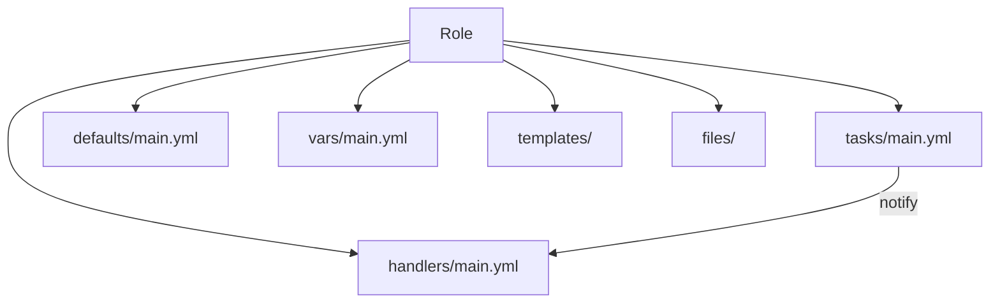

# Ansible Role Handlers

## Introduction

Handlers are a special type of task in Ansible that only run when they are notified by another task. They are primarily used within Ansible Roles to implement a responsive, event-driven automation approach. Handlers provide an elegant way to trigger specific actions (like restarting a service) only when relevant changes occur (like updating a configuration file).

This concept allows us to create more efficient playbooks that avoid unnecessary operations. For example, we don't need to restart a web server every time we run a playbook - we only need to restart it when its configuration has actually changed.

## Understanding Handlers in Ansible Roles

### What Are Handlers?

Handlers are tasks that only execute when explicitly notified by other tasks using the `notify` directive. They follow the same structure as regular tasks but are defined in a separate section and have a unique behavior:

1. They run only when notified
2. They run only once at the end of a play, even if notified multiple times
3. They run in the order defined in the handlers section, not in the notification order

Within an Ansible Role, handlers are typically defined in a dedicated file: `roles/role_name/handlers/main.yml`.

### Basic Structure

Here's how handlers fit into the structure of an Ansible Role:



## Creating and Using Handlers

### Step 1: Define a Handler

First, let's create a handler in our role's handlers file:

```yaml title="roles/webserver/handlers/main.yml"
---
- name: restart apache
  service:
    name: apache2
    state: restarted

- name: reload apache
  service:
    name: apache2
    state: reloaded
```

In this example, we've defined two handlers: one to restart the Apache service and another to reload it. Each handler has a unique name that will be referenced when notifying it.

### Step 2: Notify the Handler from a Task

Now, let's use these handlers in our tasks:

```yaml title="roles/webserver/tasks/main.yml"
---
- name: Install Apache
  apt:
    name: apache2
    state: present

- name: Deploy Apache configuration
  template:
    src: apache.conf.j2
    dest: /etc/apache2/apache2.conf
  notify: restart apache

- name: Deploy virtual host configuration
  template:
    src: vhost.conf.j2
    dest: /etc/apache2/sites-available/{{ item }}.conf
  loop: "{{ virtual_hosts }}"
  notify: reload apache
```

In this example:
- The first task installs Apache without notifying any handlers
- The second task deploys the main Apache configuration and notifies the "restart apache" handler
- The third task deploys virtual host configurations and notifies the "reload apache" handler

### Step 3: Execution Process

When the playbook runs:
1. If the Apache configuration file changes, the "restart apache" handler gets notified
2. If any virtual host configuration changes, the "reload apache" handler gets notified
3. Tasks continue to execute
4. At the end of the play, any notified handlers execute in the order they are defined in the handlers file

## Advanced Handler Usage

### Handler Execution Control

By default, handlers only run at the end of a play. However, you can force them to run immediately with the `meta` task:

```yaml
- name: Apply critical configuration changes
  template:
    src: critical-config.j2
    dest: /etc/critical/config.conf
  notify: restart critical service

- name: Force handlers to run now
  meta: flush_handlers

- name: Continue with other tasks
  # More tasks here
```

This pattern is useful when subsequent tasks depend on the handler having been executed.

### Handlers Across Multiple Files

As roles grow larger, you might want to organize handlers across multiple files:

```yaml title="roles/webserver/handlers/apache.yml"
---
- name: restart apache
  service:
    name: apache2
    state: restarted
```

```yaml title="roles/webserver/handlers/mysql.yml"
---
- name: restart mysql
  service:
    name: mysql
    state: restarted
```

```yaml title="roles/webserver/handlers/main.yml"
---
- import_tasks: apache.yml
- import_tasks: mysql.yml
```

This approach helps maintain organization in complex roles.

### Conditional Handlers

Handlers can include conditionals:

```yaml title="roles/webserver/handlers/main.yml"
---
- name: restart apache
  service:
    name: apache2
    state: restarted
  when: apache_service_enabled | bool
```

### Handlers with Variables

You can use variables within handlers:

```yaml title="roles/webserver/handlers/main.yml"
---
- name: restart web service
  service:
    name: "{{ web_service_name }}"
    state: restarted
```

```yaml title="roles/webserver/defaults/main.yml"
---
web_service_name: apache2
```

## Real-world Examples

### Example 1: NGINX Web Server Configuration

```yaml title="roles/nginx/tasks/main.yml"
---
- name: Install NGINX
  apt:
    name: nginx
    state: present

- name: Deploy NGINX configuration
  template:
    src: nginx.conf.j2
    dest: /etc/nginx/nginx.conf
  notify: restart nginx

- name: Ensure NGINX is running
  service:
    name: nginx
    state: started
    enabled: yes
```

```yaml title="roles/nginx/handlers/main.yml"
---
- name: restart nginx
  service:
    name: nginx
    state: restarted
```

### Example 2: Multi-service Application Stack

Let's consider a more complex example with multiple services:

```yaml title="roles/app_stack/tasks/main.yml"
---
- name: Deploy database configuration
  template:
    src: mysql.conf.j2
    dest: /etc/mysql/my.cnf
  notify: restart mysql

- name: Deploy Redis configuration
  template:
    src: redis.conf.j2
    dest: /etc/redis/redis.conf
  notify: restart redis

- name: Deploy application configuration
  template:
    src: app.conf.j2
    dest: /etc/app/config.json
  notify: restart application

- name: Force handlers for dependent services
  meta: flush_handlers

- name: Deploy web server configuration
  template:
    src: nginx.conf.j2
    dest: /etc/nginx/sites-available/app.conf
  notify: reload nginx
```

```yaml title="roles/app_stack/handlers/main.yml"
---
- name: restart mysql
  service:
    name: mysql
    state: restarted
  listen: restart backend services

- name: restart redis
  service:
    name: redis
    state: restarted
  listen: restart backend services

- name: restart application
  service:
    name: app
    state: restarted
  
- name: reload nginx
  service:
    name: nginx
    state: reloaded
```

In this example, we use:
- Multiple handlers for different services
- The `flush_handlers` meta task to ensure backend services restart before continuing
- The `listen` keyword to group handlers (introduced in Ansible 2.2)

### Example 3: Handler Failure Handling

```yaml title="roles/critical_service/tasks/main.yml"
---
- name: Deploy critical service configuration
  template:
    src: service.conf.j2
    dest: /etc/critical/service.conf
  notify: restart with verification

- name: Other non-critical tasks
  # more tasks here
```

```yaml title="roles/critical_service/handlers/main.yml"
---
- name: restart with verification
  block:
    - name: Restart critical service
      service:
        name: critical-service
        state: restarted
      
    - name: Verify service is running
      uri:
        url: http://localhost:8080/health
        status_code: 200
      register: health_check
      retries: 5
      delay: 10
      until: health_check.status == 200
  rescue:
    - name: Rollback configuration
      copy:
        src: /etc/critical/service.conf.backup
        dest: /etc/critical/service.conf
        
    - name: Restart with original config
      service:
        name: critical-service
        state: restarted
        
    - name: Send alert
      debug:
        msg: "Critical service failed to restart properly!"
```

This example includes error handling with the `block`/`rescue` feature to implement a rollback strategy if the service fails to restart properly.

## Best Practices for Handlers

1. **Use descriptive names**: Name handlers clearly based on what they do (e.g., "restart apache" rather than just "apache").

2. **Keep handlers simple**: Handlers should perform focused actions, typically service management.

3. **Group related handlers**: For complex roles, organize handlers by service or functionality.

4. **Use variables**: Make handlers reusable by using variables for service names and other parameters.

5. **Consider idempotence**: Like tasks, handlers should be idempotent (safe to run multiple times).

6. **Plan handler order**: Remember that handlers run in the order defined in the handlers section, not in notification order.

7. **Use `listen` for handler groups**: When multiple tasks need to trigger the same set of handlers, use the `listen` directive.

8. **Use `flush_handlers` strategically**: Only force handler execution mid-play when necessary for subsequent tasks.

## Common Issues and Solutions

### Handler Not Running

If your handler isn't running, check:
- Is the task that should notify it actually changing something? (check for `changed: true`)
- Is the handler name spelled correctly?
- Are there any conditionals preventing the handler from running?

### Handlers Running in Unexpected Order

Remember that handlers run in the order they're defined in the handlers file, not in the order they're notified. If you need specific execution order, arrange them accordingly in your handler file.

### Multiple Restarts

If you find a service restarting multiple times in a playbook run, you might be using multiple roles that each trigger the same restart. Consider using the `listen` keyword to consolidate these notifications.

## Summary

Handlers in Ansible Roles provide an elegant way to respond to changes in your infrastructure. By using the "notify" mechanism, you can create more efficient playbooks that only perform actions like service restarts when necessary.

Key points to remember:
- Handlers only run when notified by tasks
- They run only once at the end of a play, even if notified multiple times
- They run in the order defined in the handlers section
- You can force handlers to run immediately with `meta: flush_handlers`
- The `listen` keyword allows grouping handlers for more flexible notification

By following the practices outlined in this guide, you can create more efficient, event-driven automation with Ansible Roles.

## Exercises

1. Create a simple Ansible Role for managing the SSH service that includes a handler to restart SSH only when the configuration changes.

2. Modify an existing role to use handlers instead of directly restarting services in tasks.

3. Implement a multi-service role with handlers that use the `listen` keyword to group related service restarts.

4. Create a role with handlers that implement validation after a service restart, rolling back changes if validation fails.

## Additional Resources

- [Ansible Official Documentation on Handlers](https://docs.ansible.com/ansible/latest/playbook_guide/playbooks_handlers.html)
- [Ansible Roles Documentation](https://docs.ansible.com/ansible/latest/playbook_guide/playbooks_reuse_roles.html)
- [Best Practices for Ansible Roles](https://docs.ansible.com/ansible/latest/tips_tricks/ansible_tips_tricks.html)