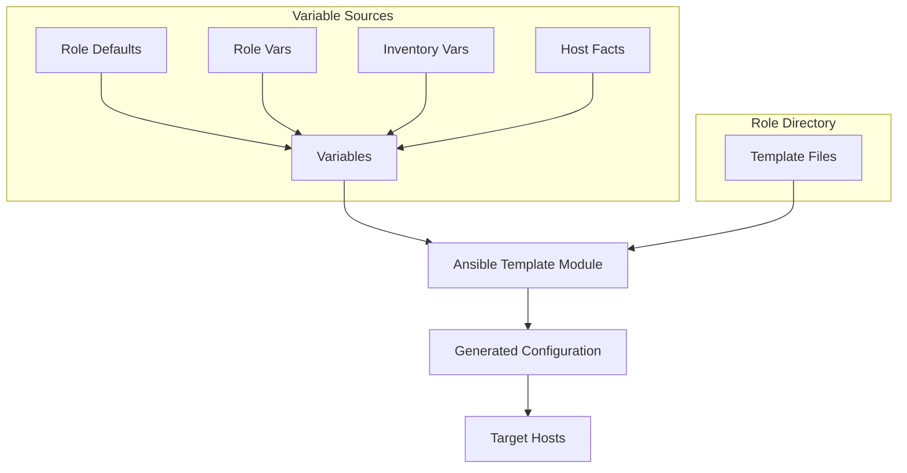

# Ansible Role Templates

## Introduction

Templates are one of the most powerful features of Ansible roles. While static files have their place in configuration management, real-world scenarios often require dynamic content generation based on variables, host information, or other contextual data. 

Ansible templates allow you to create configuration files dynamically by combining:
- Static text content
- Variable substitution
- Control structures (conditionals, loops)
- Filters for transforming data

Templates in Ansible roles use the Jinja2 templating engine, which provides a flexible way to generate configuration files tailored to each managed host. This dramatically reduces duplication and makes your infrastructure more maintainable.

## Understanding the Templates Directory

Within an Ansible role structure, templates live in the `templates` directory:

```
my_role/
├── defaults/
├── files/
├── handlers/
├── meta/
├── tasks/
├── templates/  <-- Template files go here
│   ├── nginx.conf.j2
│   └── app_config.ini.j2
├── tests/
└── vars/
```

By convention, template files use the `.j2` extension (for Jinja2), though this isn't strictly required.

## Basic Template Usage

Let's start with a simple example of using templates in an Ansible role. Imagine we're creating a role to deploy a web server.

### Step 1: Create a template file

First, create a template file in your role's `templates` directory:

**templates/nginx.conf.j2**
```
server {
    listen {{ nginx_port | default(80) }};
    server_name {{ nginx_server_name }};

    root {{ nginx_document_root }};
    index index.html;

    
    listen 443 ssl;
    ssl_certificate {{ nginx_ssl_cert_path }};
    ssl_certificate_key {{ nginx_ssl_key_path }};
    
}
```

### Step 2: Define task to apply the template

In your role's `tasks/main.yml` file:

```yaml
- name: Create Nginx configuration
  template:
    src: nginx.conf.j2
    dest: /etc/nginx/sites-available/{{ nginx_server_name }}
    owner: root
    group: root
    mode: '0644'
  notify: Restart nginx
```

### Step 3: Define default values

In your role's `defaults/main.yml`:

```yaml
nginx_port: 80
nginx_server_name: example.com
nginx_document_root: /var/www/html
nginx_enable_ssl: false
nginx_ssl_cert_path: /etc/ssl/certs/nginx.crt
nginx_ssl_key_path: /etc/ssl/private/nginx.key
```

This simple example demonstrates how templates can generate different configuration files based on variables.

## Template Features and Syntax

### Variable Substitution

The most basic feature of templates is variable substitution using `{{ variable_name }}` syntax:

```
app_name: {{ application_name }}
environment: {{ env | default('production') }}
debug_mode: {{ debug | default(false) }}
```

### Conditionals

You can use conditionals to include or exclude sections of your configuration:

```

backup_path: {{ backup_directory }}
backup_schedule: {{ backup_schedule }}



loglevel: DEBUG

loglevel: INFO

loglevel: WARNING

```

### Loops

Loops are useful for generating repeated configuration sections:

```
allowed_hosts:

  - {{ host }}



user_{{ user.name }}:
  home: {{ user.home | default('/home/' + user.name) }}
  shell: {{ user.shell | default('/bin/bash') }}
  groups: {{ user.groups | join(',') }}

```

### Filters

Jinja2 provides many filters to transform data:

```
max_connections: {{ max_connections | default(100) }}
app_version: {{ version | trim }}
server_list: {{ servers | join(',') }}
config_json: {{ config_dict | to_json }}
uppercase_name: {{ app_name | upper }}
```

## Real-World Example: Database Configuration Role

Let's create a more comprehensive example for configuring a database across different environments.

### Directory Structure

```
database_role/
├── defaults/
│   └── main.yml
├── templates/
│   ├── my.cnf.j2
│   └── backup.sh.j2
└── tasks/
    └── main.yml
```

### Default Variables

**defaults/main.yml**
```yaml
# Database configuration
db_type: mysql
db_port: 3306
db_bind_address: 127.0.0.1
db_max_connections: 100
db_innodb_buffer_pool_size: 128M

# Backup configuration
db_backup_enabled: true
db_backup_directory: /var/backups/mysql
db_backup_retention_days: 7
db_backup_time: "23:00"

# Environment-specific settings
db_environments:
  development:
    max_connections: 50
    innodb_buffer_pool_size: 64M
  staging:
    max_connections: 100
    innodb_buffer_pool_size: 128M
  production:
    max_connections: 200
    innodb_buffer_pool_size: 512M
```

### Template Files

**templates/my.cnf.j2**
```
[mysqld]
port = {{ db_port }}
bind-address = {{ db_bind_address }}

# Performance settings
max_connections = {{ db_environments[db_environment].max_connections }}{{ db_max_connections }}
innodb_buffer_pool_size = {{ db_environments[db_environment].innodb_buffer_pool_size }}{{ db_innodb_buffer_pool_size }}

# Security settings

ssl = ON
ssl-ca = {{ db_ssl_ca }}
ssl-cert = {{ db_ssl_cert }}
ssl-key = {{ db_ssl_key }}


# Custom options


{{ option.key }} = {{ option.value }}


```

**templates/backup.sh.j2**
```bash
#!/bin/bash
# Backup script for {{ db_type }} database
# Generated by Ansible on {{ ansible_date_time.date }}

BACKUP_DIR="{{ db_backup_directory }}"
RETENTION_DAYS={{ db_backup_retention_days }}
DATE=$(date +%Y%m%d)
HOSTNAME=$(hostname)


mysqldump --all-databases -u root -p"${MYSQL_ROOT_PASSWORD}" > ${BACKUP_DIR}/${HOSTNAME}-${DATE}.sql

pg_dumpall -U postgres > ${BACKUP_DIR}/${HOSTNAME}-${DATE}.sql


# Compress the backup
gzip ${BACKUP_DIR}/${HOSTNAME}-${DATE}.sql

# Clean up old backups
find ${BACKUP_DIR} -name "*.gz" -mtime +${RETENTION_DAYS} -delete


# Send notification
echo "Database backup completed on ${HOSTNAME}" | mail -s "Backup Notification" {{ db_notify_email }}

```

### Tasks

**tasks/main.yml**
```yaml
---
- name: Ensure backup directory exists
  file:
    path: "{{ db_backup_directory }}"
    state: directory
    mode: '0750'
  when: db_backup_enabled

- name: Configure database
  template:
    src: my.cnf.j2
    dest: /etc/{{ db_type }}/my.cnf
    owner: root
    group: root
    mode: '0644'
  notify: Restart database service

- name: Set up database backup script
  template:
    src: backup.sh.j2
    dest: /usr/local/bin/db-backup.sh
    owner: root
    group: root
    mode: '0755'
  when: db_backup_enabled

- name: Set up backup cron job
  cron:
    name: "Database backup"
    hour: "{{ db_backup_time.split(':')[0] }}"
    minute: "{{ db_backup_time.split(':')[1] }}"
    job: "/usr/local/bin/db-backup.sh"
    state: "{{ 'present' if db_backup_enabled else 'absent' }}"
```

## Template Best Practices

### 1. Keep Templates Simple

While Jinja2 provides powerful programming capabilities, complex logic in templates can make them hard to maintain. When possible:
- Move complex transformations to your playbook or role variables
- Use default filters to handle missing variables
- Break complex templates into smaller, manageable pieces

### 2. Comment Your Templates

Add comments to explain non-obvious sections:

```
# This section configures the connection pool
# Increase max_connections for high-traffic environments
max_connections = {{ max_connections }}
```

### 3. Use Defensive Programming

Account for missing or undefined variables:

```
debug = {{ debug_mode | default(false) }}
log_dir = {{ log_directory | default('/var/log/' + application_name) }}
```

### 4. Validate Generated Files

For complex templates, add validation tasks:

```yaml
- name: Validate Nginx configuration
  command: nginx -t -c /etc/nginx/nginx.conf
  changed_when: false
  register: nginx_valid
  failed_when: nginx_valid.rc != 0
```

### 5. Consider Template Inheritance

For complex configurations, leverage Jinja2's template inheritance:

**templates/base.conf.j2**
```
# Base configuration
log_level = {{ log_level }}
data_dir = {{ data_dir }}


# Custom configuration goes here

```

**templates/app.conf.j2**
```



app_name = {{ app_name }}
app_port = {{ app_port }}

```

## Advanced Template Techniques

### Using Registered Variables

You can use facts or registered variables from previous tasks:

```yaml
- name: Get disk information
  command: df -h
  register: disk_info
  changed_when: false

- name: Create report
  template:
    src: system_report.j2
    dest: /opt/reports/system_status.txt
```

Then in your template:

```
System Report
-------------
Generated: {{ ansible_date_time.iso8601 }}
Hostname: {{ ansible_hostname }}

Disk Usage:
{{ disk_info.stdout }}
```

### Template Debugging

When templates don't render as expected, you can debug the variables:

```yaml
- name: Debug variables
  debug:
    var: some_complex_variable
```

Or inside the template itself:

```
{# Debug information #}
{# {{ some_variable | to_yaml }} #}
```

### Using Lookups in Templates

You can use Ansible lookups within templates:

```
# Database configuration from vault
db_password: {{ lookup('ansible.builtin.passwordstore', 'path/to/password') }}
```

## Creating Reusable Role Templates

### Template Organization

For complex roles, organize templates in subdirectories:

```
templates/
├── apache/
│   ├── vhost.conf.j2
│   └── security.conf.j2
├── mysql/
│   ├── my.cnf.j2
│   └── users.sql.j2
└── common/
    └── backup.sh.j2
```

### Template Sharing Between Roles

For templates used across multiple roles, consider:

1. Creating a common role with shared templates
2. Using the `template_src` variable to specify alternative templates

```yaml
- name: Configure web server
  template:
    src: "{{ web_config_template | default('nginx.conf.j2') }}"
    dest: /etc/nginx/sites-available/default
```

This allows role users to override the template while keeping your default.

## Workflow Diagram

Here's a visual representation of how templates work in Ansible roles:



## Summary

Templates are the backbone of creating dynamic, adaptable configurations in Ansible roles. By leveraging Jinja2's powerful features, you can generate configuration files customized for each environment and host in your infrastructure.

Key points to remember:
- Templates use the `.j2` extension and live in the `templates/` directory
- The Jinja2 templating language provides variable substitution, conditionals, loops, and filters
- Well-designed templates make your roles more reusable and adaptable
- Always validate generated configurations before applying them
- Use defensive programming techniques to handle missing variables

## Exercises

1. **Basic Template**: Create a template file for a simple application configuration that sets different log levels based on the environment.

2. **Loop Exercise**: Write a template that generates a list of virtual hosts for Apache based on a list of websites defined in variables.

3. **Conditional Exercise**: Create a template that includes different security settings depending on whether the server is internet-facing or internal.

4. **Advanced Exercise**: Design a template for a complex application that uses inheritance to share common settings while allowing environment-specific customizations.

## Additional Resources

- [Ansible Template Module Documentation](https://docs.ansible.com/ansible/latest/collections/ansible/builtin/template_module.html)
- [Jinja2 Template Designer Documentation](https://jinja.palletsprojects.com/en/3.0.x/templates/)
- [Ansible Roles Best Practices](https://docs.ansible.com/ansible/latest/user_guide/playbooks_best_practices.html)