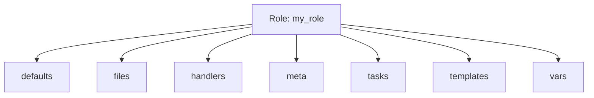

# Ansible Role Files

## Introduction

When working with Ansible roles, proper organization of your automation code is essential for maintainability and reusability. The `files` directory is a key component of this organization, providing a dedicated location for static content that your role needs to deploy or reference.

In this guide, we'll explore how the `files` directory works within Ansible roles, its relationship to other role components, and best practices for managing files effectively. By the end, you'll understand how to structure and leverage files in your Ansible roles for more efficient infrastructure automation.

## What Are Role Files?

The `files` directory in an Ansible role contains static files that need to be transferred to the managed hosts without modification. Unlike templates (which are processed with variables), files are copied as-is to their destination.

### Common Use Cases for Role Files

- Configuration files that don't need variable substitution
- Scripts to be executed on remote hosts
- Binary files or archives to be deployed
- SSL certificates and other security-related files
- Static HTML, CSS, or image files for web applications

## Role Files Directory Structure

Within a standard Ansible role structure, the `files` directory sits alongside other key directories:



For example, in a role named `web_server`, the directory structure might look like this:

```
web_server/
├── defaults/
│   └── main.yml
├── files/
│   ├── nginx.conf
│   ├── ssl_cert.pem
│   └── maintenance.html
├── handlers/
│   └── main.yml
├── meta/
│   └── main.yml
├── tasks/
│   └── main.yml
├── templates/
│   └── vhost.conf.j2
└── vars/
    └── main.yml
```

## Using Files in Ansible Tasks

Let's look at how to reference and use files from the `files` directory in your role tasks.

### Basic File Copy

The simplest operation is copying a file from your role to a managed host:

```yaml
- name: Copy nginx configuration
  ansible.builtin.copy:
    src: nginx.conf
    dest: /etc/nginx/nginx.conf
    owner: root
    group: root
    mode: '0644'
```

When you specify just the filename (without a path) in the `src` parameter, Ansible automatically looks for this file in the role's `files` directory.

### Using the `file` Lookup Plugin

You can also use the `file` lookup plugin to read the content of a file:

```yaml
- name: Display file content
  ansible.builtin.debug:
    msg: "{{ lookup('file', 'message.txt') }}"
```

When used within a role, this lookup will search for `message.txt` in the role's `files` directory.

### Running Scripts from Files

You can execute scripts stored in the `files` directory:

```yaml
- name: Run setup script
  ansible.builtin.script: setup_application.sh
```

Again, Ansible will look for `setup_application.sh` in the role's `files` directory.

## Organizing Files in Subdirectories

For more complex roles, you might want to organize files into subdirectories within the `files` directory:

```
files/
├── configs/
│   ├── app_config.conf
│   └── db_config.conf
├── scripts/
│   ├── setup.sh
│   └── cleanup.sh
└── web/
    ├── index.html
    └── styles.css
```

To reference a file in a subdirectory, include the relative path:

```yaml
- name: Copy application configuration
  ansible.builtin.copy:
    src: configs/app_config.conf
    dest: /etc/app/config.conf
    owner: app
    group: app
    mode: '0644'
```

## Practical Examples

Let's explore some real-world examples of using files in Ansible roles.

### Example 1: Deploying a Web Server Configuration

```yaml
# tasks/main.yml
- name: Install Nginx
  ansible.builtin.package:
    name: nginx
    state: present

- name: Copy Nginx configuration
  ansible.builtin.copy:
    src: nginx.conf
    dest: /etc/nginx/nginx.conf
    owner: root
    group: root
    mode: '0644'
    backup: yes
  notify: Restart Nginx

- name: Copy default website
  ansible.builtin.copy:
    src: default-site/
    dest: /var/www/html/
    owner: www-data
    group: www-data
    mode: '0644'
```

In this example, we're copying both a single configuration file and an entire directory of website files from the role's `files` directory.

### Example 2: Deploying a Custom Script

This example demonstrates deploying and executing a custom script:

```yaml
# tasks/main.yml
- name: Copy maintenance script
  ansible.builtin.copy:
    src: scripts/maintenance.sh
    dest: /usr/local/bin/maintenance.sh
    owner: root
    group: root
    mode: '0755'

- name: Run initial maintenance
  ansible.builtin.command: /usr/local/bin/maintenance.sh
  args:
    creates: /var/log/maintenance-init.log
```

### Example 3: Managing SSL Certificates

```yaml
# tasks/main.yml
- name: Ensure SSL directory exists
  ansible.builtin.file:
    path: /etc/ssl/private
    state: directory
    mode: '0700'
    owner: root
    group: root

- name: Copy SSL certificate
  ansible.builtin.copy:
    src: ssl/certificate.pem
    dest: /etc/ssl/certs/my-certificate.pem
    owner: root
    group: root
    mode: '0644'

- name: Copy SSL private key
  ansible.builtin.copy:
    src: ssl/private.key
    dest: /etc/ssl/private/my-key.pem
    owner: root
    group: root
    mode: '0600'
```

## Best Practices for Managing Role Files

1. **Keep Files Organized**: Use subdirectories within `files` for logical grouping.

2. **Be Mindful of File Permissions**: Set appropriate permissions when copying files, especially for sensitive content like private keys.

3. **Use Version Control**: Always include your `files` directory in version control, but be careful with sensitive data.

4. **Consider File Size**: For large files, consider alternative distribution methods or package management.

5. **Use Checksums**: For critical files, verify integrity using checksums:

```yaml
- name: Copy important configuration
  ansible.builtin.copy:
    src: important_config.conf
    dest: /etc/service/config.conf
    owner: root
    group: root
    mode: '0644'
    checksum: sha256:e3b0c44298fc1c149afbf4c8996fb92427ae41e4649b934ca495991b7852b855
```

6. **Document Special Files**: Add comments in your tasks explaining the purpose of non-obvious files.

7. **Use Templates Instead When Appropriate**: If a file needs variable substitution, use templates instead of static files.

## Files vs. Templates: When to Use Each

While `files` are perfect for static content, remember that Ansible also provides `templates` for files that need variable substitution:

| Feature | Files | Templates |
|---------|-------|-----------|
| Variable substitution | No | Yes (Jinja2) |
| Conditional sections | No | Yes |
| Loops and logic | No | Yes |
| Transfer method | Copied as-is | Rendered then copied |
| Use case | Static content | Dynamic configurations |

## Common Issues and Solutions

### Issue: File Not Found

```
ERROR! The task includes an option with an undefined variable. The error was: 'file_path' is undefined
```

**Solution**: Ensure the file exists in the role's `files` directory and that the path is correct.

### Issue: Permission Denied

```
fatal: [server1]: FAILED! => {"changed": false, "msg": "Permission denied"}
```

**Solution**: Check that the destination directory is writable by the Ansible user or use `become: yes` to elevate privileges.

### Issue: File Content Changed Unexpectedly

**Solution**: Use the `backup: yes` option with the `copy` module to create backups before overwriting files:

```yaml
- name: Copy configuration with backup
  ansible.builtin.copy:
    src: app.conf
    dest: /etc/app/app.conf
    backup: yes
```

## Real-World Role Example

Here's a complete example of a role that uses files in different ways:

```
my_web_role/
├── defaults/
│   └── main.yml
├── files/
│   ├── nginx/
│   │   ├── nginx.conf
│   │   └── security_params.conf
│   ├── ssl/
│   │   ├── site.crt
│   │   └── site.key
│   └── html/
│       ├── index.html
│       ├── styles.css
│       └── logo.png
├── handlers/
│   └── main.yml
├── tasks/
│   ├── main.yml
│   ├── install.yml
│   └── configure.yml
└── templates/
    └── vhost.conf.j2
```

And the corresponding task file might look like:

```yaml
# tasks/configure.yml
- name: Copy main Nginx configuration
  ansible.builtin.copy:
    src: nginx/nginx.conf
    dest: /etc/nginx/nginx.conf
    owner: root
    group: root
    mode: '0644'
  notify: Restart Nginx

- name: Copy security parameters
  ansible.builtin.copy:
    src: nginx/security_params.conf
    dest: /etc/nginx/conf.d/security.conf
    owner: root
    group: root
    mode: '0644'
  notify: Reload Nginx

- name: Ensure SSL directory exists
  ansible.builtin.file:
    path: /etc/nginx/ssl
    state: directory
    owner: root
    group: root
    mode: '0700'

- name: Copy SSL certificate and key
  ansible.builtin.copy:
    src: "ssl/{{ item.src }}"
    dest: "/etc/nginx/ssl/{{ item.dest }}"
    owner: root
    group: root
    mode: "{{ item.mode }}"
  loop:
    - { src: 'site.crt', dest: 'site.crt', mode: '0644' }
    - { src: 'site.key', dest: 'site.key', mode: '0600' }
  notify: Restart Nginx

- name: Copy website files
  ansible.builtin.copy:
    src: html/
    dest: /var/www/html/
    owner: www-data
    group: www-data
    mode: '0644'
```

## Summary

The `files` directory in Ansible roles provides a organized location for storing static content that needs to be deployed to managed hosts. By leveraging this structure, you can create more maintainable and reusable automation code.

Key points to remember:
- Use the `files` directory for static content that doesn't need variable substitution
- Ansible automatically looks in the role's `files` directory when referencing files in tasks
- Organize complex roles with subdirectories within `files`
- Set appropriate permissions, especially for sensitive files
- Use templates instead of files when you need variable substitution

By following the practices outlined in this guide, you'll be able to create roles that effectively manage files across your infrastructure, making your automation more consistent and reliable.

## Exercises

1. Create a basic Ansible role that copies a custom `motd` (message of the day) file to `/etc/motd` on target servers.

2. Extend your role to organize different types of configuration files in subdirectories within the `files` directory.

3. Create a role that deploys multiple files with different permissions using a loop and the `copy` module.

4. Practice creating a role that deploys both static files and templates, understanding when to use each.

## Additional Resources

- [Ansible Roles Documentation](https://docs.ansible.com/ansible/latest/user_guide/playbooks_reuse_roles.html)
- [Ansible Copy Module](https://docs.ansible.com/ansible/latest/collections/ansible/builtin/copy_module.html)
- [Ansible File Lookup Plugin](https://docs.ansible.com/ansible/latest/collections/ansible/builtin/file_lookup.html)
- [Ansible Best Practices](https://docs.ansible.com/ansible/latest/user_guide/playbooks_best_practices.html)